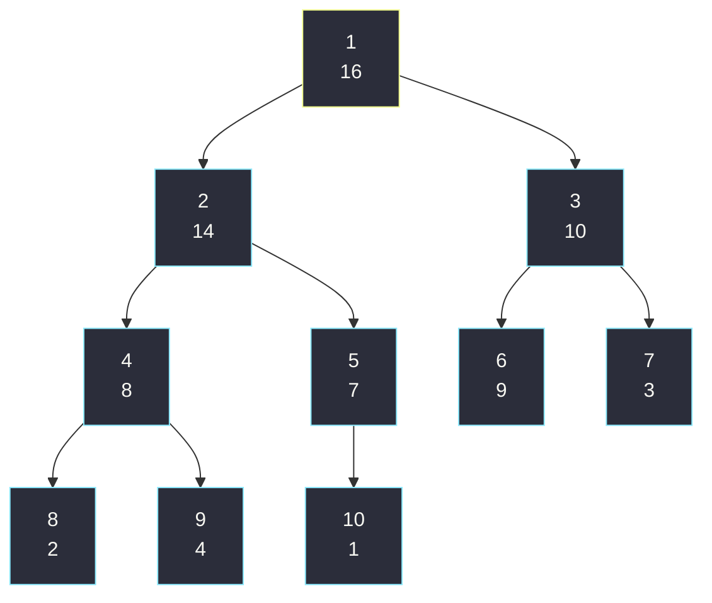
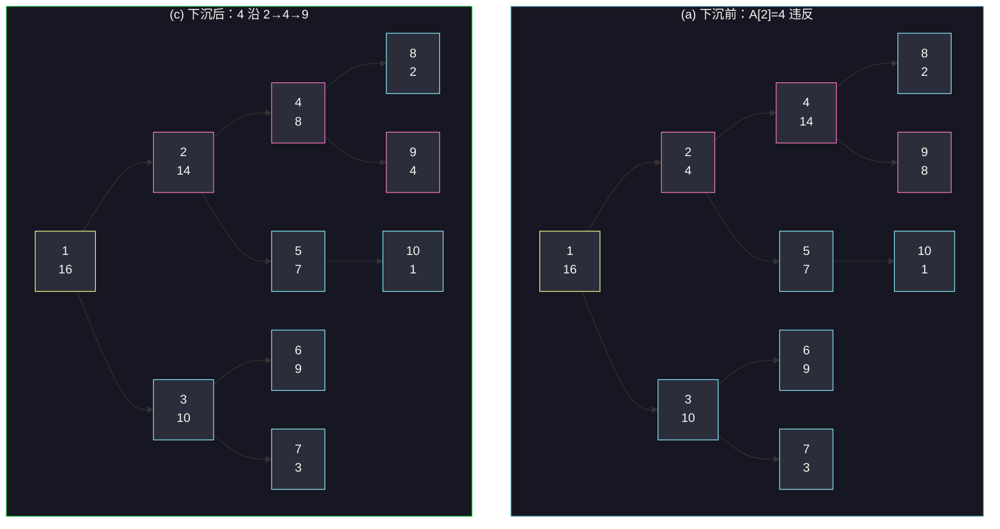
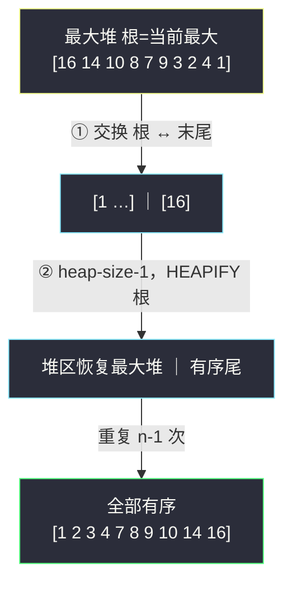
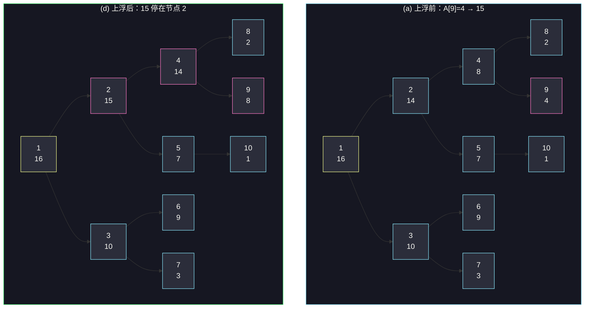
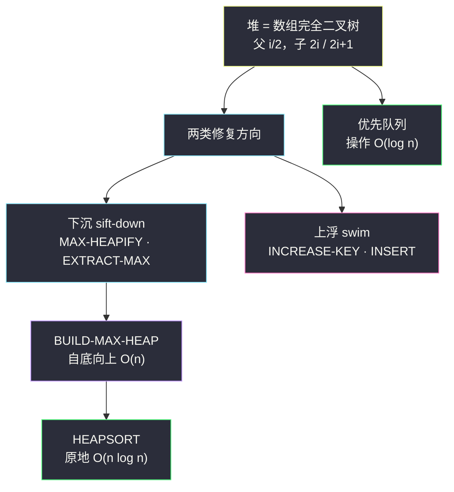

# 第六章：堆排序

> **本章定位**：插入排序「原地」但 O(n²)；归并排序 O(n log n) 但要 O(n) 额外空间。**堆排序把两者的优点合二为一**——既 O(n log n)，又原地排序（只用 O(1) 额外空间），且**最坏情况也是 O(n log n)**（不像快排会退化到 O(n²)）。
>
> 更重要的是，堆排序引入了一个新的算法设计思路：**用一个数据结构（堆）来管理信息**。堆不止用于排序，还能高效实现**优先队列**，并在后续许多章节（Dijkstra、Prim 等）中反复出现。

> ⚠️ **术语澄清**：「堆」这个词最早就是在堆排序里提出的。后来 Java/Python 把「垃圾回收的存储区」也叫 heap。**本书的「堆」一律指数据结构，不是垃圾回收存储**。

> 📌 **索引约定**：CLRS 伪代码用 **1-indexed**（`PARENT(i)=⌊i/2⌋, LEFT(i)=2i, RIGHT(i)=2i+1`）；本章 Java/Python 代码用实战惯用的 **0-indexed**（`left=2i+1, right=2i+2, parent=(i-1)/2`）。

---

## 一、二叉堆：一种用数组存的完全二叉树

### 1.1 定义

**（二叉）堆**是一个数组，可以看作一棵**近似完全二叉树**：
- 树是**完全二叉树**——除最后一层外每层都填满，最后一层**从左到右**依次填充；
- 树的第 i 个节点就对应数组下标 i（1-indexed）。

数组带一个属性 `A.heap-size`，表示当前堆里有效元素的个数（`0 ≤ heap-size ≤ n`）。`heap-size = 0` 即堆空。

**索引计算（1-indexed，可用位运算 O(1) 实现）：**

```
PARENT(i)   return ⌊i/2⌋        // i >> 1
LEFT(i)     return 2i           // i << 1
RIGHT(i)    return 2i + 1       // (i << 1) + 1
```

### 1.2 堆性质与高度

两种堆，都满足各自的**堆性质**：

| 类型 | 堆性质 | 最大/小元素在哪 |
|------|--------|----------------|
| **最大堆** max-heap | 除根外每个节点 i：`A[PARENT(i)] ≥ A[i]`（父 ≥ 子） | 根节点 |
| **最小堆** min-heap | 除根外每个节点 i：`A[PARENT(i)] ≤ A[i]`（父 ≤ 子） | 根节点 |

- 堆排序用**最大堆**；优先队列常用**最小堆**。
- **节点的高度** = 该节点到叶子最长简单路径的边数；**堆的高度** = 根的高度。
- n 个元素的堆，高度 = **⌊lg n⌋**（由完全二叉树性质决定，习题 6.1-2）。
- 后续所有基本操作的耗时都正比于树高，故都是 **O(lg n)**。

### 图 A：最大堆的「树 ↔ 数组」对照

一棵 10 个节点的最大堆。树中圆圈里的数字是**值**，圆圈外的数字是**数组下标**：



对应的数组（树的高度为 3；下标 4 的节点高度为 1）：

| 下标 | 1 | 2 | 3 | 4 | 5 | 6 | 7 | 8 | 9 | 10 |
|------|---|---|---|---|---|---|---|---|---|----|
| 值   | 16 | 14 | 10 | 8 | 7 | 9 | 3 | 2 | 4 | 1 |

> 💡 **关键直觉**：父节点下标 `⌊i/2⌋`、子节点下标 `2i / 2i+1`——这套算术让「完全二叉树的父子关系」直接编码进数组下标，**不需要任何指针**。这就是堆能用数组高效存储的根本原因。

---

## 二、维护堆性质：MAX-HEAPIFY（下沉）

### 2.1 直觉

`MAX-HEAPIFY(A, i)` 的**前提**：节点 i 的左右子树都已经是最大堆，只有 `A[i]` **可能**比自己的子节点小。

做法：让 `A[i]` 的值**「下沉（float down）」**——在它和两个子节点中找出最大的；
- 若最大者就是 `A[i]`，子树已是最大堆，结束；
- 否则把 `A[i]` 和最大子节点交换。交换后，**被换下去的那个节点**值变小了，可能又违反堆性质 → **对它递归调用 MAX-HEAPIFY**。

> 🔑 **易混点**：MAX-HEAPIFY 是**下沉（下滤 / sift-down / percolate-down）**操作。「上浮」是 INCREASE-KEY 和 INSERT 才用的（见第五节），不要混为一谈。

### 2.2 伪代码（1-indexed）

```
MAX-HEAPIFY(A, i)
1  l = LEFT(i)
2  r = RIGHT(i)
3  if l ≤ A.heap-size and A[l] > A[i]
4      largest = l
5  else largest = i
6  if r ≤ A.heap-size and A[r] > A[largest]
7      largest = r
8  if largest ≠ i
9      exchange A[i] with A[largest]
10     MAX-HEAPIFY(A, largest)     // 对换下去的子节点递归
```

### 图 B：MAX-HEAPIFY(A, 2) 的下沉过程

输入数组 `A = [16, 4, 10, 14, 7, 9, 3, 2, 8, 1]`（heap-size=10），调用 `MAX-HEAPIFY(A, 2)`。粉边框为当前违反 / 正在下沉的节点：



**中间一步（b）**：先交换 `A[2]↔A[4]`（4 与 14 交换）→ 此时**节点 4（值 4）**又比子节点 2、8 小，递归 `MAX-HEAPIFY(A, 4)`；再交换 `A[4]↔A[9]`（4 与 8 交换）→ 节点 9 是叶子，结束。最终得到图 (c) 的标准最大堆。

### 2.3 复杂度

- 每次递归下降一层，树高 ⌊lg n⌋，故 **O(lg n)**。
- 严格递推：根的一棵子树规模最多 `2n/3`（习题 6.2-2），故 `T(n) ≤ T(2n/3) + O(1)`，由主定理 case 2 得 **T(n) = O(lg n)**。
- 等价地，对高度为 h 的节点，代价 **O(h)**。
- 最坏情况确实是 **Ω(lg n)**（习题 6.2-7），所以是 Θ(lg n)。

---

## 三、建堆：BUILD-MAX-HEAP（线性时间）

### 3.1 思路：自底向上对非叶子节点逐个下沉

叶子节点天然是「1 元素的最大堆」。习题 6.1-8 指出：**下标 ⌊n/2⌋+1 … n 的节点全是叶子**。所以只需对**非叶子节点**（下标 ⌊n/2⌋ … 1）**从后往前**逐个调用 MAX-HEAPIFY。

```
BUILD-MAX-HEAP(A, n)
1  A.heap-size = n
2  for i = ⌊n/2⌋ downto 1
3      MAX-HEAPIFY(A, i)
```

**循环不变量**（证明正确性）：在第 2 行 for 循环每轮开始时，节点 `i+1, i+2, …, n` 都各自是某个最大堆的根。
- **初始化**（i=⌊n/2⌋）：⌊n/2⌋+1…n 都是叶子，天然是最大堆根。
- **保持**：节点 i 的子节点编号都大于 i，由不变量它们都是最大堆根——这恰好满足 MAX-HEAPIFY 的前提；调用后 i 也成为最大堆根，且不破坏后面的节点。
- **终止**（i=0）：节点 1…n 都最大堆根，特别地根节点 1 是，建堆完成。

**为什么倒序（从 ⌊n/2⌋ 到 1）？** 这样能保证「调用 MAX-HEAPIFY(A, i) 时，i 的两棵子树都已经是最大堆」——正序就不成立了（习题 6.3-3）。

### 图 C：建堆流程 + 数组 trace


对 `A = [4, 1, 3, 2, 16, 9, 10, 14, 8, 7]`（n=10，⌊n/2⌋=5）建堆的完整轨迹。每行**加粗**的格子 = 本轮 heapify 的根节点 i（已就位为子树最大值），括号内是该轮发生的交换：

| 步骤 | 1 | 2 | 3 | 4 | 5 | 6 | 7 | 8 | 9 | 10 |
|------|---|---|---|---|---|---|---|---|---|----|
| 初始（输入） | 4 | 1 | 3 | 2 | 16 | 9 | 10 | 14 | 8 | 7 |
| heapify(5)（不变） | 4 | 1 | 3 | 2 | **16** | 9 | 10 | 14 | 8 | 7 |
| heapify(4)（A[4]↔A[8]） | 4 | 1 | 3 | **14** | 16 | 9 | 10 | 2 | 8 | 7 |
| heapify(3)（A[3]↔A[7]） | 4 | 1 | **10** | 14 | 16 | 9 | 3 | 2 | 8 | 7 |
| heapify(2)（A[2]↔A[5]↔A[10]） | 4 | **16** | 10 | 14 | 7 | 9 | 3 | 2 | 8 | 1 |
| heapify(1)（A[1]→2→4→9） | **16** | 14 | 10 | 8 | 7 | 9 | 3 | 2 | 4 | 1 |

最终得到第一节那个标准最大堆 `[16,14,10,8,7,9,3,2,4,1]`。

### 3.2 复杂度：为什么是 O(n) 而不是 O(n log n)？

粗看：n 次 MAX-HEAPIFY × 每次 O(lg n) = O(n log n)。这个上界**对但不紧**。

**关键观察**：MAX-HEAPIFY 的代价正比于**节点高度 h**，而**大多数节点高度很小**（叶子高度 0，占一半）。精确按高度求和：

### 图 F：建堆 O(n) 证明（按高度求和）

| 高度 h | 该高度的节点数 ≤ | 每节点代价 | 该高度总代价 ≤ |
|--------|------------------|-----------|----------------|
| 0（叶子） | ⌈n/2⌉ | 0 | 0 |
| 1 | ⌈n/4⌉ | c·1 | n/4 · c |
| 2 | ⌈n/8⌉ | c·2 | 2n/8 · c |
| … | … | … | … |
| h | ⌈n / 2^(h+1)⌉ | c·h | c · h · n / 2^(h+1) |
| **求和** | | | **见下** |

总代价上界（其中用到 `⌈n/2^(h+1)⌉ ≤ n/2^h`）：

```
Σ_{h=0}^{⌊lg n⌋}  c · h · n / 2^(h+1)
  = (cn/2) · Σ_{h=0}^∞ (h / 2^h)
  = (cn/2) · 2
  = O(n)
```

> 最后一步用了恒等式 `Σ_{h≥0} h/2^h = 2`（即 `Σ h x^h = x/(1-x)²` 在 `x=1/2` 处取值）。
>
> **结论：建最大堆只需线性时间 O(n)。**（建最小堆同理，把 MAX-HEAPIFY 换成 MIN-HEAPIFY。）

---

## 四、堆排序：HEAPSORT

### 4.1 算法

```
HEAPSORT(A, n)
1  BUILD-MAX-HEAP(A, n)           // 先建最大堆，O(n)
2  for i = n downto 2
3      exchange A[1] with A[i]    // 把当前最大值（根）换到末尾归位
4      A.heap-size = A.heap-size − 1  // 缩小堆，把 A[i] 排除在外
5      MAX-HEAPIFY(A, 1)          // 对新根下沉，恢复最大堆
```

**直觉**：最大堆的根永远是当前最大值。每轮把它换到数组末尾、缩小堆、再下沉堆顶——末尾就长出一个**升序的已排序区**，堆区逐渐缩小。

**循环不变量**（习题 6.4-2）：每轮开始时，`A[1..i]` 是含 i 个最小元素的最大堆，`A[i+1..n]` 是已排序的 n−i 个最大元素。

### 图 D：堆排序流程



完整轨迹。**加粗** = 已排序区，可见它从右向左逐渐占满整个数组：

| 步骤 | 1 | 2 | 3 | 4 | 5 | 6 | 7 | 8 | 9 | 10 |
|------|---|---|---|---|---|---|---|---|---|----|
| 初态（建堆后） | 16 | 14 | 10 | 8 | 7 | 9 | 3 | 2 | 4 | 1 |
| i=10 后 | 14 | 8 | 10 | 4 | 7 | 9 | 3 | 2 | 1 | **16** |
| i=9 后 | 10 | 8 | 9 | 4 | 7 | 1 | 3 | 2 | **14** | **16** |
| i=8 后 | 9 | 8 | 3 | 4 | 7 | 1 | 2 | **10** | **14** | **16** |
| … | … | … | … | … | … | … | … | … | … | … |
| 终态 | **1** | **2** | **3** | **4** | **7** | **8** | **9** | **10** | **14** | **16** |

（i=7 … 2 每轮同理：交换堆顶与堆尾、堆缩小一格、对新根下沉，最大值依次归位到已排序区前端。）

### 4.2 复杂度

- BUILD-MAX-HEAP：**O(n)**。
- n−1 次 MAX-HEAPIFY，每次 **O(lg n)**：**O(n log n)**。
- 合计 **O(n log n)**，原地（**O(1)** 额外空间）。

> 🏆 **渐进最优**：第 8 章会证明任何**基于比较**的排序至少需要 Ω(n log n) 次比较。所以堆排序在比较排序中**渐进最优**。不过实际工程中，常数因子更小的快排通常更快。

---

## 五、优先队列：堆最重要的应用

**优先队列**维护一个带 key 的元素集合，支持高效取最值。最大优先队列（基于最大堆）支持：

| 操作 | 含义 | 复杂度 |
|------|------|--------|
| `MAXIMUM(S)` | 返回最大 key 的元素 | **O(1)** |
| `EXTRACT-MAX(S)` | 删除并返回最大 key 的元素 | **O(lg n)** |
| `INCREASE-KEY(S, x, k)` | 把元素 x 的 key 增大到 k（只能增） | **O(lg n)** |
| `INSERT(S, x, k)` | 插入 key 为 k 的元素 | **O(lg n)** |

> 最小优先队列把 MAX 换成 MIN、INCREASE-KEY 换成 DECREASE-KEY，用最小堆实现。常用于事件驱动模拟（按时间取下一个事件）、Dijkstra / Prim 算法（按距离 / 权重取最小）。

### 5.1 伪代码（1-indexed）

```
MAX-HEAP-MAXIMUM(A)
1  if A.heap-size < 1
2      error "heap underflow"
3  return A[1]

MAX-HEAP-EXTRACT-MAX(A)        // 和 HEAPSORT 循环体一致
1  max = MAX-HEAP-MAXIMUM(A)
2  A[1] = A[A.heap-size]
3  A.heap-size = A.heap-size − 1
4  MAX-HEAPIFY(A, 1)           // 下沉堆顶
5  return max

MAX-HEAP-INCREASE-KEY(A, i, k)   // i 为元素下标
1  if k < A[i]
2      error "new key is smaller than current key"
3  A[i] = k
4  while i > 1 and A[PARENT(i)] < A[i]
5      exchange A[i] with A[PARENT(i)]   // 上浮
6      i = PARENT(i)

MAX-HEAP-INSERT(A, key, n)
1  if A.heap-size == n  error "heap overflow"
2  A.heap-size = A.heap-size + 1
3  A[A.heap-size] = −∞           // 先放一个 −∞ 的叶子
4  MAX-HEAP-INCREASE-KEY(A, A.heap-size, key)  // 再上浮到正确位置
```

> 🔑 EXTRACT-MAX 用**下沉**（根变小，往下滤）；INCREASE-KEY / INSERT 用**上浮**（节点变大，往上滤）——这是堆的两类基本修复方向，务必区分。

### 图 E：MAX-HEAP-INCREASE-KEY 的上浮过程

对上图 (a) 的最大堆，把 `A[9]`（值 4）增加到 15。值 15 沿 **9→4→2** 一路上浮：



中间过程：`A[9]=15` > 父 `A[4]=8` → 交换（15 到节点 4）；15 > 父 `A[2]=14` → 交换（15 到节点 2）；15 < 父 `A[1]=16` → 停止。最终 `[16,15,10,14,7,9,3,2,8,1]`。

---

## 六、代码实现（0-indexed）

> 约定：`left = 2i+1`，`right = 2i+2`，`parent = (i-1)/2`。

### 6.1 Java：堆排序

```java
public class HeapSort {
    /** 堆排序（原地，0-indexed）。时间 O(n log n)，空间 O(1)。 */
    public static void sort(int[] a) {
        int n = a.length;
        for (int i = n / 2 - 1; i >= 0; i--) siftDown(a, n, i);   // 1. 建最大堆
        for (int i = n - 1; i > 0; i--) {                          // 2. 排序
            swap(a, 0, i);        // 最大值归位到 i
            siftDown(a, i, 0);    // 堆大小缩为 i，对新根下沉
        }
    }

    /** 下沉：在 [0, n) 范围内把 a[i] 下滤到正确位置。O(log n)。 */
    private static void siftDown(int[] a, int n, int i) {
        while (true) {
            int l = 2 * i + 1, r = 2 * i + 2, max = i;
            if (l < n && a[l] > a[max]) max = l;
            if (r < n && a[r] > a[max]) max = r;
            if (max == i) break;
            swap(a, i, max);
            i = max;
        }
    }

    private static void swap(int[] a, int i, int j) {
        int t = a[i]; a[i] = a[j]; a[j] = t;
    }
}
```

### 6.2 Java：最大优先队列

```java
import java.util.NoSuchElementException;

/** 基于最大堆的最大优先队列（0-indexed）。 */
public class MaxPriorityQueue {
    private final int[] a;
    private int size;

    public MaxPriorityQueue(int capacity) { a = new int[capacity]; }

    public boolean isEmpty() { return size == 0; }
    public int size() { return size; }

    /** 取最大值（堆顶）。O(1)。 */
    public int maximum() {
        if (size == 0) throw new NoSuchElementException("heap underflow");
        return a[0];
    }

    /** 删除并返回最大值。O(log n)。 */
    public int extractMax() {
        int max = maximum();
        a[0] = a[--size];          // 末尾元素顶上根
        siftDown(0);               // 下沉
        return max;
    }

    /** 把下标 i 的值增大到 key（只能增）。O(log n)。 */
    public void increaseKey(int i, int key) {
        if (key < a[i]) throw new IllegalArgumentException("new key is smaller");
        a[i] = key;
        swim(i);                   // 上浮
    }

    /** 插入 key。O(log n)。 */
    public void insert(int key) {
        a[size] = key;             // 先放末尾
        swim(size++);              // 再上浮
    }

    /** 上浮：把 a[i] 上滤到正确位置。 */
    private void swim(int i) {
        while (i > 0 && a[(i - 1) / 2] < a[i]) {
            swap(i, (i - 1) / 2);
            i = (i - 1) / 2;
        }
    }

    /** 下沉（用内部 size）。 */
    private void siftDown(int i) {
        while (true) {
            int l = 2 * i + 1, r = 2 * i + 2, max = i;
            if (l < size && a[l] > a[max]) max = l;
            if (r < size && a[r] > a[max]) max = r;
            if (max == i) break;
            swap(i, max);
            i = max;
        }
    }

    private void swap(int i, int j) { int t = a[i]; a[i] = a[j]; a[j] = t; }
}
```

### 6.3 Python：堆排序

```python
def heap_sort(a):
    """堆排序（原地，0-indexed）。时间 O(n log n)，空间 O(1)。"""
    n = len(a)

    def sift_down(i, size):
        while True:
            l, r, mx = 2 * i + 1, 2 * i + 2, i
            if l < size and a[l] > a[mx]:
                mx = l
            if r < size and a[r] > a[mx]:
                mx = r
            if mx == i:
                break
            a[i], a[mx] = a[mx], a[i]
            i = mx

    for i in range(n // 2 - 1, -1, -1):     # 1. 建最大堆
        sift_down(i, n)
    for i in range(n - 1, 0, -1):            # 2. 排序
        a[0], a[i] = a[i], a[0]
        sift_down(0, i)
```

> 💡 **实战提示**：Python 标准库 `heapq` 提供最小堆（`heapq.heapify` 建堆 O(n)、`heapq.heappush / heappop` O(log n)）。日常几乎不必手写，理解原理即可。

---

## 七、复杂度汇总与对比

### 堆的基本操作

| 操作 | 时间复杂度 | 备注 |
|------|-----------|------|
| PARENT / LEFT / RIGHT | O(1) | 位运算 |
| MAX-HEAPIFY | O(lg n) | 下沉，单次修复 |
| BUILD-MAX-HEAP | **O(n)** | 自底向上，线性 |
| HEAPSORT | **O(n log n)** | 原地、最坏也是 O(n log n) |
| INSERT / EXTRACT-MAX / INCREASE-KEY | O(lg n) | 优先队列操作 |
| MAXIMUM | O(1) | 直接取根 |

### 与其他排序对比

| 排序算法 | 平均时间 | 最坏时间 | 额外空间 | 稳定性 | 特点 |
|----------|---------|---------|---------|--------|------|
| **堆排序** | O(n log n) | **O(n log n)** | **O(1)** | 不稳定 | 原地 + 最坏有保证 |
| 快速排序 | O(n log n) | O(n²) | O(lg n) | 不稳定 | 实测最快、缓存友好 |
| 归并排序 | O(n log n) | O(n log n) | O(n) | **稳定** | 要额外空间 |
| 插入排序 | O(n²) | O(n²) | O(1) | 稳定 | 小数据 / 近乎有序最快 |

> 堆排序的**优点**：原地、最坏 O(n log n)。**缺点**：不稳定、缓存不友好（数组访问跳跃大）、常数因子比快排大。所以「理论上最优（比较排序）」≠「工程上最快」。

---

## 八、精选习题与面试题

### 8.1 经典应用：Top-K 问题（第 K 大）

维护一个**大小为 K 的最小堆**：遍历数组，元素入堆，堆超过 K 就弹出堆顶（最小值）。结束时堆顶就是第 K 大。

```python
import heapq

def find_kth_largest(nums, k):
    """第 K 大 / 前 K 大。维护大小为 K 的最小堆。O(n log k)。"""
    min_heap = []
    for x in nums:
        heapq.heappush(min_heap, x)
        if len(min_heap) > k:
            heapq.heappop(min_heap)        # 弹出最小，保留最大的 K 个
    return min_heap[0]                      # 堆顶即第 K 大
```

> 为什么用**最小堆**找**最大**的 K 个？因为堆顶始终是当前 K 个里的最小值，新来一个更大的就把它换掉。堆大小恒为 K，复杂度 **O(n log k)**、空间 **O(k)**——远优于排序的 O(n log n)。

### 8.2 数据流的中位数（双堆技巧，LeetCode 295）

用两个堆：`lo`（最大堆，装较小的一半）、`hi`（最小堆，装较大的一半），并保持 `len(lo) == len(hi)` 或 `len(lo) == len(hi)+1`。中位数就是 `lo` 的堆顶（奇数）或两堆顶平均（偶数）。

```python
import heapq

class MedianFinder:
    def __init__(self):
        self.lo = []    # 最大堆（Python 用负数模拟）
        self.hi = []    # 最小堆

    def add_num(self, x):
        heapq.heappush(self.lo, -x)
        heapq.heappush(self.hi, -heapq.heappop(self.lo))   # lo 的最大 → hi
        if len(self.lo) < len(self.hi):                     # 平衡：hi 的最小 → lo
            heapq.heappush(self.lo, -heapq.heappop(self.hi))

    def find_median(self):
        if len(self.lo) > len(self.hi):
            return -self.lo[0]
        return (-self.lo[0] + self.hi[0]) / 2
```

插入 O(log n)，查中位数 O(1)。

### 8.3 合并 K 个有序链表（LeetCode 23，习题 6.5-11）

用大小为 K 的最小堆，每次从 K 个链表头取最小。O(n log k)，n 为总元素数。（实现略，思路同 Top-K。）

### 8.4 CLRS 习题精选

| 习题 | 要点 |
|------|------|
| 6.1-2 | n 元素堆高度 = ⌊lg n⌋ |
| 6.1-7 | 数组表示下，叶子下标为 ⌊n/2⌋+1 … n（建堆从这里推出） |
| 6.2-2 | 根的子树规模最多 2n/3 → MAX-HEAPIFY 的递推式 |
| 6.3-3 | 建堆为何倒序：保证子树已是堆 |
| 6.4-3 | 已升序 / 已降序输入，堆排序都是 Θ(n log n) |
| 6.5-6 | INCREASE-KEY 不能换成 MAX-HEAPIFY（方向相反，会破坏堆） |

---

## 九、本章要点回顾



**一句话记忆**：
- 堆 = 数组里的完全二叉树，靠下标算父子关系；
- **下沉**修「根变小」，**上浮**修「叶变大」；
- 建堆 **O(n)**（按高度求和），堆排序 **O(n log n)** 且原地、最坏同阶，是比较排序的渐进最优解。
