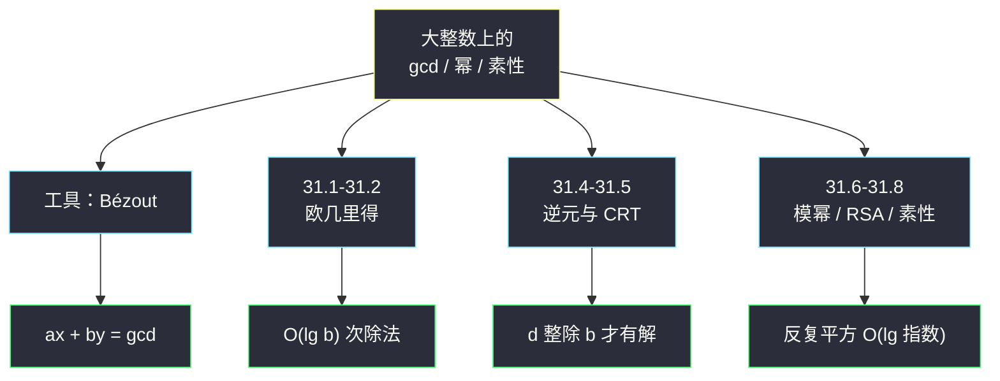
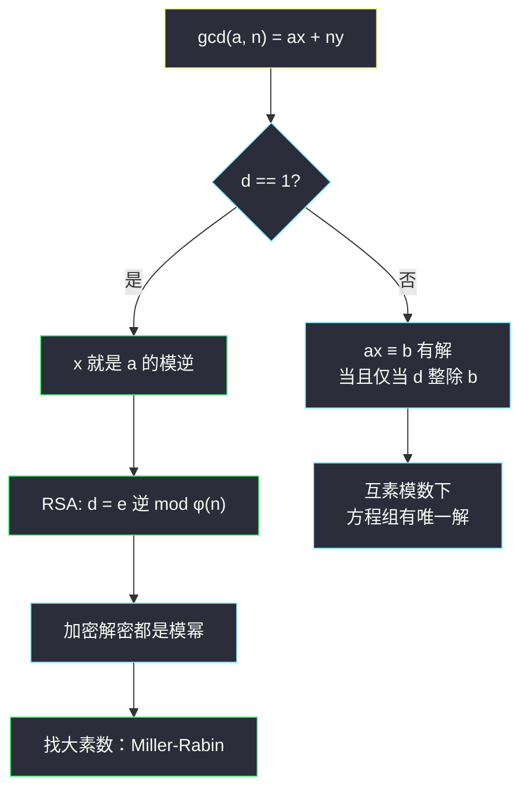
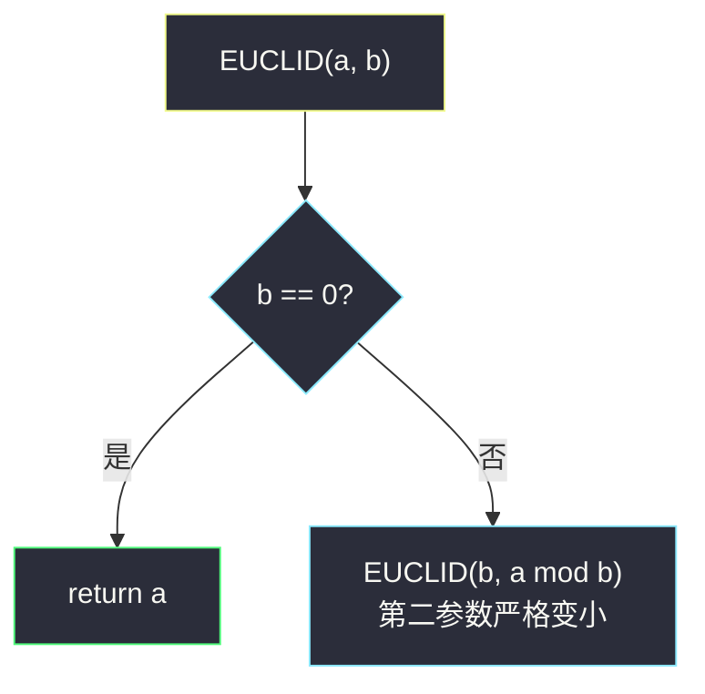
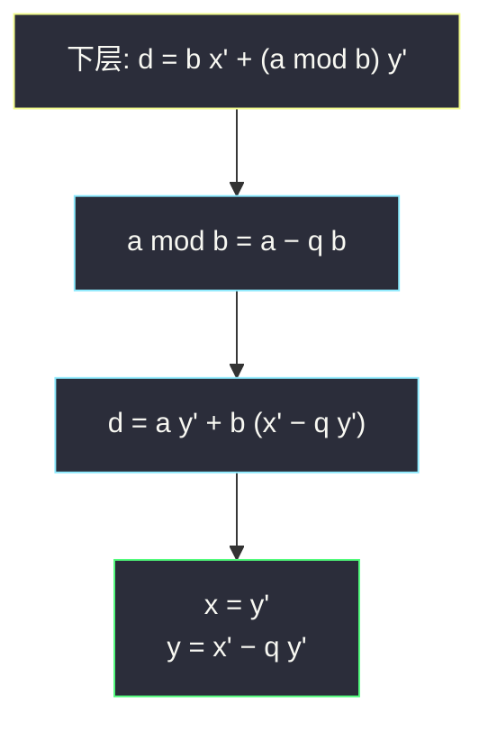
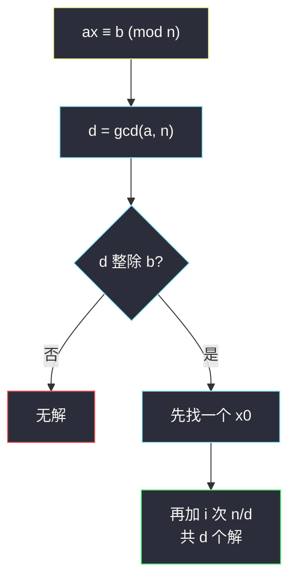
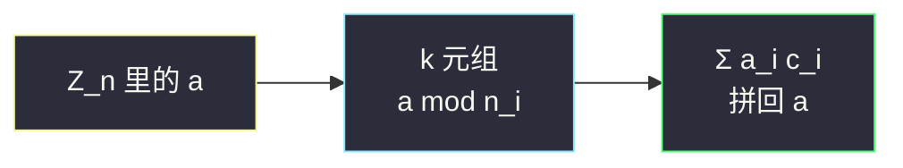
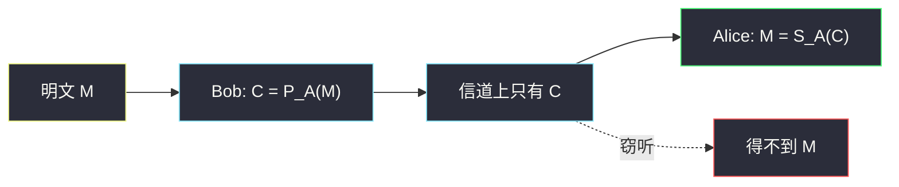
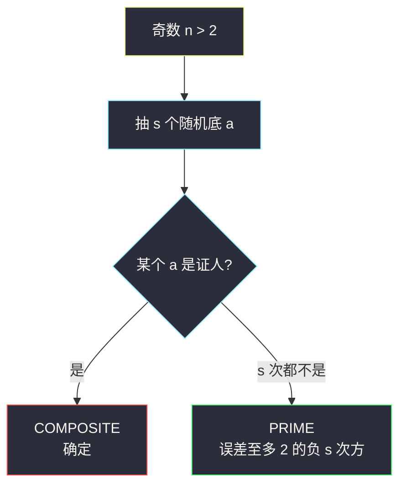
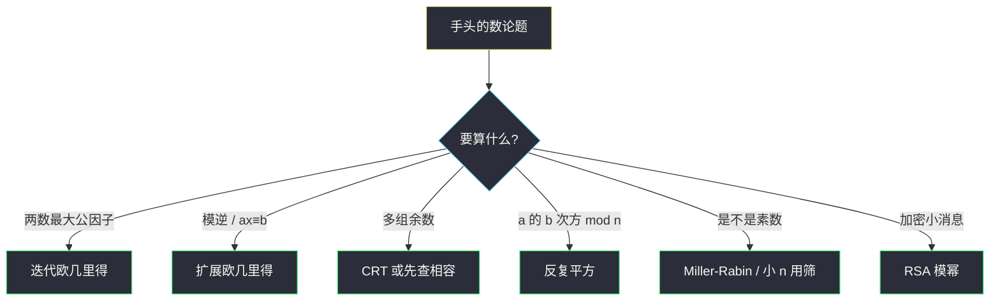

# 第 31 章：数论算法（Number-Theoretic Algorithms）——深度版

## 一、开篇定位

本章回答一个问题：**大整数上的 gcd、逆元、幂、素性，怎么算得又对又快，以及 RSA 凭什么能加密？**数论一度被当成「漂亮但没用」的纯数学。公钥密码把局面翻过来：大素数**找得快**，两个大素数的积**拆不开**——前者让密钥能生成，后者让窃听者算不出私钥。

本章输入的「大」指的是**位数多**，不是个数多。一个 `β` 位整数的输入规模是 `β=Θ(lg n)`。试除到 `√(n)` 看起来像 `√(n)` 步，换成位数就是 `2^(β/2)`，指数时间。多项式时间必须是 `β` 的多项式，也就是 `lg n` 的多项式。加减乘除在本章仍按「一次算术运算」计数；若较真到位运算，`β` 位数乘除是 `Θ(β²)`（更快的乘法拉进来也不改主结论）。

与前后章节的关系：

- **第 5 章**：Miller-Rabin 是「只错一边」的蒙特卡洛算法——报 COMPOSITE 一定对，报 PRIME 有 `≤ 2^(-s)` 的误差。第 1 章开篇就拿它当「不正确但可控」的例子；
- **第 4 章分治**：反复平方 `a^(b)mod n` 是 `T(lg b)=Θ(lg b)` 次模乘，和 FFT 同一类「折半」；
- **第 30 章 NTT**：模素数的单位根依赖 `ℤₚ*` 是循环群（31.6）。生成元存在当且仅当模数形状是 `2,4,p^(e),2p^(e)`；
- **第 34 章**：大整数分解没有已知的多项式算法，这是 RSA 安全的经验支柱，不是定理。

做题定位：LeetCode **不考手写 RSA / Miller-Rabin**。能直接练的是 gcd / Bézout（365、914）、模幂（372）、筛素数（204）、lcm 容斥（878、1201）。本章要带走的三句话：**`gcd(a,n)=1` 才有模逆，扩展欧几里得一次求出**；**`ax≡ bpmod n` 有解当且仅当 `d∣ b`，解的个数恰好是 `d`**；**模幂用反复平方 `O(lg b)`，别真乘 `b` 次。**

**本章主线**：整除与 Bézout → 欧几里得 / 扩展欧几里得 → 模线性方程与逆元 → CRT → 反复平方 → RSA → Miller-Rabin → Java + Python → 速查 / 易混 → 题单与习题。



---

## 二、核心思想：能写成 `ax+by` 的最小正数就是 gcd

大白话：两个数的公约数，一定也整除它们的任意整系数组合 `ax+by`。反过来，**最小的正组合恰好就是 `gcd(a,b)`**（Bézout）。于是：

- `gcd(a,n)=1` 意味着存在 `x` 使得 `ax≡ 1pmod n`——`x` 就是模逆；
- 模逆一旦有了，RSA 的私钥 `d=e⁻¹mod φ(n)` 就是一次扩展欧几里得；
- `ax≡ bpmod n` 有解，当且仅当这个 gcd 整除 `b`。

欧几里得算法不拆质因数（分解本身就没有多项式算法），只反复用 `gcd(a,b)=gcd(b,amod b)`，最坏 `O(lg b)` 次除法。



---

## 三、整除、素数与唯一分解（31.1）

记号 `d∣ a` 表示存在整数 `k` 使 `a=kd`。正整数 `a>1`：只有平凡因子 `1` 和 `a` 的叫**素数**；否则叫**合数**。`1` 是单位，既不是素数也不是合数。前 20 个素数：


```
2,3,5,7,11,13,17,19,23,29,31,37,41,43,47,53,59,61,67,71.
```


带余除法：对任意整数 `a` 和正整数 `n`，存在唯一 `q,r` 满足 `a=qn+r` 且 `0≤ r<n`。`r=amod n`。同余类 `[a]ₙ={a+kn}`，代表元取 `{0,1,…,n-1}`，这套代表元记作 `ℤₙ`。

公约数的两条常用性质：

- `d∣ a` 且 `d∣ b` `⇒` `d∣(ax+by)`；
- `gcd(a,b)` 是 `{ax+by:x,y∈ℤ}` 里**最小的正元素**。

因此任何公约数都整除 gcd；`gcd(an,bn)=n·gcd(a,b)`；若 `n∣ ab` 且 `gcd(a,n)=1`，则 `n∣ b`。

`gcd(a,b)=1` 称**互素**。素数 `p` 整除乘积则必整除某一个因子。于是有唯一分解：`a=p₁^(e₁)⋯ p_r^(e_r)`，`pᵢ` 递增。例：`6000=2⁴· 3· 5³`。

gcd 的几条代数性质（做题够用）：


```
gcd(a,b)=gcd(b,a)=gcd(|a|,|b|), gcd(a,0)=|a|, gcd(a,ka)=|a|.
```


约定 `gcd(0,0)=0`，好让上面几条普遍成立。

---

## 四、欧几里得算法（31.2）

### 4.1 直觉

用质因数公式 `gcd=Π pᵢ^(min(eᵢ,fᵢ))` 要先分解，分解没有多项式算法。欧几里得只用一件事：


```
gcd(a,b)=gcd(b,amod b).
```


公约数集合不变：能整除 `a,b` 就能整除余数，反过来能整除 `b` 和余数就能整除 `a=qb+` 余数。第二参数严格变小，所以一定停。

### 4.2 伪代码（1-indexed 风格；这里没有数组）

```
EUCLID(a, b)
1  if b == 0
2      return a
3  else return EUCLID(b, a mod b)
```

trace：`gcd(30,21)`

| 调用 | `a` | `b` | `amod b` |
|------|-----|-----|------------|
| 1 | 30 | 21 | 9 |
| 2 | 21 | 9 | 3 |
| 3 | 9 | 3 | 0 |
| 4 | 3 | 0 | — |

返回 3。递归 3 次。



实战写成迭代即可（习题 31.2-4），常数空间：

```
while b ≠ 0:
    a, b = b, a mod b
return a
```

### 4.3 最坏情况是连续斐波那契

若 `a>b≥ 1` 且 EUCLID 递归 `k≥ 1` 次，则 `a≥ Fₖ₊₂`、`b≥ Fₖ₊₁`（Lamé）。于是 `b<Fₖ₊₁` 时递归少于 `k` 次。紧例子：`EUCLID(Fₖ₊₁,Fₖ)` 恰好 `k-1` 次（`k≥ 2`）。

`Fₖ~ φ^(k)/√(5)`，`φ=(1+√(5))/2`，所以递归次数 `O(lg b)`。两个 `β` 位数：`O(β)` 次算术运算；按朴素乘除是 `O(β³)` 位运算，思考题 31-2 能收到 `O(β²)`。

更紧的上界（31.2-5）：`a>b≥ 0` 时至多 `1+log_φ b` 次递归，还能再换成 `1+log_φ(b/gcd(a,b))`。

### 4.4 扩展欧几里得：顺手拿出 Bézout 系数

不但要 `d=gcd(a,b)`，还要 `x,y` 满足 `d=ax+by`。模逆就是 `b=n` 且 `d=1` 的那个 `x`。

```
EXTENDED-EUCLID(a, b)
1  if b == 0
2      return (a, 1, 0)
3  else (d', x', y') = EXTENDED-EUCLID(b, a mod b)
4      (d, x, y) = (d', y', x' - ⌊a/b⌋ y')
5      return (d, x, y)
```

递推理由：下一层给出 `d'=bx'+(amod b)y'`，而 `amod b=a-⌊ a/b⌋ b`，代回去：


```
d=ay'+b(x'-⌊ a/b⌋ y').
```


所以 `x=y'`，`y=x'-⌊ a/b⌋ y'`。递归次数与 EUCLID 同阶 `O(lg b)`。

原书图 31.1：`EXTENDED-EUCLID(99,78)` 返回 `(3,-11,14)`。

| `a` | `b` | `⌊ a/b⌋` | `d` | `x` | `y` |
|-----|-----|----------------------|-----|-----|-----|
| 99 | 78 | 1 | 3 | **−11** | **14** |
| 78 | 21 | 3 | 3 | 3 | −11 |
| 21 | 15 | 1 | 3 | −2 | 3 |
| 15 | 6 | 2 | 3 | 1 | −2 |
| 6 | 3 | 2 | 3 | 0 | 1 |
| 3 | 0 | — | 3 | 1 | 0 |

核对：`99·(-11)+78· 14=-1089+1092=3`。



两个以上参数：`gcd(a₀,…,aₙ)=gcd(a₀,gcd(a₁,…,aₙ))`，与顺序无关。lcm 用 `lcm(a,b)=|ab|/gcd(a,b)`，多个再两两归约（先除后乘，防溢出）。

**LeetCode**：1979 数组 gcd；1071 字符串最大公因子；914 卡牌分组（所有计数的 gcd）；365 水壶（Bézout）。

---

## 五、模算术速览（31.3）

非正式模型：每次算完把结果换成 `{0,1,…,n-1}` 里那个同余的。加减乘都合法；除法只对**与 `n` 互素**的元素合法。

两个有限阿贝尔群：

| 群 | 集合 | 运算 | 单位元 | 逆 | 大小 |
|----|------|------|--------|----|------|
| `(ℤₙ,+)` | `{0,…,n-1}` | 模 `n` 加 | `0` | `-a≡ n-a` | `n` |
| `(ℤₙ*,·)` | `{a:gcd(a,n)=1}` | 模 `n` 乘 | `1` | 扩展欧几里得 | `φ(n)` |

`ℤ₁₅*={1,2,4,7,8,11,13,14}`。例：`8· 11=88≡ 13pmod15`；`7⁻¹≡ 13pmod15`，因为 `7· 13=91≡ 1`。于是 `2/7≡ 2· 13≡ 11pmod15`。

欧拉函数：


```
φ(n)=nΠ_p∣ n(1-1/p).
```


`p` 素数：`φ(p)=p-1`。`φ(p^(e))=p^(e-1)(p-1)`。例：`φ(45)=45·(1-1/3)·(1-1/5)=24`。`n` 合数时 `φ(n)<n-1`。

Lagrange：有限群的子群大小整除群的阶。真子群至多一半——Miller-Rabin 误差分析就靠这一刀。由一个元素 `a` 反复做群运算得到的集合 `⟨ a⟩` 是子群，`ord(a)=|⟨ a⟩|`，且 `a^(|S|)=e`。

---

## 六、模线性方程（31.4）

求 `ax≡ bpmod n` 的全部解。这是 RSA 里算 `d` 的那一步，也是「什么时候有模逆」的完整版。

### 6.1 直觉

`axmod n` 能取到的值，正好是 `d=gcd(a,n)` 的倍数（在 `0..n-1` 里）。所以：

- 有解 `⇔` `d∣ b`；
- 有解时恰好 `d` 个解，相邻差 `n/d`。

`d=1` 时解唯一；特别 `b=1` 时就是模逆。



### 6.2 做法

扩展欧几里得给出 `d=ax'+ny'`，于是 `ax'≡ dpmod n`。两边乘 `b/d`：


```
x₀=x'·(b/d)mod n
```


是一个解。其余：


```
xᵢ=x₀+i·(n/d)mod n, i=0,1,…,d-1.
```


```
MODULAR-LINEAR-EQUATION-SOLVER(a, b, n)
1  (d, x', y') = EXTENDED-EUCLID(a, n)
2  if d | b
3      x0 = x' · (b/d) mod n
4      for i = 0 to d − 1
5          print (x0 + i · (n/d)) mod n
6  else print "no solutions"
```

原书例子：`14x≡ 30pmod100`。`EXTENDED-EUCLID(14,100)=(2,-7,1)`，`2∣ 30`，`x₀=(-7)· 15≡ 95pmod100`。两个解：**95 和 45**。

`O(lg n+d)` 次算术运算。

**LeetCode**：365 水壶——能测出 `z` 当且仅当 `gcd(x,y)∣ z` 且 `z≤ x+y`（或 `z=0`）。

---

## 七、中国剩余定理（31.5）

孙子（约公元 100 年，《孙子算经》）的原题：除 3 余 2、除 5 余 3、除 7 余 2。一个解是 `x=23`，通解 `23+105k`。

### 7.1 直觉

模数 `n₁,…,nₖ` **两两互素**，`n=n₁⋯ nₖ`。一个模 `n` 的数，等价于 `k` 个分别模 `nᵢ` 的数；加减乘可以**分量独立**做完再拼回来。好处：每个 `nᵢ` 更短，位运算更便宜；RSA 正确性证明也走这一步（先模 `p`、模 `q`，再拼回模 `n`）。

### 7.2 拼回来的公式

`mᵢ=n/nᵢ`（不含 `nᵢ` 的那些因子的积）。`mᵢ` 与 `nᵢ` 互素，所以 `mᵢ⁻¹mod nᵢ` 存在。令


```
cᵢ=mᵢ·(mᵢ⁻¹mod nᵢ),
```


则 `cᵢ≡ 1pmodnᵢ`，且 `j≠ i` 时 `cᵢ≡ 0pmodn_j`——一组「标准基」。解是


```
x≡ a₁ c₁+⋯+aₖ cₖpmod n.
```


原书例子：`a≡ 2pmod 5`，`a≡ 3pmod13`，`n=65`。

- `c₁=13·(13⁻¹mod 5)=13· 2=26`
- `c₂=5·(5⁻¹mod 13)=5· 8=40`
- `a=2· 26+3· 40=172≡ 42pmod65`

核对：`42mod 5=2`，`42mod 13=3`。



两两互素时方程组 `x≡ aᵢpmodnᵢ` 模 `n` **唯一**。进一步：`x≡ apmodnᵢ` 对所有 `i` 成立 `⇔` `x≡ apmod n`。

模数不互素时：先看每对 `aᵢ≡ a_jpmodgcd(nᵢ,n_j)`，不成立则无解；成立则解的模数是 lcm。两个方程的常用公式：`x=a₁+n₁ t`，代入第二个再解一次模线性方程。

**LeetCode** 几乎不直接考 CRT 构造。竞赛里「模数两两互素的方程组」按上面公式套；模数不互素时先检查相容性。

---

## 八、反复平方与欧拉 / 费马（31.6）

### 8.1 阶、原根、欧拉定理

在 `ℤₙ*` 里看幂次 `a⁰,a¹,a²,…pmod n`。`ordₙ(a)` 是使 `aᵀ≡ 1pmod n` 的最小正 `t`。

| 定理 | 内容 |
|------|------|
| 欧拉 | `a^(φ(n))≡ 1pmod n`（`a∈ℤₙ*`） |
| 费马 | `p` 素数 `⇒` `a^(p-1)≡ 1pmod p`（`anot≡ 0`）；也写成 `a^(p)≡ apmod p` |

`ordₙ(g)=φ(n)` 时 `g` 是**原根**（生成元），`ℤₙ*` 是循环群。原书：模 7 时 3 是原根（幂次跑遍 `1..6`），2 不是（只有 `1,2,4`）。

`ℤₙ*` 循环当且仅当 `n=2,4,p^(e),2p^(e)`（`p` 奇素数）。这就是第 30 章 NTT 选模数 `p=kn+1` 的数论背景：需要 `n` 次单位根，也就是阶为 `n` 的元素。

离散对数：`g^(z)≡ apmod n` 的 `z=ind_n,g(a)`。`g^(x)≡ g^(y)pmod n⇔ x≡ ypmodφ(n)`。正向模幂容易，反向离散对数（一般 `n`）没有已知的多项式算法——Diffie-Hellman 走这条。

非平凡平方根：模奇素数幂，`x²≡ 1` 只有 `± 1`。若模 `n` 出现 `xnot≡± 1` 但 `x²≡ 1`，则 `n` 必合数。例：`6²=36≡ 1pmod35`，而 `6not≡± 1`。Miller-Rabin 抓的就是这个。

### 8.2 反复平方

算 `a^(b)mod n`，不要乘 `b` 次：


```
a^(b)=
1 b=0
(a^(b/2))² b偶数
a· a^(b-1) b奇数
```


奇数那步下一步一定偶数。所有运算模 `n`。

```
MODULAR-EXPONENTIATION(a, b, n)
1  if b == 0
2      return 1
3  elseif b mod 2 == 0
4      d = MODULAR-EXPONENTIATION(a, b/2, n)
5      return (d · d) mod n
6  else d = MODULAR-EXPONENTIATION(a, b − 1, n)
7      return (a · d) mod n
```

`β` 位输入：递归 `β` 到 `2β-1` 次，算术 `O(β)`，位运算 `O(β³)`。每个 0 比特一次递归，每个 1 比特两次（先减一再折半）。

原书图 31.4：`7⁵⁶⁰mod 561=1`（561 是 Carmichael 数，费马测试骗不过这一眼也看不出来）。

迭代版（习题 31.6-4，实战就写这个）：从高位往下，维护 `d`，遇 1 先乘 `a` 再平方……更常见的是从低位：

```
d = 1
while b > 0:
    if b odd: d = d * a mod n
    a = a * a mod n
    b = b / 2
return d
```

知道 `φ(n)` 时，`a⁻¹≡ a^(φ(n)-1)pmod n`（31.6-5）。扩展欧几里得通常更短，不必先算 `φ`。

**LeetCode**：50 是不取模的快速幂；372 Super Pow 是 `a^(b)mod 1337`，`b` 以十进制数组给出。

---

## 九、RSA（31.7）

### 9.1 公钥框架

每人一对 `(P,S)`：公钥公开，私钥自己留。两个函数互逆：


```
M=S(P(M))=P(S(M)).
```


只有本人能算 `S(·)`——即使全世界都会算 `P(·)`。

加密：Bob 用 Alice 的公钥，`C=P_A(M)`；Alice 用私钥还原 `M=S_A(C)`。窃听者拿到 `C` 算不出 `M`。

签名：Alice 发 `(M',σ)`，`σ=S_A(M')`；Bob 验 `M'stackrel?=P_A(σ)`。改一个比特就验不过。先签名再包一层对方公钥，就是「既签名又加密」。

实践里消息太长：对称加密跑正文，RSA 只封对称密钥（混合加密）；签名先哈希再签指纹（抗碰撞哈希，如 256 位）。证书 = 可信机构对「Alice 的公钥是 `P_A`」的签名。



### 9.2 密钥与运算

1. 随机选两个不同大素数 `p≠ q`（比如各 1024 位；2021 年常见模数 2048–4096 位）；
2. `n=pq`，`φ(n)=(p-1)(q-1)`；
3. 选小的奇数 `e`，与 `φ(n)` 互素（常用 3 或 65537）；
4. `d=e⁻¹mod φ(n)`（31.4 节）；
5. 公钥 `P=(e,n)`，私钥 `S=(d,n)`。


```
P(M)=M^(e)mod n, S(C)=C^(d)mod n.
```


两边都是反复平方。`e` 常是常数，公钥运算 `O(1)` 次模乘、`O(β²)` 位运算；私钥 `O(β)` 次模乘、`O(β³)` 位运算。

正确性：`ed=1+kφ(n)`。对素数 `p`，费马给出 `M^(ed)≡ Mpmod p`（`M≡ 0` 时两边都是 0，同样成立），模 `q` 同理。CRT 拼回来：`M^(ed)≡ Mpmod n`。

安全的经验支柱：会分解 `n` 就会算 `φ(n)` 就会算 `d`。反过来「破 RSA 一定要分解」没有证明，但几十年没找到本质更容易的路。1024 位两个素数相乘，按现有分解算法（数域筛，时间大约 `exp((ln n)^(1/3)(lnln n)^(2/3))` 量级）不可行。

习题 31.7-1（小数字走一遍）：`p=11`，`q=29`，`n=319`，`e=3`。`φ=280`，`d=3⁻¹mod 280=187`。`M=100` 的密文 `100³≡ 254pmod319`。

---

## 十、素性测试（31.8）

### 10.1 素数密度

`π(n)=#{p≤ n素数}`。素数定理：`π(n)~ n/ln n`。在 `n` 附近随机抽一个整数，是素数的概率约 `1/ln n`，期望试 `ln n` 次能碰到一个。1024 位：`ln 2¹⁰²⁴≈ 710` 次；只试奇数再砍半。

试除到 `√(n)` 是 `Θ(√(n))=Θ(2^(β/2))`，指数。它的优点是合数时能给出一个因子。本章只问「是不是素数」，不问因子——判断比分解容易得多。

### 10.2 伪素数：几乎能用的费马测试

`n` 合数且 `aⁿ⁻¹≡ 1pmod n`，称 `n` 是以 `a` 为底的**伪素数**。费马：素数对所有 `a∈ℤₙ⁺` 都成立。于是一旦某 `a` 不满足，**一定合数**。

```
PSEUDOPRIME(n)          // n > 2 奇数
1  if 2^{n-1} ≢ 1 (mod n)
2      return COMPOSITE     // 确定
3  else return PRIME        // 但愿
```

只错一种：把底为 2 的伪素数当成素数。`10⁴` 以下只有 22 个，最小四个 341、561、645、1105。随机 1024 位数被它判成素数、其实是底-2 伪素数的概率 `<10⁻⁴¹`。找随机大素数，实践里几乎够用。

不够用的场合：输入不是随机的，或者碰上 **Carmichael 数**——合数，但对所有与 `n` 互素的 `a` 都有 `aⁿ⁻¹≡ 1pmod n`。最小三个：561、1105、1729。它们必须无平方因子且至少三个不同素因子，所以稀少（`10⁸` 以下 255 个），但费马测试加几个底也骗不掉它们。

### 10.3 Miller-Rabin

两处加强：随机抽多个底 `a`；在算 `aⁿ⁻¹` 的**最后几轮平方**里抓非平凡平方根。

写 `n-1=2ᵀ u`，`u` 奇数。先算 `x₀=a^(u)mod n`，再平方 `t` 次得到 `xₜ=aⁿ⁻¹mod n`。序列 `X=⟨ x₀,…,xₜ⟩` 四种结局：

| 序列形态 | 判定 |
|----------|------|
| 末尾不是 1 | 证人（费马失败） |
| 全 1 | 非证人 |
| 末尾是 1，最后一个非 1 是 `-1` | 非证人 |
| 末尾是 1，最后一个非 1 不是 `± 1` | 证人（非平凡平方根） |

```
MILLER-RABIN(n, s)          // n > 2 奇数
1  for j = 1 to s
2      a = RANDOM(2, n − 2)
3      if WITNESS(a, n)
4          return COMPOSITE     // 确定
5  return PRIME                 // 几乎肯定

WITNESS(a, n)
1  把 n−1 写成 2^t · u，t ≥ 1，u 奇数
2  x0 = MODULAR-EXPONENTIATION(a, u, n)
3  for i = 1 to t
4      xi = x_{i−1}^2 mod n
5      if xi == 1 and x_{i−1} ≠ 1 and x_{i−1} ≠ n−1
6          return TRUE          // 非平凡平方根
7  if xt ≠ 1
8      return TRUE              // 费马失败
9  return FALSE
```

原书例子：`n=561`，`n-1=16· 35`。底 `a=7` 时 `X=⟨ 241,298,166,67,1⟩`，`67²≡ 1` 但 `67not≡± 1`，抓到合数。费马测试 `7⁵⁶⁰≡ 1pmod561` 恰好被骗。

报 COMPOSITE 永远正确。报 PRIME：合数的证人至少 `(n-1)/2` 个（更紧的界是 `3/4` 的 `a` 是证人），于是 `s` 次独立试验误差 `≤ 2^(-s)`。误差不依赖「坏输入」——Carmichael 数也被平方根测试拆穿。随机选 `β` 位数再测，先验「是素数」只有 `1/ln n`，1024 位大约先跑 9 次才能压过「大多数是合数」的先验；任意应用取 `s=50` 都过分够用。真在随机奇数里找素数，`s=3` 实践中就很少出错。

`β` 位数：`O(sβ)` 次算术，`O(sβ³)` 位运算。

确定性多项式素性测试 2002 年才有（AKS），实践仍用随机算法，更快。



**LeetCode**：204 计数质数用埃氏筛 `O(n loglog n)`，值域到 `5· 10⁶` 才是筛的主场；单个大数素性才轮到 Miller-Rabin。

---

## 十一、代码实现（Java + Python）

约定：本章几乎不碰数组下标。伪代码与实战都在整数上运算；Python 的 `%`、Java 的 `Math.floorMod` 给出非负余数。模乘在 `long` 里要求中间积不溢出：随机对拍把模数限制在 `2³⁰` 以内。

下面两份从本文原样抽出即可编译运行；`main` 核对原书例子（99 与 78、14x≡30、CRT 42、RSA 254、561 的证人 7），并用随机对拍对照语言内置 `gcd` / `pow` / 试除。

### 11.1 Java

```java
import java.util.ArrayList;
import java.util.Arrays;
import java.util.List;
import java.util.Random;

/**
 * CLRS 第 31 章：欧几里得、扩展欧几里得、模线性方程、CRT、模幂、Miller-Rabin、RSA 小例子。
 * 余数一律非负。模数请保持在 2^30 以内，保证 long 乘法不溢出。
 */
public class NumberTheory {

    static long gcd(long a, long b) {
        a = Math.abs(a);
        b = Math.abs(b);
        while (b != 0) {
            long t = a % b;
            a = b;
            b = t;
        }
        return a;
    }

    /** 返回 (d, x, y) 使 d = a x + b y。与原书 EXTENDED-EUCLID 一致。 */
    static long[] extendedGcd(long a, long b) {
        if (b == 0) return new long[] {a, 1, 0};
        long[] r = extendedGcd(b, Math.floorMod(a, b));
        long d = r[0], xp = r[1], yp = r[2];
        long q = Math.floorDiv(a, b);
        return new long[] {d, yp, xp - q * yp};
    }

    static long invMod(long a, long n) {
        long[] t = extendedGcd(Math.floorMod(a, n), n);
        if (t[0] != 1) throw new ArithmeticException("no inverse");
        return Math.floorMod(t[1], n);
    }

    static long mulMod(long a, long b, long n) {
        return Math.floorMod(a, n) * Math.floorMod(b, n) % n;
    }

    /** 迭代反复平方（习题 31.6-4）。0^0 按原书递归边界取 1。 */
    static long modPow(long a, long b, long n) {
        if (n == 1) return 0;
        long d = 1;
        a = Math.floorMod(a, n);
        while (b > 0) {
            if ((b & 1L) == 1L) d = mulMod(d, a, n);
            a = mulMod(a, a, n);
            b >>= 1;
        }
        return d;
    }

    static List<Long> solveAxBmodN(long a, long b, long n) {
        long[] t = extendedGcd(a, n);
        long d = t[0], xp = t[1];
        List<Long> ans = new ArrayList<>();
        if (b % d != 0) return ans;
        long x0 = Math.floorMod(xp * (b / d), n);
        long step = n / d;
        for (int i = 0; i < d; i++) ans.add(Math.floorMod(x0 + i * step, n));
        return ans;
    }

    /** 两两互素模数。a[i] ≡ x (mod mods[i])。 */
    static long crt(long[] a, long[] mods) {
        long n = 1;
        for (long m : mods) n *= m;
        long x = 0;
        for (int i = 0; i < mods.length; i++) {
            long mi = n / mods[i];
            long yi = invMod(mi, mods[i]);
            x = Math.floorMod(x + mulMod(mulMod(a[i], mi, n), yi, n), n);
        }
        return x;
    }

    static long eulerPhi(long n) {
        long res = n, x = n;
        for (long p = 2; p * p <= x; p++) {
            if (x % p == 0) {
                while (x % p == 0) x /= p;
                res = res / p * (p - 1);
            }
        }
        if (x > 1) res = res / x * (x - 1);
        return res;
    }

    static boolean witness(long a, long n) {
        long u = n - 1, t = 0;
        while ((u & 1L) == 0) { u >>= 1; t++; }
        long prev = modPow(a, u, n);
        for (int i = 0; i < t; i++) {
            long cur = mulMod(prev, prev, n);
            if (cur == 1 && prev != 1 && prev != n - 1) return true;
            prev = cur;
        }
        return prev != 1;
    }

    static boolean millerRabin(long n, int s, Random rng) {
        if (n < 2) return false;
        if (n == 2 || n == 3) return true;
        if ((n & 1L) == 0) return false;
        for (int j = 0; j < s; j++) {
            long a = 2 + Math.floorMod(rng.nextLong(), n - 3);
            if (witness(a, n)) return false;
        }
        return true;
    }

    static boolean trialPrime(long n) {
        if (n < 2) return false;
        if (n == 2 || n == 3) return true;
        if ((n & 1L) == 0) return false;
        for (long d = 3; d * d <= n; d += 2)
            if (n % d == 0) return false;
        return true;
    }

    static void check(boolean cond, String msg) {
        if (!cond) throw new AssertionError(msg);
    }

    static void eq(long a, long b, String msg) {
        if (a != b) throw new AssertionError(msg + ": " + a + " != " + b);
    }

    public static void main(String[] args) {
        eq(gcd(30, 21), 3, "euclid 30,21");
        long[] xy = extendedGcd(99, 78);
        eq(xy[0], 3, "ext d");
        eq(xy[1], -11, "ext x");
        eq(xy[2], 14, "ext y");
        eq(99 * xy[1] + 78 * xy[2], 3, "bezout 99,78");

        xy = extendedGcd(899, 493);
        eq(xy[0], 29, "31.2-2 d");
        eq(xy[1], -6, "31.2-2 x");
        eq(xy[2], 11, "31.2-2 y");
        xy = extendedGcd(8, 5); // 31.2-6, k=5, F6=8, F5=5
        eq(xy[0], 1, "31.2-6 d");
        eq(xy[1], 2, "31.2-6 x");
        eq(xy[2], -3, "31.2-6 y");

        List<Long> sol = solveAxBmodN(14, 30, 100);
        check(sol.equals(Arrays.asList(95L, 45L)) || sol.equals(Arrays.asList(45L, 95L)),
                "14x=30 mod 100: " + sol);
        sol = solveAxBmodN(35, 10, 50);
        List<Long> expect = Arrays.asList(6L, 16L, 26L, 36L, 46L);
        check(sol.containsAll(expect) && expect.containsAll(sol), "31.4-1: " + sol);

        eq(crt(new long[] {2, 3}, new long[] {5, 13}), 42, "crt 5,13");
        eq(crt(new long[] {4, 5}, new long[] {5, 11}), 49, "31.5-1");
        eq(crt(new long[] {1, 2, 3}, new long[] {9, 8, 7}), 10, "31.5-2");

        eq(modPow(7, 560, 561), 1, "7^560 mod 561");
        check(witness(7, 561), "7 witnesses 561");

        long nRsa = 11L * 29L, phi = 10L * 28L, e = 3, d = invMod(e, phi);
        eq(d, 187, "rsa d");
        eq(modPow(100, e, nRsa), 254, "rsa enc");
        eq(modPow(254, d, nRsa), 100, "rsa dec");
        eq(eulerPhi(45), 24, "phi(45)");
        eq(eulerPhi(319), 280, "phi(319)");

        Random rng = new Random(31);
        int s = 12;
        for (long p : new long[] {2, 3, 5, 97, 561, 1105, 1729, 341, 645}) {
            boolean mr = millerRabin(p, s, rng);
            boolean tr = trialPrime(p);
            if (tr) check(mr, "prime missed " + p);
            if (p == 561 || p == 1105 || p == 1729 || p == 341 || p == 645)
                check(!mr, "carmichael/pseudo " + p);
        }

        for (int t = 0; t < 400; t++) {
            long a = rng.nextInt(1_000_000);
            long b = rng.nextInt(1_000_000);
            long g = gcd(a, b);
            long[] bez = extendedGcd(a, b);
            eq(bez[0], g, "ext gcd match");
            eq(a * bez[1] + b * bez[2], g, "bezout random");
            long n = 2 + rng.nextInt(50_000);
            long aa = rng.nextInt(1_000_000);
            long bb = rng.nextInt(1_000_000);
            List<Long> xs = solveAxBmodN(aa, bb, n);
            long dd = gcd(aa, n);
            if (bb % dd != 0) check(xs.isEmpty(), "should be empty");
            else {
                check(xs.size() == dd, "d solutions");
                for (long x : xs) eq(Math.floorMod(aa * x - bb, n), 0, "ax=b");
            }
            if (gcd(aa, n) == 1 && n > 1) {
                long inv = invMod(aa, n);
                eq(mulMod(aa, inv, n), 1, "inv");
            }
            long exp = rng.nextInt(20_000);
            eq(modPow(aa, exp, n),
                    java.math.BigInteger.valueOf(aa).modPow(
                            java.math.BigInteger.valueOf(exp),
                            java.math.BigInteger.valueOf(n)).longValue(),
                    "modPow");
        }

        for (int t = 0; t < 300; t++) {
            long n = 3 + rng.nextInt(20_000);
            if ((n & 1) == 0) n++;
            boolean mr = millerRabin(n, 16, rng);
            boolean tr = trialPrime(n);
            check(mr == tr, "mr vs trial " + n + " mr=" + mr + " tr=" + tr);
        }

        for (int t = 0; t < 80; t++) {
            long n1 = 3 + rng.nextInt(80);
            long n2 = 3 + rng.nextInt(80);
            if (gcd(n1, n2) != 1) continue;
            long a1 = rng.nextInt((int) n1);
            long a2 = rng.nextInt((int) n2);
            long x = crt(new long[] {a1, a2}, new long[] {n1, n2});
            eq(Math.floorMod(x, n1), a1, "crt n1");
            eq(Math.floorMod(x, n2), a2, "crt n2");
        }

        System.out.println("NumberTheory: all checks passed");
    }
}
```

### 11.2 Python

```python
import random

def gcd(a, b):
    a, b = abs(a), abs(b)
    while b:
        a, b = b, a % b
    return a

def extended_gcd(a, b):
    if b == 0:
        return a, 1, 0
    d, xp, yp = extended_gcd(b, a % b)
    return d, yp, xp - (a // b) * yp

def inv_mod(a, n):
    d, x, _ = extended_gcd(a % n, n)
    if d != 1:
        raise ZeroDivisionError("no inverse")
    return x % n

def mod_pow(a, b, n):
    if n == 1:
        return 0
    d, a = 1, a % n
    while b > 0:
        if b & 1:
            d = d * a % n
        a = a * a % n
        b >>= 1
    return d

def solve_ax_b_mod_n(a, b, n):
    d, xp, _ = extended_gcd(a, n)
    if b % d != 0:
        return []
    x0 = (xp * (b // d)) % n
    step = n // d
    return [(x0 + i * step) % n for i in range(d)]

def crt(residues, mods):
    n = 1
    for m in mods:
        n *= m
    x = 0
    for ai, ni in zip(residues, mods):
        mi = n // ni
        yi = inv_mod(mi, ni)
        x = (x + ai * mi * yi) % n
    return x

def euler_phi(n):
    res, x = n, n
    p = 2
    while p * p <= x:
        if x % p == 0:
            while x % p == 0:
                x //= p
            res = res // p * (p - 1)
        p += 1
    if x > 1:
        res = res // x * (x - 1)
    return res

def witness(a, n):
    u, t = n - 1, 0
    while u % 2 == 0:
        u //= 2
        t += 1
    prev = mod_pow(a, u, n)
    for _ in range(t):
        cur = prev * prev % n
        if cur == 1 and prev not in (1, n - 1):
            return True
        prev = cur
    return prev != 1

def miller_rabin(n, s=12, rng=None):
    if n < 2:
        return False
    if n in (2, 3):
        return True
    if n % 2 == 0:
        return False
    rng = rng or random.Random()
    for _ in range(s):
        a = rng.randrange(2, n - 1)
        if witness(a, n):
            return False
    return True

def trial_prime(n):
    if n < 2:
        return False
    if n in (2, 3):
        return True
    if n % 2 == 0:
        return False
    d = 3
    while d * d <= n:
        if n % d == 0:
            return False
        d += 2
    return True


def main():
    assert gcd(30, 21) == 3
    d, x, y = extended_gcd(99, 78)
    assert (d, x, y) == (3, -11, 14)
    assert 99 * x + 78 * y == 3
    d, x, y = extended_gcd(899, 493)
    assert (d, x, y) == (29, -6, 11)
    assert extended_gcd(8, 5) == (1, 2, -3)

    sol = solve_ax_b_mod_n(14, 30, 100)
    assert set(sol) == {95, 45}
    assert set(solve_ax_b_mod_n(35, 10, 50)) == {6, 16, 26, 36, 46}

    assert crt([2, 3], [5, 13]) == 42
    assert crt([4, 5], [5, 11]) == 49
    assert crt([1, 2, 3], [9, 8, 7]) == 10
    assert mod_pow(7, 560, 561) == 1
    assert witness(7, 561)

    n_rsa, e = 11 * 29, 3
    dlt = inv_mod(e, 10 * 28)
    assert dlt == 187
    assert mod_pow(100, e, n_rsa) == 254
    assert mod_pow(254, dlt, n_rsa) == 100
    assert euler_phi(45) == 24

    rng = random.Random(31)
    for p in (2, 3, 5, 97, 561, 1105, 1729, 341, 645):
        mr, tr = miller_rabin(p, 12, rng), trial_prime(p)
        if tr:
            assert mr
        if p in (561, 1105, 1729, 341, 645):
            assert not mr

    for _ in range(400):
        a = rng.randint(0, 1_000_000)
        b = rng.randint(0, 1_000_000)
        g = gcd(a, b)
        d, x, y = extended_gcd(a, b)
        if a or b:
            assert d == g and a * x + b * y == g
        n = rng.randint(2, 50_000)
        aa, bb = rng.randint(0, 1_000_000), rng.randint(0, 1_000_000)
        xs = solve_ax_b_mod_n(aa, bb, n)
        dd = gcd(aa, n)
        if bb % dd:
            assert xs == []
        else:
            assert len(xs) == dd
            assert all((aa * x - bb) % n == 0 for x in xs)
        if gcd(aa, n) == 1 and n > 1:
            assert aa * inv_mod(aa, n) % n == 1
        exp = rng.randint(0, 20_000)
        assert mod_pow(aa, exp, n) == pow(aa, exp, n)

    for _ in range(300):
        n = rng.randint(3, 20_000) | 1
        assert miller_rabin(n, 16, rng) == trial_prime(n)

    for _ in range(80):
        n1, n2 = rng.randint(3, 80), rng.randint(3, 80)
        if gcd(n1, n2) != 1:
            continue
        a1, a2 = rng.randrange(n1), rng.randrange(n2)
        x = crt([a1, a2], [n1, n2])
        assert x % n1 == a1 and x % n2 == a2

    print("NumberTheory: all checks passed")


if __name__ == "__main__":
    main()
```

---

## 十二、复杂度速查 + 易混点对比

### 12.1 速查表

| 问题 | 算术运算 | 位运算（`β` 位，朴素乘除） |
|------|----------|--------------------------------|
| EUCLID / 扩展欧几里得 | `O(lg b)` | `O(β²)`（思考题 31-2） |
| 模逆 `a⁻¹mod n` | `O(lg n)` | 同扩展欧几里得 |
| `ax≡ bpmod n` 全部解 | `O(lg n+d)` | `d=gcd(a,n)` 个解 |
| CRT（`k` 个两两互素模数） | `O(klg n)` | 每个逆元一次扩展欧几里得 |
| 模幂 `a^(b)mod n` | `O(lg b)=O(β)` | `O(β³)` |
| 试除素性 | `Θ(√(n))` | 指数 `2^(Θ(β))` |
| Miller-Rabin | `O(sβ)` | `O(sβ³)`，误差 `≤ 2^(-s)` |
| RSA 公钥（`e=O(1)`） | `O(1)` 次模乘 | `O(β²)` |
| RSA 私钥 | `O(β)` 次模乘 | `O(β³)` |
| 找一个 `β` 位素数 | 期望 `O(β)` 次 MR | 素数定理：约 `ln 2^(β)` 次试验 |

### 12.2 易混点对比

| 易混点 | 辨析 |
|-------|------|
| `gcd(0,0)` | 定义为 0，好让 `gcd(a,0)=‖a‖` 普遍成立 |
| 公约数 vs 因子 | 因子 = 非平凡除数。20 的因子是 2,4,5,10，不含 1 和 20 |
| 互素 vs 素数 | 互素是一对的关系，`gcd=1`。8 和 15 都合数但互素 |
| `ℤₙ` vs `ℤₙ*` | 前者 `n` 个、做加法；后者 `φ(n)` 个与 `n` 互素的、做乘法 |
| 有模逆 `⇔` 互素 | `gcd(a,n)=1`。`a=2,n=4` 没有逆 |
| `ax≡ b` 解的个数 | 不是 0 或 1。是 0 或 `d=gcd(a,n)` |
| CRT 模数必须互素？ | 两两互素才唯一模 `n`。不互素要先查 `aᵢ≡ a_jpmodgcd` |
| 欧拉 vs 费马 | 费马是欧拉在 `n=p` 时的特例，`φ(p)=p-1` |
| 原根不一定存在 | 只在 `n=2,4,p^(e),2p^(e)` 时 `ℤₙ*` 循环 |
| 伪素数 vs Carmichael | 伪素数相对某个底；Carmichael 对所有互素底都骗过费马 |
| Miller-Rabin 报 PRIME | 仍可能错，概率 `2^(-s)`。报 COMPOSITE 不错 |
| 素性 vs 分解 | 判断素数（随机）多项式；分解没有已知多项式算法 |
| RSA 破译 = 分解？ | 分解 ⇒ 破译。反过来未证，只是没有找到本质更容易的攻击 |
| 快速幂乘了又平方 | 从低位：奇数才乘进答案，然后底数自乘、指数折半。不要写成 `b` 次循环 |



---

## 十三、LeetCode 题单 + 习题快问快答

### 13.1 LeetCode 题单

定位语：**不考手写 RSA 和 Miller-Rabin**。力扣能练的是 gcd / Bézout、模运算、快速幂、筛素数。大整数素性与 CRT 构造出现在竞赛多于力扣。

| 题号 | 题目 | 难度 | 考点 |
|-----|------|------|------|
| 1979 | 找出数组的最大公约数 | 易 | 两端的 gcd，再推广到全体 |
| 1071 | 字符串的最大公因子 | 易 | 长度的 gcd；串要能被前缀重复拼出 |
| 914 | 卡牌分组 | 易 | 所有频次的 gcd `≥ 2` |
| 365 | 水壶问题 | 中 | Bézout：能测 `z` iff `gcd(x,y)∣ z` 且 `z≤ x+y` |
| 149 | 直线上最多的点数 | 难 | 斜率 `(dy,dx)` 除以 gcd 后当哈希键 |
| 204 | 计数质数 | 中 | 埃氏筛；试除单个没问题，计数必须筛 |
| 50 | Pow(x, n) | 中 | 反复平方，注意 `n` 是负的、`-2³¹` |
| 372 | Super Pow | 中 | `a^(b)mod 1337`，`b` 是十进制数组；欧拉降幂或按位模幂 |
| 509 | 斐波那契数 | 易 | 思考题 31-3 的矩阵幂 `O(lg n)` |
| 878 | 第 N 个神奇数字 | 难 | 容斥：能被 `a` 或 `b` 整除的个数用 lcm |
| 1201 | 丑数 III | 中 | 三个数的容斥 + 二分，lcm 防溢出 |
| 2654 | 使数组元素全部变为 1 | 中 | 相邻 gcd 能传到 1 当且仅当全体 gcd 为 1 |
| 2543 | 检查一个点是否可达 | 中 | 操作不改变「能约成」的 gcd 形态 |
| 523 | 连续的子数组和 | 中 | 前缀和模 `k` 第一次重复 |
| 974 | 和可被 K 整除的子数组 | 中 | 同余类计数 |
| 1010 | 总持续时间可被 60 整除 | 中 | `tmod 60` 配对成 0 |

竞赛向：扩展欧几里得求逆（模素数也可用费马 `a^(p-2)`）、CRT 合并、Miller-Rabin 判素数、Pollard Rho 分解。NTT 模数常用 `998244353=2²³· 119+1`，原根 3（第 30 章）。

### 13.2 习题快问快答（第四版编号）

- **31.1-1** `a>b>0`，`c=a+b`，则 `cmod a=b`。
- **31.1-2** 无穷多素数：若只有 `p₁,…,pₖ`，则 `P=p₁⋯ pₖ+1` 不被任何一个整除。
- **31.1-4** `0<k<p` 素数 `⇒gcd(k,p)=1`（否则 `p` 有非平凡因子）。
- **31.1-6** 素数 `p` 整除 `binompk`（`0<k<p`），于是 `(a+b)^(p)≡ a^(p)+b^(p)pmod p`。
- **31.1-7** `a∣ b⇒ (xmod b)mod a=xmod a`；同余模 `b` 可降到模 `a`。CRT 分量运算靠它。
- **31.1-14** 第 `i` 盏被按 `n/i` 次。最终亮着的是平方数（约数成对，平方数多一个）。
- **31.2-2** `EXTENDED-EUCLID(899,493)=(29,-6,11)`。`899·(-6)+493· 11=29`。
- **31.2-3** `gcd(a,n)=gcd(a+kn,n)`。因此 `a≡ 1pmod n⇒gcd(a,n)=1`。
- **31.2-5** 递归 `≤ 1+log_φ b`，再换成 `1+log_φ(b/gcd(a,b))`。
- **31.2-6** 约定 `F₀=0,F₁=1`。`k≥ 2` 时返回 `(1,(-1)^(k+1)Fₖ₋₂,(-1)^(k) Fₖ₋₁)`。例：`k=5` 时 `(F₆,F₅)=(8,5)→(1,2,-3)`。
- **31.2-8** `lcm(a,b)=|ab|/gcd(a,b)`；多个两两归约。
- **31.3-4** `φ(p^(e))=p^(e-1)(p-1)`。
- **31.3-5** `a∈ℤₙ*` 时 `x↦ axmod n` 是 `ℤₙ*` 上的置换（可逆，乘 `a⁻¹`）。
- **31.4-1** `35x≡ 10pmod50`。`d=5∣ 10`。`x₀=6`，五个解 **6, 16, 26, 36, 46**。
- **31.4-2** `gcd(a,n)=1` 时可约掉 `a`（乘逆）。反例：`6· 2≡ 6· 7pmod10` 但 `2not≡ 7`。
- **31.4-3** 改成 `x₀=x'(b/d)mod(n/d)` **仍然正确**：得到的是同一条公差 `n/d` 的等差数列里另一个起点，再模 `n` 后集合不变。原书写模 `n` 只是少一次心算。
- **31.5-1** `x≡ 4pmod 5`、`x≡ 5pmod11` `⇒` `x≡ 49pmod55`。
- **31.5-2** 余 1,2,3 除以 9,8,7 `⇒` `x≡ 10pmod504`。
- **31.5-3** 互素时逆元也可以分量做：`(a⁻¹mod n)↔(aᵢ⁻¹mod nᵢ)`。
- **31.6-5** `a⁻¹≡ a^(φ(n)-1)pmod n`。
- **31.7-1** `d=187`，密文 `254`。
- **31.7-3** RSA 乘性：`P(M₁)P(M₂)≡ P(M₁M₂)`。若能解密 1% 的密文，随机乘一个已知明文再问预言机，高概率落到那 1% 里，再除掉辅助明文。
- **31.8-1** `n` 非素数幂则存在非平凡 `x²≡ 1pmod n`（CRT 在两个因子上分别取 `± 1` 的混搭）。
- **31.8-2** Carmichael：无平方因子且至少三素因子。`λ(n)=lcm(φ(pᵢ^(eᵢ)))` 整除 `n-1`。`561=3· 11· 17`，`λ=80∣ 560`。
- **31.8-3** 非平凡平方根 `x` 给出真因子 `gcd(x-1,n)` 和 `gcd(x+1,n)`。

### 13.3 思考题选

- **31-1 二进制 gcd**：同偶则提出 2；一奇一偶则偶数除 2；两奇则 `(a-b)/2`。只减、判奇偶、右移，无取模。仍 `O(lg a)`。硬件上有时比欧几里得更快。
- **31-2 欧几里得位运算**：一次除法 `O((1+lg q)lg b)` 位；势能 `μ(a,b)=(1+lg a)(1+lg b)` 每步下降，总分 `O(β²)`。
- **31-3 斐波那契三种算法**：(a) 朴素递归指数；(b) 记忆化 `O(n)`；(c) `[ 0 1 ] [ 1 1 ]ⁿ` 快速幂 `O(lg n)` 次乘。计入位数后乘法 `Θ(β²)`，`Fₙ` 有 `Θ(n)` 位，矩阵幂更贵。
- **31-4 二次剩余**：模奇素数恰好 `(p-1)/2` 个。勒让德符号 `(a/p)≡ a^((p-1)/2)pmod p`，一次模幂就能判。`p=4k+3` 时平方根是 `a^(k+1)mod p`。非剩余：随机试到勒让德为 `-1`，期望常数次。

### 13.4 章末注记

欧几里得《几何原本》第 7 卷（约公元前 300 年），可能更早到 Eudoxus。CRT 的特殊情形归孙子，秦九韶 1247 年推广，欧拉 1734 年给出一般形式。RSA 是 Rivest–Shamir–Adleman 1977；公钥思想是 Diffie–Hellman 1976。Miller–Rabin 是最快的随机素性测试之一；AKS（2002）给出确定性多项式算法，实践仍用随机。大整数分解目前最好的通用算法是数域筛；Lenstra 椭圆曲线法对小素因子更敏感。

---

## 参考资料

- Cormen, T. H., Leiserson, C. E., Rivest, R. L., & Stein, C. (2022). *Introduction to Algorithms* (4th ed.). MIT Press. Chapter 31: Number-Theoretic Algorithms, pp. 903–956.
- Rivest, R. L., Shamir, A., & Adleman, L. (1978). A method for obtaining digital signatures and public-key cryptosystems.
- Miller, G. L. (1976). Riemann's hypothesis and tests for primality. Rabin, M. O. (1980). Probabilistic algorithm for testing primality.
- Agrawal, M., Kayal, N., & Saxena, N. (2004). PRIMES is in P.
- Diffie, W., & Hellman, M. (1976). New directions in cryptography.
- Knuth, D. E. *The Art of Computer Programming*, Vol. 2: Seminumerical Algorithms.
