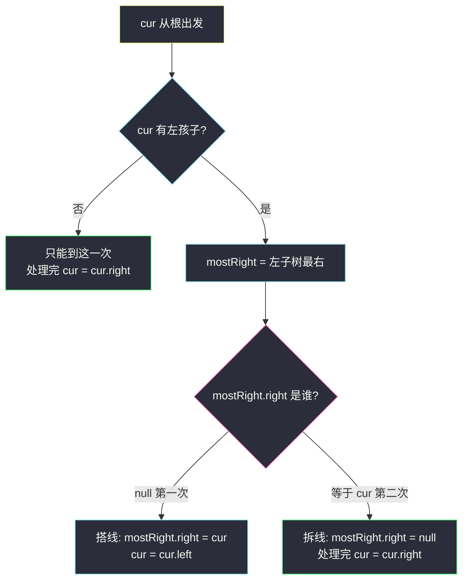
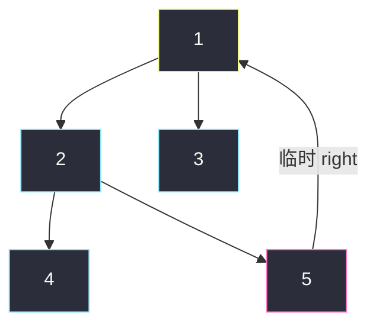

# Morris 遍历：用空指针换栈

> 递归遍历要 `O(h)` 栈；显式栈迭代也是 `O(h)`。Morris 把额外空间压到 **`O(1)`**：临时借用叶子上闲着的 `right`，给自己铺一条「回来的路」，走完再拆掉。  
> 树会被改一会儿，但结束时必须和进来时一模一样。

可直接提交：

- 中序：https://leetcode.cn/problems/binary-tree-inorder-traversal/
- 先序：https://leetcode.cn/problems/binary-tree-preorder-traversal/
- 后序：https://leetcode.cn/problems/binary-tree-postorder-traversal/

---

## 1. 要解决什么问题？

二叉树三序遍历，常规手段：

| 写法 | 时间 | 额外空间 | 改树？ |
|------|------|----------|--------|
| 递归 | `O(n)` | `O(h)` 系统栈 | 否 |
| 显式栈 | `O(n)` | `O(h)` | 否 |
| **Morris** | `O(n)` | **`O(1)`** | 临时改 `right`，结束还原 |

`h` 最坏是 `n`。题目若卡空间、或你想搞清「不用栈怎么从左子树走回来」，才值得上 Morris。日常默写仍优先递归。

**核心交换**：递归靠调用栈记住「从哪回来」；Morris 把这个地址写进**左子树最右节点**的 `right`。

---

## 2. 一个事实：左子树的最右节点，`right` 本来是空的

任意有左孩子的节点 `cur`：

- 左子树里，中序最后一个节点 = **左子树最右侧那条链的尾巴**（记作 `mostRight`）
- 中序里，这个尾巴的**后继就是 `cur` 自己**
- 这个尾巴原来没有右孩子（否则它就不是「最右」）

所以 `mostRight.right` 是空闲的。Morris 把它临时改成指向 `cur`：

```
第一次走到 cur：mostRight.right = cur，然后 cur 往左走
第二次走到 cur：发现 mostRight.right 已经指向自己 → 说明左子树走完了
                把 mostRight.right 改回 null，然后 cur 往右走
```

没有左孩子的节点只会经过一次，直接往右走。



**一句话**：有左树的节点会被碰到两次——第一次去铺路并下左，第二次拆路再下右。

---

## 3. 骨架：只走路、不收集

先把「怎么走」写对。先序 / 中序只是在骨架上换打印时机。

找 `mostRight` 时必须停在两种情况之一：`right == null`（还没搭线）或 `right == cur`（已经搭过）。**不能**写成「一直走到 `right == null`」，否则第二次会顺着线索走回 `cur`，死循环。

```java
// Morris 骨架：走完整棵树并还原所有指针
public static void morris(TreeNode cur) {
    TreeNode mostRight;
    while (cur != null) {
        mostRight = cur.left;
        if (mostRight != null) {
            while (mostRight.right != null && mostRight.right != cur) {
                mostRight = mostRight.right;
            }
            if (mostRight.right == null) {      // 第一次到 cur
                mostRight.right = cur;
                cur = cur.left;
                continue;
            }
            mostRight.right = null;             // 第二次到 cur，拆线
        }
        cur = cur.right;
    }
}
```

循环不变式（直观版）：

- 每次进入 `while (cur != null)` 时，当前子树里**已经拆掉的线索**都还原了；
- 尚未走完的左子树，最多存在一条「最右节点 → 某祖先」的临时边，用来回来。

---

## 4. 先序 / 中序：只改打印时机

对照递归序：有左树的节点，递归会经过它两次（进左之前、左完之后）。Morris 的两次到达，正好对应这两次。

| 序 | 有左树：第一次 | 有左树：第二次 | 无左树 |
|----|----------------|----------------|--------|
| **先序** 根左右 | **打印**，再下左 | 只拆线 | **打印**，下右 |
| **中序** 左根右 | 只搭线，下左 | **拆线后打印** | **打印**，下右 |

无左树时「第一次 = 唯一一次」，先序和中序都在这里打印——因为没有左孩子可等。

### Java 中序（94）

```java
// Morris 中序
// 测试链接 : https://leetcode.cn/problems/binary-tree-inorder-traversal/
public class Solution {
    public List<Integer> inorderTraversal(TreeNode root) {
        List<Integer> ans = new ArrayList<>();
        TreeNode cur = root;
        TreeNode mostRight;
        while (cur != null) {
            mostRight = cur.left;
            if (mostRight != null) {
                while (mostRight.right != null && mostRight.right != cur) {
                    mostRight = mostRight.right;
                }
                if (mostRight.right == null) {
                    mostRight.right = cur;
                    cur = cur.left;
                    continue;
                }
                mostRight.right = null;
            }
            ans.add(cur.val);   // 左子树已走完（或本来就没有）
            cur = cur.right;
        }
        return ans;
    }
}
```

### Java 先序（144）

骨架相同，打印挪到「第一次到达 / 无左树」：

```java
// Morris 先序
// 测试链接 : https://leetcode.cn/problems/binary-tree-preorder-traversal/
public List<Integer> preorderTraversal(TreeNode root) {
    List<Integer> ans = new ArrayList<>();
    TreeNode cur = root;
    TreeNode mostRight;
    while (cur != null) {
        mostRight = cur.left;
        if (mostRight != null) {
            while (mostRight.right != null && mostRight.right != cur) {
                mostRight = mostRight.right;
            }
            if (mostRight.right == null) {
                ans.add(cur.val);          // 第一次：先打印根
                mostRight.right = cur;
                cur = cur.left;
                continue;
            }
            mostRight.right = null;
        } else {
            ans.add(cur.val);              // 无左树：只到一次
        }
        cur = cur.right;
    }
    return ans;
}
```

### Python 中序

```python
class Solution:
    def inorderTraversal(self, root: TreeNode | None) -> list[int]:
        ans: list[int] = []
        cur = root
        while cur:
            most_right = cur.left
            if most_right:
                while most_right.right and most_right.right is not cur:
                    most_right = most_right.right
                if most_right.right is None:
                    most_right.right = cur
                    cur = cur.left
                    continue
                most_right.right = None
            ans.append(cur.val)
            cur = cur.right
        return ans
```

---

## 5. 端到端例子（中序）

树：

```
      1
     / \
    2   3
   / \
  4   5
```

中序目标：`4, 2, 5, 1, 3`。

| 步 | cur | 发生了什么 | 线索 | 输出 |
|----|-----|------------|------|------|
| 1 | 1 | 左树最右是 5，`5.right` 空 → 第一次。`5.right=1`，去左 | 5→1 | |
| 2 | 2 | 左树最右是 4，`4.right` 空 → 第一次。`4.right=2`，去左 | 4→2，5→1 | |
| 3 | 4 | 无左树。打印 4，沿线索 `4.right` 回到 2 | | 4 |
| 4 | 2 | `4.right==2` → 第二次。拆 `4.right`。打印 2，去右到 5 | 5→1 | 4, 2 |
| 5 | 5 | 无左树。打印 5，沿线索回到 1 | 5→1 | 4, 2, 5 |
| 6 | 1 | `5.right==1` → 第二次。拆 `5.right`。打印 1，去右到 3 | （无线索） | 4, 2, 5, 1 |
| 7 | 3 | 无左树。打印 3，`right` 空，结束 | | 4, 2, 5, 1, 3 |

第二次到达 1 时的形态（即将拆线）：



粉边的 5 把路指回 1。拆掉之后树恢复原样。

先序同一条路，只是在步 1 打印 1、步 2 打印 2、步 3 打印 4、步 5 打印 5、步 7 打印 3 → `1, 2, 4, 5, 3`。

---

## 6. 后序：第二次到达时，倒着收左子树的右边界

后序是左右根。Morris 第二次到达 `cur` 时，左子树刚刚走完，但还没走右子树，**不能直接打印 `cur`**。

做法：在第二次到达时，把 **`cur.left` 这棵子树的右边界倒序收集**；整棵树走完后，再倒序收集**整棵树的右边界**。

右边界 = 从该子树根一直沿 `right` 走到空。倒序收集 = 把这条 `right` 链当链表翻转、扫一遍、再翻回来（必须还原）。

上面这棵树的收集时机：

| 时机 | 倒序收哪条右边界 | 打印 |
|------|------------------|------|
| 第二次到 2 | `2.left = 4` 的右边界：`4` | 4 |
| 第二次到 1 | `1.left = 2` 的右边界：`2 → 5`，倒序 | 5, 2 |
| 循环结束 | 整棵树右边界：`1 → 3`，倒序 | 3, 1 |

合起来：`4, 5, 2, 3, 1`，正是后序。

```java
// Morris 后序
// 测试链接 : https://leetcode.cn/problems/binary-tree-postorder-traversal/
public List<Integer> postorderTraversal(TreeNode root) {
    List<Integer> ans = new ArrayList<>();
    TreeNode cur = root;
    TreeNode mostRight;
    while (cur != null) {
        mostRight = cur.left;
        if (mostRight != null) {
            while (mostRight.right != null && mostRight.right != cur) {
                mostRight = mostRight.right;
            }
            if (mostRight.right == null) {
                mostRight.right = cur;
                cur = cur.left;
                continue;
            }
            mostRight.right = null;
            collectRightEdgeReverse(cur.left, ans);  // 左子树刚走完
        }
        cur = cur.right;
    }
    collectRightEdgeReverse(root, ans);              // 整棵树的右边界
    return ans;
}

/** 把以 head 为根的右边界当成链表：翻转 → 收集 → 再翻转还原 */
private void collectRightEdgeReverse(TreeNode head, List<Integer> ans) {
    TreeNode tail = reverseRight(head);
    for (TreeNode p = tail; p != null; p = p.right) {
        ans.add(p.val);
    }
    reverseRight(tail);
}

private TreeNode reverseRight(TreeNode from) {
    TreeNode pre = null;
    while (from != null) {
        TreeNode next = from.right;
        from.right = pre;
        pre = from;
        from = next;
    }
    return pre;
}
```

后序比先/中序多了「右边界当链表翻转」。面试若只问空间 `O(1)` 的中序，把第 4 节写对即可；追问后序再补这一段。

---

## 7. 复杂度为什么是 `O(n)` / `O(1)`

**空间**：只用 `cur`、`mostRight` 等几个指针，没有栈。后序的翻转也是原地改 `right`，额外仍是常数。所以是 `O(1)`（不算答案数组）。

**时间**：每个节点最多到达两次；找 `mostRight` 看起来像套了一层 `while`，但每条树边在「向下找最右」和「沿线索回来」里只会被走常数次，总计仍是 `O(n)`。常数比递归大一截，这是用时间换空间。

---

## 8. 易错点

1. **找最右时漏了 `mostRight.right != cur`** → 第二次顺着线索回到自己，死循环。
2. **第二次到达忘了 `mostRight.right = null`** → 树被改坏，调用方看到环。
3. **中序把打印放在第一次** → 变成先序。
4. **后序在第二次直接 `ans.add(cur)`** → 根会过早出现，右子树还没走。
5. **多线程 / 共享树** 时不要 Morris：遍历期间结构短暂非法。
6. **判断 BST** 可以在中序位置维护 `pre`，看 `pre.val < cur.val`（https://leetcode.cn/problems/validate-binary-search-tree/），走的还是同一骨架。

---

## 9. 和递归、迭代怎么选

| 场景 | 用什么 |
|------|--------|
| 默写、改树、路径回溯 | 递归 |
| 禁递归、空间 `O(h)` 可接受 | 显式栈 |
| 明确要 `O(1)` 额外空间、可临时改指针 | Morris |
| 只是「看看三序」 | 不要上 Morris |

**口诀**：有左树两次到——先搭线往左，再拆线往右；先序印在第一次，中序印在拆线后；后序拆线时倒收左树右边界，最后再倒收整树右边界。
