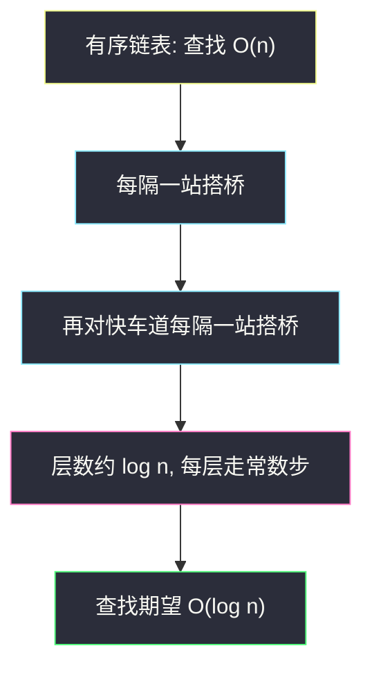
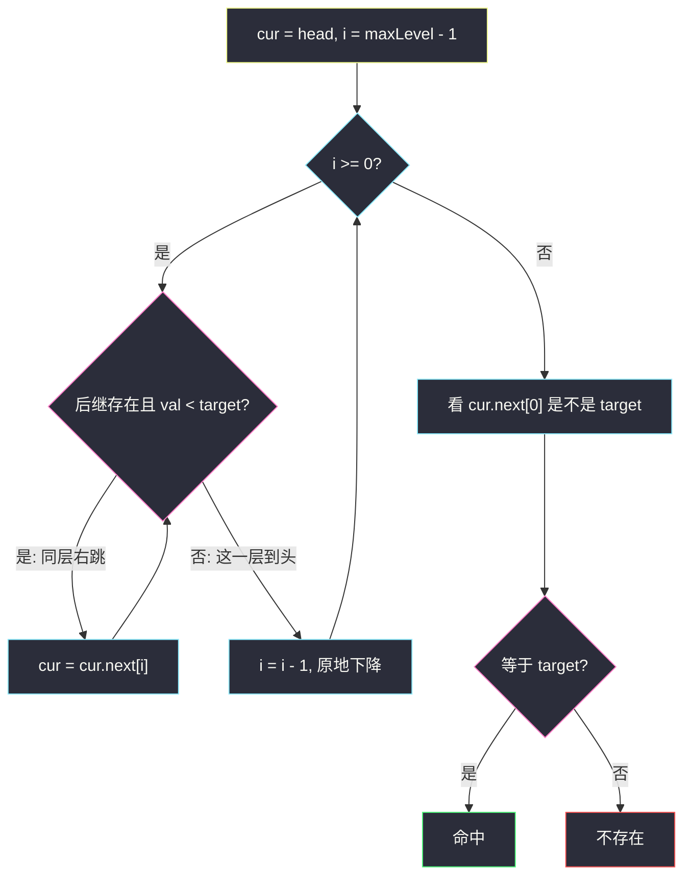
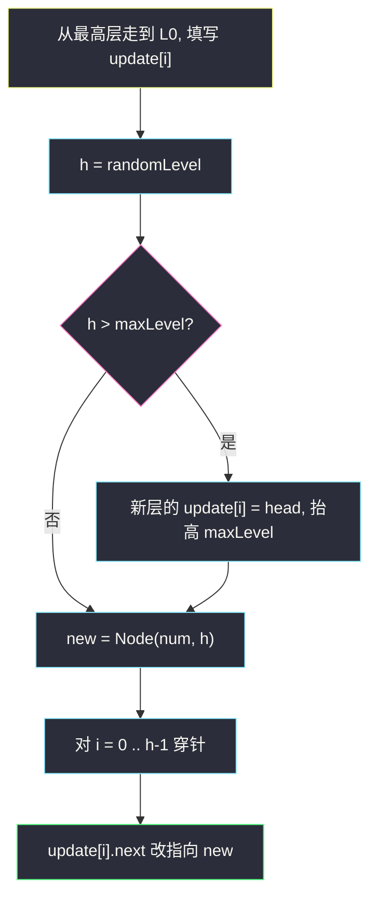
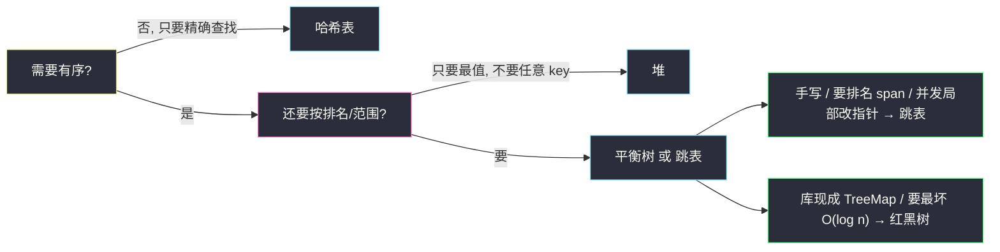

# 跳表：用多层链表近似平衡树

> 有序集合要 `O(log n)` 的查 / 插 / 删。AVL、红黑树靠**旋转**把高度钉在 `log n`；跳表不旋转，给每个节点**随机加几层快车道**，在概率上得到同样的高度。  
> 实现短、范围扫描就是顺着最底层走、按排名查询只要再给每条边记一个「跨度」。Redis 的 `ZSET`、Java 的 `ConcurrentSkipListMap`、LevelDB 的 memtable，用的都是它。

可直接提交：

- 设计跳表：https://leetcode.cn/problems/design-skiplist/
- 带排名的平衡树（跨度版）：https://www.luogu.com.cn/problem/P3369

**索引约定**：正文示意图把最底层叫 **L0**（完整有序链表），往上 L1、L2……代码里 `next[0]` 就是 L0。有的教材 / 左程云 / Redis 源码从第 1 层起算，差的只是 ±1，不是另一种结构。

---

## 1. 要解决什么问题？

维护一个**有序集合**（可重复），支持：

| 操作 | 含义 |
|------|------|
| `search(x)` | x 在不在 |
| `add(x)` | 插入一个 x（重复算多个） |
| `erase(x)` | 删掉**一个** x，没有则失败 |
| （进阶）`rank(x)` / `index(k)` | 比 x 小的有多少；第 k 小是谁 |
| （进阶）前驱 / 后继 / 范围扫描 | `< x` 的最大、`> x` 的最小、区间里所有数 |

候选结构：

| 结构 | 查找 | 插入删除 | 有序遍历 | 痛点 |
|------|------|----------|----------|------|
| 有序数组 | `O(log n)` | `O(n)` 搬移 | 快 | 改一点动一片 |
| 有序链表 | `O(n)` | 找到后 `O(1)` | 快 | 找不到，只能挨个走 |
| 哈希表 | 期望 `O(1)` | 期望 `O(1)` | **无序** | 做不了范围、排名 |
| AVL / 红黑树 | `O(log n)` 最坏 | `O(log n)` + 旋转 | 中序 | 旋转 / 染色难写、难并发 |
| **跳表** | **期望 `O(log n)`** | **期望 `O(log n)`，局部改指针** | 最底层就是链表 | 不保证最坏；靠随机 |

跳表要回答的那句话：**链表已经有序了，只是走得太慢——能不能隔几个就搭一座桥，让查找像高速公路一样先走快车道、临近再下辅路？**

---

## 2. 高速公路直觉

最底层是普通有序单链表，查 17 最多走完所有节点：

```
L0:  2 → 5 → 7 → 9 → 12 → 17 → 21
                 要找 17，一步一挪
```

如果允许「每隔一个」再拉一层：

```
L1:  2 ------> 7 ------> 12 ------> 21
L0:  2 → 5 → 7 → 9 → 12 → 17 → 21
```

查 17：L1 上 `2 → 7 → 12`，12 的下一家 21 已经越过 17，**下到 L0**，`12 → 17`。步数从 6 变成 4。再加一层，继续稀疏：

```
L2:  2 ----------------> 12
L1:  2 ------> 7 ------> 12 ------> 21
L0:  2 → 5 → 7 → 9 → 12 → 17 → 21
```

理想世界里：**每一层都是下一层的「隔一取一」**，层数约 `log₂ n`，每一层只走常数步，总查找就是 `O(log n)`。这和完全二叉树的高度是一回事——只不过二叉树的边是父子，跳表的边是「同层后继」。



**立刻出现的问题**：真按「每隔一个」来，插入一个新节点会打乱所有层的间距，要么全局重建，要么像 B 树一样做复杂的分裂。跳表的发明（William Pugh, 1990）是：**不要维持完美间距，让每个新节点自己掷硬币决定长多高。** 大样本下，高度的分布仍然接近几何层级，期望复杂度不变，插入却只改自己那几层的指针。

---

## 3. 结构：节点、层、哨兵

一个节点不止一个 `next`，而是 **`next[0..h)`**：`next[i]` 指向「第 i 层的后继」。`h` 是这个节点的**层高**（tower height），至少为 1（必须出现在 L0）。

整张表还要一个**哨兵头** `head`：层高拉满 `MAX_LEVEL`，值比任何合法 key 都小（实现里随便放个 -1 即可，查找从不拿 `head.val` 当数据）。所有层的遍历都从头开始，避免「这一层第一个节点是谁」的空指针特判。

```
        next[2]
head ─────────────────────────────► 9 ──► null
        next[1]
head ──────────► 3 ───────────────► 9 ──► null
        next[0]
head ──► 1 ──► 3 ──► 5 ──► 7 ──► 8 ──► 9 ──► null
```

读图规则：

- **竖直方向**是同一个节点的塔。9 出现在 L0/L1/L2，所以它的 `next.length == 3`。
- **水平方向**同一层严格有序。
- **包含关系**：L2 上的节点一定出现在 L1，L1 一定出现在 L0。L0 包含全部数据。
- 向右走 = 同层后继；要更精细就**原地降一层**（节点引用不变，`i--`）。

节点长这样：

```java
static class Node {
    int val;
    Node[] next;   // next[i] = 第 i 层后继；数组长度 = 层高
    Node(int val, int height) {
        this.val = val;
        this.next = new Node[height];
    }
}
```

**循环不变式**（后面所有操作都在维护它）：

1. 每一层都是严格的有序单链表（允许值相等的相邻节点，见第 6 节）。
2. 层 `i` 上的节点序列，是层 `i-1` 的子序列。
3. 查找时若在层 `i` 停在节点 `u`（`u.next[i]` 空，或 `u.next[i].val >= target`），则 target 若存在，一定在 `u` 这一侧的更低层里，绝不会落在 `u.next[i]` 的右边。

第 3 条就是「能右则右、不能则下」正确的原因：高层已经用更大的步子把区间收窄了。

---

## 4. 随机层高：几何分布

新节点至少占 L0。然后反复掷硬币：正面就再加一层，直到反面，或碰到 `MAX_LEVEL`。

```
randomLevel():
    h = 1
    while random() < p 且 h < MAX_LEVEL:
        h++
    return h
```

教科书和 LeetCode 实现常用 **`p = 1/2`**；Redis 用 **`p = 1/4`**（塔更矮，更省指针，查找时每一层平均多走几步）。

这是**几何分布**。一个节点高度至少为 k（即它出现在 L(k-1) 上）的概率：

| 至少几层 | 概率（`p = 1/2`） | n = 10^6 时期望节点数 |
|----------|-------------------|------------------------|
| ≥ 1（L0） | 1 | 1_000_000 |
| ≥ 2（L1） | 1/2 | 500_000 |
| ≥ 3（L2） | 1/4 | 250_000 |
| ≥ 11 | 1/1024 | ~1000 |
| ≥ 21 | 约 10^-6 | < 1 |

所以：

- **单个节点的期望层高** = `1 + p + p² + … = 1/(1-p)`。`p = 1/2` 时期望 **2** 根指针，整张表额外空间是 `O(n)`，不是 `O(n log n)`。
- **整张表用到的最高层**期望是 `O(log n)`：令 `n · p^(k-1) ≈ 1`，解出 `k ≈ log(n) / log(1/p)`。`p = 1/2` 就是 `log₂ n`。
- `MAX_LEVEL = 16` 对百万级足够（`2^16 = 65536` 量级已经远超「顶层只剩几个节点」）；Redis 用 32 是因为 `p = 1/4` 时层要更多才摊平，且要扛住极大的 zset。

`p` 的权衡：

| | `p = 1/2` | `p = 1/4`（Redis） |
|--|-----------|---------------------|
| 期望指针 / 节点 | 2 | 4/3 ≈ 1.33 |
| 期望层数 | `log₂ n` | `log₄ n = (1/2) log₂ n`（更矮） |
| 每一层平均右走几步 | 约 2 | 约 4 |
| 总查找步数 | 同阶 `O(log n)` | 同阶，常数略不同 |

**不要**试图在插入后去「修正」间距。随机的全部意义就是：每个节点独立，插入只动自己，大数定律会把层级密度拉回几何形状。

---

## 5. 查找：能右则右，不能则下

从 `head` 的**当前最高层**往下扫。在第 `i` 层，只要后继存在且 **`next.val < target`**，就沿这一层跳过去；否则降到 `i-1`，人还站在同一个节点上。

降到 L0 走完后，看 `cur.next[0]` 是不是 target。



用第 3 节那张表查 **7**：

| 步 | 层 | 站在 | 后继 | 决策 |
|----|----|------|------|------|
| 1 | L2 | head | 9 | 9 `<` 7？否，下降 |
| 2 | L1 | head | 3 | 3 `<` 7，右跳到 3 |
| 3 | L1 | 3 | 9 | 9 `<` 7？否，下降 |
| 4 | L0 | 3 | 5 | 5 `<` 7，右跳到 5 |
| 5 | L0 | 5 | 7 | 7 `<` 7？否，L0 结束 |
| 6 | — | — | `5.next[0] = 7` | 命中 |

路径是 `head →(下) head →(右) 3 →(下) 3 →(右) 5 →(看后继) 7`。高层把搜索区间从「整张表」收成「3 的右边」，底层只在短区间里爬。

**比较必须用 `<` 而不是 `≤`**：相等时停下来下降，最后在 L0 核对。若写成 `≤` 再右跳，会越过 target，漏掉它（有重复值时更会跳到重复段的右边）。

查找本身**不需要**记下前驱。插入和删除需要，所以实现里会把「走一遍」抽成填 `update[]` 的过程，查找只是走完后看一眼 `update[0].next[0]`。

---

## 6. 插入：记下每一层的前驱，再穿针

插入 = 查找的终点变成「要插入的位置」，再在 0..h-1 层各接一次指针。关键辅助数组：

**`update[i]` = 第 i 层里，新节点应该插在谁后面**（该层最右的、值 `< num` 的节点；可能是 `head`）。

走法和查找完全一样，只是每降一层之前把当前节点记进 `update[i]`。

然后 `h = randomLevel()`。若 `h` 高于表的当前高度 `maxLevel`，多出来的那些层没有人走过，`update[i]` 一律等于 `head`（新的最高层目前只有哨兵），并抬高 `maxLevel`。

穿针（每一层独立、互不干扰）：

```
原来:  update[i] ────────► succ
现在:  update[i] ──► new ──► succ
```

```java
node.next[i] = update[i].next[i];
update[i].next[i] = node;
```

**先接 new 的后继，再把前驱改过来**——和链表插入同一纪律，顺序反了会丢链。

有重复值时：因为前进条件是 `next.val < num`，会停在「第一段相等值」的左边，新节点插在所有已有 `num` 的**前面**。`erase` 也删最左边那个。对 LeetCode 1206 足够；语义是「袋（bag）」而不是「去重集合」。

另一种设计是相同 key **只留一个节点 + `count` 词频**（洛谷 P3369、部分竞赛跳表）。省节点，但跨度要按词频加权。主代码用多节点，更贴 1206，也更好画。



---

## 7. 删除：还是那些前驱，按塔高拆线

同样填 `update[]`。走到 L0 后令 `victim = update[0].next[0]`，若空或不等于 num，返回失败。

`victim` 的塔高是 `victim.next.length`。只在这些层上，`update[i].next[i]` 才可能等于 `victim`。拆法：

```
原来:  update[i] ──► victim ──► succ
现在:  update[i] ──────────────► succ
```

```java
for (int i = 0; i < victim.next.length; i++) {
    update[i].next[i] = victim.next[i];
}
```

从 **L0 往上**拆。不要从最高层往下碰到「这一层 next 不是 victim」就 `break`——若循环变量是从高到低，会把下面还没拆的层漏掉。按 `victim` 自己的高度循环最不容易写错。

拆完后，若最高层已经没有任何实节点（`head.next[maxLevel-1] == null`），把 `maxLevel` 降下来。可以连降多层。`maxLevel` 至少留 1。

---

## 8. 端到端例子

规定随机层高（含 L0，即 `next.length`），按这个顺序插入：

| 插入 | 层高 | 出现在哪些层 |
|------|------|----------------|
| 5 | 1 | L0 |
| 9 | 3 | L0 L1 L2 |
| 3 | 2 | L0 L1 |
| 7 | 1 | L0 |
| 1 | 2 | L0 L1 |

### 8.1 插入 5（高 1）

空表，`maxLevel` 先当成 1，`update[0] = head`。

```
L0:  head ──► 5 ──► null
maxLevel = 1
```

### 8.2 插入 9（高 3）

从 L0 走：`head` 的后继 5 `<` 9，跳到 5；5 的后继空。`update[0] = 5`。  
`h = 3 > maxLevel`，于是 `update[1] = update[2] = head`，`maxLevel = 3`。

```
L2:  head ─────────────────────► 9 ──► null
L1:  head ─────────────────────► 9 ──► null
L0:  head ──► 5 ───────────────► 9 ──► null
```

### 8.3 插入 3（高 2）

| 层 | 站在 | 后继 | 动作 | update |
|----|------|------|------|--------|
| L2 | head | 9 | 9 `<` 3？否，记 update、下降 | update[2]=head |
| L1 | head | 9 | 9 `<` 3？否 | update[1]=head |
| L0 | head | 5 | 5 `<` 3？否 | update[0]=head |

3 插在 head 后面、5/9 前面。L2 比 3 的塔高，不动。

```
L2:  head ──────────────────────────► 9
L1:  head ──► 3 ────────────────────► 9
L0:  head ──► 3 ──► 5 ──────────────► 9
```

### 8.4 插入 7（高 1）

L2：head → 9 太大。L1：head → 3（3 `<` 7）→ 9 太大。L0：3 → 5（5 `<` 7）→ 9 太大。  
`update = [5, 3, head]`，只在 L0 把 7 接到 5 和 9 之间。

```
L2:  head ────────────────────────────────► 9
L1:  head ──► 3 ──────────────────────────► 9
L0:  head ──► 3 ──► 5 ──► 7 ──────────────► 9
```

### 8.5 插入 1（高 2）

三层的后继都 ≥ 1，`update` 全是 head。1 接到最左边。

```
L2:  head ──────────────────────────────────────► 9
L1:  head ──► 1 ──────► 3 ──────────────────────► 9
L0:  head ──► 1 ──► 3 ──► 5 ──► 7 ──────────────► 9
```

这就是第 3 节那张图（还没 8）。

### 8.6 查找 7（对照第 5 节表）

粉节点是路径上停留过的位置：

```mermaid
flowchart TD
    subgraph L2["L2"]
        h2["head"] --> n9c["9"]
    end
    subgraph L1["L1"]
        h1["head"] --> n1b["1"] --> n3b["3"] --> n9b["9"]
    end
    subgraph L0["L0"]
        h0["head"] --> n1a["1"] --> n3a["3"] --> n5a["5"] --> n7a["7"] --> n9a["9"]
    end

    style L2 fill:#161722,stroke:#8be9fd,color:#f8f8f2
    style L1 fill:#161722,stroke:#8be9fd,color:#f8f8f2
    style L0 fill:#161722,stroke:#8be9fd,color:#f8f8f2
    style h2 fill:#2b2d3a,stroke:#f1fa8c,color:#f8f8f2
    style h1 fill:#2b2d3a,stroke:#f1fa8c,color:#f8f8f2
    style h0 fill:#2b2d3a,stroke:#f1fa8c,color:#f8f8f2
    style n3b fill:#2b2d3a,stroke:#ff79c6,color:#f8f8f2
    style n5a fill:#2b2d3a,stroke:#ff79c6,color:#f8f8f2
    style n7a fill:#2b2d3a,stroke:#50fa7b,color:#f8f8f2
    style n9c fill:#2b2d3a,stroke:#8be9fd,color:#f8f8f2
    style n1b fill:#2b2d3a,stroke:#8be9fd,color:#f8f8f2
    style n9b fill:#2b2d3a,stroke:#8be9fd,color:#f8f8f2
    style n1a fill:#2b2d3a,stroke:#8be9fd,color:#f8f8f2
    style n3a fill:#2b2d3a,stroke:#8be9fd,color:#f8f8f2
    style n9a fill:#2b2d3a,stroke:#8be9fd,color:#f8f8f2
```



L2 的 9 太大所以没碰它；真正走过的是 head(L2) → 下降 → 3(L1) → 下降 → 5(L0) → 看见 7。

### 8.7 插入 8（高 2）

| 层 | 走法 | update |
|----|------|--------|
| L2 | head 的 9 不小于 8 | head |
| L1 | head → 1 → 3，后继 9 太大 | 3 |
| L0 | 3 → 5 → 7，后继 9 太大 | 7 |

8 穿进 L1 和 L0：

```
L2:  head ──────────────────────────────────────────► 9
L1:  head ──► 1 ──────► 3 ──────────────► 8 ────────► 9
L0:  head ──► 1 ──► 3 ──► 5 ──► 7 ──► 8 ──────────► 9
```

L2 没 8，因为塔高只有 2。**这就是跳表插入的全部局部性**：3 的 L1 后继从 9 改成 8，7 的 L0 后继从 9 改成 8，9 的入边少两根、多两根，别的节点指针不动。没有旋转，没有把 5、7 提上去。

### 8.8 删除 9

`update`：L2 停在 head（后继就是 9），L1 停在 8，L0 停在 8。`victim` 是 9，塔高 3，三层都拆：

```
L2:  head ──► null          （这一层空了，maxLevel 降到 2）
L1:  head ──► 1 ──► 3 ──► 8 ──► null
L0:  head ──► 1 ──► 3 ──► 5 ──► 7 ──► 8 ──► null
```

9 曾经是唯一的 L2 节点，删掉后顶层变空，高度收缩。若不收缩，查找仍正确（顶层一步都走不了，立刻下降），只是多做几次空转。

---

## 9. 代码实现（LeetCode 1206）

设计类：

- `Skiplist()`
- `boolean search(int target)`
- `void add(int num)`
- `boolean erase(int num)` —— 只删一个；没有则返回 false

约束大约 5·10^4 次操作。`MAX_LEVEL = 16`、`p = 0.5` 足够。

### Java

```java
// 设计跳表
// 测试链接 : https://leetcode.cn/problems/design-skiplist/
class Skiplist {
    static final int MAX_LEVEL = 16;
    static final double P = 0.5;

    static class Node {
        int val;
        Node[] next;

        Node(int val, int height) {
            this.val = val;
            this.next = new Node[height];
        }
    }

    private final Node head = new Node(-1, MAX_LEVEL);
    private int maxLevel = 1;

    public Skiplist() {}

    private int randomLevel() {
        int h = 1;
        while (Math.random() < P && h < MAX_LEVEL) {
            h++;
        }
        return h;
    }

    /** 填写每一层的前驱；返回后调用方看 update[0].next[0] */
    private Node[] findPredecessors(int target) {
        Node[] update = new Node[MAX_LEVEL];
        Node cur = head;
        for (int i = maxLevel - 1; i >= 0; i--) {
            while (cur.next[i] != null && cur.next[i].val < target) {
                cur = cur.next[i];
            }
            update[i] = cur;
        }
        return update;
    }

    public boolean search(int target) {
        Node[] update = findPredecessors(target);
        Node cand = update[0].next[0];
        return cand != null && cand.val == target;
    }

    public void add(int num) {
        Node[] update = findPredecessors(num);
        int h = randomLevel();
        if (h > maxLevel) {
            for (int i = maxLevel; i < h; i++) {
                update[i] = head;
            }
            maxLevel = h;
        }
        Node node = new Node(num, h);
        for (int i = 0; i < h; i++) {
            node.next[i] = update[i].next[i];
            update[i].next[i] = node;
        }
    }

    public boolean erase(int num) {
        Node[] update = findPredecessors(num);
        Node victim = update[0].next[0];
        if (victim == null || victim.val != num) {
            return false;
        }
        for (int i = 0; i < victim.next.length; i++) {
            update[i].next[i] = victim.next[i];
        }
        while (maxLevel > 1 && head.next[maxLevel - 1] == null) {
            maxLevel--;
        }
        return true;
    }
}
```

### Python

```python
import random

class Skiplist:
    MAX_LEVEL = 16
    P = 0.5

    class Node:
        def __init__(self, val: int, height: int):
            self.val = val
            self.next: list[Skiplist.Node | None] = [None] * height

    def __init__(self):
        self.head = Skiplist.Node(-1, self.MAX_LEVEL)
        self.max_level = 1

    def _random_level(self) -> int:
        h = 1
        while random.random() < self.P and h < self.MAX_LEVEL:
            h += 1
        return h

    def _predecessors(self, target: int) -> list[Node]:
        update = [self.head] * self.MAX_LEVEL
        cur = self.head
        for i in range(self.max_level - 1, -1, -1):
            while cur.next[i] is not None and cur.next[i].val < target:
                cur = cur.next[i]
            update[i] = cur
        return update

    def search(self, target: int) -> bool:
        update = self._predecessors(target)
        cand = update[0].next[0]
        return cand is not None and cand.val == target

    def add(self, num: int) -> None:
        update = self._predecessors(num)
        h = self._random_level()
        if h > self.max_level:
            for i in range(self.max_level, h):
                update[i] = self.head
            self.max_level = h
        node = Skiplist.Node(num, h)
        for i in range(h):
            node.next[i] = update[i].next[i]
            update[i].next[i] = node

    def erase(self, num: int) -> bool:
        update = self._predecessors(num)
        victim = update[0].next[0]
        if victim is None or victim.val != num:
            return False
        for i in range(len(victim.next)):
            update[i].next[i] = victim.next[i]
        while self.max_level > 1 and self.head.next[self.max_level - 1] is None:
            self.max_level -= 1
        return True
```

范围扫描（没要求提交，但跳表的「免费赠品」）：从 `findPredecessors(lo)` 得到的 `update[0].next[0]` 出发，**只沿 L0** 走到值 `> hi`。这就是 Redis `ZRANGEBYSCORE` 的骨架——先用高层定位左端点，再顺序吐出。

---

## 10. 复杂度：期望 `O(log n)`，不是最坏 `O(log n)`

### 10.1 空间

每个节点期望 `1/(1-p)` 根指针。`p = 1/2` 时平均 2，合计 `O(n)`。哨兵占 `MAX_LEVEL`，常数。

最坏：所有节点都长到 `MAX_LEVEL`，空间 `O(n · MAX_LEVEL)`。概率是 `p^(MAX_LEVEL-1)` 的 n 次方量级，实际当它不发生。`MAX_LEVEL` 本身有上限，所以空间最坏也是线性乘一个小常数（16 或 32）。

### 10.2 高度

前面已经用「第 k 层期望 `n · p^(k-1)` 个节点」夹出表高期望 `O(log n)`。再硬一点：单个节点高度 ≥ `c · log(n)/log(1/p)` 的概率是 `1/n^c`。n 个节点做并，再取 c 大一点（比如 3），**整张表高度超过 `O(log n)` 的概率是 n 的某个负常数次方**，和「随机快速排序退化成 `O(n²)`」同一类尾巴。

### 10.3 查找步数

Pugh 的标准算法分析是**倒着看搜索路径**。从目标（或它应在的位置）往回走到 head：路径上每一步要么是「同一层向左」，要么是「升一层」。

更适合默写的直觉：

1. 层数期望 `O(log n)`，所以「下降」最多这么多次。
2. 在某一层，两个相邻的「更高一层节点」之间，夹着的本层节点数期望是常数（`p = 1/2` 时期望约 1 个中间点，再算上自己，右走期望常数步）。
3. 下降次数 × 每层右走步数 = 期望 `O(log n)`。

插入、删除 = 一次查找 + 最多 `O(maxLevel)` 次指针改写，所以也是期望 `O(log n)`。

### 10.4 和「最坏也是 `O(log n)`」的平衡树比

跳表**没有** AVL 那种「任何输入、任何随机种子都 `O(log n)`」的保证。对抗性输入加上一个**已知的随机种子**，理论上可以构造出退化链。实践里：

- 用不可预测的随机源（`Math.random` / `ThreadLocalRandom`）即可；
- 即便退化，`MAX_LEVEL` 把塔高截断，最坏查找是 `O(n)`（退化成单链表），不会无限涨。

面试一句话：**跳表是概率平衡，红黑树是强制平衡；前者代码短、后者最坏有保证。**

---

## 11. 跨度：`O(log n)` 算排名

到这里，跳表已经是有序集合。Redis 的 `ZRANK` / `ZREVRANK`、洛谷 P3369 的「x 的排名 / 第 k 小」，还要能回答：**这个节点左边有多少个元素？**

在每一层的每一条 forward 边上加一个整数 **`span`（跨度）**：

> `node.span[i]` = 从 `node` 走到 `node.next[i]`，底层 L0 要经过多少个**实节点**（不含自己，含到达的那个节点）。

L0 上每条边的 span 都是 1。高层一条边可能跨过好几个底层节点，span 就是这段里的节点个数。

沿用「插入 8 之前」那张表，标上 span：

```
L2:  head --------span=5--------> 9
L1:  head -1-> 1 -1-> 3 ----span=3----> 9
L0:  head -1-> 1 -1-> 3 -1-> 5 -1-> 7 -1-> 9
```

- L0 每条边 span=1。
- 1 也在 L1，所以 head→1 的 span=1，1→3 的 span=1。若 1 不在 L1，head 会直接指向 3，那条边 span=2（跨过 1 和 3）。
- 3→9 在 L1：经过 5、7、9，span=3。
- head→9 在 L2：经过 1、3、5、7、9，span=5。

**排名（1-based）= 从头走到该节点的路径上，所有用过的 span 之和。**  
查 7 的排名：

| 层 | 动作 | 累加 rank |
|----|------|-----------|
| L2 | head 的后继 9 不小于 7，不走 | 0 |
| L1 | head→1（1`<`7）rank+=1；1→3（3`<`7）rank+=1；3→9 太大 | 2 |
| L0 | 3→5（5`<`7）rank+=1；5→7 不小于 7 | 3 |

比 7 小的有 3 个（1、3、5），7 的排名 = 3+1 = 4。若只要「小于 x 的个数」，用 3 即可；若 x 不存在，这个 3 仍是插入点左边的元素个数。

### 11.1 插入时怎么改 span

查找前驱时额外记 `rank[i]` = **`update[i]` 这个节点的排名**（哨兵排名 0；往右跳时把走过的 span 累加进去）。走到 L0 结束时，`rank[0]` 就是「严格小于新值的元素个数」。新节点自己的排名是 `rank[0] + 1`。

对每一层 `i = 0 .. h-1`（新节点出现的层）：

```
new.span[i]     = update[i].span[i] - (rank[0] - rank[i])
update[i].span[i] = (rank[0] - rank[i]) + 1
```

人话：

- `rank[0] - rank[i]` = 从 `update[i]` 到「新节点前一个」之间的底层节点数；
- 前驱到新节点的跨度 = 这段距离 + 1（把新节点自己算进去）；
- 新节点到原后继的跨度 = 前驱原来那条大边的跨度，减去刚分走的那一截。

对 **`i = h .. maxLevel-1`**（新节点够不着的高层）：这条边从原前驱仍跳到原来的后继，只是中间多了一个人，**`update[i].span[i]++`**。

插 8、高 2，对照上一张图：

走完后 `update[0]=7`（rank 4，因为 1,3,5,7），`update[1]=3`（rank 2），`update[2]=head`（rank 0），`rank[0]=4`。

- L0：`rank[0]-rank[0]=0` → 7.span[0]=0+1=1（7→8），8.span[0]=旧的 1-0=1（8→9）。
- L1：`rank[0]-rank[1]=2` → 3.span[1]=2+1=3（3→8 经过 5,7,8），8.span[1]=旧的 3-2=1（8→9）。
- L2：8 够不着，head.span[2] 从 5 变成 6。

结果：

```
L2:  head --------span=6--------> 9
L1:  head -1-> 1 -1-> 3 --span=3--> 8 -1-> 9
L0:  head -1-> 1 -1-> 3 -1-> 5 -1-> 7 -1-> 8 -1-> 9
```

### 11.2 删除时怎么改 span

找到 `victim` 之后，每一层：

- 若 `update[i].next[i] == victim`：边要改接，跨度合并为 `update.span[i] += victim.span[i] - 1`（两段拼起来，去掉 victim 自己）；
- 否则：这条边本来就跳过 victim，`update.span[i]--`。

### 11.3 第 k 小

从 head、最高层开始：若 `cur.span[i] < k`，说明第 k 小还在更右边，`k -= span[i]`，右跳；否则下降。降到 L0 时，后继就是答案。这和「在二叉搜索树里用子树 size 找第 k 小」是同一个思路，span 就是「这条边覆盖的子树大小」。

### 11.4 带跨度的实现要点

下面在 1206 的节点上加 `span[]`，支持 `countSmaller`（小于 num 的个数）和 `index`（第 k 小，k 从 1 开始）。重复值仍用多节点。洛谷 P3369 把重复压成词频即可，逻辑相同，span 改按 `count` 加权。

```java
static class Node {
    int val;
    Node[] next;
    int[] span;   // span[i] 与 next[i] 配对；哨兵同样有

    Node(int val, int height) {
        this.val = val;
        this.next = new Node[height];
        this.span = new int[height];
    }
}

// 查找时同时填 update[i] 与 rank[i]（update[i] 的排名，head 为 0）
int countSmaller(int num) {
    Node cur = head;
    int rank = 0;
    for (int i = maxLevel - 1; i >= 0; i--) {
        while (cur.next[i] != null && cur.next[i].val < num) {
            rank += cur.span[i];
            cur = cur.next[i];
        }
    }
    return rank;
}

int index(int k) {   // k 从 1 到 size
    Node cur = head;
    for (int i = maxLevel - 1; i >= 0; i--) {
        while (cur.next[i] != null && cur.span[i] < k) {
            k -= cur.span[i];
            cur = cur.next[i];
        }
    }
    return cur.next[0].val;
}
```

插入里改 span 的那四行，对照 11.1 的公式写进穿针循环即可；高层 `span++` 不要漏。这是本节唯一容易算错的地方——**画一个 3 层小例子手算一遍 rank[] 再写代码**，比盯着公式更稳。

Redis 的 `zskiplistLevel` 就是 `{forward, span}` 这一对；`ZRANK` 沿途加 span，`ZREVRANGE` 靠底层的 `backward` 倒着走（本文单向链表版本不需要 backward，倒序可以先 `index(size)` 再往左……单向做不到往左，所以 Redis 底层是双向的）。

---

## 12. 实战里它出现在哪

### Redis ZSET

一个 zset = **哈希表 + 跳表**：

| 结构 | 负责 |
|------|------|
| `dict`：member → score | `ZSCORE` `O(1)`，也用来判断 member 在不在 |
| 跳表：按 (score, member) 有序 | `ZRANGE`、`ZRANK`、范围、前后名次 |

member 唯一，score 可重复；score 相同再比 member 字典序。`p = 0.25`，`MAX_LEVEL = 32`，底层带 `backward`，每层带 `span`。排行榜那道系统设计题里，`ZADD` / `ZINCRBY` / `ZREVRANGE` / `ZREVRANK` 能 `O(log n)` 完成，根源就是这张表。

为什么不用红黑树？范围扫描同样可以中序走；但 span 让**排名是一等公民**，实现也更短。Redis 早期作者明确写过：跳表在范围操作上更舒服，实现复杂度比平衡树友好。

### Java ConcurrentSkipListMap

`java.util.concurrent` 里有序 Map 的并发实现。跳表插入只改前驱的几根指针，Pugh 原论文就给出了**分层加锁**（锁住要改的那几个前驱）；后来的无锁版本用 CAS 换指针。红黑树一次旋转可能动到离插入点很远的祖先，锁粒度更差。这是「跳表比平衡树更适合并发」的具体含义——不是神秘性能，是**修改的局部性**。

### LSM memtable（LevelDB / RocksDB）

写先落到内存有序结构，满了再 freeze、顺序刷成 SSTable。哈希表快但**吐不出有序序列**；红黑树 / 跳表都能边插边保持有序。LevelDB 选了跳表：实现简单，遍历 L0 就是刷盘顺序。

---

## 13. 和 AVL / 红黑树 / 哈希 / 堆怎么选



| 场景 | 选 |
|------|----|
| 默写有序集合、LeetCode 1206 | 跳表（本节主代码） |
| Java 里要个有序 Map，单线程 | `TreeMap`（红黑树） |
| 并发有序 Map | `ConcurrentSkipListMap` |
| 排行榜、区间、名次 | Redis ZSET（跳表 + 哈希） |
| 只要 Top-K / 中位数，不要任意查找 | 堆 |
| 最坏时间必须死死钉住 | AVL / 红黑树 |
| 只要精确查找 | 哈希表，不要跳表 |

Treap（随机优先级的 BST）是跳表的近亲：都靠随机得到期望 `O(log n)` 高度。Treap 改的是树旋转，跳表改的是多层后继。理解一个，另一个的「随机维持平衡」可以直接迁移。

---

## 14. 易错点

1. **前进条件写成 `<=`**：会越过 target，`search` 假阴性；有重复时 `erase` 可能删错位置。一律 `next.val < target`，相等留给 L0 判断。
2. **插入时 `h > maxLevel` 却忘了把新层的 `update[i]` 设成 `head`**：新层 `update[i]` 还是 null，NPE。
3. **穿针顺序反了**：必须 `node.next[i] = update[i].next[i]` 再 `update[i].next[i] = node`。
4. **删除从高层往下扫，遇到 `next != victim` 就 break**：victim 塔比较矮时，高层本来就不是它，break 会把 L0 的线留下，链表坏掉。按 `victim.next.length` 从 0 往上拆。
5. **删空顶层却不降 `maxLevel`**：正确性还在，之后每次查找多扫几层空指针。1206 不卡这个，但和 Redis 一致更好。
6. **`maxLevel` 降到 0**：查找循环 `i = -1`，再访问 `next[0]` 仍行，但语义别扭。至少留 1。
7. **把层高当成「最高层下标」**：`next.length == 3` 表示 L0/L1/L2，最高下标是 2。和 1-based 教材对拍时 ±1。
8. **跨度版漏改高层 `span++` / 删除时漏 `span--`**：排名整体偏 1，`index(k)` 全错，查找仍可能对——这是 span  bug 的典型症状。
9. **用跳表当哈希用**：平均比不过哈希，还更占指针。没有「有序」需求就不要上。
10. **多线程直接用本节代码**：没有锁。并发要么外层加锁，要么用 `ConcurrentSkipListMap`，不要自己先上无锁。

---

## 15. 题型与口诀

| 题 | 链接 | 本文对应 |
|----|------|----------|
| 设计跳表 | https://leetcode.cn/problems/design-skiplist/ | 第 9 节，可直接交 |
| 普通平衡树 | https://www.luogu.com.cn/problem/P3369 | 第 11 节 span + 词频；插删查排名、第 k 小、前驱后继 |
| （系统）游戏排行榜 | Redis `ZSET` | 第 12 节：跳表管有序与名次，哈希管 member→score |

同一骨架还能支撑：前驱 = `update[0]`（若不是 head）；后继 = 查找停下来后的 `update[0].next[0]`，若它等于 x 再取它的 `next[0]`。

**口诀**：底层一条有序链，往上随机加快车道；查找能右则右不能则下；插入先记每层前驱再按塔高穿针；删除按塔高拆线；要排名就给每条边记跨度，走过的 span 加起来就是左边有多少人。
