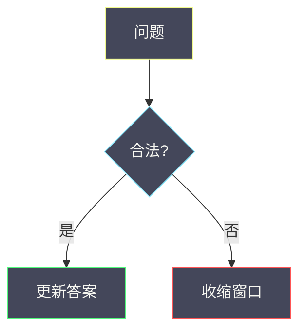

# 题解里的 Mermaid 规范

本站是 **Dracula 深色 UI**，图直接画在深色底上。

## 配色

节点统一：`fill:#44475a`（Current Line）+ **彩色描边** + `color:#f8f8f2`。

| 用途 | stroke | 示例 style |
|------|--------|------------|
| 起点 / 输入 | `#f1fa8c` 黄 | `fill:#44475a,stroke:#f1fa8c,color:#f8f8f2` |
| 过程 / 判断 | `#8be9fd` 青 | `fill:#44475a,stroke:#8be9fd,color:#f8f8f2` |
| 成功 / 更新 | `#50fa7b` 绿 | `fill:#44475a,stroke:#50fa7b,color:#f8f8f2` |
| 收缩 / 否定 | `#ff5555` 红 | `fill:#44475a,stroke:#ff5555,color:#f8f8f2` |
| 强调 | `#ff79c6` 粉 | `fill:#44475a,stroke:#ff79c6,color:#f8f8f2` |

**不要**再用浅黄/浅青实心块（`#FFE082` / `#80DEEA`）——在深色页上要么刺眼要么字看不清。

## 语法与尺寸

- 标签有 `()[]?/=:+` 时加双引号：`C{"zero > k?"}`
- 节点 ID 字母开头；换行用 ` `
- 组件侧会把 SVG 限制在约 `max-w-xl` 并按 viewBox 自适应，图里不必写死宽高
