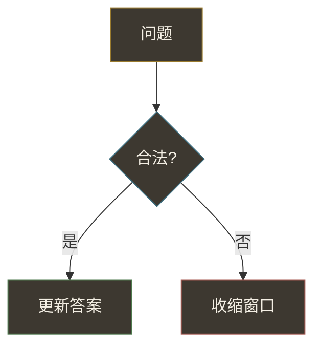

# 题解里的 Mermaid 规范

本站是 **羊皮纸浅色护眼 UI**。图内节点推荐用**深墨底 + 彩色描边 + 浅色字**（卡片感，浅底上也清晰）。

## 配色

节点统一：`fill:#3d3830`（暖墨）+ **彩色描边** + `color:#f4efe4`。

| 用途 | stroke | 示例 style |
|------|--------|------------|
| 起点 / 输入 | `#9a7b2e` 金 | `fill:#3d3830,stroke:#9a7b2e,color:#f4efe4` |
| 过程 / 判断 | `#3a6b7c` 青石 | `fill:#3d3830,stroke:#3a6b7c,color:#f4efe4` |
| 成功 / 更新 | `#4f7a4e` 鼠尾草 | `fill:#3d3830,stroke:#4f7a4e,color:#f4efe4` |
| 收缩 / 否定 | `#a85a52` 雾玫 | `fill:#3d3830,stroke:#a85a52,color:#f4efe4` |
| 强调 | `#8b5a6b` 藕荷 | `fill:#3d3830,stroke:#8b5a6b,color:#f4efe4` |

旧题解里若仍是德古拉色（`#44475a` / `#8be9fd` 等），在浅色页上也能读，不必立刻全改；新图按上表写即可。

## 语法与尺寸

- 标签有 `()[]?/=:+` 时加双引号：`C{"zero > k?"}`
- 节点 ID 字母开头；换行用 ` `
- 组件侧会把 SVG 限制在约 `max-w-xl` 并按 viewBox 自适应，图里不必写死宽高
