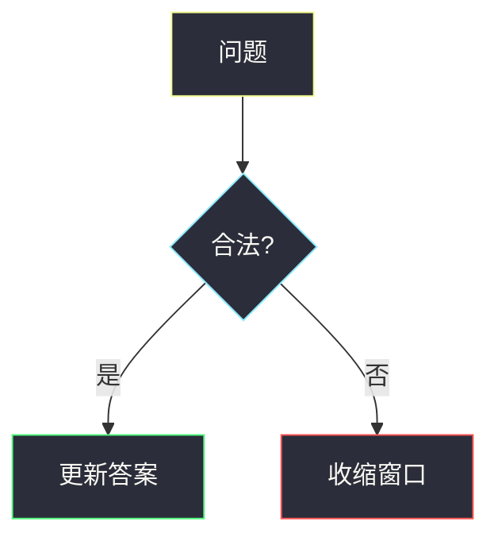

# 题解里的 Mermaid 规范

图是**独立深墨画布**，与页面「护眼 / 德古拉」主题解耦——两种页面主题下都用同一套节点色，保证可读。

## 配色（双主题通用 · 深墨卡片）

节点统一：`fill:#2b2d3a` + **高亮描边** + `color:#f8f8f2`。  
**不要**用浅黄/浅青实心块（`#FFE082` / `#80DEEA`）——叠在米色护眼页上会发糊，且站点 CSS 会强制浅色字导致糊成一片。

| 用途 | stroke | 示例 style |
|------|--------|------------|
| 起点 / 输入 | `#f1fa8c` 黄 | `fill:#2b2d3a,stroke:#f1fa8c,color:#f8f8f2` |
| 过程 / 判断 | `#8be9fd` 青 | `fill:#2b2d3a,stroke:#8be9fd,color:#f8f8f2` |
| 成功 / 更新 | `#50fa7b` 绿 | `fill:#2b2d3a,stroke:#50fa7b,color:#f8f8f2` |
| 收缩 / 否定 | `#ff5555` 红 | `fill:#2b2d3a,stroke:#ff5555,color:#f8f8f2` |
| 强调 | `#ff79c6` 粉 | `fill:#2b2d3a,stroke:#ff79c6,color:#f8f8f2` |



subgraph / 窗口容器也用深底：

```text
style W0 fill:#1e1f29,stroke:#8be9fd,color:#f8f8f2
```

## 语法与尺寸

- 标签有 `()[]?/=:+` 时加双引号：`C{"zero > k?"}`
- 节点 ID 字母开头；换行用 `<br/>`
- 组件侧会把 SVG 限制在约 `max-w-xl` 并按 viewBox 自适应，图里不必写死宽高
