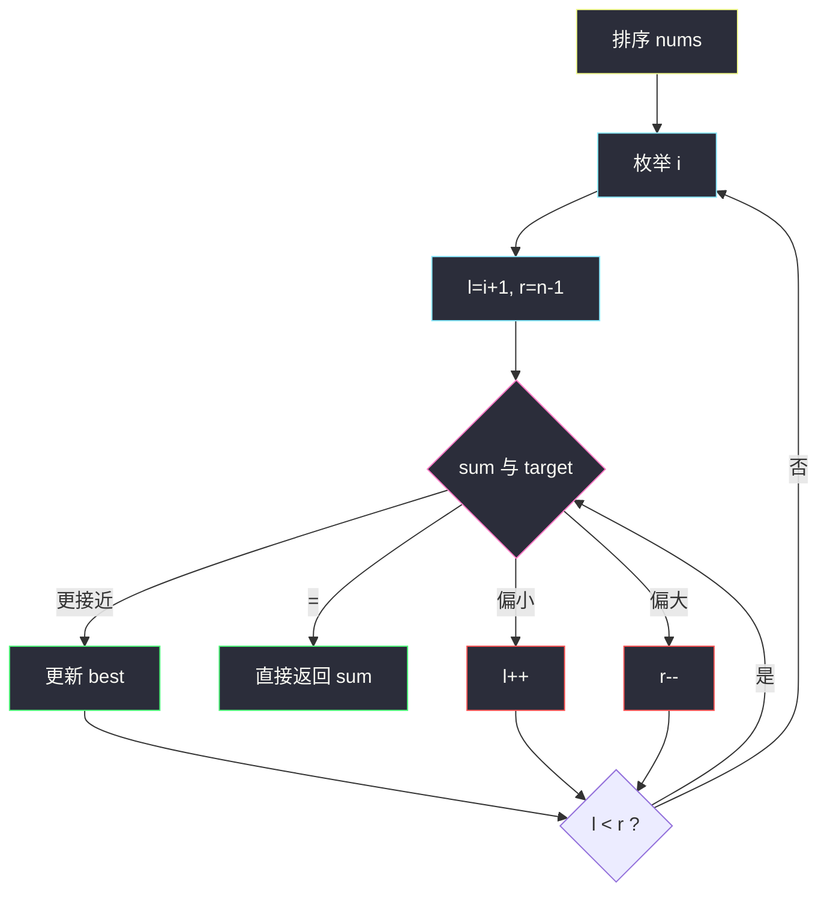

# 最接近的三数之和（排序 + 双指针逼近）

## 一、问题描述

给你一个长度为 `n` 的整数数组 `nums` 和一个目标值 `target`。  
请从 `nums` 中选出三个整数，使它们的和与 `target` **最接近**。

返回这三个数的和。题目保证每一组输入只存在**恰好一个**答案。

> 🔗 LeetCode 16：https://leetcode.cn/problems/3sum-closest/

**示例 1**

```
输入：nums = [-1,2,1,-4], target = 1
输出：2
解释：与 target 最接近的和是 (-1) + 2 + 1 = 2
```

**示例 2**

```
输入：nums = [0,0,0], target = 1
输出：0
解释：只能选 (0,0,0)，和为 0
```

**直观理解**

不像 [15. 三数之和](https://leetcode.cn/problems/3sum/) 要找「恰好等于」的全部解；这里只关心**距离 `|sum - target|` 最小**的那一个和。  
有序数组上，固定一个数，另外两个用对撞指针往 `target` 方向「逼近」。

---

## 二、暴力解法（入门）

### 直观思路

三重循环枚举所有三元组，维护当前最接近的和。

```java
public static int threeSumClosest(int[] nums, int target) {
    int n = nums.length;
    int best = nums[0] + nums[1] + nums[2];
    for (int i = 0; i < n; i++) {
        for (int j = i + 1; j < n; j++) {
            for (int k = j + 1; k < n; k++) {
                int sum = nums[i] + nums[j] + nums[k];
                if (Math.abs(sum - target) < Math.abs(best - target)) {
                    best = sum;
                }
            }
        }
    }
    return best;
}
```

### 复杂度

- **时间**：`O(n³)`
- **空间**：`O(1)`

### 🔴 瓶颈在哪里

`n` 到几百时 `n³` 会吃紧。  
观察：若先**排序**，固定最小下标 `i`，则在右侧有序区间里找「两数之和最接近 `target - nums[i]`」——经典对撞双指针，整题降到 `O(n²)`。

---

## 三、优化探索（核心章节）

### 3.1 观察特征

| 特征 | 说明 |
|------|------|
| 求「最接近」而非「全部等于」 | 维护 `best` 与 `|best - target|` 即可，不必收集列表 |
| 有序后可对撞 | `sum < target` 只能 `l++`；`sum > target` 只能 `r--` |
| 恰好等于可提前返回 | `|sum - target| == 0` 已是最优 |
| 可不强制去重 | 返回的是和，不是互异三元组；跳重复只是常数优化 |

### 3.2 暴力 → 优化：排序 + 双指针

1. **排序** `nums`。
2. 枚举第一个数 `i`（`0 .. n-3`）。
3. 设 `l = i+1`，`r = n-1`，对撞：
   - `sum = nums[i] + nums[l] + nums[r]`
   - 若 `|sum - target|` 更小，更新 `best`
   - `sum == target` → 直接返回
   - `sum < target` → `l++`（需要更大）
   - `sum > target` → `r--`（需要更小）

```
排序
 ↓
best = 前三个之和（或任意合法初值）
for i = 0 .. n-3:
  l = i+1, r = n-1
  while l < r:
    sum = nums[i]+nums[l]+nums[r]
    更新 best
    if sum == target: return
    if sum < target: l++
    else:            r--
```



### 3.3 关键推导问题

| 问题 | 答案 |
|------|------|
| 为何必须排序？ | 对撞正确性依赖有序：偏小只可能靠增大左边，偏大只可能靠减小右边 |
| 为何固定 `i` 后两端夹？ | 右侧是有序区间，两数之和相对 `aim = target - nums[i]` 单调可夹 |
| 和 15 题差在哪？ | 15 要 `|sum-target|==0` 的全部去重解；16 只维护最优 `best` |
| 要不要去重？ | 可不去；若 `nums[i]==nums[i-1]` 跳过，只减少重复搜索 |
| 初值怎么取？ | `nums[0]+nums[1]+nums[2]` 一定合法（`n≥3`） |

### 3.4 一句话核心

> **排序后固定一个数，左右对撞逼近 target；每次用更小的距离刷新 best，撞到相等即可返回。**

---

## 四、代码实现详解

### Java（课上风格）

```java
// 最接近的三数之和
// 测试链接 : https://leetcode.cn/problems/3sum-closest/
public class Solution {

    public static int threeSumClosest(int[] nums, int target) {
        Arrays.sort(nums);
        int n = nums.length;
        int best = nums[0] + nums[1] + nums[2];
        for (int i = 0; i < n - 2; i++) {
            // 可选：跳过相同的 i，少做无用功
            if (i > 0 && nums[i] == nums[i - 1]) {
                continue;
            }
            int l = i + 1;
            int r = n - 1;
            while (l < r) {
                int sum = nums[i] + nums[l] + nums[r];
                if (Math.abs(sum - target) < Math.abs(best - target)) {
                    best = sum;
                }
                if (sum == target) {
                    return sum;
                } else if (sum < target) {
                    l++;
                } else {
                    r--;
                }
            }
        }
        return best;
    }
}
```

### Python

```python
# 最接近的三数之和
# 测试链接 : https://leetcode.cn/problems/3sum-closest/
class Solution:
    def threeSumClosest(self, nums: list[int], target: int) -> int:
        nums.sort()
        n = len(nums)
        best = nums[0] + nums[1] + nums[2]
        for i in range(n - 2):
            if i > 0 and nums[i] == nums[i - 1]:
                continue
            l, r = i + 1, n - 1
            while l < r:
                s = nums[i] + nums[l] + nums[r]
                if abs(s - target) < abs(best - target):
                    best = s
                if s == target:
                    return s
                if s < target:
                    l += 1
                else:
                    r -= 1
        return best
```

---

## 五、例子演示

以 `nums = [-1, 2, 1, -4]`，`target = 1` 为例。

**排序后**：`[-4, -1, 1, 2]`，初值 `best = -4 + -1 + 1 = -6`

```
i=0, nums[i]=-4
  l=1(-1), r=3(2)  sum=-3  | -3-1|=4 < |-6-1|=5 → best=-3
  -3 < 1 → l++
  l=2(1),  r=3(2)  sum=-1  |-1-1|=2 < 4 → best=-1
  -1 < 1 → l++ → l==r 结束

i=1, nums[i]=-1
  l=2(1), r=3(2)  sum=2   |2-1|=1 < |-1-1|=2 → best=2
  2 > 1 → r-- → l==r 结束

i=2 无法再凑两个数，结束
答案 best = 2
```


---

## 六、复杂度分析

| 项目 | 复杂度 | 说明 |
|------|--------|------|
| 排序 | `O(n log n)` | 一次 |
| 双指针枚举 | `O(n²)` | 每个 `i` 上 `l/r` 至多走一遍 |
| 总时间 | `O(n²)` | 主导项 |
| 额外空间 | `O(1)` | 若排序原地；不计排序栈 |

---

## 七、对比总结

### 易错点

1. **忘排序** → 对撞方向失去意义。
2. **用 `sum` 和 `target` 比大小，却拿 `sum` 去更新距离** → 更新条件必须是 `|sum-target|` 更小。
3. **`i` 枚举到 `n-1`** → 至少留两个位置给 `l/r`，上界是 `n-3`。
4. **和 15 题一样疯狂去重答案** → 本题返回单个和，去重可选。

### 和三数之和的关系

| | 15 三数之和 | 16 最接近的三数之和 |
|--|------------|-------------------|
| 目标 | 和恰好为 0（或 target） | 和最接近 target |
| 输出 | 所有不重复三元组 | 一个最优和 |
| 骨架 | 排序 + 固定 + 对撞 | **同一骨架** |
| 指针动作 | 相等收答案并跳重 | 相等可直接返回；否则按大小夹逼 |

### 模板口诀

> **先排序，定一个，两端夹；比距离，刷新 best，相等就收工。**

---

## 八、举一反三

| 题目 | 链接 | 迁移点 |
|------|------|--------|
| 15. 三数之和 | https://leetcode.cn/problems/3sum/ | 同一骨架，改成收全部解 + 去重 |
| 18. 四数之和 | https://leetcode.cn/problems/4sum/ | 再多固定一层 |
| 167. 两数之和 II | https://leetcode.cn/problems/two-sum-ii-input-array-is-sorted/ | 有序对撞的最简版 |
| 611. 有效三角形的个数 | https://leetcode.cn/problems/valid-triangle-number/ | 排序后固定一边，另一边双指针计数 |

**迁移一句**：凡是「有序数组上凑 k 个数接近 / 等于某值」，几乎都是**外层枚举 + 内层对撞**。
