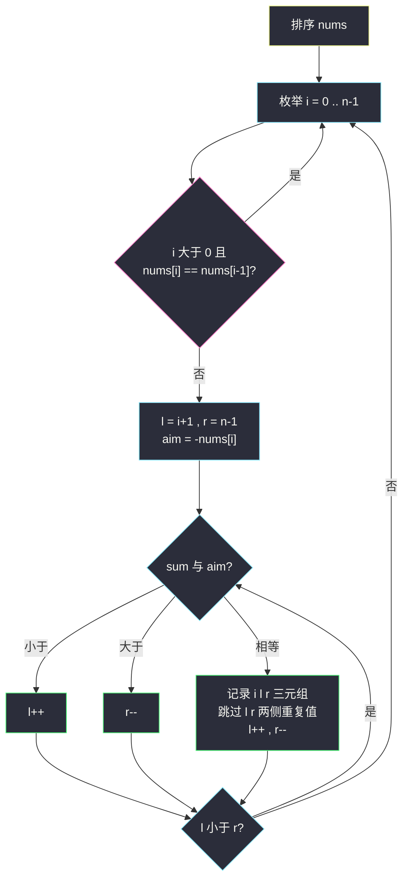
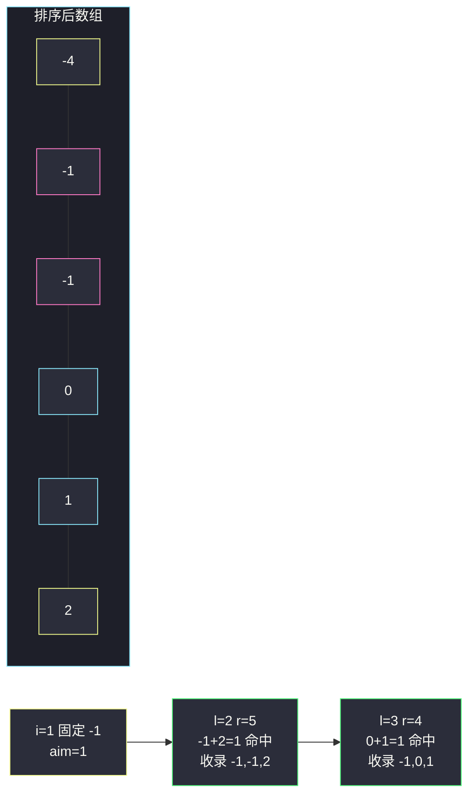

# 三数之和（排序 + 双指针 + 去重）

## 一、问题描述

给你一个整数数组 `nums`，判断是否存在三元组 `[nums[i], nums[j], nums[k]]` 满足 `i != j、i != k 且 j != k`，同时还满足 `nums[i] + nums[j] + nums[k] == 0`。请你返回**所有和为 0 且不重复**的三元组。

注意：答案中不可以包含重复的三元组。

> 🔗 LeetCode 15：https://leetcode.cn/problems/3sum/

**示例 1（经典）**

```
输入：nums = [-1,0,1,2,-1,-4]
输出：[[-1,-1,2],[-1,0,1]]
解释：
- nums[0] + nums[1] + nums[2] = (-1) + 0 + 1 = 0
- nums[1] + nums[2] + nums[4] = 0 + 1 + (-1) = 0
- nums[0] + nums[3] + nums[4] = (-1) + 2 + (-1) = 0
不同的三元组是 [-1,0,1] 和 [-1,-1,2]
```

**示例 2**

```
输入：nums = [0,1,1]
输出：[]
解释：唯一可能的三元组和不为 0
```

**示例 3**

```
输入：nums = [0,0,0]
输出：[[0,0,0]]
解释：唯一的三元组，0 + 0 + 0 = 0
```

**直观理解**

表面上是「找所有和为 0 的三元组」，真正的难点不在「找到」，而在**「不重不漏地枚举」**：暴力能列出全部组合，但相同的三元组会出现很多次（比如四个 `-1` 里任选两个就有 6 种）。本题的正解 = **排序（让相等的数挨在一起）+ 固定一个数、对撞双指针找另外两个（消灭一层循环）+ 逐层去重（保证每个三元组只按一种方式被枚举）**。

---

## 二、暴力解法（入门）

### 直观思路

三重循环枚举所有 `i < j < k`，和为 0 就把三个数排好序后放进 `Set` 里去重。

```java
public List<List<Integer>> threeSum(int[] nums) {
    Set<List<Integer>> set = new HashSet<>();
    int n = nums.length;
    for (int i = 0; i < n; i++) {
        for (int j = i + 1; j < n; j++) {
            for (int k = j + 1; k < n; k++) {
                if (nums[i] + nums[j] + nums[k] == 0) {
                    List<Integer> tri = new ArrayList<>(
                            Arrays.asList(nums[i], nums[j], nums[k]));
                    Collections.sort(tri);       // 排序后塞进 Set 去重
                    set.add(tri);
                }
            }
        }
    }
    return new ArrayList<>(set);
}
```

### 复杂度

- **时间**：`O(n³ · log 3) ≈ O(n³)`，三重循环加上每个命中的三元组排序、哈希去重。
- **空间**：`O(答案数)`。

### 🔴 瓶颈在哪里

1. 三重循环在 `n = 3000` 时约 4.5×10⁹ 次，必然超时。
2. 「先枚举再靠 Set 去重」是被动的：重复组合**全部生成**了再过滤，白白浪费。

正确的思路是**从枚举方式上根除重复**：让每类合法三元组只被枚举恰好一次——排序 + 双指针 + 跳过重复值。

---

## 三、优化探索（核心章节）

### 3.1 观察特征

| 特征 | 结论 |
|------|------|
| 输出的是**值**（且无序）而不是下标 | 允许**排序**打乱原顺序，且排序后相同值相邻，去重才有抓手 |
| 「三元组和为 0」 | 固定一个数 `nums[i]` 后，剩下两个数的和目标是 `-nums[i]`，变成两数之和 |
| 排序后数组有序 | 小了动左指针、大了动右指针，**对撞双指针** O(n) 解决两数之和 |

### 3.2 排序 + 双指针：为什么不会漏解？

排序后固定 `i`，令 `l = i+1`、`r = n-1`，目标 `aim = -nums[i]`：

- `nums[l] + nums[r] < aim`：当前 `l` 配谁都凑不够（`r` 已是剩下最大的），**淘汰 l**，`l++`；
- `nums[l] + nums[r] > aim`：当前 `r` 配谁都超（`l` 已是剩下最小的），**淘汰 r**，`r--`；
- 相等：命中一组，同时收缩两端。

**不漏的论证**：`l` 被淘汰的充要条件是它跟「当前剩余范围内任何数」都凑不出 `aim`（因为最大候选 `nums[r]` 都不够），所以淘汰它是安全的；`r` 同理。每次操作都永久淘汰一个不可能的候选，两端合拢覆盖全部组合。

### 3.3 去重：本题真正的灵魂

排序让相等的值相邻，去重变成「相邻跳过」，分三层：

1. **固定层 `i` 去重**：`i > 0 && nums[i] == nums[i-1]` 时直接 `continue`——以这个值开头的搜索上一轮已经做完了。
2. **命中层 `l` 去重**：命中一组后，`while (l < r && nums[l] == nums[l+1]) l++` 跳过后面重复的左值。
3. **命中层 `r` 去重**：对称地 `while (l < r && nums[r] == nums[r-1]) r--`，最后再各走一步。

注意 `i` 层的去重方向：**与左邻居比**（`nums[i-1]`），不是与右邻居比。写成 `nums[i] == nums[i+1]` 虽然大多测试也能过，但会在「连续多个相同值恰好在末尾凑成唯一解」的场景下错误跳过（如 `[0,0,0]` 会漏掉自己）。与左边比、保证「每个开头值只做第一次」，语义最干净。

### 3.4 流程图



### 3.5 关键推导问题

| 问题 | 答案 |
|------|------|
| 为什么要排序？ | ① 相等值相邻才能 O(1) 跳重复；② 有序才有「小了动 l、大了动 r」的单调性 |
| 双指针会不会漏掉解？ | 不会。淘汰 `l`（或 `r`）时已证明它与剩余任何数都配不出 `aim`，见 3.2 论证 |
| 为什么不用两数之和的哈希法？ | 哈希法适合「找一个解」；本题要**所有解且去重**，哈希去重反而麻烦，有序 + 对撞指针天然一次扫全 |
| 命中一组后为什么 l、r 要一起动？ | 命中后 `l` 与当前 `r` 的组合已收录；`l` 换别的 `r' < r` 和只会更小，`r` 换别的 `l' > l` 和只会更大，都不再等于 `aim`，两端一起安全收缩 |
| `i` 循环到 `nums[i] > 0` 能提前 break 吗？ | 能。排序后三个正数之和必为正，`i` 及之后都不可能有解（可作小优化，不影响正确性） |

### 3.6 一句话核心

> **排序后固定一个数，剩余两数用对撞指针一次扫完；相等的值只在「第一次出现」时担当每个角色，重复即跳过。**

---

## 四、代码实现详解

> 说明：课源码仓库 `src/class*` 未单独收录 #15（站内已有同骨架的 [4sum.md](/solutions/base/4sum.md) 与 [3sum-closest.md](/solutions/base/3sum-closest.md)），主解按课上「排序 + 固定 + 对撞双指针」骨架与 `l/r` 命名书写，重点展开 3sum 特有的三层去重。

### Java（主解：排序 + 双指针 + 三层去重）

```java
// 三数之和
// 测试链接 : https://leetcode.cn/problems/3sum/
public class Solution {

    public static List<List<Integer>> threeSum(int[] nums) {
        Arrays.sort(nums);
        int n = nums.length;
        List<List<Integer>> ans = new ArrayList<>();
        for (int i = 0; i < n; i++) {
            // 第一层去重：i 只在每个值的第一次出现处担任「固定数」
            if (i > 0 && nums[i] == nums[i - 1]) {
                continue;
            }
            if (nums[i] > 0) {
                break;            // 排序后全为正数，不可能凑出 0
            }
            int l = i + 1, r = n - 1;
            int aim = -nums[i];   // 后两个数要凑出的和
            while (l < r) {
                int sum = nums[l] + nums[r];
                if (sum < aim) {
                    l++;
                } else if (sum > aim) {
                    r--;
                } else {
                    ans.add(Arrays.asList(nums[i], nums[l], nums[r]));
                    // 第二层去重：跳过与命中值相同的左候选
                    while (l < r && nums[l] == nums[l + 1]) {
                        l++;
                    }
                    // 第三层去重：跳过与命中值相同的右候选
                    while (l < r && nums[r] == nums[r - 1]) {
                        r--;
                    }
                    l++;
                    r--;
                }
            }
        }
        return ans;
    }
}
```

**变量含义**

| 变量 | 含义 |
|------|------|
| `i` | 固定的第一个数下标（枚举值，去重后每个值只当一次开头） |
| `l, r` | 对撞指针，`i < l < r`，负责在有序尾巴上凑 `aim` |
| `aim` | `-nums[i]`，后两个数的目标和 |
| `sum` | `nums[l] + nums[r]`，与 `aim` 比较决定指针走向 |

**循环不变式**：内层 `while` 的任意时刻，所有「和为 `aim` 且两端落在 `[l..r]` 内」的二元组，要么已收录进 `ans`，要么正等着被 `l`/`r` 的收缩发现；而 `[i+1..l-1]` 与 `[r+1..n-1]` 里的数已被证明或被去重淘汰。

### Python（同思路）

```python
class Solution:
    def threeSum(self, nums: list[int]) -> list[list[int]]:
        nums.sort()
        n = len(nums)
        ans = []
        for i in range(n):
            if i > 0 and nums[i] == nums[i - 1]:
                continue
            if nums[i] > 0:
                break
            l, r = i + 1, n - 1
            aim = -nums[i]
            while l < r:
                s = nums[l] + nums[r]
                if s < aim:
                    l += 1
                elif s > aim:
                    r -= 1
                else:
                    ans.append([nums[i], nums[l], nums[r]])
                    while l < r and nums[l] == nums[l + 1]:
                        l += 1
                    while l < r and nums[r] == nums[r - 1]:
                        r -= 1
                    l += 1
                    r -= 1
        return ans
```

---

## 五、具体例子演示

`nums = [-1, 0, 1, 2, -1, -4]`。排序后：`[-4, -1, -1, 0, 1, 2]`（下标 0..5）。

**i = 0（值 -4），aim = 4**

| 步骤 | l | r | nums[l]+nums[r] | 与 4 比较 | 动作 |
|------|---|---|-----------------|-----------|------|
| 1 | 1 | 5 | -1+2 = 1 | 小 | l→2 |
| 2 | 2 | 5 | -1+2 = 1 | 小 | l→3 |
| 3 | 3 | 5 | 0+2 = 2 | 小 | l→4 |
| 4 | 4 | 5 | 1+2 = 3 | 小 | l→5，l==r 结束 |

`i=0` 无解。

**i = 1（值 -1），aim = 1**

| 步骤 | l | r | nums[l]+nums[r] | 与 1 比较 | 动作 |
|------|---|---|-----------------|-----------|------|
| 1 | 2 | 5 | -1+2 = 1 | 相等 | 收录 `[-1,-1,2]`；两侧无重复，l→3，r→4 |
| 2 | 3 | 4 | 0+1 = 1 | 相等 | 收录 `[-1,0,1]`；两侧无重复，l→4，r→3 结束 |

**i = 2（值 -1）**：`nums[2] == nums[1]`，第一层去重命中，直接 `continue`——这就是「以 -1 开头的解上一轮已搜全」的体现。

**i = 3（值 0），aim = 0**：l=4, r=5，`1+2=3 > 0`，r→4，l==r 结束，无解。

**i = 4（值 1）**：`nums[4] > 0`，提前 `break`（三个正数凑不出 0）。

最终答案：`[[-1,-1,2], [-1,0,1]]`，与预期一致。



再演示 `[0,0,0]`：排序后不变。`i=0` 值 0，aim=0，l=1, r=2，`0+0=0` 命中，收录 `[0,0,0]`；去重 while 把 l 推到 2、r 缩到 1，循环结束。`i=1、i=2` 均被第一层去重跳过——**连续重复值只会以第一次出现的位置担任开头**，`[0,0,0]` 恰好被完整保留。

---

## 六、复杂度分析

| 项目 | 排序 + 双指针（主解） | 暴力三重循环 |
|------|----------------------|--------------|
| 时间 | `O(n²)`：排序 `O(n log n)`；外层 `i` 走 n 次，内层 `l+r` 合计最多 n 步 | `O(n³)` |
| 空间 | `O(log n)` 排序递归栈（不计输出）；`O(1)` 额外（不计答案） | `O(答案数)` 的 Set |

---

## 七、方法对比与总结

| | 暴力 + Set 去重 | 排序 + 对撞双指针 |
|--|-----------------|-------------------|
| 找解 | 三重循环全枚举 | 固定一个 + O(n) 收拢 |
| 去重 | 事后过滤，重复解全部生成过 | 枚举方式本身唯一，天然不重 |
| 复杂度 | `O(n³)` | `O(n²)` |

**易错点**

1. **忘记排序**：所有单调性与去重逻辑的前提。
2. `i` 层去重与 `nums[i+1]` 比较：`[0,0,0]` 会把唯一解跳掉，必须与 `nums[i-1]` 比。
3. 命中后**只动一个指针**：另一端不动的话，下一个组合必然不等于 aim，虽不会错但白白空转；标准写法两端齐动。
4. 内层去重 while 的条件**别忘了 `l < r`**：数组尾部连续重复值时可能越界。
5. 输出的是**值**不是下标，排序不影响正确性——若改成「下标三元组」类题目（如 1. 两数之和要求返回下标）就不能排序了。

**模板（k 数之和通式）**

```java
// 排序；枚举第 1 个数（跳重复）→ 递归枚举第 2..k-2 个数 →
// 最后两数对撞双指针（命中后两侧跳重复、齐步收缩）
```

---

## 八、举一反三

| 题目 | 链接 | 迁移点 |
|------|------|--------|
| 16. 最接近的三数之和 | https://leetcode.cn/problems/3sum-closest/ | 同骨架找「最接近」而非全部解（[站内题解](/solutions/base/3sum-closest.md)） |
| 18. 四数之和 | https://leetcode.cn/problems/4sum/ | 再套一层「固定 + 去重」，注意 long 防溢出（[站内题解](/solutions/base/4sum.md)） |
| 1. 两数之和 | https://leetcode.cn/problems/two-sum/ | 双指针套路的最小 case；返回下标时用哈希更直接 |
| 167. 两数之和 II | https://leetcode.cn/problems/two-sum-ii-input-array-is-sorted/ | 有序数组上的对撞指针裸题，3sum 内层循环的原子操作 |

**思想迁移**：凡是「数组中选 k 个数满足某种和/差约束」——排序（若要值）、固定 k-2 个、对撞最后两个、逐层去重，是一整套可以直接默写的流水线。窗口/双指针一族共用的直觉是：**有序性 + 单调淘汰 = 每步永久排除一个候选**。
