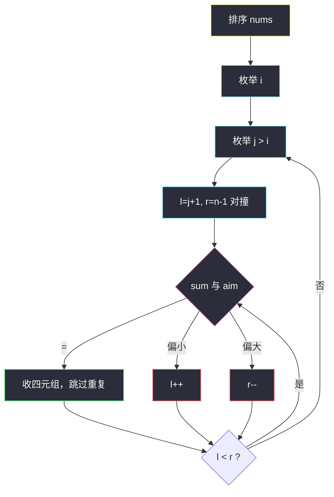
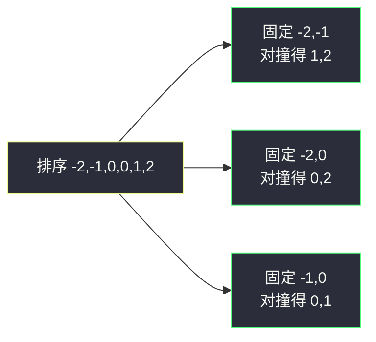

# 四数之和（排序 + 枚举两层 + 对撞双指针）

## 一、问题描述

给你一个由 `n` 个整数组成的数组 `nums`，和一个目标值 `target`。  
请你找出并返回满足下述条件的所有**不重复**四元组 `[nums[a], nums[b], nums[c], nums[d]]`：

- `0 ≤ a, b, c, d < n`
- `a、b、c、d` 互不相同
- `nums[a] + nums[b] + nums[c] + nums[d] == target`

答案中四元组可以按任意顺序返回。

> 🔗 LeetCode 18：https://leetcode.cn/problems/4sum/

**示例 1（经典）**

```
输入：nums = [1,0,-1,0,-2,2], target = 0
输出：[[-2,-1,1,2],[-2,0,0,2],[-1,0,0,1]]
```

**示例 2**

```
输入：nums = [2,2,2,2,2], target = 8
输出：[[2,2,2,2]]
```

**直观理解**

在数组里挑 4 个**下标不同**的数，和为 `target`；值相同但来自不同下标可以，**结果四元组本身不能重复**。  
就是 [15. 三数之和](https://leetcode.cn/problems/3sum/) 再多固定一层。

---

## 二、暴力解法（入门）

### 直观思路

四重循环枚举所有四元组，用 `Set` 去重（先排序再塞进集合）。

```java
public static List<List<Integer>> fourSum(int[] nums, int target) {
    int n = nums.length;
    Set<List<Integer>> set = new HashSet<>();
    for (int a = 0; a < n; a++) {
        for (int b = a + 1; b < n; b++) {
            for (int c = b + 1; c < n; c++) {
                for (int d = c + 1; d < n; d++) {
                    if ((long) nums[a] + nums[b] + nums[c] + nums[d] == target) {
                        List<Integer> t = Arrays.asList(nums[a], nums[b], nums[c], nums[d]);
                        Collections.sort(t);
                        set.add(t);
                    }
                }
            }
        }
    }
    return new ArrayList<>(set);
}
```

### 复杂度

- **时间**：`O(n⁴)`（再加排序去重开销）。
- **空间**：`O(答案数)`。

### 🔴 瓶颈在哪里

`n` 到 `200` 时 `n⁴` 勉强，再大就炸。  
排序后：固定前两个数，剩下两个数变成**有序数组两数之和**——对撞双指针 `O(n)`，整体降到 `O(n³)`。

---

## 三、优化探索（核心章节）

### 3.1 观察特征

| 特征 | 说明 |
|------|------|
| 求和 + 组合 | 先**排序**，方便双指针与去重 |
| 四元组 = 二元组 + 两数之和 | 外两层枚举，内层对撞 |
| 不能重复 | 每一层跳过与前一个相同的值 |
| 和可能溢出 | 用 `long` 算和（题面数值范围大） |

### 3.2 暴力 → 优化：排序 + 双指针

1. **排序** `nums`。
2. 枚举第一个数下标 `i`（去重：`i>0 && nums[i]==nums[i-1]` 则跳过）。
3. 枚举第二个数下标 `j`（`j>i+1 && nums[j]==nums[j-1]` 则跳过）。
4. 在 `(j+1 .. n-1)` 上设 `l、r` 对撞，找两数之和 = `target - nums[i] - nums[j]`：
   - 相等：收答案，`l++`、`r--`，并跳过重复；
   - 偏小：`l++`；
   - 偏大：`r--`。

```
排序
 ↓
for i = 0 .. n-1:          // 第一个数
  去重 i
  for j = i+1 .. n-1:      // 第二个数
    去重 j
    l = j+1, r = n-1
    aim = target - nums[i] - nums[j]
    while l < r:           // 两数之和对撞
      ...
```



### 3.3 关键推导问题（双指针）

| 问题 | 答案 |
|------|------|
| 为何先排序？ | 对撞依赖有序；相同值挤在一起方便去重 |
| 何时 `l++`？ | `nums[l]+nums[r] < aim` |
| 何时 `r--`？ | `nums[l]+nums[r] > aim` |
| 去重何时跳？ | **同一层**当前值等于「上一个已经用过的值」时跳过 |
| `j` 的去重为何是 `j > i+1`？ | `j==i+1` 是这对 `(i,j)` 的第一个 `j`，即使等于 `nums[i]` 也合法（例如四个 2） |

### 3.4 可选剪枝（常数优化）

在枚举 `i` / `j` 时：

- 最小可能和已经 `> target` → 后面更大，**直接 break**；
- 最大可能和已经 `< target` → 当前 `i`/`j` 太小，**continue**。

正确性依赖已排序。

### 3.5 一句话核心

> **排序后固定两个数，剩下变成有序两数之和；每一层跳过相同值，避免重复四元组。**

---

## 四、代码实现详解

### Java（课上风格）

```java
// 四数之和
// 测试链接 : https://leetcode.cn/problems/4sum/
public class Solution {

    public static List<List<Integer>> fourSum(int[] nums, int target) {
        Arrays.sort(nums);
        int n = nums.length;
        List<List<Integer>> ans = new ArrayList<>();
        for (int i = 0; i < n; i++) {
            // 第一层去重
            if (i > 0 && nums[i] == nums[i - 1]) {
                continue;
            }
            for (int j = i + 1; j < n; j++) {
                // 第二层去重：j 至少是 i 后面第一个，不能跟「上一个 j」比成 nums[i]
                if (j > i + 1 && nums[j] == nums[j - 1]) {
                    continue;
                }
                int l = j + 1;
                int r = n - 1;
                long aim = (long) target - nums[i] - nums[j];
                while (l < r) {
                    long sum = (long) nums[l] + nums[r];
                    if (sum == aim) {
                        ans.add(Arrays.asList(nums[i], nums[j], nums[l], nums[r]));
                        // 第三、四层去重
                        while (l < r && nums[l] == nums[l + 1]) {
                            l++;
                        }
                        while (l < r && nums[r] == nums[r - 1]) {
                            r--;
                        }
                        l++;
                        r--;
                    } else if (sum < aim) {
                        l++;
                    } else {
                        r--;
                    }
                }
            }
        }
        return ans;
    }
}
```

**变量含义**

| 变量 | 含义 |
|------|------|
| `i, j` | 固定的前两个数下标，`i < j` |
| `l, r` | 后两个数的对撞指针，`j < l < r` |
| `aim` | 后两个数需要凑出的目标（`long`） |
| `sum` | `nums[l] + nums[r]`（`long`） |

**循环不变式**：内层 `while` 中，所有和为 `aim` 且下标在 `(j+1..n-1)` 的二元组，要么已收录，要么仍在 `[l..r]` 待查。

### Java（带剪枝）

```java
public static List<List<Integer>> fourSum(int[] nums, int target) {
    Arrays.sort(nums);
    int n = nums.length;
    List<List<Integer>> ans = new ArrayList<>();
    for (int i = 0; i <= n - 4; i++) {
        if (i > 0 && nums[i] == nums[i - 1]) continue;
        if ((long) nums[i] + nums[i + 1] + nums[i + 2] + nums[i + 3] > target) break;
        if ((long) nums[i] + nums[n - 3] + nums[n - 2] + nums[n - 1] < target) continue;
        for (int j = i + 1; j <= n - 3; j++) {
            if (j > i + 1 && nums[j] == nums[j - 1]) continue;
            if ((long) nums[i] + nums[j] + nums[j + 1] + nums[j + 2] > target) break;
            if ((long) nums[i] + nums[j] + nums[n - 2] + nums[n - 1] < target) continue;
            int l = j + 1, r = n - 1;
            long aim = (long) target - nums[i] - nums[j];
            while (l < r) {
                long sum = (long) nums[l] + nums[r];
                if (sum == aim) {
                    ans.add(Arrays.asList(nums[i], nums[j], nums[l], nums[r]));
                    while (l < r && nums[l] == nums[l + 1]) l++;
                    while (l < r && nums[r] == nums[r - 1]) r--;
                    l++;
                    r--;
                } else if (sum < aim) {
                    l++;
                } else {
                    r--;
                }
            }
        }
    }
    return ans;
}
```

剪枝依赖已排序：当前层「最小四数和」已大于 `target` 则可 break；「最大四数和」仍小于 `target` 则 continue。
### Python（同结构）

```python
class Solution:
    def fourSum(self, nums: list[int], target: int) -> list[list[int]]:
        nums.sort()
        n = len(nums)
        ans: list[list[int]] = []
        for i in range(n):
            if i > 0 and nums[i] == nums[i - 1]:
                continue
            for j in range(i + 1, n):
                if j > i + 1 and nums[j] == nums[j - 1]:
                    continue
                l, r = j + 1, n - 1
                aim = target - nums[i] - nums[j]
                while l < r:
                    s = nums[l] + nums[r]
                    if s == aim:
                        ans.append([nums[i], nums[j], nums[l], nums[r]])
                        while l < r and nums[l] == nums[l + 1]:
                            l += 1
                        while l < r and nums[r] == nums[r - 1]:
                            r -= 1
                        l += 1
                        r -= 1
                    elif s < aim:
                        l += 1
                    else:
                        r -= 1
        return ans
```

---

## 五、具体例子演示

`nums = [1,0,-1,0,-2,2]`，`target = 0`。

排序后：`[-2,-1,0,0,1,2]`

| i | j | aim | 对撞过程 | 命中 |
|---|---|-----|----------|------|
| -2 | -1 | 3 | l=0,r=2 → 0+2=2 偏小；… → 1+2=3 | `[-2,-1,1,2]` |
| -2 | 0（第一个） | 2 | 0+2=2 | `[-2,0,0,2]` |
| -2 | 0（第二个） | 跳过（与上一 j 相同） | | |
| -1 | 0 | 1 | 0+1=1 | `[-1,0,0,1]` |
| … | | | 其余无新四元组 | |

答案：`[[-2,-1,1,2],[-2,0,0,2],[-1,0,0,1]]`。



再看全相同：`[2,2,2,2,2]`，`target = 8`。  
`i=0` 取 2，`j=1` 取 2，`l,r` 再取两个 2 → 收一组；随后各层去重，不会再收重复的 `[2,2,2,2]`。

---

## 六、复杂度分析

| 方法 | 时间 | 空间 | 说明 |
|------|------|------|------|
| 四重循环 + Set | `O(n⁴)` | `O(答案)` | 太慢 |
| 排序 + 双指针 | **`O(n³)`** | `O(1)` 额外（不含答案） | 排序 `O(n log n)` 被主导 |

---

## 七、方法对比与总结

| | 暴力 | 排序 + 双指针 |
|--|------|----------------|
| 想法 | 枚举四个下标 | 固定两个 + 两数之和 |
| 去重 | HashSet | 每一层跳过相同值 |
| 适用 | 理解题意 | **本题默认解** |

**和三数之和的关系**

| | 15 三数之和 | 18 四数之和 |
|--|-------------|-------------|
| 外层 | 固定 1 个数 | 固定 2 个数 |
| 内层 | 对撞找两数 | 对撞找两数 |
| 复杂度 | `O(n²)` | `O(n³)` |

**易错点**

1. **去重位置**：`j > i + 1 && nums[j]==nums[j-1]`，不要写成 `j>0`（会把合法的「两个相同数」误杀）。
2. **溢出**：`nums[i]+nums[j]+nums[l]+nums[r]` 用 `long`。
3. 命中后 `l、r` 都要移动，并跳过后续相同值。
4. 下标必须 `i < j < l < r`，保证四个数来自不同位置。

**模板（k 数之和 · 双指针版）**

```java
// 排序
// 枚举前 k-2 层（去重）
// 最后两层：l、r 对撞，sum ? aim
```

---

## 八、举一反三

| 题目 | 关系 |
|------|------|
| [15. 三数之和](https://leetcode.cn/problems/3sum/) | 少固定一层，同模板 |
| [1. 两数之和](https://leetcode.cn/problems/two-sum/) | 无序用 Hash；有序才对撞 |
| [167. 两数之和 II](https://leetcode.cn/problems/two-sum-ii-input-array-is-sorted/) | 有序数组对撞的基本型 |
| [454. 四数相加 II](https://leetcode.cn/problems/4sum-ii/) | 四个数组，改用分组 + Hash，不是本题双指针 |

**思想迁移**

```
k 数之和（同一数组、不重复四元组）
  ↓
排序
  ↓
枚举前 k-2 个（层层去重）
  ↓
最后两个：有序对撞
```

**记忆口诀**：先排序，外两层固定并去重；内双指针对撞凑 aim；相等收答案再跳同值。
