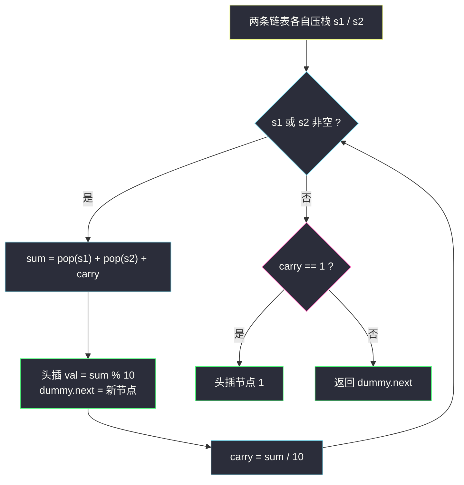
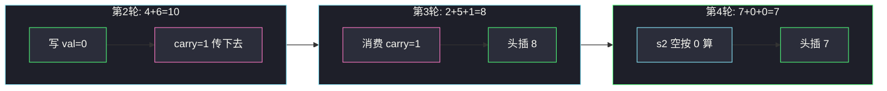

# 两数相加 II（正序链表：用栈回到低位）

## 一、问题描述

给你两个**非空**链表，表示两个非负整数。数字最高位位于链表开头位置，每个节点只存储**一位**数字。请将这两个数相加，返回一个表示它们和的链表，同样**最高位在前**。

除数字 0 之外，这两个数都不会以 0 开头。

**进阶**：输入链表不能修改（换言之，不能对链表中的节点进行翻转）。

> 🔗 LeetCode 445：https://leetcode.cn/problems/add-two-numbers-ii/
> 骨架对照：左程云 `class011/AddTwoNumbers.java`（#2 逆序相加模板）。课上无本题独立文件，本文按「低位优先的逐位 + carry 模板」配「栈/头插」两个结构补丁对齐。

**示例 1**

```
输入：l1 = 7 → 2 → 4 → 3（即 7243）
     l2 = 5 → 6 → 4（即 564）
输出：7 → 8 → 0 → 7（即 7807）
```

**示例 2**

```
输入：l1 = 2 → 4 → 9（即 249）
     l2 = 5 → 6（即 56）
输出：3 → 0 → 5（即 305）
解释：个位 9+6=15 写 5 进 1；十位 4+5+1=10 写 0 进 1；
     百位 s2 已空按 0 算，2+0+1=3。
```

**直观理解**

和 #2 的唯一区别是**方向**：现在头是最高位，尾是个位。  
竖式加法必须从个位算起——那就用**栈**把两条链表倒过来弹，或者把「结果倒着建」交给**头插法**，两头一凑，正序输出自然成型。

---

## 二、暴力解法（入门）

### 直观思路：转成整数再相加

按 `val * 10^k` 还原整数，相加后拆位建链表。

```java
class Solution {
    public ListNode addTwoNumbersBrute(ListNode l1, ListNode l2) {
        long a = 0, b = 0;
        for (ListNode p = l1; p != null; p = p.next) a = a * 10 + p.val;
        for (ListNode p = l2; p != null; p = p.next) b = b * 10 + p.val;
        String s = String.valueOf(a + b);        // 溢出风险：链表可达 100 位
        ListNode dummy = new ListNode(0), cur = dummy;
        for (char c : s.toCharArray()) {
            cur.next = new ListNode(c - '0');
            cur = cur.next;
        }
        return dummy.next;
    }
}
```

### 复杂度

- **时间**：`O(n + m)`
- **空间**：`O(n + m)`

### 🔴 瓶颈在哪里

1. **链表最长 100 位，`long` 直接溢出**（约 19 位），大样例必错。
2. 换 `BigInteger` 能过，但那是考语言不是考算法。
3. 「不能修改输入链表」的进阶直接排除「先反转再算」这条最省事的路（反转完再反转回去也行，但污染了输入过程）。

---

## 三、优化探索（核心章节）

### 3.1 观察特征

| 特征 | 说明 |
|------|------|
| 高位在前 | 从头遍历的顺序与竖式加法**相反** |
| 加法必须从低位起 | 需要「倒着访问」的能力 |
| 栈恰好倒着吐 | 先把两条链各压一个栈，弹出的顺序 = 从个位往上 |
| 结果也要高位在前 | **头插法**建链：最后算出的高位插在最前面 |

两个「倒」凑成一个「正」：栈解决**读**的方向，头插解决**写**的方向。

### 3.2 栈 + 头插：逐位模拟

1. 遍历两条链，把节点值分别压入 `s1`、`s2`；
2. `carry = 0`，只要 `s1` 或 `s2` 非空就继续：`sum = pop + pop + carry`；
3. `val = sum % 10`，**头插**到结果链表头部（`dummy.next = new ListNode(val, dummy.next)`）；
4. `carry = sum / 10`；
5. 循环结束后若 `carry == 1`，头插一个 `1`（它本来就是最高位）。



### 3.3 关键推导问题

| 问题 | 答案 |
|------|------|
| 为什么头插而不是尾插？ | 计算顺序从低位到高位，最先算出的是结果链的**尾部**；头插让后算的高位自然排在前面，免了一次反转 |
| 栈里存 val 还是存节点？ | 存 `int` 值即可，避免节点被误改（进阶要求不改输入） |
| 不变式是什么？ | 每轮结束后：`dummy.next` 是「已算完的低 i 位组成的正序链表」，`carry` 是下一位的预进位 |
| 不用栈行不行？ | 行——递归（先递归对齐再回溯相加）或「先反转链表、算完再反转回去」也可以，见附录 |
| 与 #2 的模板差在哪？ | 核心三行（`sum / val / carry`）一字不差，只是取数与写数各换了一个方向 |

### 3.4 一句话核心

> **栈倒着读，头插倒着写，两倒相抵正序出；三行加法模板不动摇。**

---

## 四、代码实现详解

### Java（双栈 + 头插 · 主解）

```java
class Solution {
    public ListNode addTwoNumbers(ListNode l1, ListNode l2) {
        Deque<Integer> s1 = new ArrayDeque<>();
        Deque<Integer> s2 = new ArrayDeque<>();
        // 两条链压栈：栈顶就是各位、十位、百位……
        for (ListNode p = l1; p != null; p = p.next) s1.push(p.val);
        for (ListNode p = l2; p != null; p = p.next) s2.push(p.val);

        ListNode dummy = new ListNode(0);
        int carry = 0;
        while (!s1.isEmpty() || !s2.isEmpty()) {
            int sum = carry;
            if (!s1.isEmpty()) sum += s1.pop();
            if (!s2.isEmpty()) sum += s2.pop();
            dummy.next = new ListNode(sum % 10, dummy.next); // 头插
            carry = sum / 10;
        }
        if (carry == 1) {
            dummy.next = new ListNode(1, dummy.next); // 最高位进位也是头插
        }
        return dummy.next;
    }
}
```

**为什么这版最顺**：加法模板与 #2 完全同构（`sum → val/carry → 推进`），只是——

- 取数：`pop`（从低位往上）；
- 写数：头插（后算的高位排前面）。

连「循环外补进位」都共用同一逻辑，且补的 `1` 也走头插，位置天然正确。

### Python（同思路）

```python
class Solution:
    def addTwoNumbers(self, l1: ListNode, l2: ListNode) -> ListNode:
        s1, s2 = [], []
        while l1:
            s1.append(l1.val); l1 = l1.next
        while l2:
            s2.append(l2.val); l2 = l2.next

        dummy = ListNode(0)
        carry = 0
        while s1 or s2:
            s = carry
            if s1: s += s1.pop()
            if s2: s += s2.pop()
            node = ListNode(s % 10)
            node.next = dummy.next
            dummy.next = node        # 头插
            carry = s // 10
        if carry:
            node = ListNode(1)
            node.next = dummy.next
            dummy.next = node
        return dummy.next
```

### 可选附录：反转链表版（O(1) 空间）

若允许改动链表，最短路径是「两条各反转 → 按 #2 从头加 → 结果再反转」：

```java
// 伪骨架：reverse(l1); reverse(l2); ans = addTwoNumbers#2(l1, l2); return reverse(ans);
```

三次反转后与 #2 零差别，但违背进阶要求（过程污染输入），且栈版已足够清晰，故只作思路储备。

---

## 五、例子演示

以 `7243 + 564 = 7807` 为例：`l1 = 7 → 2 → 4 → 3`，`l2 = 5 → 6 → 4`。

### 压栈

```
s1（栈底→栈顶）: 7, 2, 4, 3   → pop 顺序 3, 4, 2, 7
s2（栈底→栈顶）: 5, 6, 4      → pop 顺序 4, 6, 5
```

### 第 1 轮：3 + 4 + 0 = 7

```
carry = 0
头插 7 → 结果链: 7
```

### 第 2 轮：4 + 6 + 0 = 10

```
val = 0，carry = 1
头插 0 → 结果链: 0 → 7
```

### 第 3 轮：2 + 5 + 1 = 8

```
val = 8，carry = 0（上一位的进位在这里被消费）
头插 8 → 结果链: 8 → 0 → 7
```

### 第 4 轮：7 + 0（s2 空）+ 0 = 7

```
s2 已空，pop 按 0 计
头插 7 → 结果链: 7 → 8 → 0 → 7   ✅
```

### 收尾

```
carry = 0，不补节点；返回 dummy.next = 7 → 8 → 0 → 7
```



**进位到顶示例**：`l1 = 9 → 9`（99）加 `l2 = 1`（1）：压栈后 pop 顺序 `9,9` 与 `1`。第 1 轮 `9+1=10` 写 0 进 1；第 2 轮 `9+0+1=10` 写 0 进 1；栈空后 `carry == 1`，头插 `1`，得 `1 → 0 → 0`（100）。✅

**极简边界**：`l1 = 0`、`l2 = 0` → 一轮 `0+0=0` 写 0，输出单节点 `0`。

---

## 六、复杂度分析

| 方法 | 时间 | 额外空间 | 说明 |
|------|------|----------|------|
| 转整数 | `O(n + m)` | `O(n + m)` | 长数必溢出 |
| 反转三连 | `O(n + m)` | `O(1)` | 违反「不改输入」进阶 |
| **双栈 + 头插** | **`O(n + m)`** | **`O(n + m)`** | 主解：两条链各进栈一次 |

压栈两趟 + 计算一趟，每轮常数操作；空间来自两个栈。

---

## 七、对比总结

### 易错点

1. **尾插结果** → 先算出来的是低位，尾插会得到完全倒置的链表，还得再反转一次。
2. **忘了进阶约束** → 直接在输入链表上做反转再不还原，本地测试能过、线上「链表已修改」的判定挂掉。
3. **循环外漏查 `carry`** → `99 + 1` 输出 `00`，与 #2 同款经典 WA。
4. **栈空还 pop** → 判空给 0，别让 `EmptyStackException` 提前收工。
5. **头插写错方向** → `newNode.next = dummy.next; dummy.next = newNode;` 两行顺序不能反。

### 与 #2 的模板对比

| | #2 逆序存储 | 本题 #445 正序存储 |
|--|------|------|
| 读的方向 | 从头读 = 从低位读 | 用栈倒过来读 |
| 写的方向 | 尾插 | 头插 |
| 核心三行 | `sum / val / carry` | 完全相同 |
| 空间 | `O(1)`（不计输出） | `O(n + m)` 栈 |

### 模板口诀

> **正序别硬加，压栈回到个位家；头插装结果，进位出门再查查。**

---

## 八、举一反三

| 题目 | 链接 | 迁移点 |
|------|------|--------|
| 2. 两数相加 | https://leetcode.cn/problems/add-two-numbers/ | 逆序版母题，模板完全同源 |
| 67. 二进制求和 | https://leetcode.cn/problems/add-binary/ | 模拟竖式 + 进制为 2 |
| 415. 字符串相加 | https://leetcode.cn/problems/add-strings/ | 正序字符串版：倒序下标遍历对应本题的栈 |
| 43. 字符串相乘 | https://leetcode.cn/problems/multiply-strings/ | 进位思想的乘法推广 |
| 725. 分隔链表 | https://leetcode.cn/problems/split-linked-list-in-parts/ | 换口味练「链表按位置重排」的指针手术 |

**迁移一句**：高位在前的「大数运算」，先造一个**倒着读**的通道（栈 / 倒序下标 / 递归回溯），加法模板立刻退回 #2 的形状。
