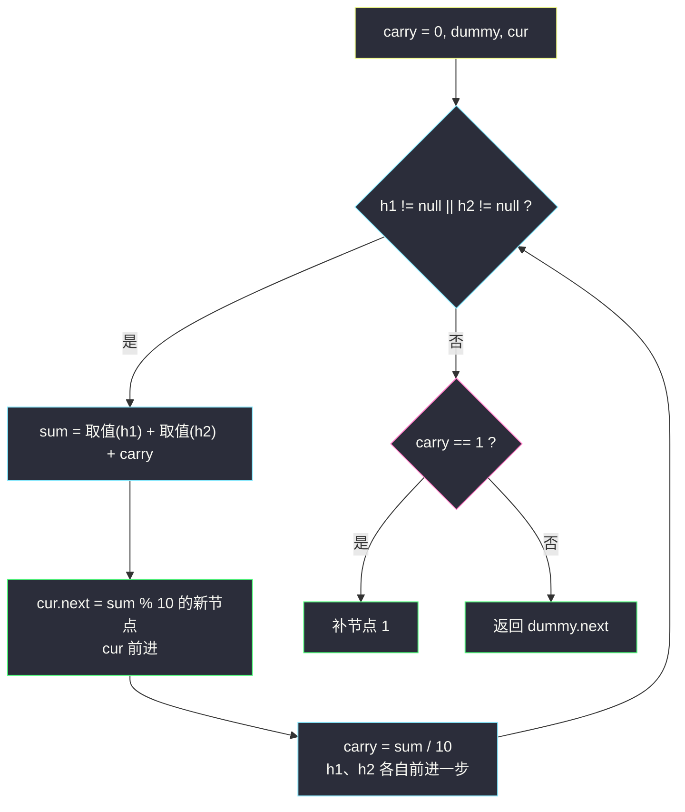
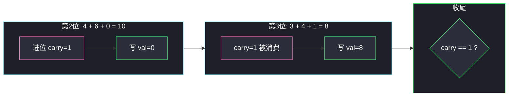

# 两数相加（逆序链表模拟竖式加法）

## 一、问题描述

给你两个**非空**链表，表示两个非负整数。每位数字都是按照**逆序**方式存储的（个位在链表头），每个节点只能存储**一位**数字。请你将两个数相加，并以相同形式返回一个表示和的链表。

你可以假设除了数字 0 之外，这两个数都不会以 0 开头。

节点定义：

```java
public class ListNode {
    int val;
    ListNode next;
}
```

> 🔗 LeetCode 2：https://leetcode.cn/problems/add-two-numbers/
> 课源码对照：左程云 `class011/AddTwoNumbers.java`（思路同源）

**示例 1（经典）**

```
输入：l1 = 2 → 4 → 3（即 342）
     l2 = 5 → 6 → 4（即 465）
输出：7 → 0 → 8（即 807）
解释：342 + 465 = 807
```

**示例 2**

```
输入：l1 = 0，l2 = 0
输出：0
```

**直观理解**

这就是小学竖式加法，只是「个位在最前面」。逆序存储反而帮了大忙：**从头开始加恰好是从低位开始加**，进位自然往 `next` 方向传——一步「随走随加」就够，不用先反转链表。

---

## 二、暴力解法（入门）

### 直观思路：转成数字再相加

遍历两条链表把整数还原出来（如 `342`、`465`），相加得到 `807`，再逐位拆回链表。

```java
class Solution {
    public ListNode addTwoNumbersBrute(ListNode l1, ListNode l2) {
        long a = toNumber(l1), b = toNumber(l2), sum = a + b; // 危险！
        ListNode dummy = new ListNode(0), cur = dummy;
        if (sum == 0) return new ListNode(0);
        for (long s = sum; s > 0; s /= 10) {
            cur.next = new ListNode((int) (s % 10));
            cur = cur.next;
        }
        return dummy.next;
    }

    private long toNumber(ListNode head) {
        long num = 0, base = 1;
        for (ListNode p = head; p != null; p = p.next, base *= 10) {
            num += p.val * base;
        }
        return num;
    }
}
```

### 复杂度

- **时间**：`O(n + m)`
- **空间**：`O(n + m)`

### 🔴 瓶颈在哪里

1. **数据范围直接判死刑**：链表最长可达 100 位，`long` 只有约 19 位，必然溢出。
2. 绕过溢出只能用 `BigInteger`（Java）/ 大整数（Python 天然支持）——但那是在考「语言特性」而不是「加法模拟」，面试不得分。
3. 这道题真正想考的是：**沿着链表边走边加、把进位当作第三个加数**的模拟功力。

---

## 三、优化探索（核心章节）

### 3.1 观察特征

| 特征 | 说明 |
|------|------|
| 逆序存储 | 头节点 = 个位，天然从低位开始，模拟竖式的顺序与遍历顺序一致 |
| 每位一个节点 | 每步只算一位，`sum ∈ [0, 19]`，进位只能是 0 或 1 |
| 两链可能不等长 | 短的那条走到 `null` 后按 0 参与运算 |
| 最高位可能进位 | 如 `5 + 5 = 10`，别忘循环外补一个节点 |

### 3.2 逐位模拟：进位是第三个加数

设 `carry` 为上一位向这一位的进位（初始 0）。每一位：

```
sum = (h1 的值) + (h2 的值) + carry
val   = sum % 10   → 写进新节点
carry = sum / 10   → 传给下一位
```

两条链**谁还没走完就继续加**（走完的按 0 算），循环结束后若 `carry == 1`，单独补一个节点 `1`。

用一个**哑节点（dummy）**当结果链表的锚点，新节点全部尾插到 `cur` 后面，最后返回 `dummy.next`——省去「头节点为空的特判」。



### 3.3 关键推导问题

| 问题 | 答案 |
|------|------|
| 为什么不用先反转链表？ | 逆序存储意味着头就是个位，遍历顺序 = 竖式加法顺序 |
| 不等长怎么处理？ | 统一条件 `h1 != null \|\| h2 != null`，取值时判空给 0 |
| 最高位进位会不会丢？ | 不会，循环外 `carry == 1` 时补节点；漏掉是最常见 WA 点 |
| 不变式是什么？ | 每轮结束后：`dummy.next` 链表是「前 i 位已算完的和（低位在前）」，`carry` 是第 i+1 位的预进位 |
| 要不要复用旧节点？ | 生成新节点教学最好懂（课源码亦如此）；面试提一句可复用省内存 |

### 3.4 一句话核心

> **进位当第三个加数，谁没走完按零算；循环出了看 carry，是 1 就补个尾巴。**

---

## 四、代码实现详解

### Java（dummy 尾插 · 主解）

```java
class Solution {
    public ListNode addTwoNumbers(ListNode h1, ListNode h2) {
        ListNode dummy = new ListNode(0); // 哑头，锚定结果
        ListNode cur = dummy;
        int carry = 0;                    // 进位：0 或 1
        while (h1 != null || h2 != null) {
            int sum = carry;
            if (h1 != null) { sum += h1.val; h1 = h1.next; }
            if (h2 != null) { sum += h2.val; h2 = h2.next; }
            cur.next = new ListNode(sum % 10); // 当前位
            cur = cur.next;
            carry = sum / 10;                 // 传下去
        }
        if (carry == 1) {
            cur.next = new ListNode(1);       // 最高位进位
        }
        return dummy.next;
    }
}
```

**课源码对照**：左程云 `class011/AddTwoNumbers.java` 思路完全一致——`for` 循环头部声明 `sum/val`，步进用 `h1 == null ? null : h1.next` 三元跳转，值取 `h1 == null ? 0 : h1.val`。站点主解换成 while + dummy 的等价写法，更好讲、好默写。

### Python（同思路）

```python
class Solution:
    def addTwoNumbers(self, l1: ListNode, l2: ListNode) -> ListNode:
        dummy = cur = ListNode(0)
        carry = 0
        while l1 or l2:
            s = carry
            if l1:
                s += l1.val
                l1 = l1.next
            if l2:
                s += l2.val
                l2 = l2.next
            cur.next = ListNode(s % 10)
            cur = cur.next
            carry = s // 10
        if carry:
            cur.next = ListNode(1)
        return dummy.next
```

---

## 五、例子演示

以 `342 + 465 = 807` 为例：`l1 = 2 → 4 → 3`，`l2 = 5 → 6 → 4`。

### 初始

```
l1:  2 → 4 → 3 → null
l2:  5 → 6 → 4 → null
carry = 0, dummy → (空)
```

### 第 1 位：2 + 5 + 0 = 7

```
val = 7, carry = 0
结果：7
l1 → 4, l2 → 6
```

### 第 2 位：4 + 6 + 0 = 10

```
val = 10 % 10 = 0, carry = 10 / 10 = 1
结果：7 → 0
l1 → 3, l2 → 4
```

### 第 3 位：3 + 4 + 1 = 8

```
val = 8, carry = 0
结果：7 → 0 → 8
l1 → null, l2 → null
```

### 收尾

```
两条链都空，循环结束；carry = 0，不补节点
返回 dummy.next = 7 → 0 → 8   ✅ 即 807
```



**进位链示例**：`l1 = 9 → 9`（99）加 `l2 = 1`（1）：第 1 位 `9+1=10` 写 0 进 1，第 2 位 `9+0+1=10` 写 0 进 1，循环外补 `1`，得 `0 → 0 → 1`（100）。**进位能一路传到底**，这就是必须循环外再查一次 `carry` 的原因。

**不等长示例**：`l1 = 5`，`l2 = 5 → 9`（5 + 95）：第 1 位 `5+5=10` 写 0 进 1；第 2 位只有 `l2`：`0+9+1=10` 写 0 进 1；补尾 `1`，得 `0 → 0 → 1`（100）。✅

---

## 六、复杂度分析

| 方法 | 时间 | 额外空间 | 说明 |
|------|------|----------|------|
| 转整数 | `O(n + m)` | `O(n + m)` | 长数必溢出，仅可作反面教材 |
| **逐位模拟** | **`O(max(n, m))`** | **`O(1)`** | 不计输出链表；计输出也是 `O(max(n,m)+1)` |

两条链最多同时走 `max(n, m)` 轮，每轮常数操作。

---

## 七、对比总结

### 易错点

1. **循环外忘了 `carry == 1` 补节点** → `99 + 1` 输出 `00`，经典 WA。
2. **循环条件写成 `h1 != null && h2 != null`** → 不等长时提前结束，低位丢光。
3. **取值前不判空** → 短链先走完，`null.val` 空指针异常。
4. **先 sum 再把 `carry` 重置顺序写反** → 先 `carry = 0` 再加旧 carry，进位丢失；正确顺序是「先取旧 carry 求和，再从 sum 里更新 carry」。
5. 返回 `dummy` 而不是 `dummy.next` → 结果多一个 0 头。

### 与 445（两数相加 II）的关系

| | 本题 #2 | #445 |
|--|------|------|
| 存储方向 | 逆序（头=个位） | 正序（头=最高位） |
| 直接模拟 | ✅ 从头加 | ❌ 高位先加没有意义 |
| 需要的预处理 | 无 | 栈 / 反转链表 |

### 模板口诀

> **低位在前刚好加，进位当作老三家；谁空谁当零来算，出门莫忘 carry 大。**

---

## 八、举一反三

| 题目 | 链接 | 迁移点 |
|------|------|--------|
| 445. 两数相加 II | https://leetcode.cn/problems/add-two-numbers-ii/ | 正序存储，先入栈或反转再套本题模板 |
| 67. 二进制求和 | https://leetcode.cn/problems/add-binary/ | 同一套进位模拟，进制换 2 |
| 415. 字符串相加 | https://leetcode.cn/problems/add-strings/ | 数组版竖式加法，逐位 + carry |
| 43. 字符串相乘 | https://leetcode.cn/problems/multiply-strings/ | 竖式乘法，进位思想的乘法版 |
| 66. 加一 | https://leetcode.cn/problems/plus-one/ | carry 传播的最小场景 |

**迁移一句**：凡是「大数按位存储 + 加减运算」，一律**模拟竖式 + 进位传播**，从最低位那一端开始扫。
