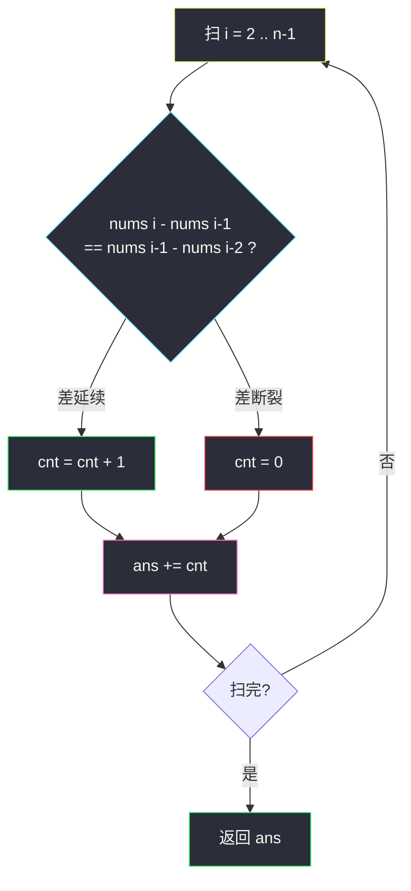
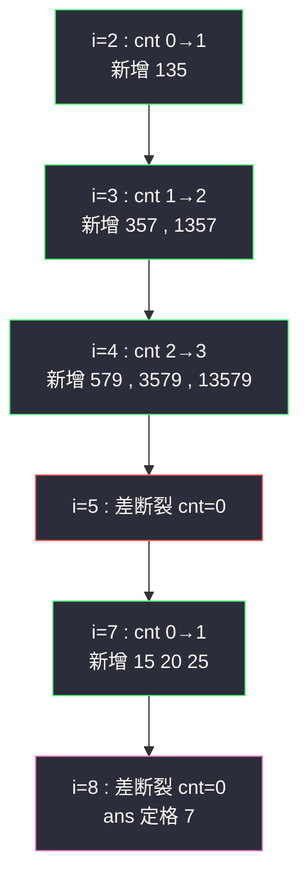

# 等差数列划分（一维计数 DP：以 i 结尾）

## 一、问题描述

给你一个整数数组 `nums`，返回 `nums` 中**连续**子数组的数目，要求子数组是**等差数列**且长度至少 3。

> 🔗 LeetCode 413：https://leetcode.cn/problems/arithmetic-slices/

**示例 1**

```
输入：nums = [1,2,3,4]
输出：3
解释：等差子数组 [1,2,3]、[2,3,4]、[1,2,3,4] 共 3 个
```

**示例 2**

```
输入：nums = [1]
输出：0
```

**直观理解**

「连续 + 等差」意味着判定只看**相邻两个差**：`nums[i] - nums[i-1]` 与 `nums[i-1] - nums[i-2]` 是否相等。计数题的标准套路是定义「**以 i 结尾**」的局部量，最后求和——因为一个长为 L 的等差段，其内部以各位置结尾的子数组恰好每个只被数一次，不重不漏。（本题课上无原题，按 class066/class067 的线性计数 DP 骨架对齐：`dp[i] = 以 i 结尾的方案数`。）

---

## 二、暴力解法

### 直观思路

枚举所有起点 `i`，向后延伸 `j`，逐个检查 `nums[i..j]` 是否等差：

```java
// 暴力：枚举起点 + 延伸
public static int numberOfArithmeticSlicesBrute(int[] nums) {
    int n = nums.length, ans = 0;
    for (int i = 0; i + 2 < n; i++) {
        for (int j = i + 2; j < n; j++) {
            if (isArithmetic(nums, i, j)) {
                ans++;   // 延伸到 j 仍等差
            } else {
                break;   // 连续等差一旦破坏，更长的也不可能
            }
        }
    }
    return ans;
}

private static boolean isArithmetic(int[] nums, int i, int j) {
    int d = nums[i + 1] - nums[i];
    for (int k = i + 2; k <= j; k++) {
        if (nums[k] - nums[k - 1] != d) {
            return false;
        }
    }
    return true;
}
```

### 复杂度

- **时间**：`O(n²)`——每个子数组内重复比较相邻差（`break` 优化后均摊，最坏仍平方级）
- **空间**：`O(1)`

### 🔴 瓶颈在哪里

`isArithmetic(i, j)` 的判定结果其实由「从 i 起的差分序列何时断」唯一决定——同一信息被起点枚举反复重算。换个定义方向，把信息按**结尾位置**存下来，一遍扫完。

---

## 三、优化探索（核心章节）

### 3.1 状态定义：以 i 结尾

| dp 定义 | 含义 |
|---------|------|
| `dp[i]` | **以 nums[i] 结尾**、长度 ≥ 3 的等差子数组的个数 |

「以 i 结尾」是计数 DP 的经典定义——总答案 = 所有结尾处局部量之和，天然去重。

### 3.2 转移方程推导

看最后三个数 `nums[i-2], nums[i-1], nums[i]`：

- **差延续**（`nums[i] - nums[i-1] == nums[i-1] - nums[i-2]`）：
  任何以 `i-1` 结尾的等差子数组，末尾接上 `nums[i]` 仍是等差，得到一个以 `i` 结尾的新子数组；再外加新出现的那个长度为 3 的 `(i-2, i-1, i)`。所以
  `dp[i] = dp[i-1] + 1`
- **差断裂**：以 `i` 结尾的等差子数组不存在：
  `dp[i] = 0`

```
边界 : dp[0] = dp[1] = 0（凑不满 3 个数）
答案 = Σ dp[i]  (i = 2 .. n-1)
```

**增量 +1 的直观解读**：差延续一次，新增的子数组恰好是「所有以 i-1 结尾的旧段各延长一个」+「新三连」。差延续 t 次时 `dp[i] = t`，对应长为 `t+2` 的等差段贡献 `1+2+...+t` 个子数组——与「长度 L 的等差段有 (L-1)(L-2)/2 个子数组」的封闭公式一致。

### 3.3 空间压缩：一个变量滚动

`dp[i]` 只依赖 `dp[i-1]`，用变量 `cnt` 滚动即可，`O(1)` 空间。



### 3.4 关键问题

| 问题 | 答案 |
|------|------|
| 为什么计数不会重复？ | 每个子数组有唯一的结尾下标；`dp[i]` 只数以 `i` 结尾的，求和天然不重不漏 |
| 长度 ≥ 3 的约束体现在哪？ | `dp[i-1]` 的所有段长度已 ≥ 3，`+1` 后新三连 `(i-2,i-1,i)` 恰是长度 3；不会数出长度 2 的段 |
| 差断裂后旧段还能复用吗？ | 不能——连续性破坏后，跨断点的新子数组必不等差；`cnt = 0` 干净重置 |
| `d` 要不要先预处理差分数组？ | 可以（差分数组变 01 判等），但直接两个减法比较更省事，不必引入额外数组 |
| 和 #446 等差数列划分 II（可跳）的区别？ | #446 允许**不连续**子序列，需要 `dp[i][d]`（以 i 结尾公差 d 的方案）哈希表计数，难度高一个档次 |

### 3.5 一句话核心

> **差延续：dp[i] = dp[i-1] + 1；差断裂：dp[i] = 0；答案 = 全部求和（可滚动成一个 cnt）。**

---

## 四、代码实现

### Java（主解：滚动变量计数）

```java
// 等差数列划分
// 返回 nums 中连续且为等差数列(长度>=3)的子数组个数
// 测试链接 : https://leetcode.cn/problems/arithmetic-slices/
// 说明 : 课上无原题，按线性计数 DP 骨架对齐
//        (dp[i] = 以 i 结尾的方案数，同体系 : 最大子数组和 / 最长递增子数组)
public class Solution {

    // 时间复杂度 O(n)，空间复杂度 O(1)
    public int numberOfArithmeticSlices(int[] nums) {
        int n = nums.length;
        int ans = 0, cnt = 0;   // cnt : 滚动的 dp[i]（以 i 结尾的等差子数组数）
        for (int i = 2; i < n; i++) {
            if (nums[i] - nums[i - 1] == nums[i - 1] - nums[i - 2]) {
                cnt += 1;       // 差延续 : dp[i] = dp[i-1] + 1
            } else {
                cnt = 0;        // 差断裂 : dp[i] = 0
            }
            ans += cnt;
        }
        return ans;
    }
}
```

### Java（对照版：显式 dp 数组）

```java
// dp[i] : 以 nums[i] 结尾、长度>=3 的等差子数组个数
public class Solution {

    public int numberOfArithmeticSlices(int[] nums) {
        int n = nums.length;
        int[] dp = new int[n];
        int ans = 0;
        for (int i = 2; i < n; i++) {
            if (nums[i] - nums[i - 1] == nums[i - 1] - nums[i - 2]) {
                dp[i] = dp[i - 1] + 1;
            }
            ans += dp[i];
        }
        return ans;
    }
}
```

### Python（主解同思路）

```python
class Solution:
    def numberOfArithmeticSlices(self, nums: list[int]) -> int:
        ans = cnt = 0
        for i in range(2, len(nums)):
            if nums[i] - nums[i - 1] == nums[i - 1] - nums[i - 2]:
                cnt += 1      # 差延续
            else:
                cnt = 0       # 差断裂
            ans += cnt
        return ans
```

---

## 五、具体例子演示

以 `nums = [1, 3, 5, 7, 9, 15, 20, 25, 28, 29]` 为例（两段等差 + 杂项）。

### 逐 i 跟踪（cnt 即滚动 dp[i]）

| i | 三元组 | 差比较 | cnt = dp[i] | ans | 对应新增子数组 |
|---|--------|--------|-------------|-----|----------------|
| 2 | (1,3,5) | 2 == 2 ✓ | 1 | 1 | `1,3,5` |
| 3 | (3,5,7) | 2 == 2 ✓ | 2 | 3 | `3,5,7`；`1,3,5,7` |
| 4 | (5,7,9) | 2 == 2 ✓ | 3 | 6 | `5,7,9`；`3,5,7,9`；`1,3,5,7,9` |
| 5 | (7,9,15) | 6 != 2 ✗ | 0 | 6 | —（断裂） |
| 6 | (9,15,20) | 5 != 6 ✗ | 0 | 6 | — |
| 7 | (15,20,25) | 5 == 5 ✓ | 1 | 7 | `15,20,25` |
| 8 | (20,25,28) | 3 != 5 ✗ | 0 | 7 | —（断裂） |
| 9 | (25,28,29) | 1 != 3 ✗ | 0 | 7 | — |

最终 `ans = 7`。

**重点看 i=4 的增量**：cnt 从 2 跳到 3，新增的 3 个子数组是——旧的两段（以 7 结尾的 `5,7` 起头段……准确说：以 7 结尾的 `3,5,7` 与 `1,3,5,7`）各延长一个 9，变成 `3,5,7,9`、`1,3,5,7,9`，加上全新三连 `5,7,9`。**「旧段延长 + 新三连」正是 `dp[i-1] + 1` 的 +1 与 dp[i-1] 部分**。



**再验最小例子** `nums = [1,2,3,4]`：i=2 cnt=1（`123`），i=3 cnt=2（`234`、`1234`），ans = 3 ✓ 与示例一致。

---

## 六、复杂度分析

| 版本 | 时间 | 空间 | 说明 |
|------|------|------|------|
| 暴力枚举 | `O(n²)` | `O(1)` | 起点延伸 + 反复判定 |
| 显式 dp 数组 | `O(n)` | `O(n)` | 一遍扫 |
| **滚动变量（主解）** | `O(n)` | `O(1)` | dp[i] 只依赖 dp[i-1] |

---

## 七、方法对比与总结

### 「以 i 结尾」家族

| 题 | dp[i] 含义 | 转移 |
|----|-----------|------|
| 53 最大子数组和 | 以 i 结尾的最大和 | `max(nums[i], dp[i-1]+nums[i])` |
| 300 最长递增子序列 | 以 i 结尾的最长长度 | `max(dp[j]+1)`（j < i 且 nums[j]<nums[i]） |
| **413 等差数列划分（本题）** | 以 i 结尾的等差子数组个数 | 差延续 `dp[i-1]+1`，断裂归 0 |

这类定义的共同红利：**结尾唯一 → 求和/取 max 不重不漏**；代价：断裂条件（连续性）必须能 O(1) 判定——等差、递增、同值等都满足。

### 易错点

1. **从 i=1 开始循环**：`nums[i-2]` 越界；三元比较从 `i=2` 起。
2. **断裂忘了清零**：cnt 带着旧值跨过断点会多数。
3. **ans 累加位置**：每轮循环内 `ans += cnt`（断裂轮 cnt=0 加零无妨），别放在 if 里面漏加。
4. **想用滑动窗口做**：窗口能求「最长等差段」但计数容易绕晕，「以 i 结尾」的定义直给得多。

### 模板口诀

> **看最后三数差延续，延续加一断归零；结尾计数求和毕，一个变量全搞定。**

---

## 八、举一反三

| 题目 | 链接 | 迁移点 |
|------|------|--------|
| 446. 等差数列划分 II | https://leetcode.cn/problems/arithmetic-slices-ii-subsequence/ | 不连续版：`dp[i][d]` 哈希计数，本题的 Hard 升级 |
| 53. 最大子数组和 | https://leetcode.cn/problems/maximum-subarray/ | 同为「以 i 结尾 + 断裂重置」骨架 |
| 673. 最长递增子序列的个数 | https://leetcode.cn/problems/number-of-longest-increasing-subsequence/ | 「以 i 结尾」计数 + 长度双信息 |
| 1512. 好数对的数目 | https://leetcode.cn/problems/number-of-good-pairs/ | 计数 DP/哈希热身，体会「增量计数」 |
| 2393. 严格递增的子数组计数 | https://leetcode.cn/problems/count-strictly-increasing-subarrays/ | 同骨架换判定条件（会员题可选做） |

**迁移一句**：凡是「连续段 + 局部性质（等差/递增/同值）+ 计数」，套「以 i 结尾」：性质延续则 `dp[i-1] + 增量`，断裂归零，求和收工。一行转移、一个变量，是性价比最高的 DP 模板之一。
