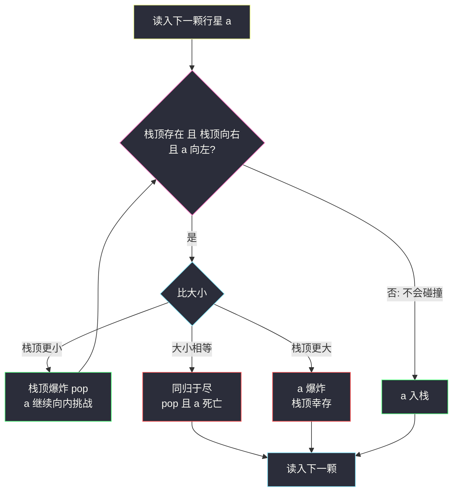
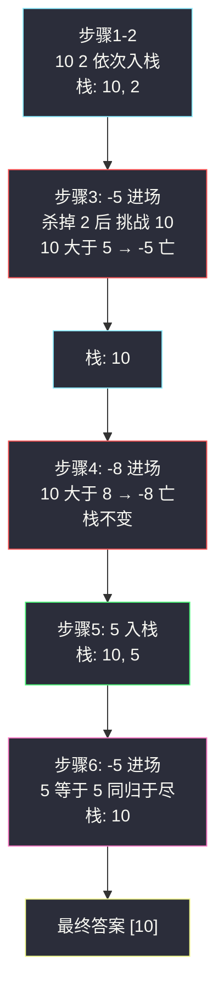

# 行星碰撞（栈模拟碰撞 + 存活不变式）

## 一、问题描述

给你一个整数数组 `asteroids`，表示在同一行的行星。

- `asteroids[i] > 0`：行星向**右**移动；`asteroids[i] < 0`：行星向**左**移动；**绝对值**表示行星的大小（质量）。
- 每颗行星以相同速度移动，速度永远不变。
- 碰撞规则：两颗行星**相向**移动时会碰撞——较小的行星爆炸；若两者大小相同，则**双双爆炸**。同向移动的两颗行星永远不会碰撞（速度相同追不上），一颗向左的行星与它左边一颗向左的行星也不会碰撞。
- 找出碰撞后剩下的所有行星，返回其数组（答案顺序即从左到右的行星顺序）。

> 🔗 LeetCode 735：https://leetcode.cn/problems/asteroid-collision/
>
> 约束：`2 <= asteroids.length <= 10^4`；`-1000 <= asteroids[i] <= 1000`；`asteroids[i] != 0`。

**示例 1**

```
输入：asteroids = [5,10,-5]
输出：[5,10]
解释：10 和 -5 碰撞，|-5| < 10，-5 爆炸；5 太远，不会与 -5 碰。
```

**示例 2**

```
输入：asteroids = [8,-8]
输出：[]
解释：8 与 -8 相撞，大小相同，双双爆炸。
```

**示例 3**

```
输入：asteroids = [-2,-1,1,2]
输出：[-2,-1,1,2]
解释：-2 与 -1 向左，1 与 2 向右，任何两颗都不同向相遇，零碰撞。
```

**直观理解**

从左往右看，一颗向**左**的新行星 `a` 有多危险，只取决于它**左边连续的一串向右行星**：它们正迎面开来，必有一战；而更左边那些向左的行星早已背道而驰，永远安全。「左边连续向右的送死区」用一个栈维护正合适——新来的左行星与栈顶清算，赢了继续挑战更下面，输了就地爆炸。本题课源码未收录原码，骨架对齐 `class052` 单调栈系列的「**弹栈结算**」思想：新元素入栈前，先把栈里活不下去的批量弹掉。

---

## 二、暴力解法（每轮全扫，找一对相邻碰撞）

### 直观思路

完全按时间线模拟：每一轮从头扫整个数组，找到**第一对**会碰撞的相邻行星（左 `>0`、右 `<0`），按规则处理（炸一个或炸一双），重建数组；直到某一轮再也找不到碰撞对，输出剩余数组。

```java
class Solution {
    public int[] asteroidCollision(int[] asteroids) {
        List<Integer> list = new ArrayList<>();
        for (int a : asteroids) {
            list.add(a);
        }
        boolean changed = true;
        while (changed) {
            changed = false;
            for (int i = 0; i + 1 < list.size(); i++) {
                int left = list.get(i), right = list.get(i + 1);
                if (left > 0 && right < 0) {          // 找到一对碰撞
                    if (left > -right) {              // 右边爆
                        list.remove(i + 1);
                    } else if (left < -right) {       // 左边爆
                        list.remove(i);
                    } else {                          // 同归于尽
                        list.remove(i + 1);
                        list.remove(i);
                    }
                    changed = true;
                    break;                            // 本轮只处理一对，重启扫描
                }
            }
        }
        int[] ans = new int[list.size()];
        for (int i = 0; i < ans.length; i++) {
            ans[i] = list.get(i);
        }
        return ans;
    }
}
```

### 复杂度

- **时间**：`O(n²)`——每次碰撞都重启全量扫描，最坏（递减的正数串尾接一个大负数）要做约 n/2 轮、每轮扫 O(n)
- **空间**：`O(n)` 列表

### 🔴 瓶颈在哪里

1. **前缀反复白扫**：碰撞永远发生在「新负数 vs 已有向右串」的边界上，前面前面早已安定的区域每轮都陪扫；
2. `remove` 挪数组 + `break` 重启，双重浪费；
3. 本质：一次碰撞处理后，**结论是永久的**（爆掉的行星再也不回来），这种「结算即终局」的信息，栈能 O(1) 利用，逐轮重扫不能。

---

## 三、优化探索（核心章节）

### 3.1 观察特征

| 特征 | 说明 |
|------|------|
| 碰撞只发生在相邻对 `(>0, <0)` | 左右都向左、或都向右、或左向右+右向左之外的方向，永不相遇 |
| 新负数只挑战「左边连续向右区」 | 更左的向左行星背向而行，绝对安全；向右区从最近（栈顶）开始清算 |
| 结算即终局 | 爆掉的行星永久出局，不会被「复活」——天然适配栈的弹出不回头 |
| 存活序列顺序天然有序 | 从左到右依次入栈，栈底到栈顶就是存活顺序，无需排序 |

### 3.2 暴力 → 优化：栈模拟清算

```
for a in asteroids:
    alive = true                          ← a 自己的生死簿
    while 栈非空 且 栈顶 > 0 且 a < 0:     ← 只有这种局面会碰
        if    |栈顶| < |a|: pop()          ← 栈顶较小，爆炸，a 继续挑战更下面
        elif  |栈顶| = |a|: pop(); alive=false; break   ← 同归于尽
        else:               alive=false; break          ← 栈顶更大，a 爆炸
    if alive: push(a)                     ← 活下来（含直接入栈的向右/向左行星）
```

**存活不变式**：任意时刻，栈中**不存在相邻的 `(向右, 向左)` 对**——即从底到顶，一旦出现向左行星，它上面（更右）全是向左的。每颗新行星入栈前，循环把会与它相撞的栈顶全部清算，不变式得以维持；也因此**栈内行星彼此永不再碰**，栈就是最终答案。



### 3.3 关键推导问题

| 问题 | 答案 |
|------|------|
| 为什么向右的新行星直接入栈？ | 它右边还没有任何行星；未来只有「更右的向左行星」能碰到它，那时再清算不迟。现在入栈绝对安全 |
| 为什么向左的新行星碰到「向左的栈顶」就安全了？ | 两者都向左、速度相同，距离永不缩短；栈顶左边的向右行星被栈顶这颗向左行星挡住「够不着」新行星 |
| 等大为什么要双方都爆且立刻 break？ | 题目规定等大同爆；a 已死，绝不能再继续挑战更下面的栈顶，也不入栈 |
| 连杀多颗后 a 自己死了怎么办？ | `alive` 标志位统一收尾：break 后只在 `alive` 为真时 push，逻辑集中不散落 |
| 这是单调栈吗？ | 结构是栈+弹栈结算，但弹栈条件是「存活竞争」而非「值的大小单调」——不是单调栈，却共享同一套摊还分析：每颗行星至多入栈一次、出栈一次 |
| 答案顺序对吗？ | 入栈顺序即从左到右顺序，弹出只发生在「死亡」时，栈底到栈顶就是幸存序列，直接输出无需反转 |

### 3.4 一句话核心

> **向右的排队站好，向左的进场清算：从最近的开杀，谁大谁活，等大同尽——栈里剩下的就是最终宇宙。**

---

## 四、代码实现详解

### Java（主解：ArrayDeque 模拟清算）

```java
// 行星碰撞：向右的入栈候着，向左的进场逐个清算
// 测试链接 : https://leetcode.cn/problems/asteroid-collision/
// 课源码未收录本题；骨架对齐 class052 单调栈系列"弹栈结算"思想
class Solution {
    public int[] asteroidCollision(int[] asteroids) {
        Deque<Integer> stack = new ArrayDeque<>();
        for (int a : asteroids) {
            boolean alive = true;
            // 只有「栈顶向右 且 a 向左」才会碰撞
            while (alive && a < 0 && !stack.isEmpty() && stack.peek() > 0) {
                if (stack.peek() < -a) {          // 栈顶较小：爆炸，继续挑战
                    stack.pop();
                } else if (stack.peek() == -a) {  // 等大：同归于尽
                    stack.pop();
                    alive = false;
                } else {                          // 栈顶较大：a 死亡
                    alive = false;
                }
            }
            if (alive) {
                stack.push(a);
            }
        }
        int[] ans = new int[stack.size()];
        for (int i = ans.length - 1; i >= 0; i--) {   // ArrayDeque 头到尾 = 栈顶到底
            ans[i] = stack.pop();
        }
        return ans;
    }
}
```

注意收尾把栈倒回数组：`stack.pop()` 先吐栈顶（最右行星），所以从 `ans` 末位往前填，恢复从左到右顺序。

### Python（同思路）

```python
class Solution:
    def asteroidCollision(self, asteroids: list[int]) -> list[int]:
        stack: list[int] = []
        for a in asteroids:
            alive = True
            while alive and a < 0 and stack and stack[-1] > 0:
                if stack[-1] < -a:        # 栈顶较小，爆炸
                    stack.pop()
                elif stack[-1] == -a:     # 等大同爆
                    stack.pop()
                    alive = False
                else:                     # 栈顶更大，a 爆炸
                    alive = False
            if alive:
                stack.append(a)
        return stack
```

Python 的 list 栈顶在末尾，天然从左到右有序，直接返回即可。

---

## 五、具体例子演示

### 例 1：`asteroids = [10,2,-5,-8,5,-5]`，答案 `[10]`

逐颗跟踪（栈记法：左侧为底）：

| 步 | 当前 a | 比较 / 判断 | 动作 | 栈（底→顶） |
|----|--------|-------------|------|-------------|
| 1 | 10 | 向右，无威胁 | 入栈 | [10] |
| 2 | 2 | 向右 | 入栈 | [10, 2] |
| 3 | -5 | vs 栈顶 2：`2 < 5` | 2 爆，继续 | [10] |
|  |  | vs 栈顶 10：`10 > 5` | -5 爆，break | [10] |
| 4 | -8 | vs 栈顶 10：`10 > 8` | -8 爆 | [10] |
| 5 | 5 | 向右 | 入栈 | [10, 5] |
| 6 | -5 | vs 栈顶 5：`5 == 5` | 双双爆炸 | [10] |
| 7 | 读完 | — | 栈即答案 | **[10]** ✅ |



**关键看点**：步骤 3 一颗 `-5` 连环清算（杀掉 2）后**仍死于 10**——「能杀」不等于「能活」，`alive` 标志必须独立维护。

### 例 2：`asteroids = [5,10,-5]`，答案 `[5,10]`

| 步 | a | 判断 | 栈 |
|----|---|------|-----|
| 1 | 5 | 向右入栈 | [5] |
| 2 | 10 | 向右入栈 | [5,10] |
| 3 | -5 | vs 10：`10 > 5`，-5 爆 | [5,10] ✅ |

5 离得太远且同向，全程零接触。

### 例 3：`asteroids = [-2,-2,1,-2]`，答案 `[-2,-2,-2]`

| 步 | a | 判断 | 栈 |
|----|---|------|-----|
| 1 | -2 | 向左，栈空入栈 | [-2] |
| 2 | -2 | 栈顶向左（背向），入栈 | [-2,-2] |
| 3 | 1 | 向右入栈 | [-2,-2,1] |
| 4 | -2 | vs 1：`1 < 2`，1 爆；栈顶 -2 向左，无碰撞 | [-2,-2,-2] ✅ |

**关键看点**：步骤 4 杀掉 1 后**继续向内**，发现新栈顶是向左的 -2——背道而驰，立刻收手入栈。`while` 的循环条件 `栈顶 > 0` 挡住了多余比较。

### 例 4：零碰撞 `[-2,-1,1,2]`

四颗全部直接入栈（步骤 4 的 2 向右、此前栈顶向左也照样入栈——向右行星从不主动碰撞）：`[-2,-1,1,2]` ✅。最坏情况全部入栈、零弹出，栈深达 n。

---

## 六、复杂度分析

| 项目 | 暴力逐轮重扫 | 栈模拟清算（主解） |
|------|--------------|---------------------|
| 时间 | `O(n²)` | **`O(n)`**：每颗行星入栈至多一次、出栈至多一次，总操作 ≤ 2n |
| 空间 | `O(n)` | `O(n)` 栈 |

**摊还论证**：虽然单颗向左行星可能连环弹出多个栈顶（例 1 步骤 3），但每个被弹出的行星一生只被弹一次——把总代价均摊到 n 颗行星上，每颗 O(1)。与单调栈、双栈队列是同一套「进出各一次」的账本。

---

## 七、方法对比与总结

### 写法对比

| | 暴力逐轮重扫 | 栈模拟清算（主解） |
|--|--------------|---------------------|
| 时间 | `O(n²)` | `O(n)` |
| 模拟对象 | 全时间线 | 只模拟「结算点」 |
| 易错面 | 数组删格、重启扫描 | 生死标志、等大双爆 |
| 面试定位 | 讲思路的起点 | ✅ 必须默写 |

### 易错点

1. **等大同爆忘 break**：a 已死还继续挑战更深的栈顶，甚至被再次入栈——`alive=false` 必须立刻跳出。
2. **while 条件漏写 `栈顶 > 0`**：向左的新行星与向左的栈顶也会被误判碰撞。
3. **只写 `if` 不写 `while`**：连杀多颗（例 3 步骤 4）会被漏掉。
4. **Java 收尾忘了栈序反转**：`pop` 先出的是最右行星，直接顺序填充 `ans` 会整体倒序。
5. **把本题当单调栈硬套**：弹栈条件是「相向且更小」，不是值的大小单调，栈内并不单调（如 `[10, 5]` 向右串或 `[-2,-2,-2]` 向左串）。

### 模板口诀

> **右行入栈列队，左行入场上阵；由近及远清算，小者爆、等大尽、大者镇；栈底到顶即乾坤。**

---

## 八、举一反三

| 题目 | 链接 | 迁移点 |
|------|------|--------|
| 946. 验证栈序列 | https://leetcode.cn/problems/validate-stack-sequences/ | 同批次站内题解（互引）：纯栈模拟，无大小竞争，练「边推边弹」 |
| 1047. 删除字符串中的所有相邻重复项 | https://leetcode.cn/problems/remove-all-adjacent-duplicates-in-string/ | 最简版「栈顶结算」：相等即双双消除 |
| 739. 每日温度 | https://leetcode.cn/problems/daily-temperatures/ | 单调栈家族：弹栈结算的「值大小」版 |
| 496. 下一个更大元素 I | https://leetcode.cn/problems/next-greater-element-i/ | 站内已有题解：单调栈入门，「新来更大批量结案」 |
| 42. 接雨水 | https://leetcode.cn/problems/trapping-rain-water/ | 站内已有题解：栈解法同族——「新来的一根柱子结算一串」 |

**迁移一句**：这类题的共同骨架是「**新元素入栈前，把栈里活不下去的批量弹掉（弹栈结算）**」——差别只在结算条件：比大小（单调栈）、相等（1047）、相向碰撞（本题）。认出骨架，套题即解。
