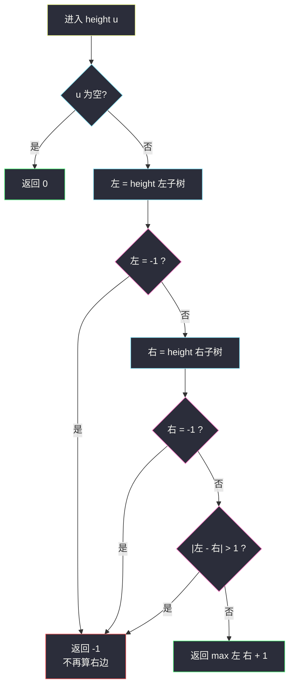
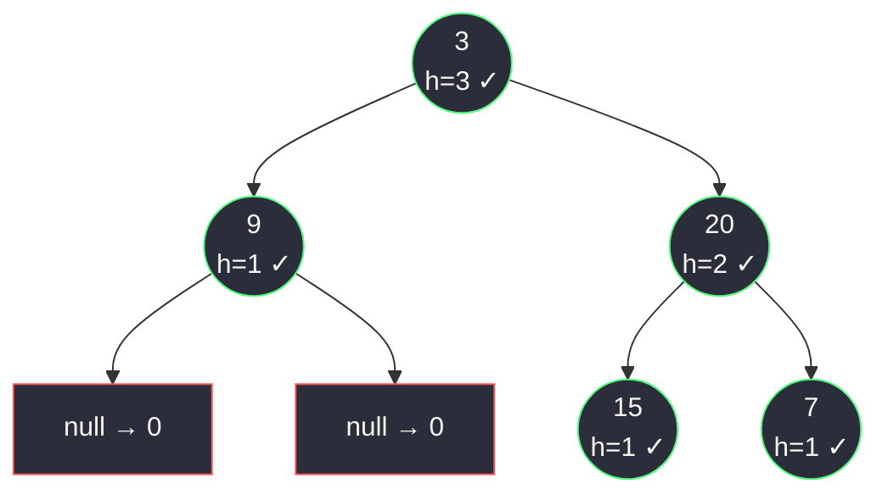

# 平衡二叉树（后序求高度 + 发现不平衡立刻剪枝）

## 一、问题描述

给出一棵二叉树的根节点 `root`，判断它是否是**平衡二叉树**。

平衡二叉树的定义：**每个节点**的左右两棵子树的高度差不超过 1（空树也算平衡）。

> 🔗 LeetCode 110：https://leetcode.cn/problems/balanced-binary-tree/

**示例 1**

```
输入：root = [3,9,20,null,null,15,7]
输出：true
树形：
       3
      / \
     9   20
         / \
        15  7
节点 3：|1 - 2| = 1 ✓；节点 20：|1 - 1| = 0 ✓；叶子节点左右都是 0 ✓
```

**示例 2**

```
输入：root = [1,2,2,3,3,null,null,4,4]
输出：false
树形：
         1
        / \
       2   2
      / \
     3   3
    / \
   4   4
节点 1：左子树高 3，右子树高 1，|3 - 1| = 2 > 1 ✗ → 不平衡
```

**直观理解**

「整棵树平衡」要对**每个节点**都检查一次「左右子树高度差 ≤ 1」。逐个节点看会得到一个天然的结构：想知道某个节点的答案，得**先知道它两棵子树的高度**——信息从孩子流向父亲，这是标准的**后序（自底向上）**问题。

---

## 二、暴力解法（对每个节点重新算高度）

### 直观思路

最直接的翻译：写一个 `height(u)` 求子树高度；再写一个递归，对**每个节点** u 检查 `|height(u.left) - height(u.right)| ≤ 1`，全部通过才平衡。

```java
class Solution {
    public boolean isBalanced(TreeNode root) {
        if (root == null) {
            return true;                    // 空树平衡
        }
        int diff = Math.abs(height(root.left) - height(root.right));
        return diff <= 1
                && isBalanced(root.left)    // 左子树内部也要平衡
                && isBalanced(root.right);  // 右子树内部也要平衡
    }

    // 树的最大深度（节点个数）
    private int height(TreeNode node) {
        if (node == null) {
            return 0;
        }
        return Math.max(height(node.left), height(node.right)) + 1;
    }
}
```

### 复杂度

- **时间**：`O(n²)` 最坏——链状树上，每个节点都要把它下面的整棵子树重算一遍高度
- **空间**：`O(h)` 递归栈，链状树 `O(n)`

### 🔴 瓶颈在哪里

`height` 被**反复调用**：判断节点 1 时算了一遍 2 的高度，判断节点 2 时又把 3、4、4 全部重算。同一棵子树的高度被算了 `O(n)` 次。  
子树高度这个信息明明在递归里**可以一路带回来**——一次后序遍历，边求高度边判平衡，就足够了。

---

## 三、优化探索（核心章节）

### 3.1 观察特征

| 特征 | 说明 |
|------|------|
| 子问题重叠严重 | 暴力版里 `height(2)` 被不同祖先反复计算——典型可合并的重复子问题 |
| 高度与判定同源 | 判平衡需要「左右高度」，求高度本身也要「左右高度」，两件事是一次后序里同时发生的 |
| 坏消息可以提前终止 | 一旦发现某个节点不平衡，**整棵树就不平衡**，剩下的子树高度不必再算 |
| 信息流自底向上 | 孩子把高度告诉父亲，父亲做差判断——后序框架 |

### 3.2 推导：合并两件事 + 提前剪枝

定义递归函数 `height(u)`：返回以 `u` 为根的子树高度；**但如果发现不平衡，返回 -1 作为失败信号**，并且此后一路短路返回 -1。

```
height(u):
    u 为空            → 返回 0
    左 = height(u.left)   是 -1 → 直接返回 -1（不再算右边）
    右 = height(u.right)  是 -1 → 直接返回 -1
    |左 - 右| > 1     → 返回 -1
    否则              → 返回 max(左, 右) + 1
```

主函数只需 `height(root) != -1`。**高度计算与平衡判定在一次递归中完成**，且不平衡信息像「病毒」一样从底层瞬间传染到根部。

课上 class037 `Code04_BalancedBinaryTree` 用的是**全局布尔变量 `balance`**（发现不平衡置 false，height 里看到 `!balance` 就返回 0 不再深入），思路与本节完全一致——都是「后序求高度 + 剪枝」。`-1` 哨兵版不需要全局变量、`LeetCode` 提交更干净，作为主解；课上版见第四章对照。



### 3.3 关键推导问题

| 问题 | 答案 |
|------|------|
| 为什么 -1 可以当哨兵？ | 合法高度从 0（空树）开始，-1 不与任何真实高度冲突 |
| 为什么左子树返回 -1 就不用算右边？ | 平衡是「与」关系：一棵子树已不平衡，整棵树必然不平衡，右边算不算都不影响结论——省时间 |
| 为什么不早退会退化？ | 不剪枝仍正确，但最坏还是每个节点全量算高——剪枝保证坏消息一次传到顶 |
| AVL 的平衡和本题一样吗？ | 定义同源（左右高度差 ≤ 1），但 AVL 还要求**插入/删除时旋转维护**平衡；本题只判不改 |
| 「高度差不超过 1」包括相等吗？ | 包括。`≤ 1` 即 0 或 1 都合法，写成 `< 1` 会把示例 1 判成 false |

### 3.4 一句话核心

> **一次后序：孩子汇报高度，父亲做差；差超 1 就打 -1，坏消息不再往下也无需再算。**

---

## 四、代码实现详解

### Java（主解：-1 哨兵剪枝）

```java
// 判断二叉树是否平衡（后序求高度 + 剪枝）
// 测试链接 : https://leetcode.cn/problems/balanced-binary-tree/
// 思路对齐 class037 Code04_BalancedBinaryTree（课上用全局 balance 变量）
class Solution {
    public boolean isBalanced(TreeNode root) {
        return height(root) != -1;
    }

    // 返回以 node 为根的子树高度；发现不平衡返回 -1
    private int height(TreeNode node) {
        if (node == null) {
            return 0;
        }
        int leftH = height(node.left);
        if (leftH == -1) {
            return -1;              // 左边已坏，短路
        }
        int rightH = height(node.right);
        if (rightH == -1 || Math.abs(leftH - rightH) > 1) {
            return -1;              // 右边坏 / 自己不平衡
        }
        return Math.max(leftH, rightH) + 1;
    }
}
```

### Java（课上版：全局变量 balance，对照）

```java
// 对齐 class037 Code04 原版写法：全局 balance 标记
class Solution {
    private boolean balance;

    public boolean isBalanced(TreeNode root) {
        balance = true;             // 共享变量，开头复位
        height(root);
        return balance;
    }

    private int height(TreeNode cur) {
        if (!balance || cur == null) {
            return 0;               // 已发现不平衡，随便返回
        }
        int lh = height(cur.left);
        int rh = height(cur.right);
        if (Math.abs(lh - rh) > 1) {
            balance = false;
        }
        return Math.max(lh, rh) + 1;
    }
}
```

两版等价：`-1` 哨兵把「失败信号」编码进返回值，全局变量把它放在成员里。哨兵版无隐藏状态，更推荐默写。

### Python（同思路）

```python
class Solution:
    def isBalanced(self, root: Optional[TreeNode]) -> bool:
        return self.height(root) != -1

    def height(self, node: Optional[TreeNode]) -> int:
        if node is None:
            return 0
        left_h = self.height(node.left)
        if left_h == -1:
            return -1
        right_h = self.height(node.right)
        if right_h == -1 or abs(left_h - right_h) > 1:
            return -1
        return max(left_h, right_h) + 1
```

---

## 五、具体例子演示

### 例 1：`root = [3,9,20,null,null,15,7]`（返回 true）

递归**先扎到底，回程时逐层合成高度**：

| 步骤 | 递归动作 | 返回值 | 说明 |
|------|----------|--------|------|
| 1 | `height(3)` 调左 `height(9)` | — | 进入左子树 |
| 2 | `height(9)`：左右都空 → max(0,0)+1 | **1** | 叶子高度 1，无 -1 |
| 3 | `height(3)` 调右 `height(20)` | — | 再进右子树 |
| 4 | `height(15)`：空空 → 1；`height(7)`：空空 → 1 | 1, 1 | 两个孩子先返回 |
| 5 | `height(20)`：\|1-1\|=0 ✓ → max(1,1)+1 | **2** | 判平衡 ✓，高度 2 |
| 6 | `height(3)`：\|1-2\|=1 ✓ → max(1,2)+1 | **3** | 判平衡 ✓，返回 3 ≠ -1 → **true** ✅ |



每个节点旁标出它回传的高度，✓ 表示该节点做差通过。

### 例 2：`root = [1,2,2,3,3,null,null,4,4]`（返回 false，看剪枝）

```
         1
        / \
       2   2
      / \
     3   3
    / \
   4   4
```

| 步骤 | 递归动作 | 返回 | 说明 |
|------|----------|------|------|
| 1 | 一路向左：`height(1) → height(2) → height(3左) → height(4)` | — | 递到最左叶子 |
| 2 | `height(4)`：左右空 → | **1** | 最底叶子 |
| 3 | `height(3左)`：右子 `height(4)` → 1；\|1-1\|=0 ✓ → | **2** | 这层平衡 |
| 4 | `height(2)`：左 = 2，右 = `height(3右)` → 2；\|2-2\|=0 ✓ → | **3** | 这层也平衡 |
| 5 | `height(1)`：左 = 3，右 = `height(2右)` → 1；**\|3-1\| = 2 > 1** | **-1** | 在根节点判死刑 |
| 6 | 主函数：`height(root) == -1` | **false** ✅ | 全程只算了一遍高度 |

注意坏消息发生在**根节点**（示例里最深的不平衡点在根部）；如果坏消息发生在深层（比如把节点 2 的右孩子砍掉，`|2-0| = 2` 在节点 2 处爆雷），`-1` 会从节点 2 一路短路传到根，**节点 1 的右子树都不会再算**——这就是剪枝的价值。

### 例 3：空树 `root = []`

`height(null)` 返回 0，`0 != -1` → **true** ✅（空树平衡）。

---

## 六、复杂度分析

| 项目 | 暴力版 | 后序剪枝版（主解） |
|------|--------|---------------------|
| 时间 | `O(n²)` 最坏：每个节点重算子树高度，链状树最惨 | `O(n)`：每个节点只被访问一次，高度一次算清 |
| 空间 | `O(h)` 递归栈 | `O(h)` 递归栈，`h` 为树高：平衡树 `O(log n)`，链状树 `O(n)` |

优化点**不在访问更少的节点**（每个节点总要看一次），而在于**每个节点的高度只计算一次**并顺路完成判定。

---

## 七、方法对比与总结

### 三种写法对比

| | 暴力（每点重算高度） | 全局 balance（课上版） | -1 哨兵（主解） |
|--|---------------------|------------------------|-----------------|
| 时间 | `O(n²)` | `O(n)` | `O(n)` |
| 剪枝 | ✗ 算完才判 | ✓ 发现即停 | ✓ -1 短路 |
| 状态 | 无 | 成员变量（要记得复位） | 全在返回值里 |
| 推荐 | 理解用 | 对照课上源码 | ✅ 面试默写 |

### 易错点

1. **只判根节点**：定义要求**每个**节点都平衡，示例 2 的雷就埋在根部，但更一般的数据坏在深层。
2. **高度差写 `< 1`**：等于 1 是合法的，条件应为「> 1 才返回 -1」。
3. **忘记空树返回 true**：`height(null) = 0 ≠ -1` 自然成立，但暴力版里显式 `if (root == null) return true` 别漏。
4. **全局变量不复位**：课上版 `balance` 是共享的，多组数据必须开头置 true，否则上一轮的 false 污染本轮。
5. **混淆深度与高度**：做差用的是**子树高度**（自底向上数），与「节点深度」无关。

### 模板口诀

> **后序求高度，顺手做差；差过一，报 -1；见 -1，快回家。**

---

## 八、举一反三

| 题目 | 链接 | 迁移点 |
|------|------|--------|
| 104. 二叉树的最大深度 | https://leetcode.cn/problems/maximum-depth-of-binary-tree/ | 本题地基：`max(左,右)+1` 后序框架（本站已有题解） |
| 543. 二叉树的直径 | https://leetcode.cn/problems/diameter-of-binary-tree/ | 同款「后序求高度 + 顺带更新额外统计量」，把平衡判定换成 `左 + 右` |
| 124. 二叉树中的最大路径和 | https://leetcode.cn/problems/binary-tree-maximum-path-sum/ | 后序回传「单边最大贡献」，剪枝思想换成负贡献舍弃 |
| 108. 将有序数组转换为二叉搜索树 | https://leetcode.cn/problems/convert-sorted-array-to-binary-search-tree/ | 反向问题：主动构造一棵平衡树（取中点当根递归二分） |

**迁移一句**：树形统计题的通用范式是——**递归函数返回「子树上你要的信息」，路过每个节点时顺带用它维护答案**；本题返回高度、维护平衡标记，下一题可能返回路径和、维护最大值，骨架一模一样。
