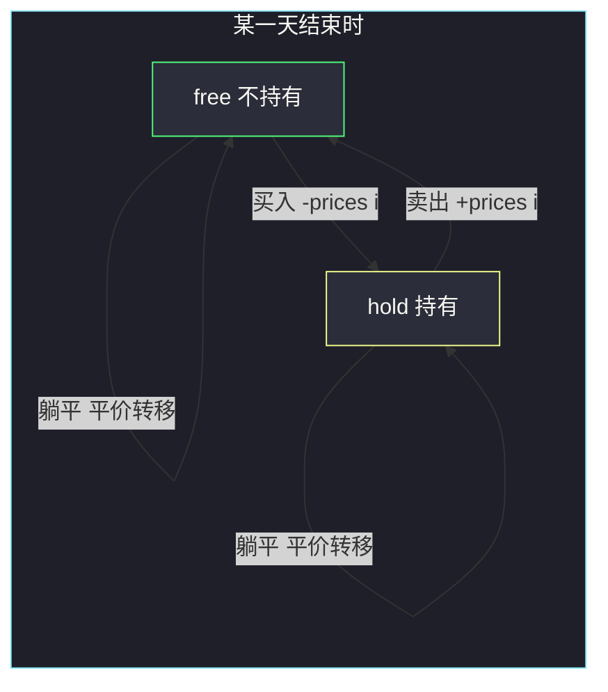
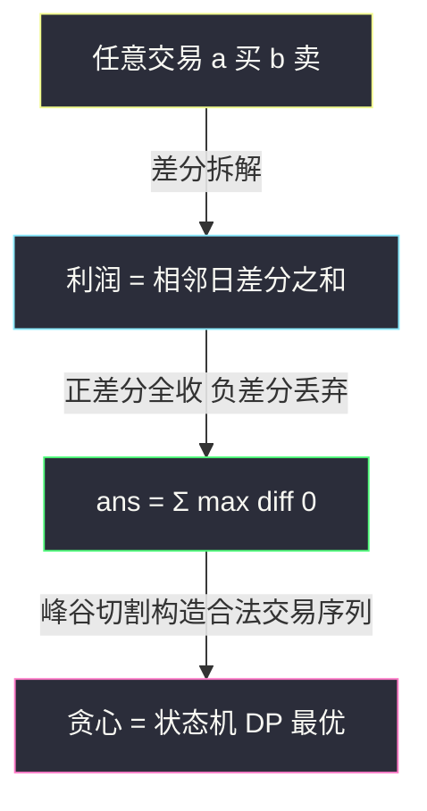

# 买卖股票的最佳时机 II（无限次交易：贪心收上坡 + 状态机验证）

## 一、问题描述

给你一个整数数组 `prices`，`prices[i]` 表示某支股票第 `i` 天的价格。每天你可以决定是否购买和/或出售股票（**无限次交易**），但任何时候最多只能持有**一股**；也可以在同一天先买后卖。返回能获得的最大利润。

> 🔗 LeetCode 122：https://leetcode.cn/problems/best-time-to-buy-and-sell-stock-ii/

**示例 1**

```
输入：prices = [7, 1, 5, 3, 6, 4]
输出：7
解释：第 2 天（价格 1）买入，第 3 天（价格 5）卖出，利润 4；
     随后第 4 天（价格 3）买入，第 5 天（价格 6）卖出，利润 3。总利润 4+3 = 7。
```

**示例 2**

```
输入：prices = [1, 2, 3, 4, 5]
输出：4
解释：第 1 天买入，第 5 天卖出，利润 4。
```

**直观理解**

相比 [#121 只允许一笔交易](https://leetcode.cn/problems/best-time-to-buy-and-sell-stock/)（站内本批题解），本题放开成无限次。放开之后出现一个惊人的简化：**只吃每一个上涨日就够了**——任何一笔「低买高卖」的利润，都能拆成相邻日差分之和，所以把所有正差分全收进兜里，恰好就是全局最优。

> 课源码出处：class082 Code02_Stock2.java（买卖股票的最佳时机 II）。

---

## 二、暴力解法（入门）

### 直观思路

从每一天出发做**所有可能的决定**（什么都不做 / 买入 / 卖出），用递归枚举全部交易序列。用 `i` 表示当前天、`status` 表示是否持股：

```java
// 买卖股票 II：暴力递归枚举每天的决定
public static int maxProfit0(int[] prices) {
    return f(prices, 0, 0); // status: 0 不持有, 1 持有
}

// 返回：第 i 天、状态 status 下，往后能获得的最大利润
public static int f(int[] prices, int i, int status) {
    if (i == prices.length) {
        return 0; // 越界，游戏结束
    }
    // 决定 1：今天什么都不做
    int ans = f(prices, i + 1, status);
    if (status == 0) {
        // 决定 2：今天买入
        ans = Math.max(ans, f(prices, i + 1, 1) - prices[i]);
    } else {
        // 决定 2：今天卖出
        ans = Math.max(ans, f(prices, i + 1, 0) + prices[i]);
    }
    return ans;
}
```

### 复杂度

- **时间**：`O(2ⁿ)`，每天两个分支，指数爆炸
- **空间**：`O(n)`，递归栈

### 🔴 瓶颈在哪里

`(i, status)` 的组合只有 `2n` 种，但递归树却长到 `2ⁿ`——**同一个状态被反复展开**。这是「可变参数法」最标准的信号：可变参数是 `i` 和 `status` 两个，就开一张 `n×2` 的表。

---

## 三、优化探索（核心章节）

### 3.1 观察特征

| 特征 | 说明 |
|------|------|
| 状态清晰 | 每天只有「持有 / 不持有」两种身份，天然是状态机 |
| 无交易次数限制 | 不需要记录「第几笔交易」（对比 #123/#188），两状态够用 |
| 可变参数 = 2 | `i` 和 `status`，dp 表是 `n × 2` |

### 3.2 状态机 DP：两个状态的递推（同体系骨架）

```
free[i] : 第 i 天结束时不持有股票的最大利润
hold[i] : 第 i 天结束时持有股票的最大利润
转移：
free[i] = max(free[i-1],            昨天就不持有，今天躺平
              hold[i-1] + prices[i])    今天卖出
hold[i] = max(hold[i-1],            昨天就持有，今天躺平
              free[i-1] - prices[i])    今天买入（卖完随时可再买）
初始：free[0] = 0, hold[0] = -prices[0]
答案：free[n-1]
```

依赖方向：第 `i` 天只看第 `i-1` 天的两格 → 从左到右逐天推进；两格可压缩成两个滚动变量。



### 3.3 更狠的优化：贪心，只收上坡（课上主解）

对任意一笔交易（第 `a` 天买、第 `b` 天卖，`a < b`）做 telescoping 拆解：

```
prices[b] - prices[a]
= (prices[b] - prices[b-1]) + (prices[b-1] - prices[b-2]) + ... + (prices[a+1] - prices[a])
```

即**任何利润都能写成若干相邻日差分之和**。既然交易次数不限：

- 正差分（上涨日）：全收，一分不漏
- 负差分（下跌日）：一分不碰（把交易在峰谷处切断即可）

```
ans = Σ max(prices[i] - prices[i-1], 0)   对所有 i 从 1 到 n-1
```

**贪心正确性一句话**：最优解 ≤ 所有正差分之和（每笔交易利润被差分拆开后只取正项才不亏）；同时「峰值卖、谷值买」的方案恰好取到每一个正差分 → 两者相等。

课上代码就是这一行循环：

```java
for (int i = 1; i < prices.length; i++) {
    ans += Math.max(prices[i] - prices[i - 1], 0);
}
```



### 3.4 关键推导问题

| 问题 | 答案 |
|------|------|
| 「同一天先卖再买」合法吗？ | 合法（题面允许同一天买卖）。贪心的峰谷切割可能同日卖+买，状态机 `free → hold` 同日转移同样允许，两解一致 |
| 贪心和状态机 DP 谁是主解？ | 求数值答案用贪心（课上主解，一行循环）；要还原具体交易序列或题目加约束（冷冻期/手续费/限 k 次），回到状态机 |
| 负差分为什么能整段丢弃？ | 交易次数不限，亏损日的暴露可以完全避免——在下跌开始前卖出、结束后买回 |
| 为什么本题不用记录交易次数？ | 无限次意味着次数维度「不构成约束」，退化掉；#123/#188 时再加回来 |

### 3.5 一句话核心

> **任何利润都是相邻日差分之和，正差分全收负差分全丢：`ans += max(prices[i]-prices[i-1], 0)`。**

---

## 四、代码实现详解

### Java（主解：贪心收上坡，课上原版）

```java
// 买卖股票的最佳时机 II
// 可以无限次交易，但任何时候最多持有一股；同一天可以先买后卖
// 测试链接 : https://leetcode.cn/problems/best-time-to-buy-and-sell-stock-ii/
// 对齐 class082 Code02_Stock2：贪心收集所有正差分
public class Solution {

    // 每个上涨日都吃到，等价于最优交易序列的利润
    // 时间复杂度 O(n)，空间复杂度 O(1)
    public static int maxProfit(int[] prices) {
        int ans = 0;
        for (int i = 1; i < prices.length; i++) {
            ans += Math.max(prices[i] - prices[i - 1], 0);
        }
        return ans;
    }
}
```

### Java（状态机 dp 版：free/hold 两状态滚动，家族通解）

```java
// 状态机 dp：本题的通用框架版本（贪心失效时用这版，见 309/714）
public class Solution {

    public static int maxProfit(int[] prices) {
        // free : 第 i 天结束不持有股票的最大利润
        // hold : 第 i 天结束持有股票的最大利润
        // 依赖方向：只依赖前一天的两格，从左到右滚动
        int free = 0;
        int hold = -prices[0];
        for (int i = 1; i < prices.length; i++) {
            int curFree = Math.max(free, hold + prices[i]); // 今天卖 或 躺平
            int curHold = Math.max(hold, free - prices[i]); // 今天买 或 躺平
            free = curFree;
            hold = curHold;
        }
        return free;
    }
}
```

> 注意：`free` 和 `hold` 要先用旧值算出 `curFree`/`curHold` 再统一覆盖（同一天互相转账，防止串档）。

### Python（同思路）

```python
# 买卖股票 II：贪心收上坡，O(n) / O(1)
class Solution:
    def maxProfit(self, prices: list[int]) -> int:
        return sum(max(prices[i] - prices[i - 1], 0) for i in range(1, len(prices)))
```

```python
# 状态机 dp 版（free/hold 滚动）
class Solution:
    def maxProfit(self, prices: list[int]) -> int:
        free, hold = 0, -prices[0]
        for p in prices[1:]:
            cur_free = max(free, hold + p)
            cur_hold = max(hold, free - p)
            free, hold = cur_free, cur_hold
        return free
```

---

## 五、具体例子演示

### 例 A：`prices = [7, 1, 5, 3, 6, 4]`

**贪心逐日跟踪：**

| 天对 (i-1 → i) | 差分 | max(diff, 0) | ans 累计 | 对应动作 |
|----------------|------|--------------|----------|----------|
| 7 → 1 | -6 | 0 | 0 | 下跌不参与 |
| 1 → 5 | +4 | 4 | 4 | 1 买 5 卖 |
| 5 → 3 | -2 | 0 | 4 | 下跌不参与 |
| 3 → 6 | +3 | 3 | **7** | 3 买 6 卖 |
| 6 → 4 | -2 | 0 | 7 | 下跌不参与 |

返回 7 ✓。

**状态机逐天状态表：**

| 天 i | prices[i] | free[i]（转移来源） | hold[i]（转移来源） |
|------|-----------|---------------------|---------------------|
| 0 | 7 | 0（初始） | -7（初始，买入） |
| 1 | 1 | max(0, -7+1=-6) = **0**（躺平） | max(-7, 0-1=-1) = **-1**（今天买） |
| 2 | 5 | max(0, -1+5=4) = **4**（今天卖） | max(-1, 0-5=-5) = **-1**（躺平） |
| 3 | 3 | max(4, -1+3=2) = **4**（躺平） | max(-1, 4-3=1) = **1**（今天买） |
| 4 | 6 | max(4, 1+6=7) = **7**（今天卖） | max(1, 4-6=-2) = **1**（躺平） |
| 5 | 4 | max(7, 1+4=5) = **7**（躺平） | max(1, 7-4=3) = **3**（今天买） |

返回 `free[5] = 7` ✓。两法一致；状态机表里 `i=1 买 → i=2 卖 → i=3 买 → i=4 卖` 正好还原出示例的两笔交易。

### 例 B：`prices = [1, 2, 3, 4, 5]` 单调上涨

差分 +1、+1、+1、+1，贪心收满 `ans = 4`；等价于第 1 天买第 5 天卖（一笔），**贪心不需要真的每天买卖，数值上等价即可**。状态机里 `free[4] = 4` 同样验证。

---

## 六、复杂度分析

| 版本 | 时间 | 空间 | 说明 |
|------|------|------|------|
| 暴力递归 | `O(2ⁿ)` | `O(n)` | 每天买/不买二叉展开 |
| 状态机 dp | `O(n)` | `O(1)` | 两状态滚动变量（显式表 `O(n)` 空间） |
| 贪心（主解） | `O(n)` | `O(1)` | 一遍收集正差分，常数最小 |

---

## 七、方法对比与总结

### 与 #121 的对照

| | #121 一笔交易 | #122 无限次 |
|---|---|---|
| 关键结构 | 枚举卖出日 + 历史 min | 收所有正差分 |
| 状态数 | 2（压缩成一个 min） | 2（free/hold） |
| 最短解 | `min` + `max` 滚动 | 一行 `max(diff, 0)` 求和 |
| 负差分 | 只能忍受（只持一段） | 完全可以绕开 |

### 易错点

1. **贪心「只收正差分」想成必须真的每日交易**：贪心只保证**数值**最优，不必还原交易序列；若题目要序列，用状态机 dp 回溯。
2. **状态机滚动时串档**：`free`、`hold` 同日互相转账，必须先算 `curFree/curHold` 再覆盖（本文代码已示范）。
3. **把本题贪心套到带手续费的题上**：#714 每笔交易扣 fee 后「拆成多段」可能不如「合成一段」，贪心失效，必须状态机。
4. **把本题贪心套到冷冻期题上**：#309 卖出后隔天才能买，切分交易受到限制，同样必须状态机。

### 模板口诀

> **次数无限收上坡，正差分一分不落；一旦加费或冷冻，回头状态机开两座。**

---

## 八、举一反三

| 题目 | 链接 | 迁移点 |
|------|------|--------|
| 121. 买卖股票的最佳时机（站内本批题解） | https://leetcode.cn/problems/best-time-to-buy-and-sell-stock/ | 一笔交易版：枚举卖出日 + min，class082 Code01 |
| 309. 最佳买卖股票时机含冷冻期（站内本批题解） | https://leetcode.cn/problems/best-time-to-buy-and-sell-stock-with-cooldown/ | 卖后隔天才能买，free/hold 的依赖跨两天，class082 Code06 |
| 714. 买卖股票的最佳时机含手续费（站内本批题解） | https://leetcode.cn/problems/best-time-to-buy-and-sell-stock-with-transaction-fee/ | 每笔交易扣 fee，买入边加边权，class082 Code05 |
| 123. 买卖股票的最佳时机 III | https://leetcode.cn/problems/best-time-to-buy-and-sell-stock-iii/ | 最多 2 笔：状态机加交易数维度（下一批题解） |
| 188. 买卖股票的最佳时机 IV | https://leetcode.cn/problems/best-time-to-buy-and-sell-stock-iv/ | 最多 k 笔通用版，class082 Code04（下一批题解） |

**迁移一句**：股票家族的分水岭就在「**交易是否受限**」——不受限（无限次、无费用、无冷冻）时贪心一步到位；任何限制（次数、费用、冷冻）加进来，就回到 free/hold 状态机，把限制写成转移方程里的额外维度或边权。
