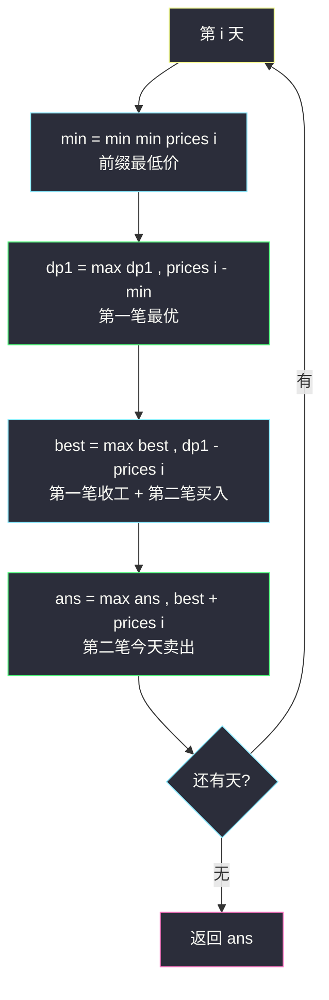
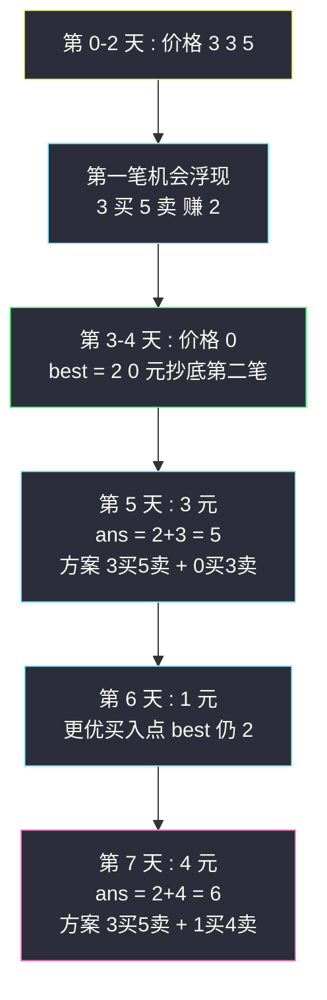

# 买卖股票的最佳时机 III（Hard：最多 2 笔交易的拆解与合并）

## 一、问题描述

给定数组 `prices`，`prices[i]` 是某支股票第 `i` 天的价格。设计算法计算你能获取的**最大利润**，你**最多可以完成 2 笔交易**（买一次卖一次算一笔）。同时只有一条规则：**必须在再次购买前出售掉之前的股票**（不能同时持有多笔）。

> 🔗 LeetCode 123：https://leetcode.cn/problems/best-time-to-buy-and-sell-stock-iii/

**示例 1**

```
输入：prices = [3,3,5,0,0,3,1,4]
输出：6
解释：第 4 天买（价 0），第 6 天卖（价 3），利润 3；第 7 天买（价 1），第 8 天卖（价 4），利润 3，共 6
```

**示例 2**

```
输入：prices = [1,2,3,4,5]
输出：4
解释：第 1 天买第 5 天卖，一笔就够了；拆两笔反而少
```

**直观理解**

股票家族（#121 单次 / #122 无限 / #309 冷冻 / #714 手续费，站内均已写题解）走到这里开始「加约束计数」：**交易次数被限制为 2 次**。课上 class082 Code03 的讲法非常漂亮：先把「恰好一次交易」的前缀最优做出来（就是 #121），再枚举**第二笔交易的买入点**——暴力枚举 O(n²)，然后观察到枚举项可以**用变量滚动掉**，一路优化到 O(1) 空间。这个「枚举 → 发现重复计算 → 变量合并」的演进链，正是左程云体系最想教的分析能力。

---

## 二、暴力解法

### 直观思路

拆成两段：**第一笔**在位置 `j` 之前完成，**第二笔**在 `j` 买入。先预处理 `dp1[i]`（0..i 内一次交易的最大利润，即 #121），再暴力枚举第二笔的买入点（对齐 class082 Code03 的 maxProfit1）：

```java
// 暴力版（对齐 class082 Code03 maxProfit1）
public static int maxProfit1(int[] prices) {
    int n = prices.length;
    // dp1[i] : 0..i 范围内一次交易的最大利润（不要求 i 卖出）
    int[] dp1 = new int[n];
    for (int i = 1, min = prices[0]; i < n; i++) {
        min = Math.min(min, prices[i]);
        dp1[i] = Math.max(dp1[i - 1], prices[i] - min);
    }
    // dp2[i] : 两笔交易且第二笔恰在 i 卖出的最大利润
    int[] dp2 = new int[n];
    int ans = 0;
    for (int i = 1; i < n; i++) {
        // 枚举第二笔的买入时机 j ≤ i
        for (int j = 0; j <= i; j++) {
            dp2[i] = Math.max(dp2[i], dp1[j] + prices[i] - prices[j]);
        }
        ans = Math.max(ans, dp2[i]);
    }
    return ans;
}
```

### 复杂度

- **时间**：`O(n²)`，n = 10^5 时超时
- **空间**：`O(n)`

### 🔴 瓶颈在哪里

内层枚举 `j` 时反复计算 `max over j≤i (dp1[j] - prices[j])`——**同一个 max 在不同 i 之间只差一项**，这就是可滚动掉的重复计算。

---

## 三、优化探索

### 3.1 可变参数分析

两笔交易拆开看，每个子问题的可变参数只有天数：

| dp 定义 | 含义 |
|---------|------|
| `dp1[i]` | 0..i 内**完成一笔**交易的最大利润（**不要求** i 卖出） |
| `best[i]` | `max over j ≤ i (dp1[j] - prices[j])`：第一笔在 j 前收工、j 天**买入**第二笔的最优本金状态 |
| `dp2[i]` | 0..i 内完成**两笔**、第二笔恰在 i 卖出的最大利润 |

### 3.2 转移方程推导（把 O(n²) 枚举写成 O(n) 递推）

**第一步（#121 的骨架）**：

```
min = 前缀最低价
dp1[i] = max(dp1[i-1], prices[i] - min)
```

**第二步（消灭内层枚举）**：暴力版内层是

```
dp2[i] = max over j ≤ i ( dp1[j] + prices[i] - prices[j] )
       = prices[i] + max over j ≤ i ( dp1[j] - prices[j] )
```

后一项只随 i **单调增加一个候选** → 用 `best` 数组滚动：

```
best[i] = max(best[i-1], dp1[i] - prices[i])
dp2[i]  = best[i] + prices[i]
```

**第三步（合并数组）**：三个数组的更新都只依赖前一天 → 压成 4 个变量 `min / dp1 / best / ans`。

### 3.3 关键问题

| 问题 | 答案 |
|------|------|
| 两笔交易能不能「共享」同一天？ | 可以：`best[i]` 用 `dp1[i]` 更新意味着第 i 天卖第一笔又买第二笔——题目允许（卖后可再买）；若不允许同天买卖，改用 `dp1[i-1]` 更新即可，本题两种写法答案相同 |
| 为什么答案在 `dp2` 上取 max 而不直接 `dp2[n-1]`？ | `dp2[i]` 强制「i 天卖出」，最优不一定在最后一天卖 |
| 只做一笔算不算两笔？ | 算：dp1[j] 允许第一笔存在、第二笔不赚钱（`best` 更新含 `dp1[i] - prices[i]`，同日买卖利润 0 的路径天然保留一笔解） |
| 上坡能否都抓？ | 那是 #122 无限次；本题限 2 次，拆段是必然思路 |
| 与 #188 什么关系？ | #188 是 k 笔的通式（站内 `best-time-to-buy-and-sell-stock-iv.md`），本题 k=2 特例；课 class082 Code04 用同样的 best 消枚举推广到 k 维 |

### 3.4 一句话核心

> **第一笔跑 #121；第二笔枚举买入点被 best 变量滚动合并：best = max(best, dp1 - price)，ans = max(ans, best + price)。**



---

## 四、代码实现

### Java（主解：O(1) 空间滚动版，对齐 class082 Code03 maxProfit4）

```java
// 买卖股票的最佳时机 III
// 最多完成 2 笔交易，再次购买前必须卖掉之前的股票，求最大利润
// 测试链接 : https://leetcode.cn/problems/best-time-to-buy-and-sell-stock-iii
// 对齐 class082 Code03_Stock3（maxProfit1 暴力 → maxProfit2 best 数组 → maxProfit4 滚动）
public class Solution {

    // 时间复杂度 O(n)，空间复杂度 O(1)
    public int maxProfit(int[] prices) {
        // dp1 : 到今天为止完成 1 笔的最大利润（不要求今天卖）
        // best : max(第一笔利润 - 买入价) : 第二笔已买入的最好本金状态
        // ans  : 完成两笔的最大利润（第二笔已卖出）
        int dp1 = 0, best = -prices[0], ans = 0;
        for (int i = 1, min = prices[0]; i < prices.length; i++) {
            min = Math.min(min, prices[i]);              // 前缀最低价
            dp1 = Math.max(dp1, prices[i] - min);        // 一笔的最优
            best = Math.max(best, dp1 - prices[i]);      // 第二笔买入的最好时机
            ans = Math.max(ans, best + prices[i]);       // 第二笔今天卖
        }
        return ans;
    }
}
```

### Java（教学版：三数组并列，对齐 class082 Code03 maxProfit2/3）

```java
// 保留 dp1 / best / dp2 三个数组，看清"枚举如何被滚动掉"
// 时间复杂度 O(n)，空间复杂度 O(n)
public class Solution {

    public int maxProfit(int[] prices) {
        int n = prices.length;
        int[] dp1 = new int[n];
        int[] best = new int[n];
        best[0] = -prices[0];
        int[] dp2 = new int[n];
        int ans = 0;
        for (int i = 1, min = prices[0]; i < n; i++) {
            min = Math.min(min, prices[i]);
            dp1[i] = Math.max(dp1[i - 1], prices[i] - min);   // 一笔 : #121 骨架
            best[i] = Math.max(best[i - 1], dp1[i] - prices[i]); // 枚举买入点被滚动
            dp2[i] = best[i] + prices[i];                     // 两笔 , 第二笔 i 卖
            ans = Math.max(ans, dp2[i]);
        }
        return ans;
    }
}
```

### Python

```python
# 主解：O(1) 空间滚动（同思路）
class Solution:
    def maxProfit(self, prices: list[int]) -> int:
        dp1, best, ans = 0, -prices[0], 0
        min_price = prices[0]
        for i in range(1, len(prices)):
            min_price = min(min_price, prices[i])
            dp1 = max(dp1, prices[i] - min_price)   # 第一笔
            best = max(best, dp1 - prices[i])        # 第二笔已买入
            ans = max(ans, best + prices[i])         # 第二笔今天卖
        return ans
```

```python
# 状态机四变量版（与 #188 k=2 特例互通，帮助向通式迁移）
class Solution:
    def maxProfit(self, prices: list[int]) -> int:
        buy1, sell1 = float('-inf'), 0
        buy2, sell2 = float('-inf'), 0
        for p in prices:
            buy1 = max(buy1, -p)           # 第一笔买入
            sell1 = max(sell1, buy1 + p)   # 第一笔卖出
            buy2 = max(buy2, sell1 - p)    # 第二笔买入
            sell2 = max(sell2, buy2 + p)   # 第二笔卖出
        return sell2
```

四变量版与课上 best 版本质相同：`sell1 = dp1`、`buy2 = best`、`sell2 = ans`、`buy1 由 min 隐含`。两版互相印证着背。

---

## 五、具体例子演示

以 `prices = [3,3,5,0,0,3,1,4]` 为例。

### 四变量逐天状态表

| 天 i | price | min | dp1（一笔最优） | best（dp1−price 最大） | ans（best+price） |
|------|-------|-----|-----------------|------------------------|-------------------|
| 0 | 3 | 3 | 0 | −3（初始） | 0 |
| 1 | 3 | 3 | 0 | max(−3, 0−3) = −3 | max(0, −3+3) = 0 |
| 2 | 5 | 3 | max(0, 5−3) = 2 | max(−3, 2−5) = −3 | max(0, −3+5) = 2 |
| 3 | 0 | 0 | 2 | max(−3, 2−0) = **2** | max(2, 2+0) = 2 |
| 4 | 0 | 0 | 2 | 2 | 2 |
| 5 | 3 | 0 | max(2, 3−0) = **3** | max(2, 3−3) = 2 | max(2, 2+3) = **5** |
| 6 | 1 | 0 | 3 | max(2, 3−1) = 2 | max(5, 2+1) = 5 |
| 7 | 4 | 0 | 3 | max(2, 3−4) = 2 | max(5, 2+4) = **6** |

最终 `ans = 6` → 返回 **6** ✓。

### 关键转移解读

- **第 3 天（price=0）**：`best` 首次变成 2——含义是「第一笔赚 2（3 元买 5 元卖），第 3 天 0 元抄底买第二笔」，本金状态 2 − 0 = 2。
- **第 5 天（price=3）**：`ans = best(2) + 3 = 5`——两笔：3→5 赚 2，0→3 赚 3，共 5。
- **第 7 天（price=4）**：`best(2) + 4 = 6`——第一笔 3→5 赚 2，第二笔 1→4 赚 3，共 **6**；注意第 7 天 `best` 的更新候选 `dp1 − price = 3 − 4 = −1 < 2`，说明「第 7 天才买第二笔」不如第 6 天买。



---

## 六、复杂度分析

| 版本 | 时间 | 空间 | 说明 |
|------|------|------|------|
| 暴力枚举买入点 | `O(n²)` | `O(n)` | class082 maxProfit1，超时 |
| best 数组版 | `O(n)` | `O(n)` | maxProfit2/3，消灭内层枚举 |
| 四变量滚动（主解） | `O(n)` | `O(1)` | maxProfit4，数组更新合并进单循环 |

---

## 七、方法对比与总结

### 股票家族全景（家族互引，站内均有题解）

| 题 | 约束 | 核心状态 | 难度 |
|----|------|---------|------|
| #121 一次交易 | ≤1 笔 | min + 单变量 | Easy |
| #122 无限次 | 不限 | 邻差正数和 | Medium |
| **#123 两次交易** | ≤2 笔 | dp1 + best + ans（本题） | Hard |
| #188 k 次交易 | ≤k 笔 | dp[k] + best[k]（通式） | Hard |
| #309 冷冻期 | 无限 + 卖后隔天 | 状态机三态 | Medium |
| #714 手续费 | 无限 + 每笔费 | 状态机两态扣费 | Medium |

**演进脉络**：#121 的 min 技巧 → #123 把「第二笔的枚举」用 best 滚动掉 → #188 把 best/dp 做成 k 维数组就是通式。课上 class082 的讲法正是这条线，先 #123 后 #188 顺理成章。

### 易错点

1. **best 初值**：`-prices[0]`（或第 0 天买第一笔又不赚），不是 0——否则第二笔买入被「白嫖」。
2. **dp2 忘了取全局 max**：`best + prices[i]` 只代表「第二笔今天卖」，最优可能更早。
3. **更新顺序**：一天内先 dp1、再 best、再 ans（同天卖一笔买一笔合法），顺序乱了会用到「未来」状态。
4. **以为必须恰好两笔**：最多两笔，一笔更优时答案取一笔（best 更新路径自动涵盖）。
5. **把 #122 的贪心搬来用**：上坡全抓需要无限次，限 2 次时必须拆段。

### 模板口诀

> **一笔跑 121，两笔 best 滚：best = max(best, dp1 − price)，ans = max(ans, best + price)。**

---

## 八、举一反三

| 题目 | 链接 | 迁移点 |
|------|------|--------|
| 188. 买卖股票的最佳时机 IV | https://leetcode.cn/problems/best-time-to-buy-and-sell-stock-iv/ | k 笔通式，best 推广成数组（站内已写题解） |
| 121. 买卖股票的最佳时机 | https://leetcode.cn/problems/best-time-to-buy-and-sell-stock/ | 第一笔的子问题原型（站内已写题解） |
| 122. 买卖股票的最佳时机 II | https://leetcode.cn/problems/best-time-to-buy-and-sell-stock-ii/ | 无限次版，对照「拆段」必要性（站内已写题解） |
| 309. 最佳买卖股票时机含冷冻期 | https://leetcode.cn/problems/best-time-to-buy-and-sell-stock-with-cooldown/ | 状态机兄弟题（站内已写题解） |
| 714. 买卖股票的最佳时机含手续费 | https://leetcode.cn/problems/best-time-to-buy-and-sell-stock-with-transaction-fee/ | 状态机 + 费用（站内已写题解） |

**迁移一句**：股票题的万能钥匙是「**枚举最后一笔交易的动作（买/卖/不动），把重复枚举用滚动变量收编**」——#123 的 best 技巧练透了，#188 只是把它数组化。
