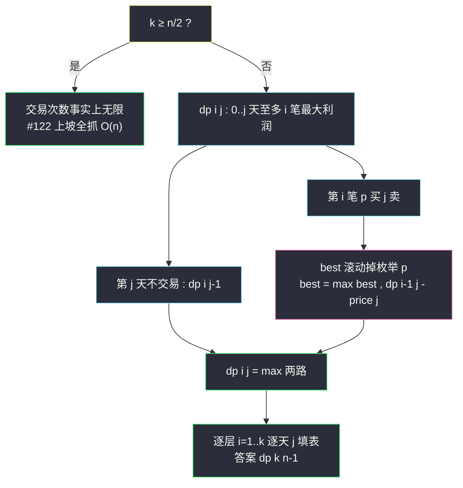
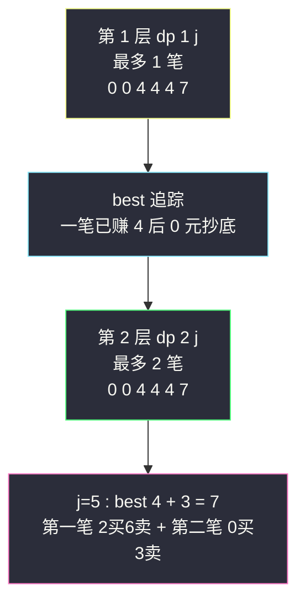

# 买卖股票的最佳时机 IV（Hard：k 笔交易通式，#123 的数组化推广）

## 一、问题描述

给你整数数组 `prices`（`prices[i]` 是第 `i` 天的股票价格）和整数 `k`，计算你能获取的最大利润。你**最多可以完成 k 笔交易**（买一次卖一次为一笔），必须在再次购买前出售掉之前的股票。

> 🔗 LeetCode 188：https://leetcode.cn/problems/best-time-to-buy-and-sell-stock-iv/

**示例 1**

```
输入：k = 2, prices = [2,4,1]
输出：2
解释：第 1 天买（价 2），第 2 天卖（价 4），利润 2
```

**示例 2**

```
输入：k = 2, prices = [3,2,6,5,0,3]
输出：7
解释：第 2 天买（价 2），第 3 天卖（价 6），利润 4；第 5 天买（价 0），第 6 天卖（价 3），利润 3
```

**直观理解**

#123（站内已写 `best-time-to-buy-and-sell-stock-iii.md`）是本题 `k=2` 的特例。把 #123 的 `best` 消枚举技巧**数组化**：`dp[i][j]` = 「恰好完成 i 笔交易、第 j 天收工」的最大利润，用 `best` 变量把内层「枚举第 i 笔在哪天买入」滚动掉，就得到 k 维通式（课上 class082 Code04 的讲法）。另有一个重要的**剪枝**：一笔有意义的交易至少要 2 天，`k ≥ n/2` 时交易次数事实上无限，直接退回 #122 的「上坡全抓」。

---

## 二、暴力解法

### 直观思路

二维 dp：`dp[i][j]` = 0..j 天内最多 i 笔的最大利润，枚举第 i 笔的买入时机 p（对齐 class082 Code04 maxProfit1）：

```java
// 暴力版（对齐 class082 Code04 maxProfit1）
public static int maxProfit1(int k, int[] prices) {
    int n = prices.length;
    if (k >= n / 2) {
        // 剪枝 : k ≥ n/2 时交易次数事实上无限，退回 #122
        int ans = 0;
        for (int i = 1; i < n; i++) {
            ans += Math.max(prices[i] - prices[i - 1], 0); // 上坡全抓
        }
        return ans;
    }
    // dp[i][j] : 0..j 天内最多 i 笔的最大利润
    int[][] dp = new int[k + 1][n];
    for (int i = 1; i <= k; i++) {
        for (int j = 1; j < n; j++) {
            dp[i][j] = dp[i][j - 1]; // 第 j 天不交易
            for (int p = 0; p < j; p++) {
                // 第 i 笔 : p 天买 j 天卖，前面最多 i-1 笔
                dp[i][j] = Math.max(dp[i][j], dp[i - 1][p] + prices[j] - prices[p]);
            }
        }
    }
    return dp[k][n - 1];
}
```

### 复杂度

- **时间**：`O(k * n²)`，n = 1000, k = 100 时 10^8 边缘超时
- **空间**：`O(k * n)`

### 🔴 瓶颈在哪里

内层枚举 `p` 反复计算 `max over p<j (dp[i-1][p] - prices[p])`——同一个 max 只随 j **单调增加一个候选**，可滚动（与 #123 的 best 完全同理）。

---

## 三、优化探索

### 3.1 可变参数分析（对齐 class082 Code04）

两个可变参数 `(交易笔数 i, 天数 j)` → 二维表：

| dp 定义 | 含义 |
|---------|------|
| `dp[i][j]` | 0..j 天内完成**至多 i 笔**交易的最大利润 |

### 3.2 转移方程推导（best 消枚举）

按「第 j 天是否有交易发生」分类：

```
dp[i][j] = dp[i][j-1]                                   # 第 j 天不交易
dp[i][j] = max over p < j ( dp[i-1][p] + prices[j] - prices[p] )   # 第 i 笔 p 买 j 卖
```

把第二式改写：

```
dp[i][j] = prices[j] + max over p < j ( dp[i-1][p] - prices[p] )
                     └────────── best[i]（随 j 滚动的变量） ──────────┘
```

于是内层枚举消失（对齐 maxProfit2）：

```
best = max(best, dp[i-1][j] - prices[j])   # 逐天维护
dp[i][j] = max(dp[i][j-1], best + prices[j])
```

### 3.3 k ≥ n/2 剪枝的原理

一笔交易需要**至少两个不同的日子**（买一天卖一天）。n 天里互不重叠的有意义交易最多 `⌊n/2⌋` 笔——再多给了也用不掉。此时交易次数形同无限，直接 #122 的「邻差正数和」。这个剪枝同时把 k 很大时的内存（k 维数组）也救回来了。

### 3.4 关键问题

| 问题 | 答案 |
|------|------|
| best 的初值？ | 处理第 i 层时 `best = dp[i-1][0] - prices[0]`（第 0 天买第 i 笔） |
| 同一天卖一笔又买一笔合法吗？ | 合法（卖后可再买）；转移里 `best` 更新用 `dp[i-1][j]`，允许同天衔接，与 #123 一致 |
| 「至多 i 笔」还是「恰好 i 笔」？ | 定义为至多：`dp[i][j] ≥ dp[i-1][j]` 天然成立（少做不亏），不需要恰好 i 笔的额外分支 |
| 能滚动掉 i 维吗？ | 能（课上 maxProfit3）：`dp` 压成一维（天数），best 每层重置，`tmp` 备份被覆盖前的 dp[j] |
| 与 #123 的关系？ | #123 是 k=2：`dp1 = dp[1][*]`、`best/ans = dp[2][*]` 的滚动变量版，完全同一骨架 |

### 3.5 一句话核心

> **dp[i][j] = max(dp[i][j-1], best + prices[j])，best = max(best, dp[i-1][j] − prices[j])；k ≥ n/2 直接上坡全抓。**



---

## 四、代码实现

### Java（主解：best 消枚举二维表，对齐 class082 Code04 maxProfit2）

```java
// 买卖股票的最佳时机 IV
// 最多完成 k 笔交易，再次购买前必须卖掉之前的股票，求最大利润
// 测试链接 : https://leetcode.cn/problems/best-time-to-buy-and-sell-stock-iv/
// 对齐 class082 Code04_Stock4
public class Solution {

    // 时间复杂度 O(k*n)，空间复杂度 O(k*n)
    public int maxProfit(int k, int[] prices) {
        int n = prices.length;
        if (k >= n / 2) {
            // 剪枝 : 交易次数事实上无限，退回 #122 上坡全抓
            int ans = 0;
            for (int i = 1; i < n; i++) {
                ans += Math.max(prices[i] - prices[i - 1], 0);
            }
            return ans;
        }
        // dp[i][j] : 0..j 天内至多 i 笔交易的最大利润
        int[][] dp = new int[k + 1][n];
        for (int i = 1, best; i <= k; i++) {
            // best : max(dp[i-1][p] - prices[p])，p ≤ 当前 j（枚举被滚动掉）
            best = dp[i - 1][0] - prices[0];
            for (int j = 1; j < n; j++) {
                // 依赖方向 : 本层 dp[i][j-1] + 上一层的 dp[i-1][p]（经 best）
                dp[i][j] = Math.max(dp[i][j - 1], best + prices[j]);
                best = Math.max(best, dp[i - 1][j] - prices[j]);
            }
        }
        return dp[k][n - 1];
    }
}
```

### Java（进阶：空间压缩，对齐 class082 Code04 maxProfit3）

```java
// dp 的 i 维滚动掉 : dp[j] 表示当前层，tmp 备份被覆盖前的旧值（上一层）
// 时间复杂度 O(k*n)，空间复杂度 O(n)
public class Solution {

    public int maxProfit(int k, int[] prices) {
        int n = prices.length;
        if (k >= n / 2) {
            int ans = 0;
            for (int i = 1; i < n; i++) {
                ans += Math.max(prices[i] - prices[i - 1], 0);
            }
            return ans;
        }
        int[] dp = new int[n];
        for (int i = 1, best, tmp; i <= k; i++) {
            best = dp[0] - prices[0];
            for (int j = 1; j < n; j++) {
                tmp = dp[j];                                // 旧值 = 上一层 dp[i-1][j]
                dp[j] = Math.max(dp[j - 1], best + prices[j]);
                best = Math.max(best, tmp - prices[j]);     // 用旧值更新 best
            }
        }
        return dp[n - 1];
    }
}
```

### Python

```python
# 主解：best 消枚举 + 二维表（同思路）
class Solution:
    def maxProfit(self, k: int, prices: list[int]) -> int:
        n = len(prices)
        if k >= n // 2:
            # 剪枝 : 交易次数事实上无限
            return sum(max(prices[i] - prices[i - 1], 0) for i in range(1, n))
        # dp[i][j] : 0..j 天至多 i 笔的最大利润
        dp = [[0] * n for _ in range(k + 1)]
        for i in range(1, k + 1):
            best = dp[i - 1][0] - prices[0]
            for j in range(1, n):
                dp[i][j] = max(dp[i][j - 1], best + prices[j])
                best = max(best, dp[i - 1][j] - prices[j])
        return dp[k][n - 1]
```

```python
# 状态机 O(k) 空间版（buy/sell 数组，向 #309/#714 状态机家族迁移）
class Solution:
    def maxProfit(self, k: int, prices: list[int]) -> int:
        n = len(prices)
        if k >= n // 2:
            return sum(max(prices[i] - prices[i - 1], 0) for i in range(1, n))
        buy = [float('-inf')] * (k + 1)   # buy[i] : 第 i 笔已买入的最大现金
        sell = [0] * (k + 1)              # sell[i] : 第 i 笔已卖出的最大现金
        for p in prices:
            for i in range(1, k + 1):
                buy[i] = max(buy[i], sell[i - 1] - p)   # 买第 i 笔
                sell[i] = max(sell[i], buy[i] + p)      # 卖第 i 笔
        return sell[k]
```

---

## 五、具体例子演示

以 `k = 2`、`prices = [3,2,6,5,0,3]` 为例（n = 6，`k=2 < n/2=3`，走 DP）。

### dp[1][j] 层（至多 1 笔，best 滚动）

`best` 初值 = `dp[0][0] − prices[0] = 0 − 3 = −3`：

| j | price | dp[1][j-1] | best（更新前） | best + price | dp[1][j] | 随后 best 更新 |
|---|-------|-----------|---------------|--------------|----------|----------------|
| 1 | 2 | 0 | −3 | −1 | **0** | max(−3, 0−2) = −2 |
| 2 | 6 | 0 | −2 | 4 | **4** | max(−2, 4−6) = −2 |
| 3 | 5 | 4 | −2 | 3 | **4** | max(−2, 4−5) = −1 |
| 4 | 0 | 4 | −1 | −1 | **4** | max(−1, 4−0) = **4** |
| 5 | 3 | 4 | 4 | 7 | **7** | max(4, 7−3) = 4 |

解读：`best=−2` 表示「1 笔交易已结束、第 2 元抄底买入」；j=4 时 `best=4` 意味着「一笔赚 4（2 买 6 卖），第 4 天 0 元再买」。

### dp[2][j] 层（至多 2 笔）

`best` 初值 = `dp[1][0] − prices[0] = 0 − 3 = −3`：

| j | price | dp[2][j-1] | best（更新前） | best + price | dp[2][j] | 随后 best 更新 |
|---|-------|-----------|---------------|--------------|----------|----------------|
| 1 | 2 | 0 | −3 | −1 | **0** | max(−3, dp[1][1]−2=−2) = −2 |
| 2 | 6 | 0 | −2 | 4 | **4** | max(−2, dp[1][2]−6=−2) = −2 |
| 3 | 5 | 4 | −2 | 3 | **4** | max(−2, dp[1][3]−5=−1) = −1 |
| 4 | 0 | 4 | −1 | −1 | **4** | max(−1, dp[1][4]−0=**4**) = **4** |
| 5 | 3 | 4 | 4 | 7 | **7** | max(4, dp[1][5]−3=4) = 4 |

最终 `dp[2][5] = 7` → 返回 **7** ✓（2 买 6 卖赚 4，0 买 3 卖赚 3）。

### 逐层演进的直觉



**注意**：`k=2` 层与 `k=1` 层终值都是 7——因为本题的最优解两笔就够了，第 2 层在前 4 天退化成与第 1 层相同（第二笔没机会赚钱时 dp 自动保持「少做不亏」）。

---

## 六、复杂度分析

| 版本 | 时间 | 空间 | 说明 |
|------|------|------|------|
| 暴力枚举买入点 | `O(k*n²)` | `O(k*n)` | class082 maxProfit1，可能超时 |
| best 消枚举（主解） | `O(k*n)` | `O(k*n)` | maxProfit2 |
| 空间压缩 | `O(k*n)` | `O(n)` | maxProfit3：dp 压一维 + tmp 备份 |
| 状态机版 | `O(n*k)` | `O(k)` | buy/sell 数组 |

剪枝后 `k < n/2 ≤ 500`，`n ≤ 1000`，主解最多 5×10^5 次转移，稳过。

---

## 七、方法对比与总结

### 股票家族终极图（家族互引，站内均有题解）

| 题 | 约束 | 解法骨架 | 与本题关系 |
|----|------|---------|-----------|
| #121 一次 | ≤1 | min + 单变量 | 本题 k=1 层 |
| #122 无限 | 不限 | 上坡全抓 | 本题 k ≥ n/2 的剪枝归宿 |
| **#123 两次** | ≤2 | dp1/best/ans 三变量 | 本题 k=2 的滚动变量版（站内已写） |
| **#188 k 次** | ≤k | dp[i][j] + best 数组 | 通式 |
| #309 冷冻 | 不限 + 冷冻 | 状态机三态 | 换一种约束维度 |
| #714 手续费 | 不限 + 费 | 状态机两态扣费 | 同上 |

**一句话**：#123 的 best 技巧「数组化」就是 #188；反过来 #188 把 k 固定成 2、变量展开就是 #123。两篇题解对照着看，best 的含义（**第 i 笔已买入时的最优现金状态**）会彻底想通。

### 易错点

1. **忘了 k ≥ n/2 剪枝**：k 到 10^9 时开数组直接爆内存。
2. **best 初值用 dp[i][0]**：必须是 `dp[i-1][0] - prices[0]`（上一层的值），用本层会提前自引用。
3. **空间压缩时 best 用新值更新**：必须先 `tmp = dp[j]` 备份再覆盖，best 更新用 `tmp`（上一层旧值）。
4. **dp[i][j] 与 dp[i-1][p] 的层用混**：best 累积的是**上一层**（i−1 笔）的信息，别把本层 dp 也喂进去。
5. **以为要恰好 k 笔**：至多 k 笔；「少做不亏」由 `dp[i][j] ≥ dp[i][j-1]` 与初值 0 保证。

### 模板口诀

> **k 大退 122 上坡；k 小两层表：不交易抄前格，要交易 best 加今价。**

---

## 八、举一反三

| 题目 | 链接 | 迁移点 |
|------|------|--------|
| 123. 买卖股票的最佳时机 III | https://leetcode.cn/problems/best-time-to-buy-and-sell-stock-iii/ | k=2 特例，best 未数组化（站内已写题解） |
| 121. 买卖股票的最佳时机 | https://leetcode.cn/problems/best-time-to-buy-and-sell-stock/ | k=1 特例（站内已写题解） |
| 122. 买卖股票的最佳时机 II | https://leetcode.cn/problems/best-time-to-buy-and-sell-stock-ii/ | k 无限版，也是本题剪枝的归宿（站内已写题解） |
| 714. 买卖股票的最佳时机含手续费 | https://leetcode.cn/problems/best-time-to-buy-and-sell-stock-with-transaction-fee/ | 卖出时扣 fee，叠加到状态机（站内已写题解） |
| 309. 最佳买卖股票时机含冷冻期 | https://leetcode.cn/problems/best-time-to-buy-and-sell-stock-with-cooldown/ | 买入受限（隔天），约束换轴（站内已写题解） |

**迁移一句**：股票题的通式心法是「**枚举第 i 笔交易的买点 p，用 best 把 max 滚动掉**」；约束怎么加（次数 k / 冷冻 / 手续费），就往转移里怎么缝——#188 学透，全家族通杀。
