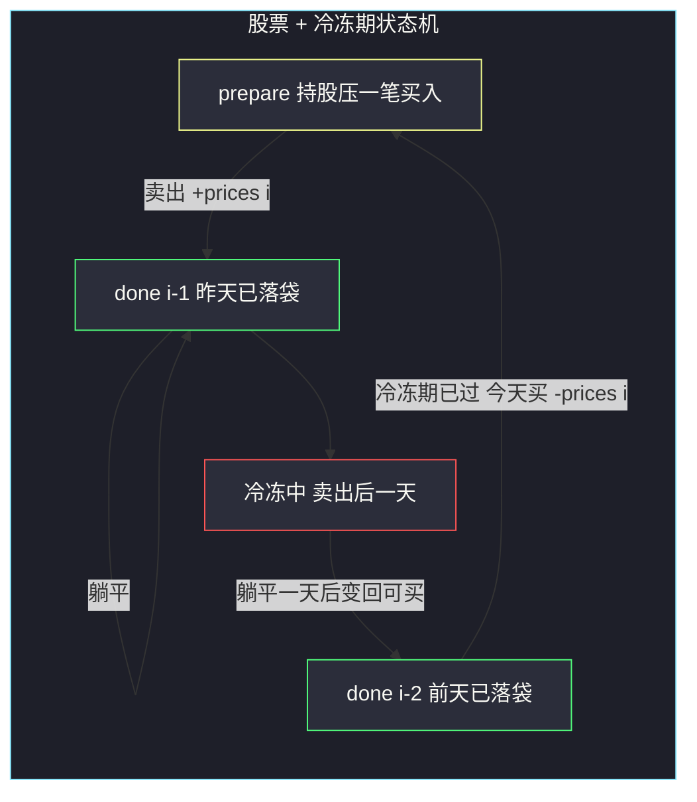

# 最佳买卖股票时机含冷冻期（状态机：卖出后隔一天才能买）

## 一、问题描述

给定一个整数数组 `prices`，`prices[i]` 表示第 `i` 天的股票价格，设计算法计算最大利润。约束：

- 可以**无限次**完成交易（多次买卖一支股票）
- **卖出股票后，无法在第二天买入股票**（冷冻期为 1 天）
- 不能同时参与多笔交易（再次购买前必须出售之前的股票）

> 🔗 LeetCode 309：https://leetcode.cn/problems/best-time-to-buy-and-sell-stock-with-cooldown/

**示例 1**

```
输入：prices = [1, 2, 3, 0, 2]
输出：3
解释：第 1 天结束买入（价格 1），第 2 天结束卖出（价格 2），收益 1；
     第 3 天是冷冻期，第 4 天结束再买入（价格 0），第 5 天结束卖出（价格 2），收益 2。
     总收益 1 + 2 = 3。
```

**示例 2**

```
输入：prices = [1]
输出：0
解释：只有一天，无法完成交易。
```

**直观理解**

在 [#122 无限次交易](https://leetcode.cn/problems/best-time-to-buy-and-sell-stock-ii/)（站内本批题解）的基础上，加了一条「**卖出后强制冷静一天**」。这条规则直接掐断了「同一天卖+买」「连续抄底」的操作，让贪心（收所有正差分）失效——因为切分交易要付出「错过一天行情」的代价。于是回到**状态机 DP**：把冷冻期写成转移方程里的一步跨日依赖。

> 课源码出处：class082 Code06_Stack6.java（买卖股票的最佳时机含冷冻期；文件名 Stack 为 Stock 笔误，实际是股票课）。

---

## 二、暴力解法（入门）

### 直观思路

从左到右模拟每一天，用递归枚举「今天做什么」。每天的身份有三种：**不持股且可买**、**持股**、**不持股但冷冻中**：

```java
// 含冷冻期：暴力递归枚举每天决定
public static int maxProfit0(int[] prices) {
    return f(prices, 0, 0); // status: 0 可买, 1 持股, 2 冷冻
}

// 返回：第 i 天开始、状态 status 下，往后能获得的最大利润
public static int f(int[] prices, int i, int status) {
    if (i == prices.length) {
        return 0;
    }
    // 决定 1：今天什么都不做
    int ans = f(prices, i + 1, status);
    if (status == 0) {
        // 决定 2：今天买入，变成持股
        ans = Math.max(ans, f(prices, i + 1, 1) - prices[i]);
    } else if (status == 1) {
        // 决定 2：今天卖出，明天进入冷冻
        ans = Math.max(ans, f(prices, i + 1, 2) + prices[i]);
    }
    // status == 2（冷冻）只有「躺平」一个决定，已包含在决定 1
    return ans;
}
```

### 复杂度

- **时间**：`O(2ⁿ)`，每个可决策日二叉展开
- **空间**：`O(n)`，递归栈

### 🔴 瓶颈在哪里

状态 `(i, status)` 只有 `3n` 种组合，递归树却指数展开——**重叠子问题**。可变参数是 `i` 和 `status` 两个，就该开一张 `n × 3`（课上合并成 `n × 2`，见下）的表。

---

## 三、优化探索（核心章节）

### 3.1 观察特征

| 特征 | 说明 |
|------|------|
| 状态划分 | 课上用两个语义把三种身份合并：**done（已落袋）** 与 **prepare（收益已锁定、但还压着一笔买入）** |
| 冷冻期的位置 | 只影响「买」这个动作：第 `i` 天想买，前提是上一次卖出最晚发生在第 `i-2` 天 |
| 跨两天的依赖 | `prepare[i]` 依赖 `done[i-2]`（不是 `i-1`）——这是冷冻期的全部数学表达 |
| 无交易次数限制 | 与 #122 一样不需要交易数维度 |

### 3.2 状态定义与转移（对齐 class082 Code06）

```
done[i]    : 0..i 天范围上，无限次交易 + 冷冻期，能获得的最大收益（手里无股，已落袋）
prepare[i] : 0..i 天范围上，无限次交易 + 冷冻期，获得收益的同时一定还压着一笔买入
             （"净值"最优的持股状态，含之前所有已落袋收益 - 当前买入价）

转移：
done[i]    = max(done[i-1],           今天不卖，落袋收益不变
                 prepare[i-1] + prices[i])  今天卖出：持股净值 + 卖价
prepare[i] = max(prepare[i-1],        今天不买，继续压着
                 done[i-2] - prices[i])     今天买入：注意是 done[i-2]！
                                      ↑ 冷冻期：昨天刚卖的话今天不能买，
                                        上一次卖出最晚是前天（i-2）
初始（课上从 i=1 起跑）：
prepare[1] = max(-prices[0], -prices[1])
done[1]    = max(0, prices[1] - prices[0])
done[0]    = 0（只有一天无法交易，供 i=2 时转移使用）
答案 = done[n-1]
```



**冷冻期为什么是 `done[i-2]`？** 若昨天（`i-1`）刚卖出，今天 `i` 处于冷冻，买不了；能买到今天的方案里，上一次卖出必须 ≤ `i-2`。而 `done` 本身单调不减（不交易收益不变），所以取「前天为止的落袋最优」`done[i-2]` 恰好覆盖所有合法情形。

### 3.3 关键推导问题

| 问题 | 答案 |
|------|------|
| `prepare` 的「压着一笔买入」是什么意思？ | 它记录的是**净值**：之前的落袋收益减当前持股成本。卖出时 `prepare + prices[i]` 就是全程累计收益 |
| 为什么初始从 `i=1` 开始？ | 前 1 天（下标 0、1）只有「第 0 天买 / 第 1 天买 / 第 1 天卖」几种有限情形，直接枚举写死；`i ≥ 2` 走通用转移 |
| `done[0]` 没赋值？ | 语义上 `done[0] = 0`（单日无法完成交易）；`i = 2` 转移 `prepare[2]` 时会用到它 |
| 为什么贪心失效？ | 贪心要求在谷底无缝接新交易；冷冻期强插一天，错过行情的代价可能超过收益，必须全局权衡 |
| 空间压缩要几个变量？ | `prepare`（i-1）、`done1`（i-1）、`done2`（i-2）三个变量，课上 maxProfit2 即此 |

### 3.4 一句话核心

> **两状态 done/prepare 逐天滚，唯一的坑：买入转移看 `done[i-2]`——冷冻一天，卖出跨两天。**

---

## 四、代码实现详解

### Java（主解：课上 maxProfit1，显式 prepare/done 两张表）

```java
// 买卖股票的最佳时机含冷冻期
// 无限次交易，但卖出股票后第二天无法买入（冷冻期 1 天）
// 测试链接 : https://leetcode.cn/problems/best-time-to-buy-and-sell-stock-with-cooldown/
// 对齐 class082 Code06_Stack6 的 maxProfit1：prepare/done 双表
public class Solution {

    // prepare[i] : 0..i 范围上，无限次交易 + 冷冻期，收益已锁定但压着一笔买入的最优净值
    // done[i]    : 0..i 范围上，无限次交易 + 冷冻期，能获得的最大落袋收益
    // 转移依赖：done[i] ← prepare[i-1]；prepare[i] ← prepare[i-1] 和 done[i-2]（冷冻跨日）
    // 时间复杂度 O(n)，空间复杂度 O(n)
    public static int maxProfit(int[] prices) {
        int n = prices.length;
        if (n < 2) {
            return 0;
        }
        int[] prepare = new int[n];
        int[] done = new int[n];
        prepare[1] = Math.max(-prices[0], -prices[1]);
        done[1] = Math.max(0, prices[1] - prices[0]);
        for (int i = 2; i < n; i++) {
            done[i] = Math.max(done[i - 1], prepare[i - 1] + prices[i]); // 今天卖 或 不动
            prepare[i] = Math.max(prepare[i - 1], done[i - 2] - prices[i]); // 冷冻：买只看 done[i-2]
        }
        return done[n - 1];
    }
}
```

### Java（空间压缩版：课上 maxProfit2，三变量滚动）

```java
// 只是把显式表做了变量滚动更新，并没有新的东西（class082 Code06 原话）
// 时间复杂度 O(n)，空间复杂度 O(1)
public class Solution {

    public static int maxProfit(int[] prices) {
        int n = prices.length;
        if (n < 2) {
            return 0;
        }
        int prepare = Math.max(-prices[0], -prices[1]); // prepare[i-1]
        int done2 = 0;                                   // done[i-2]，单日无交易，为 0
        int done1 = Math.max(0, prices[1] - prices[0]);  // done[i-1]
        for (int i = 2, curDone; i < n; i++) {
            curDone = Math.max(done1, prepare + prices[i]);
            prepare = Math.max(prepare, done2 - prices[i]); // 冷冻期：看 done[i-2]
            done2 = done1;
            done1 = curDone;
        }
        return done1;
    }
}
```

> 滚动顺序有讲究：先用旧 `prepare` 算出 `curDone`，再更新 `prepare`（此时用的 `done2` 还是旧值），最后挪 `done2 = done1; done1 = curDone`。三步不能乱。

### Python（同思路）

```python
# 含冷冻期：prepare/done 双表，O(n) / O(n)
class Solution:
    def maxProfit(self, prices: list[int]) -> int:
        n = len(prices)
        if n < 2:
            return 0
        prepare = [0] * n
        done = [0] * n
        prepare[1] = max(-prices[0], -prices[1])
        done[1] = max(0, prices[1] - prices[0])
        for i in range(2, n):
            done[i] = max(done[i - 1], prepare[i - 1] + prices[i])   # 卖 或 不动
            prepare[i] = max(prepare[i - 1], done[i - 2] - prices[i]) # 买只看前天落袋
        return done[n - 1]
```

```python
# 空间压缩版：三变量滚动，O(n) / O(1)
class Solution:
    def maxProfit(self, prices: list[int]) -> int:
        n = len(prices)
        if n < 2:
            return 0
        prepare = max(-prices[0], -prices[1])
        done2, done1 = 0, max(0, prices[1] - prices[0])
        for i in range(2, n):
            cur_done = max(done1, prepare + prices[i])
            prepare = max(prepare, done2 - prices[i])
            done2, done1 = done1, cur_done
        return done1
```

---

## 五、具体例子演示

以 `prices = [1, 2, 3, 0, 2]`（`n = 5`）为例，逐天填表，每格标出转移来源。

**初始化（i = 0、1）：**

| i | prices[i] | prepare[i] | done[i] | 说明 |
|---|-----------|------------|---------|------|
| 0 | 1 | （不启用） | 0 | 单日无法交易，done[0]=0 供后续冷冻转移用 |
| 1 | 2 | max(-1, -2) = **-1** | max(0, 2-1) = **1** | 第 0 天或第 1 天买；第 0 买第 1 卖赚 1 |

**逐天推进（i = 2..4）：**

| i | prices[i] | done[i] 转移 | done[i] | prepare[i] 转移 | prepare[i] |
|---|-----------|--------------|---------|-----------------|------------|
| 2 | 3 | max(done[1]=1, prepare[1]+3 = **2**) | **2** | max(prepare[1]=-1, done[0]-3 = -3) | **-1** |
| 3 | 0 | max(done[2]=**2**, prepare[2]+0 = -1) | **2** | max(prepare[2]=-1, done[1]-0 = **1**) | **1** |
| 4 | 2 | max(done[3]=2, prepare[3]+2 = **3**) | **3** | max(prepare[3]=1, done[2]-2 = 0) | **1** |

返回 `done[4] = 3` ✓。

**两条转移链读出来：**

- `done[4] = 3` 的来源：`prepare[3] + prices[4]`，即「第 3 天（价格 0）压着买入，第 4 天（价格 2）卖出」；而 `prepare[3] = 1` 来自 `done[1] - prices[3]`——`done[1] = 1` 正是「第 0 天买 1，第 1 天卖 2」的落袋收益。**注意这里买入用的是 `done[1]`（前天）而不是 `done[2]`（昨天）**——因为第 2 天卖出的话第 3 天是冷冻期，买不进；全程交易序列 `买(1) → 卖(2) → 冷冻 → 买(0) → 卖(2)`，收益 `1 + 2 = 3`，与示例解释一致。
- `done[2] = 2` 一路躺平到 `done[4]` 的分支（只做一笔「1 买 3 卖」）被 `max` 淘汰。

**反例对照（贪心为什么错）**：若按 #122 贪心收所有正差分：+1（1→2）、+1（2→3）、+2（0→2）共 4。但「第 2 天卖出（价 3）」后第 3 天冷冻（价 0）不能买，错过最低点；真实最优只有 3。冷冻期的代价在这里现形。

---

## 六、复杂度分析

| 版本 | 时间 | 空间 | 说明 |
|------|------|------|------|
| 暴力递归 | `O(2ⁿ)` | `O(n)` | 每个可决策日二叉展开 |
| prepare/done 双表（主解） | `O(n)` | `O(n)` | 显式两张一维表 |
| 三变量滚动 | `O(n)` | `O(1)` | prepare、done1、done2 |

---

## 七、方法对比与总结

### 股票家族状态机对照

| 题目 | 状态 | 卖出转移 | 买入转移 | 备注 |
|------|------|----------|----------|------|
| #121 一笔 | free/hold | hold + p | `-p`（全新开局） | min 压缩 |
| #122 无限 | free/hold | hold + p | free - p | 贪心一行 |
| **#309 冷冻** | done/prepare | prepare[i-1] + p | **done[i-2] - p** | 依赖跨两天 |
| #714 手续费 | done/prepare | prepare + p | done - p - fee | 买入扣费 |

### 易错点

1. **买入写成 `done[i-1] - prices[i]`**：漏掉冷冻期，答案偏大（如示例会算出 4）。冷冻的全部表达就是这一处 `i-2`。
2. **滚动更新顺序**：`curDone` 先算，`prepare` 后更新，`done2/done1` 最后挪——顺序乱了会串档（用到「今天刚算的值」）。
3. **初始只写 `i=1` 忘了 `done[0]=0`**：显式表里 `done` 数组默认 0 恰好对；手写滚动时 `done2 = 0` 别漏。
4. **`n < 2` 忘判**：单元素数组没有交易可言，直接返回 0（课上代码开头 `if (n < 2) return 0;`）。
5. **把 prepare 当「持股收益」直接返回**：它是**净值**（含未卖出的买入），答案永远是 `done`。

### 模板口诀

> **done 落袋 prepare 压仓，卖看前天买看前前天；三个变量滚一遍，冷冻全在 i-2。**

---

## 八、举一反三

| 题目 | 链接 | 迁移点 |
|------|------|--------|
| 122. 买卖股票的最佳时机 II（站内本批题解） | https://leetcode.cn/problems/best-time-to-buy-and-sell-stock-ii/ | 无冷冻的无限次版，贪心一行（本题贪心失效的对照组） |
| 714. 买卖股票的最佳时机含手续费（站内本批题解） | https://leetcode.cn/problems/best-time-to-buy-and-sell-stock-with-transaction-fee/ | 另一种「拆分交易有代价」：买入边加边权 fee，class082 Code05 |
| 121. 买卖股票的最佳时机（站内本批题解） | https://leetcode.cn/problems/best-time-to-buy-and-sell-stock/ | 状态机最简版，class082 Code01 |
| 123. 买卖股票的最佳时机 III | https://leetcode.cn/problems/best-time-to-buy-and-sell-stock-iii/ | 状态机加「第几笔」维度，class082 Code03（下一批题解） |
| 714 与 309 的合体变体 | https://leetcode.cn/problems/best-time-to-buy-and-sell-stock-with-transaction-fee/ | 两个约束叠加时转移式逐项叠加即可 |

**迁移一句**：股票状态机的通用改法就三类——**改依赖跨度**（冷冻期：`i-1` 变 `i-2`）、**加边权**（手续费：买入边 `-fee`）、**加状态维度**（限 k 次：多一维交易数）。#309 是「改依赖跨度」的唯一代表，认清它，后面的题都是换零件。
