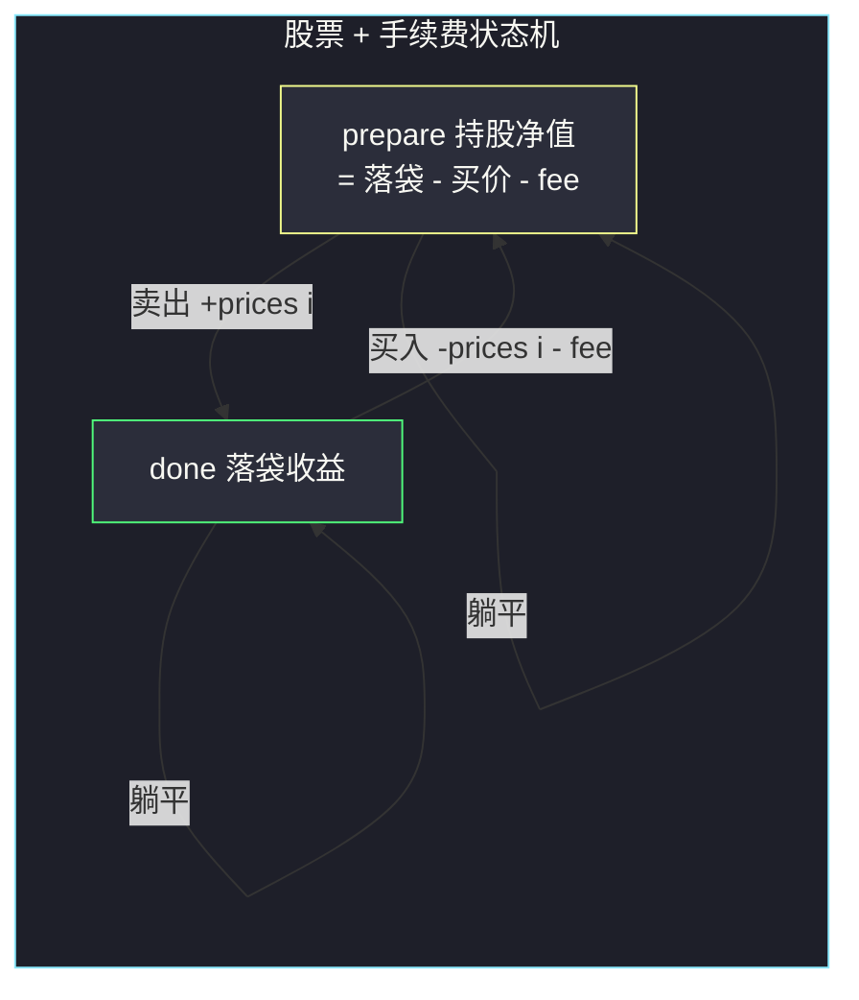

# 买卖股票的最佳时机含手续费（状态机：买入边加一笔费用）

## 一、问题描述

给定一个整数数组 `prices`，`prices[i]` 表示第 `i` 天的股票价格；整数 `fee` 代表交易股票的手续费。你可以**无限次**完成交易，但**每笔交易（一次买入 + 一次卖出）需要支付一次手续费**；任何时候最多持有一股，卖出后才能再买。返回能获得的最大利润。

> 🔗 LeetCode 714：https://leetcode.cn/problems/best-time-to-buy-and-sell-stock-with-transaction-fee/

**示例 1**

```
输入：prices = [1, 3, 2, 8, 4, 9], fee = 2
输出：8
解释：第 0 天买（价 1）第 3 天卖（价 8），毛利 7，扣手续费 2，净赚 5；
     第 4 天买（价 4）第 5 天卖（价 9），毛利 5，扣手续费 2，净赚 3。
     总利润 5 + 3 = 8。
```

**示例 2**

```
输入：prices = [1, 3, 7, 5, 10, 3], fee = 3
输出：6
解释：第 2 天买（价 7）第 4 天卖（价 10），毛利 3，扣 3，净赚 0……更优解：
     第 0 天买（价 1）第 4 天卖（价 10），毛利 9 扣 3 净赚 6。总利润 6。
```

**直观理解**

在 [#122 无限次交易](https://leetcode.cn/problems/best-time-to-buy-and-sell-stock-ii/)（站内本批题解）上加一笔「每笔交易固定手续费」。这直接让贪心失效：把交易切得越碎，交的手续费越多——示例 2 里「分段收上坡」会把 9 的毛利拆碎交给手续费。解法回到状态机：把 `fee` 作为**买入边的边权**写进转移方程即可。

> 课源码出处：class082 Code05_Stack5.java（买卖股票的最佳时机含手续费；文件名 Stack 为 Stock 笔误）。

---

## 二、暴力解法（入门）

### 直观思路

与 #122、#309 相同的递归骨架：枚举每天的决定，只是「买入」这个动作要多付一笔 `fee`：

```java
// 含手续费：暴力递归枚举每天决定
public static int maxProfit0(int[] prices, int fee) {
    return f(prices, fee, 0, false);
}

// 返回：第 i 天开始、状态 status（false 不持有 / true 持有）下，往后最大利润
public static int f(int[] prices, int fee, int i, boolean status) {
    if (i == prices.length) {
        return 0;
    }
    // 决定 1：今天什么都不做
    int ans = f(prices, fee, i + 1, status);
    if (!status) {
        // 决定 2：今天买入，手续费一并付掉
        ans = Math.max(ans, f(prices, fee, i + 1, true) - prices[i] - fee);
    } else {
        // 决定 2：今天卖出
        ans = Math.max(ans, f(prices, fee, i + 1, false) + prices[i]);
    }
    return ans;
}
```

### 复杂度

- **时间**：`O(2ⁿ)`
- **空间**：`O(n)`，递归栈

### 🔴 瓶颈在哪里

状态 `(i, status)` 只有 `2n` 种，递归树却指数展开。可变参数法：**几个可变参数就是几维表**——两个参数（`i`、是否持股），开 `n × 2` 的表。

---

## 三、优化探索（核心章节）

### 3.1 观察特征

| 特征 | 说明 |
|------|------|
| 状态划分 | 与 #309 相同的课上两状态：**done（落袋）** 与 **prepare（压着一笔买入的净值）** |
| 手续费的位置 | 只在「买入」发生时扣一次（卖出边不加权），一笔交易恰好扣一次 |
| 无冷冻依赖 | 买入看 `done[i-1]` 即可（课上滚动代码甚至允许同日卖+买，见 3.3） |
| 无交易次数限制 | 不需要交易数维度 |

### 3.2 状态定义与转移（对齐 class082 Code05）

```
done    : 交易次数无限制情况下，0..i 天能获得的最大落袋收益
prepare : 交易次数无限制情况下，获得收益的同时一定要扣掉一次购买和手续费之后
          最好的"持股净值"（= 已落袋收益 - 当前买入价 - fee）

逐天滚动转移：
done    = max(done,        今天不卖，落袋不动
              prepare + prices[i])   今天卖出：持股净值 + 卖价
prepare = max(prepare,     今天不买，继续压着
              done - prices[i] - fee)  今天买入：扣买入价和手续费
初始：prepare = -prices[0] - fee, done = 0
答案 = done（最后一天持股没有意义）
```

`fee` 的全部影响：**买入边的边权** `- fee`。它让「频繁开新仓」自动变贵——状态机不需要任何额外分支。



### 3.3 关键推导问题

| 问题 | 答案 |
|------|------|
| 为什么 fee 记在买入边？ | 一笔交易「买+卖」只该扣一次；记在买入边天然保证「开新仓才交钱」。记在卖出边也等价，二选一即可，别两边都扣 |
| 课上滚动代码 `prepare` 用的是**新** `done`，同日卖+买合法吗？ | 无冷冻期时合法（当天卖旧买新）。但该路径要求「当天价 - 当天价 > fee」才有利，恒为 `-fee < 0`，**永不优于不动**——所以先更新 `done` 再用它更新 `prepare` 不会改变答案，代码反而更短 |
| 贪心（收所有正差分）为什么错？ | 差分求和的拆法交易次数不受控：例如 `[1,3,7,5,10], fee=3`，贪心收 +2+4+5=11，但要付 3 笔手续费 9，净赚 2；合成一笔（1 买 10 卖）净赚 6 |
| 答案会不会是负数？ | 不会，`done` 初值 0 且 `max` 只增不减，「全程不交易」兜底 |
| 与 #309 冷冻期能否叠加？ | 能：`prepare[i] = max(prepare[i-1], done[i-2] - prices[i] - fee)`，两个改动正交（改跨度 + 加边权） |

### 3.4 一句话核心

> **done/prepare 两状态照 #122 滚，买入边多扣一个 fee，其余一字不改。**

---

## 四、代码实现详解

### Java（主解：课上原版，两变量滚动）

```java
// 买卖股票的最佳时机含手续费
// 无限次交易，每笔交易（一买一卖）付一次手续费 fee
// 测试链接 : https://leetcode.cn/problems/best-time-to-buy-and-sell-stock-with-transaction-fee/
// 对齐 class082 Code05_Stack5：done/prepare 滚动，买入扣 fee
public class Solution {

    // prepare : 无限次交易下，收益已锁定但压着一笔买入（含扣掉 fee）的最优净值
    // done    : 无限次交易下，能获得的最大落袋收益
    // 依赖方向：i 从左到右；done 先更新，prepare 允许接用今天的 done（同日卖+买，无害）
    // 时间复杂度 O(n)，空间复杂度 O(1)
    public static int maxProfit(int[] prices, int fee) {
        int prepare = -prices[0] - fee; // 第 0 天买入并交手续费
        int done = 0;
        for (int i = 1; i < prices.length; i++) {
            done = Math.max(done, prepare + prices[i]);         // 今天卖 或 不动
            prepare = Math.max(prepare, done - prices[i] - fee); // 今天买（含费）或 不动
        }
        return done;
    }
}
```

### Java（显式 dp 表版：帮助理解两行表的填充）

```java
// 演进过程：显式 prepare[i] / done[i] 两张一维表
public class Solution {

    public static int maxProfit(int[] prices, int fee) {
        int n = prices.length;
        long[] prepare = new long[n];
        long[] done = new long[n];
        prepare[0] = -prices[0] - fee;
        done[0] = 0;
        for (int i = 1; i < n; i++) {
            done[i] = Math.max(done[i - 1], prepare[i - 1] + prices[i]);
            prepare[i] = Math.max(prepare[i - 1], done[i] - prices[i] - fee);
        }
        return (int) done[n - 1];
    }
}
```

### Python（同思路）

```python
# 含手续费：done/prepare 滚动，O(n) / O(1)
class Solution:
    def maxProfit(self, prices: list[int], fee: int) -> int:
        prepare = -prices[0] - fee  # 买入并交手续费
        done = 0
        for p in prices[1:]:
            done = max(done, prepare + p)          # 今天卖 或 不动
            prepare = max(prepare, done - p - fee) # 今天买（含费）或 不动
        return done
```

```python
# 显式双表版（帮助理解）
class Solution:
    def maxProfit(self, prices: list[int], fee: int) -> int:
        n = len(prices)
        prepare, done = [0] * n, [0] * n
        prepare[0] = -prices[0] - fee
        for i in range(1, n):
            done[i] = max(done[i - 1], prepare[i - 1] + prices[i])
            prepare[i] = max(prepare[i - 1], done[i] - prices[i] - fee)
        return done[n - 1]
```

---

## 五、具体例子演示

以 `prices = [1, 3, 2, 8, 4, 9]`、`fee = 2`（`n = 6`）为例，逐天填表，每格标出转移来源。

**初始（i = 0，价格 1）：**

| 状态 | 值 | 含义 |
|------|-----|------|
| prepare[0] | 1 → **-3** | 第 0 天买：付 1 + 手续费 2，净值 -3 |
| done[0] | **0** | 无交易，落袋 0 |

**逐天推进（i = 1..5）：**

| i | prices[i] | done 转移 | done | prepare 转移 | prepare | 说明 |
|---|-----------|-----------|------|--------------|---------|------|
| 1 | 3 | max(0, -3+3=0) | **0** | max(-3, 0-3-2=-5) | **-3** | 卖出持平（赚 0 净亏 2），不卖 |
| 2 | 2 | max(0, -3+2=-1) | **0** | max(-3, 0-2-2=-4) | **-3** | 价格更低但换仓要再交 2，不换 |
| 3 | 8 | max(0, -3+8=**5**) | **5** | max(-3, 5-8-2=-5) | **-3** | **第 0 天的仓平仓：净赚 5**；价 8 再买太贵 |
| 4 | 4 | max(5, -3+4=1) | **5** | max(-3, 5-4-2=**-1**) | **-1** | 价 4 是好买点：落袋 5 - 4 - 2 = -1 |
| 5 | 9 | max(5, -1+9=**8**) | **8** | max(-1, 8-9-2=-3) | **-1** | **第 4 天的仓平仓：5 + 9 - 4 - 2 = 8** |

返回 `done[5] = 8` ✓。

**读出交易序列**：`prepare[4] = -1` 来自 `done[3](=5) - 4 - 2`，即「第 3 天落袋 5 后第 4 天再买」；`done[5] = 8` 来自 `prepare[4] + 9`。全程两笔交易：

```
第 0 天买 1（交费 2）→ 第 3 天卖 8 ：净赚 8 - 1 - 2 = 5
第 4 天买 4（交费 2）→ 第 5 天卖 9 ：净赚 9 - 4 - 2 = 3
合计 8 ✓
```

**贪心反例就在 i=1、i=2**：价格从 1 涨到 3（正差分 +2）、3 跌到 2 再涨到 8。贪心会在 1→3 赚 2 但为此单独开仓付 2 的费，白忙；状态机在 `i=1` 处 `done` 转移结果 0 与躺平并列、`prepare` 保持 -3 继续扛——**费用让「分批收割」不再免费**，这正是必须全局规划的原因。

---

## 六、复杂度分析

| 版本 | 时间 | 空间 | 说明 |
|------|------|------|------|
| 暴力递归 | `O(2ⁿ)` | `O(n)` | 每天买/卖二叉展开 |
| 显式双表 | `O(n)` | `O(n)` | prepare/done 两张一维表 |
| 滚动变量（主解） | `O(n)` | `O(1)` | 两个变量 |

---

## 七、方法对比与总结

### 股票家族状态机终局对照

| 题目 | 买入转移 | 卖出转移 | 相对 #122 改了什么 |
|------|----------|----------|--------------------|
| #121 一笔 | `-prices[i]`（全新开局） | hold + p | 次数限制 → min 压缩 |
| #122 无限 | free - p | hold + p | 基准版（贪心一行） |
| #309 冷冻 | done**[i-2]** - p | prepare[i-1] + p | **改依赖跨度** |
| **#714 手续费** | done - p **- fee** | prepare + p | **加边权** |

### 易错点

1. **双边扣费**：买入 `- fee` 又卖出 `- fee`，一笔交易交两次钱，答案偏小。只扣一边。
2. **用 #122 的贪心**：切分交易每段都交 fee，把毛利拆碎交手续费，示例 2 / 上文 i=1、i=2 处即可翻车。
3. **滚动顺序**：本题主解 `done` 先更新、`prepare` 后更新（允许同日卖+买，无害）；若先更新 `prepare` 再更新 `done`，写法要反过来用 `done[i-1]`，两种都行但别混写。
4. **初始 `prepare` 忘扣 fee**：`prepare[0] = -prices[0] - fee`，漏掉 fee 会让所有答案虚高一个 fee。
5. **显式表用 int 溢出**：本题价格与 fee 较大时中间净值可能溢出 32 位，显式表版用 `long` 稳妥（滚动版按课上 int 也能过，LeetCode 数据未超界）。

### 模板口诀

> **两态滚动学 #122，买入边上一笔 fee；次数无限制可贪心，一旦收费回状态机。**

---

## 八、举一反三

| 题目 | 链接 | 迁移点 |
|------|------|--------|
| 122. 买卖股票的最佳时机 II（站内本批题解） | https://leetcode.cn/problems/best-time-to-buy-and-sell-stock-ii/ | 无费用版，贪心对照（本题贪心失效的原因） |
| 309. 最佳买卖股票时机含冷冻期（站内本批题解） | https://leetcode.cn/problems/best-time-to-buy-and-sell-stock-with-cooldown/ | 另一类约束：改依赖跨度 i-2，class082 Code06 |
| 121. 买卖股票的最佳时机（站内本批题解） | https://leetcode.cn/problems/best-time-to-buy-and-sell-stock/ | 状态机最简版：一笔交易 |
| 123. 买卖股票的最佳时机 III | https://leetcode.cn/problems/best-time-to-buy-and-sell-stock-iii/ | 加交易数维度（与 fee 正交可叠加），class082 Code03（下一批题解） |
| 188. 买卖股票的最佳时机 IV | https://leetcode.cn/problems/best-time-to-buy-and-sell-stock-iv/ | k 笔通用版，class082 Code04（下一批题解） |

**迁移一句**：股票家族的约束改装至此集齐三件套——**跨度**（#309 冷冻）、**边权**（#714 手续费）、**维度**（#123/#188 限 k 次）。见到新约束先问它属于哪一类，然后只改转移方程里对应的那一项，其余骨架原封不动。
