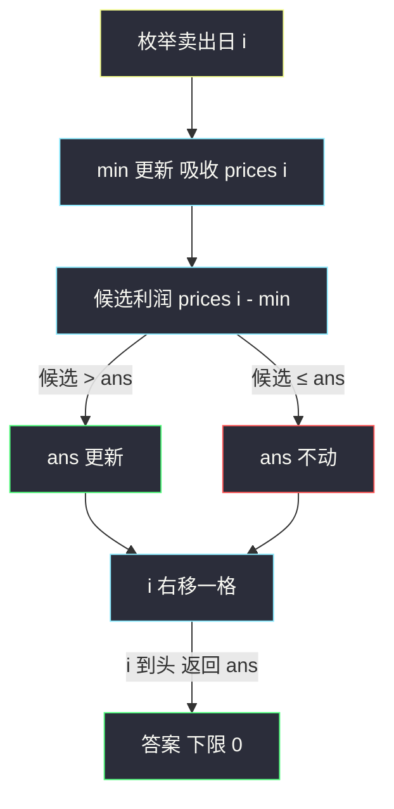
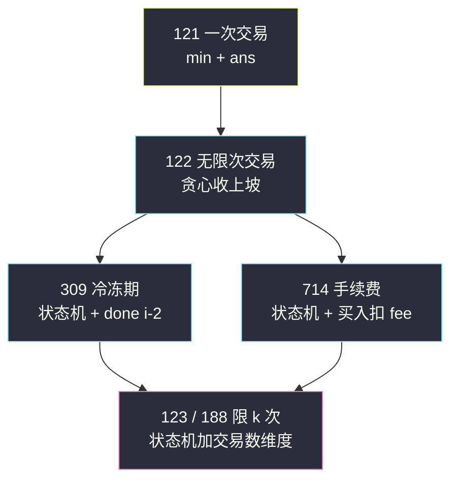

# 买卖股票的最佳时机 I（一次交易：枚举卖出日 + 维护历史最小值）

## 一、问题描述

给定一个数组 `prices`，它的第 `i` 个元素 `prices[i]` 表示一支给定股票第 `i` 天的价格。你只能选择**某一天**买入这只股票，并选择在**未来的某一个不同的日子**卖出（即最多完成 1 笔交易）。设计算法计算能获取的最大利润；不能获利则返回 0。

> 🔗 LeetCode 121：https://leetcode.cn/problems/best-time-to-buy-and-sell-stock/

**示例 1**

```
输入：prices = [7, 1, 5, 3, 6, 4]
输出：5
解释：第 2 天（下标 1，价格 1）买入，第 5 天（下标 4，价格 6）卖出，利润 6-1 = 5。
     注意 7-1 = 6 不是答案——先 7 后 1 是先卖后买，不合法。
```

**示例 2**

```
输入：prices = [7, 6, 4, 3, 1]
输出：0
解释：价格一路下跌，不交易反而最优，返回 0。
```

**直观理解**

一次交易 = 选两个下标 `i < j`，收益 `prices[j] - prices[i]`，求最大值（下限 0）。**枚举卖出日**是天然切入点：固定第 `j` 天卖，最优买入日一定是它之前价格最低的那天——于是问题变成「一边扫，一边维护历史最小值」。

这是**股票家族**的第一题（#121 → #122 → #309 → #714 → #123/#188），也是状态机 DP 的最简入门。

> 课源码出处：class082 Code01_Stock1.java（买卖股票的最佳时机）。

---

## 二、暴力解法（入门）

### 直观思路

枚举买入日 `i`、卖出日 `j > i`，取最大差值：

```java
// 买卖股票 I：暴力枚举
public static int maxProfit0(int[] prices) {
    int n = prices.length;
    int ans = 0;
    for (int i = 0; i < n; i++) {
        for (int j = i + 1; j < n; j++) {
            ans = Math.max(ans, prices[j] - prices[i]);
        }
    }
    return ans;
}
```

### 复杂度

- **时间**：`O(n²)`
- **空间**：`O(1)`

### 🔴 瓶颈在哪里

对每个卖出日 `j`，内层都在重新找「之前的最小值」。而最小值随着 `j` 右移只会**增量更新**，根本不必重扫——重复劳动就是优化空间。

---

## 三、优化探索（核心章节）

### 3.1 观察特征

| 特征 | 说明 |
|------|------|
| 枚举卖出日 | 任何交易必然在某天卖出；「卖出日」是可变参数 |
| 最优子结构 | 第 `j` 天卖的最优买入 = `0..j` 的最小价格；`j` 右移一格时，这个最小值**增量可维护** |
| 允许不交易 | 答案下限 0，`max` 融合天然兜底 |

### 3.2 推导（对齐 class082 Code01）

```
固定卖出日 j：最优收益 = prices[j] - min(prices[0..j])
让 j 从左到右扫一遍，同时维护 min = min(prices[0..j-1])（含 j-1 的历史最小）
ans = max(ans, prices[j] - min)
```

课上代码把 `min` 的更新放在取 `ans` **之前**同轮完成（`min = min(min, prices[i])` 后再算差），这样 `prices[i] - min` 包含「当天买当天卖」的 0 情形，结果不变，代码更短。



### 3.3 另一个视角：状态机 DP（家族通用的钥匙）

股票家族后面几题（#122 无限次、#309 冷冻期、#714 手续费）统一用「每天处于某个状态」的状态机描述。本题用两状态版先热身：

```
dp[i][0] : 第 i 天结束时不持有股票的最大收益
dp[i][1] : 第 i 天结束时持有股票（已买未卖）的最大收益
转移：
dp[i][0] = max(dp[i-1][0],        昨天就不持有，今天不动
               dp[i-1][1] + prices[i])   今天卖出
dp[i][1] = max(dp[i-1][1],        昨天就持有，今天不动
               -prices[i])        今天才买入（只允许一次交易，全新开局）
初始：dp[0][0] = 0, dp[0][1] = -prices[0]
答案：dp[n-1][0]（最后一天还持股没有意义）
```

妙处在于：`dp[i][1] = max(dp[i-1][1], -prices[i])` 展开后**恰好等于 `-min(prices[0..i])`**，`dp[i][0]` 恰好等于课上解法的 `ans`——两种写法是同一张表的两个读法。课上一维滚动版（`min` + `ans`）更短，状态机版为后续题目铺路。

### 3.4 关键推导问题

| 问题 | 答案 |
|------|------|
| 为什么枚举卖出日而不是买入日？ | 都可以；枚举卖出日时「之前的最小值」可增量维护，一遍扫完；枚举买入日则要维护「之后的最大值」，得倒着扫，对称等价 |
| 全递减序列为什么返回 0？ | 每轮 `prices[i] - min ≤ 0`，`ans` 初值 0 且只增不减，天然表达「不交易」 |
| `min` 里要不要包含当天？ | 课上代码包含（先更新 min 再算差），等价于允许「当天买当天卖」利润 0，不影响答案 |
| 和后缀最大差还有什么解法？ | 倒序扫维护 `max(prices[i..n-1])`，`ans = max(ans, max - prices[i])`，与正序完全对称 |

### 3.5 一句话核心

> **枚举卖出日，一边扫一边维护历史最小价 min，ans = max(ans, prices[i] - min)。**

---

## 四、代码实现详解

### Java（主解：课上原版，min + ans 滚动）

```java
// 买卖股票的最佳时机 I
// 只允许完成一笔交易（某天买入，未来某天卖出），求最大利润
// 测试链接 : https://leetcode.cn/problems/best-time-to-buy-and-sell-stock/
// 对齐 class082 Code01_Stock1：枚举卖出日 + 维护 0..i 最小值
public class Solution {

    // min : 0...i 范围上的最小价格（含当天）
    // ans : 枚举到第 i 天卖出的最优利润
    // 依赖方向：i 从左到右，min/ans 各自滚动。时间 O(n)，空间 O(1)
    public static int maxProfit(int[] prices) {
        int ans = 0;
        for (int i = 1, min = prices[0]; i < prices.length; i++) {
            // 吸收当天价格后，prices[i] - min 覆盖所有更早买入的可能
            min = Math.min(min, prices[i]);
            ans = Math.max(ans, prices[i] - min);
        }
        return ans;
    }
}
```

### Java（状态机视角版：两状态 dp，家族铺垫）

```java
// 状态机 dp 版：持有/不持有两状态
// dp1[i] 等价于 -min(0..i)，dp0[i] 等价于上面的 ans —— 与课上解法同一张表
public class Solution {

    public static int maxProfit(int[] prices) {
        int n = prices.length;
        // hold[i] : 第 i 天结束持有股票的最大收益；free[i] : 不持有的最大收益
        int hold = -prices[0]; // dp[0][1]
        int free = 0;          // dp[0][0]
        for (int i = 1; i < n; i++) {
            free = Math.max(free, hold + prices[i]); // 今天卖 或 不动
            hold = Math.max(hold, -prices[i]);       // 今天买 或 不动
        }
        return free; // 最后一天持有股票没有意义
    }
}
```

### Python（同思路）

```python
# 买卖股票 I：枚举卖出日 + 维护历史最小值，O(n) / O(1)
class Solution:
    def maxProfit(self, prices: list[int]) -> int:
        ans = 0
        mn = prices[0]
        for p in prices[1:]:
            mn = min(mn, p)
            ans = max(ans, p - mn)
        return ans
```

```python
# 状态机 dp 版（持有/不持有）
class Solution:
    def maxProfit(self, prices: list[int]) -> int:
        hold, free = -prices[0], 0
        for p in prices[1:]:
            free = max(free, hold + p)
            hold = max(hold, -p)
        return free
```

---

## 五、具体例子演示

### 例 A：`prices = [7, 1, 5, 3, 6, 4]` 逐天跟踪

| 天 i | prices[i] | min（吸收后） | 候选 prices[i]-min | ans | 说明 |
|------|-----------|---------------|--------------------|-----|------|
| 0 | 7 | 7 | — | 0 | 初始（只买不卖无法获利） |
| 1 | 1 | **1** | 1-1 = 0 | 0 | min 压到 1，无利润 |
| 2 | 5 | 1 | 5-1 = **4** | 4 | 虚拟最优：1 买 5 卖 |
| 3 | 3 | 1 | 3-1 = 2 | 4 | 候选更差，ans 不动 |
| 4 | 6 | 1 | 6-1 = **5** | **5** | 1 买 6 卖，全局最优 |
| 5 | 4 | 1 | 4-1 = 3 | 5 | 收尾，返回 5 |

返回 `5` ✓。注意 `i=1` 时 `min` 吸收当天价格 1，此后每一天的候选 `prices[i] - 1` 覆盖「1 块钱买入」的全部卖出选择。

### 例 B：`prices = [7, 6, 4, 3, 1]` 全程下跌

| 天 i | prices[i] | min | 候选 | ans |
|------|-----------|-----|------|-----|
| 0 | 7 | 7 | — | 0 |
| 1 | 6 | 6 | 0 | 0 |
| 2 | 4 | 4 | 0 | 0 |
| 3 | 3 | 3 | 0 | 0 |
| 4 | 1 | 1 | 0 | 0 |

每天候选都不超过 0（当天买当天卖），`ans` 从头到尾是 0——**不交易**被 `max` 的下限兜住，无需特判。

---

## 六、复杂度分析

| 版本 | 时间 | 空间 | 说明 |
|------|------|------|------|
| 暴力枚举 | `O(n²)` | `O(1)` | 枚举买/卖两天 |
| min 维护（主解） | `O(n)` | `O(1)` | 一遍扫，`min` 与 `ans` 各滚动 |
| 状态机 dp | `O(n)` | `O(1)` | 两状态滚动变量（显式 dp 表则为 `O(n)` 空间） |

---

## 七、方法对比与总结

### 股票家族全景（本篇是第一块拼图）



### 易错点

1. **把 `max - min` 当答案**：示例 1 中 7 与 1 的差是 6，但 7 在 1 **前面**（先卖后买不合法）。必须「卖出日在买入日之后」，所以枚举卖出日、回看历史 min。
2. **`min` 初始化为 `prices[0]` 之外**：初值必须来自真实价格，用 `Integer.MAX_VALUE` 也行但第一轮要小心。
3. **忘记「不交易」**：全下跌序列答案是 0 而不是负数——`ans` 初值 0 + `max` 融合自然处理，但手写 if 时容易漏。
4. **状态机版返回 `free` 而不是 `max(free, hold)`**：最后一天持有股票一定劣于不持有（卖出只增收益），返回 `free` 即可。

### 模板口诀

> **枚举卖出日，回看历史 min；差值取 max，下限 0 兜底。**

---

## 八、举一反三

| 题目 | 链接 | 迁移点 |
|------|------|--------|
| 122. 买卖股票的最佳时机 II（站内本批题解） | https://leetcode.cn/problems/best-time-to-buy-and-sell-stock-ii/ | 无限次交易 = 贪心收所有相邻上坡，class082 Code02 |
| 309. 最佳买卖股票时机含冷冻期（站内本批题解） | https://leetcode.cn/problems/best-time-to-buy-and-sell-stock-with-cooldown/ | 状态机版 + 卖后隔天才能买，class082 Code06 |
| 714. 买卖股票的最佳时机含手续费（站内本批题解） | https://leetcode.cn/problems/best-time-to-buy-and-sell-stock-with-transaction-fee/ | 状态机版 + 每笔交易扣 fee，class082 Code05 |
| 123. 买卖股票的最佳时机 III | https://leetcode.cn/problems/best-time-to-buy-and-sell-stock-iii/ | 状态机加「第几笔交易」维度，class082 Code03（下一批题解） |
| 188. 买卖股票的最佳时机 IV | https://leetcode.cn/problems/best-time-to-buy-and-sell-stock-iv/ | 同上推广到 k 笔，class082 Code04（下一批题解） |

**迁移一句**：股票家族的总纲是「**每天处于某个状态（持有/不持有/冷冻中），状态之间按题意连边**」——#121 的 `min` 是两状态机的压缩形态；把转移图画出来，后面的题都是往图上加一条边或扣一笔费用。
