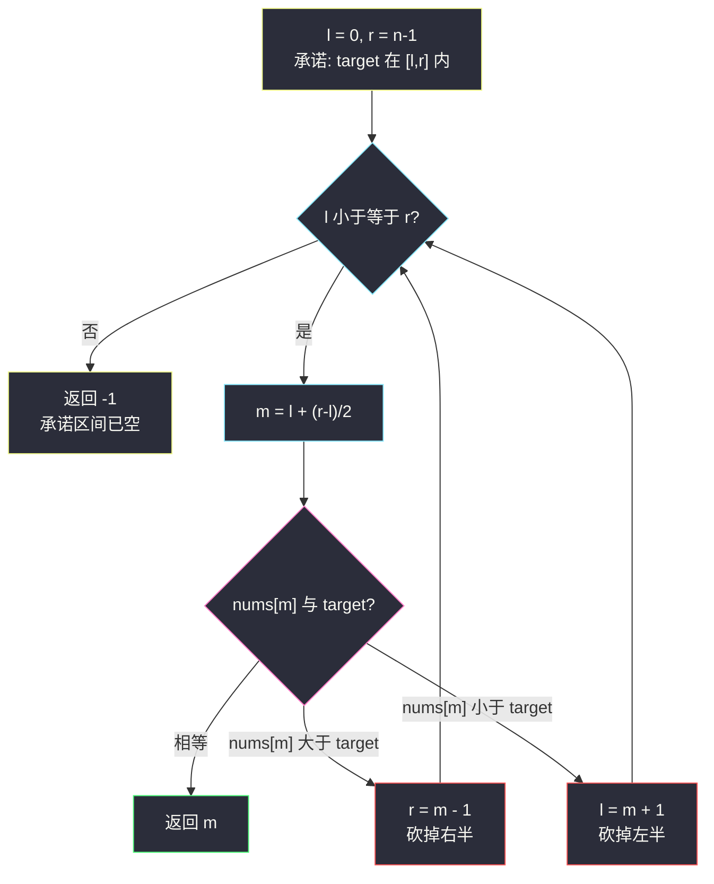
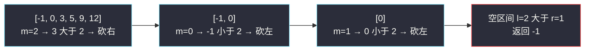

# 二分查找（全站最基础的二分模板题）

## 一、问题描述

给定一个 **n 个元素有序的（升序）** 整型数组 `nums` 和一个目标值 `target`，写一个函数搜索 `nums` 中的 `target`，如果目标值存在返回下标，否则返回 `-1`。

> 🔗 LeetCode 704：https://leetcode.cn/problems/binary-search/

**示例 1**

```
输入：nums = [-1,0,3,5,9,12], target = 9
输出：4
解释：9 出现在 nums 中并且下标为 4
```

**示例 2**

```
输入：nums = [-1,0,3,5,9,12], target = 2
输出：-1
解释：2 不存在 nums 中因此返回 -1
```

**直观理解**

数组**有序**是最强的先验信息：随便取一个中点 `m`，比较 `nums[m]` 与 `target`，就能**一次性砍掉一半**不可能的候选区间。这就是二分查找——「在有序中定位目标」的标准武器，也是后面 #34 / #33 / #153 / #162 / #4 / #378 整个二分家族的地基。

---

## 二、暴力解法（入门）

### 直观思路

从左到右线性扫描，逐个比较：

```java
public int search(int[] nums, int target) {
    for (int i = 0; i < nums.length; i++) {
        if (nums[i] == target) {
            return i;
        }
    }
    return -1;
}
```

### 复杂度

- **时间**：`O(n)`，最坏扫完整个数组
- **空间**：`O(1)`

### 🔴 瓶颈在哪里

完全没用上「有序」这个条件。`n = 10⁶` 时要扫百万次，而二分只要 20 次左右。  
**特征识别**：只要数据有序（或答案空间具有单调性），就该想起二分。

---

## 三、优化探索（核心章节）

### 3.1 核心思想：维护不变式「target 若存在，必在 [l, r] 内」

二分不是背模板，而是维护一个**始终成立的承诺**：

> 命名区间 `[l, r]`：如果 `target` 在数组里，它一定落在这个闭区间内。

每一轮取中点 `m = (l + r) / 2`，分三种情况：

| 情况 | 结论 | 动作 |
|------|------|------|
| `nums[m] == target` | 找到 | 直接返回 `m` |
| `nums[m] > target` | 有序 ⇒ `m` 及其右侧全太大 | 承诺区间缩为 `[l, m-1]` |
| `nums[m] < target` | 有序 ⇒ `m` 及其左侧全太小 | 承诺区间缩为 `[m+1, r]` |

区间严格变小且承诺不破，最多砍 `log₂n` 次就到空区间（`l > r`），此时承诺区间为空 ⇒ 数组里没有 `target`。



### 3.2 课上两种模板：`while l <= r` 与 `while l < r`

左程云课（class006）二分讲得极细，两套模板各有分工：

**模板一：`while (l <= r)` + 三分支（本题用它）**——逐个检查 `m`，命中即返回；区间缩为空则不存在。适合「找一个具体值」。

**模板二：`while (l < r)` + 收敛到单点**——`m` 永远不直接返回，只负责收缩，最后 `l == r` 停在答案位置。适合「找边界」（#34 找最左/最右、#153 找最小值都是它）。

两套模板的 `m` 收缩方向都满足「区间严格变小」，不会死循环；写二分时先想清楚「我要的是值还是边界」，再选模板。

### 3.3 溢出细节：`m = l + ((r - l) >> 1)`

`l` 和 `r` 都接近 `2³¹` 时 `(l + r) / 2` 会整型溢出，写成 `l + ((r - l) >> 1)` 先算差再折半，永远安全（课上原话：这个习惯值很多分）。

### 3.4 关键问题

| 问题 | 答案 |
|------|------|
| 为什么循环条件是 `l <= r` 而不是 `l < r`？ | 闭区间 `[l, r]` 里 `l == r` 时还剩 1 个元素没检查，必须再进一轮 |
| `r` 为什么是 `m - 1` 不是 `m`？ | `nums[m]` 已确认不是答案，检查过的下标必须踢出区间，否则死循环 |
| 数组无序能用二分吗？ | 不能直接用；但若「答案空间」单调（如 #378 值域二分）依然可以 |
| 停止时 `l` 的含义？ | 退出后 `l = r + 1`，`l` 恰是「第一个大于 target 的位置」（#35 的答案） |

### 3.5 一句话核心

> **维护「target 必在 [l, r]」的承诺，每轮用中点砍掉一半，log₂n 轮内见分晓。**

---

## 四、代码实现详解

### Java（主解：对齐课源码 class006 Code01_FindNumber）

> 课源码：`/Users/zy/ai_learn/algorithm-journey/src/class006/Code01_FindNumber.java` 的 `exist` 方法（课上验证「有序数组中是否存在一个数字」，本题返回下标版）。

```java
// 二分查找
// 测试链接 : https://leetcode.cn/problems/binary-search/
public class Solution {

    public static int search(int[] nums, int target) {
        if (nums == null || nums.length == 0) {
            return -1;
        }
        int l = 0, r = nums.length - 1, m = 0;
        while (l <= r) {
            // m = l + ((r - l) >> 1) 防溢出写法
            m = l + ((r - l) >> 1);
            if (nums[m] == target) {
                return m;
            } else if (nums[m] > target) {
                r = m - 1; // 答案只可能在左半
            } else {
                l = m + 1; // 答案只可能在右半
            }
        }
        return -1;
    }
}
```

### Java（附：while l < r 的边界模板版）

```java
// 模板二：最后停在「第一个 >= target 的位置」，再验证是否等于 target
// 与 #34 的 findLeft / #35 的插入位置同骨架，此处展示家族通用性
public static int search2(int[] nums, int target) {
    int l = 0, r = nums.length - 1;
    while (l < r) {
        int m = l + ((r - l) >> 1);
        if (nums[m] >= target) {
            r = m;      // m 可能就是答案，保留
        } else {
            l = m + 1;  // m 太小，排除
        }
    }
    return nums[l] == target ? l : -1;
}
```

### Python

```python
# 二分查找
# 测试链接 : https://leetcode.cn/problems/binary-search/
class Solution:
    def search(self, nums: list[int], target: int) -> int:
        l, r = 0, len(nums) - 1
        while l <= r:
            m = l + ((r - l) >> 1)
            if nums[m] == target:
                return m
            elif nums[m] > target:
                r = m - 1
            else:
                l = m + 1
        return -1
```

---

## 五、例子演示

### 例 A：`nums = [-1,0,3,5,9,12]`，`target = 9`（主解逐步跟踪）

初始 `l = 0`，`r = 5`：

| 轮次 | l | r | m = l+(r-l)/2 | nums[m] | 比较 | 动作 |
|------|---|---|---------------|---------|------|------|
| 1 | 0 | 5 | 2 | 3 | 3 < 9 | `l = 3`（砍掉下标 0~2） |
| 2 | 3 | 5 | 4 | 9 | 9 == 9 | **返回 4** ✅ |

仅 2 轮定位，而线性扫描要 5 次。区间演化：`[0,5]` → `[3,5]` → 命中。

### 例 B：`target = 2`（不存在，走完全程）

初始 `l = 0`，`r = 5`：

| 轮次 | l | r | m | nums[m] | 比较 | 动作 |
|------|---|---|---|---------|------|------|
| 1 | 0 | 5 | 2 | 3 | 3 > 2 | `r = 1` |
| 2 | 0 | 1 | 0 | -1 | -1 < 2 | `l = 1` |
| 3 | 1 | 1 | 1 | 0 | 0 < 2 | `l = 2` |
| 4 | 2 | 1 | — | — | `l > r` | **返回 -1** |

第 4 轮进入不了循环：承诺区间 `[2, 1]` 为空 ⇒ `2` 必不存在。



---

## 六、复杂度分析

| 项目 | 复杂度 | 说明 |
|------|--------|------|
| 时间 | `O(log n)` | 每轮区间至少砍半，最多 ⌊log₂n⌋ + 1 轮 |
| 空间 | `O(1)` | 只用 l、r、m 三个变量 |

`n = 10⁶` 时约 20 轮、`n = 10⁹` 时约 30 轮——这就是二分「指数级降本」的含金量。

---

## 七、对比总结

### 方法对比

| 方法 | 时间 | 空间 | 说明 |
|------|------|------|------|
| 线性扫描 | `O(n)` | `O(1)` | 不需要有序，通用兜底 |
| 二分查找 | `O(log n)` | `O(1)` | 必须有序；本题最优解 |

### 易错点

1. **循环条件写成 `l < r`**：漏检 `l == r` 那最后一个元素（在 `l <= r` 闭区间模板下）。
2. **收缩写 `r = m` / `l = m`**：`m` 已比较过、确认不是答案，必须 `-1` 踢出去，否则区间不缩 → 死循环。
3. **`(l + r) / 2` 溢出**：大下标场景用 `l + ((r - l) >> 1)`。
4. **忘记数组必须有序**：无序数组上二分结果无意义。

### 模板口诀

> **左闭右闭起手式，中点三分看大小；砍掉一半不回头，区间空了就是无。**

---

## 八、举一反三

| 题目 | 链接 | 迁移点 |
|------|------|--------|
| 35. 搜索插入位置 | https://leetcode.cn/problems/search-insert-position/ | 找不到时返回 `l`——正是退出时的「第一个大于 target 的位置」 |
| 34. 在排序数组中查找元素的第一个和最后一个位置 | https://leetcode.cn/problems/find-first-and-last-position-of-element-in-sorted-array/ | 从「找一个值」升级为「找左/右边界」，class006 FindLeft/FindRight 原题 |
| 278. 第一个错误的版本 | https://leetcode.cn/problems/first-bad-version/ | 答案空间单调（错的一直错），`while l < r` 找最左边界 |
| 69. x 的平方根 | https://leetcode.cn/problems/sqrtx/ | 在值域上二分答案，而不是在数组下标上二分 |

**迁移一句**：看到「有序 + 查找」先想 `while l <= r` 三分支找值；看到「找第一个/最后一个满足条件的位置」换 `while l < r` 收敛模板——这两把刀合起来就是整个二分家族（#34、#33、#153、#162、#378、#4）的通用骨架。
