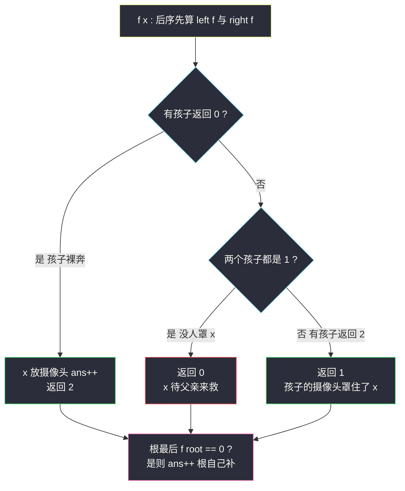
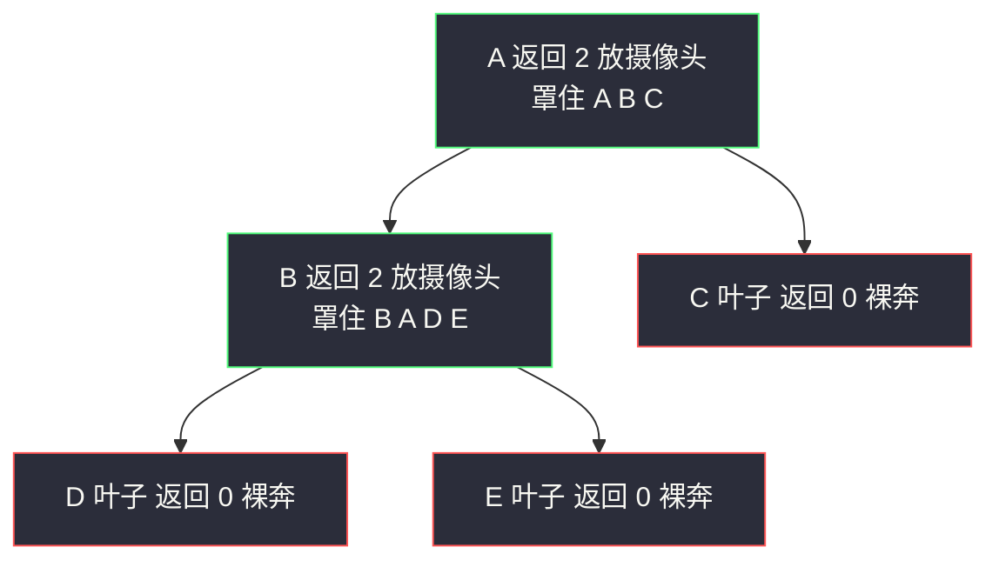

# 监控二叉树（三状态树形 DP）

## 一、问题描述

给定二叉树，在节点上安装**摄像头**。每个摄像头可以监视**自身、父节点、直接子节点**（上下各一层）。要求监视**所有节点**，返回所需摄像头的**最小数量**。

> 🔗 LeetCode 968：https://leetcode.cn/problems/binary-tree-cameras/

**示例 1**

```
输入：[0,0,null,0,0]
输出：1
解释：在中间节点放一个摄像头，覆盖根、自己和两个孩子
```

```
        0
       /
      0        ← 在这个节点放摄像头
     / \
    0   0
```

**示例 2**

```
输入：[0,0,null,0,null,0,null,null,0]
输出：2
```

**直观理解**

第一反应可能是在「父节点」放摄像头让一个摄像头管三个。但树形 DP / 贪心的精髓恰好相反：**摄像头尽量往「叶子以上」放**——放在叶子上只能覆盖叶子、它兄弟、它父亲，浪费了「向下」的视野；放在叶子的父节点，向下的视野用来罩住两个叶子，向上罩住爷爷，一箭三雕。

[#337 打家劫舍 III](./house-robber-iii.md) 里每个节点两个状态（偷/不偷）；本题每个节点要**三个状态**才能把「覆盖情况」说清楚（class078 Code06）。状态怎么设计、信息怎么从孩子汇到父亲，就是本题主线。

---

## 二、暴力解法

### 直观思路

枚举每个节点「放/不放摄像头」，检查约束（每个节点至少被自己/父亲/孩子之一覆盖），`O(2ⁿ · n)` 组合爆炸。稍作剪影的写法是尝试型递归：

```java
// 暴力示意（伪码）：每个节点独立决策放/不放，全枚举后验证
public static int brute(TreeNode root) {
    return tryAll(root, new HashSet<TreeNode>()); // 枚举放摄像头的集合
}
// n 个节点 2^n 个子集 × 每个集合 O(n) 验证覆盖 → 无法通过
```

### 复杂度

- **时间**：`O(2ⁿ · n)`
- **空间**：`O(n)`

### 🔴 瓶颈在哪里

「覆盖」是**三方关系**（自己、父亲、孩子），单独看一个节点无法决定它要不要摄像头——必须把「我是否已被覆盖」的信息随递归传递。这正适合树形 DP：**状态 = 节点的覆盖情形，信息后序向上汇总**。

---

## 三、优化探索（核心章节）

### 3.1 为什么是三个状态

节点的覆盖情形只有三种（以 class078 Code06 的定义）：

| 状态值 | 含义（对节点 x） |
|--------|------------------|
| `0` | x **未被覆盖**（x 上没摄像头也没被任何孩子罩住；x 下方全部已覆盖） |
| `1` | x **已被覆盖**，但 x 上**没有**摄像头（x 下方全部已覆盖） |
| `2` | x **已被覆盖**，且 x 上**有**摄像头（x 下方全部已覆盖） |

「下方全部已覆盖」是每个状态的隐藏承诺——递归返回时，子树内部永远是干净的，剩余问题只在「x 与 x 的父亲之间」。**这正是树形 DP 的不变式**。

### 3.2 转移规则推导（信息从孩子汇到父亲）

设 `left`、`right` 是两个孩子的返回值（class078 Code06 的 `f`）：

1. **任一孩子返回 0**（孩子未被覆盖，且孩子下方干净）→ 没有别的方式救孩子，**必须在 x 上放摄像头**：`ans++`，返回 2。
   - x 的摄像头向上还能罩住 x 的父亲——「尽量往上放」的贪心就藏在这一条。
2. **两个孩子都返回 1**（都已被覆盖但都没有摄像头）→ 没人罩 x，x **暂时未被覆盖**：返回 0（把「救 x」的任务交给 x 的父亲或自己未来的摄像头）。
3. **其余情况**（至少一个孩子返回 2）→ 那个孩子的摄像头罩住了 x：返回 1。

```
f(null) = 1                      // 空节点：视为已覆盖且无摄像头
f(x)   = 0 出现孩子0 ? (ans++ , 2)
         : 全是1      ? 0
         :              1
最后 : f(root) == 0 则 ans++     // 根没有父亲救它，自己补一个
```

### 3.3 为什么这样是最少的（贪心正确性直觉）

- 摄像头有**向上**的视野，放在越靠上的位置能同时服务「父亲 + 自己 + 两个孩子」；
- 但不能放太高——必须先保证**叶子层**被覆盖；叶子的父亲是罩住两个叶子的最低位置；
- 规则 1「孩子裸奔 → 我立刻放」实现了「**尽量晚放、放得尽量高**」：每个摄像头都被「下方有裸奔节点」逼出来，无一浪费；
- 规则「根返回 0 补一个」处理「根没有父亲」的特例。



### 3.4 关键问题

| 问题 | 答案 |
|------|------|
| 为什么空节点返回 1 不是 0？ | 若返回 0，则叶子会「为救孩子」放摄像头——恰恰违反「叶子不放」的最优策略；空节点视为已覆盖（1）让叶子自然返回 0，把摄像头逼到叶子的父亲 |
| 为什么叶子返回 0？ | 叶子孩子全为 1（空），套规则 2 → 0，即「叶子裸奔，等父亲放」 |
| 规则 1 为什么敢立刻放？ | 孩子已经 0（下方干净、自身裸奔），唯一能罩住孩子的只有 x（孩子的孩子鞭长莫及）；「现在放」还能顺带罩住 x 与 x 的父亲，收益最大 |
| 和 #337 的结构差异？ | 状态数 2 → 3；且 #337 转移只做加法/取 max，本题转移是「条件判定 + 副作用（ans++）」 |
| ans++ 放在遍历中还是最后统一？ | 课上一边遍历一边 `ans++`，最后只补根的特判——写起来最不容易漏 |
| 严格「dp 表」版怎么写？ | 状态同上但不用全局 ans：`dp[x][s]` = x 状态为 s 时子树最少摄像头数，转移对三个状态分别枚举合法组合；贪心版证明了最优解恰被规则捕获，故两者答案相同，贪心版代码更短 |

### 3.5 一句话核心

> **每个节点三状态：孩子有 0 我就放（返回 2）；孩子全 1 我裸奔（返回 0）；有孩子 2 我被罩（返回 1）；根裸奔自己补。**

---

## 四、代码实现

### Java（主解：三状态树形 DP，对齐 class078 Code06）

```java
// 监控二叉树
// 每个摄像头可监视自身、父节点、直接子节点，求覆盖全部节点的最少摄像头数
// 测试链接 : https://leetcode.cn/problems/binary-tree-cameras/
// 对齐 class078 Code06_BinaryTreeCameras
public class Solution {

    public static class TreeNode {
        public int val;
        public TreeNode left;
        public TreeNode right;
    }

    public int ans;   // 遍历过程中一旦需要放置摄像头，ans++

    // 时间复杂度 O(n)，空间复杂度 O(树高)
    public int minCameraCover(TreeNode root) {
        ans = 0;
        if (f(root) == 0) {   // 根未被覆盖，没有父亲来救，自己补一个
            ans++;
        }
        return ans;
    }

    // 返回 x 的状态（假设 x 上方有父亲，此假设很重要）:
    // 0 : x 未被覆盖，x 下方节点都已覆盖
    // 1 : x 已被覆盖，x 上没摄像头，x 下方都已覆盖
    // 2 : x 已被覆盖，x 上有摄像头，x 下方都已覆盖
    private int f(TreeNode x) {
        if (x == null) {
            return 1;   // 空节点视为已覆盖且无摄像头
        }
        int left = f(x.left);
        int right = f(x.right);
        if (left == 0 || right == 0) {
            ans++;      // 孩子裸奔，必须在 x 放摄像头
            return 2;
        }
        if (left == 1 && right == 1) {
            return 0;   // 没人罩 x，x 裸奔，交给父亲处理
        }
        return 1;       // 有孩子返回 2，x 已被其摄像头罩住
    }
}
```

### Java（对照版：显式三状态 DP 表写法）

```java
// dp[x] = {a, b, c} :
// a = x 状态0(裸奔) 的最少摄像头（此时 x 靠父亲罩，子树内部合法）
// b = x 状态1(被孩子罩) 的最少摄像头
// c = x 状态2(自己放) 的最少摄像头
// 与贪心版答案一致，胜在"纯函数"无副作用，便于理解状态含义
public class Solution {

    private static final int INF = 10000;

    public int minCameraCover(TreeNode root) {
        int[] d = f(root);
        // 根没有父亲，状态 0（裸奔）非法，取 b / c 较小者
        return Math.min(d[1], d[2]);
    }

    private int[] f(TreeNode x) {
        if (x == null) {
            // 空节点 : 视为"已覆盖且无摄像头"，但真实子树不存在，
            // 用 {0, 0, INF} 表示"父亲侧不放也能覆盖"的语义边界
            return new int[] { 0, 0, INF };
        }
        int[] l = f(x.left), r = f(x.right);
        int a, b, c;
        // x 状态0 : x 自己不放，也不被孩子罩（孩子都不得是 2）
        a = Math.min(l[1] + r[1], Math.min(l[1] + r[0], l[0] + r[1]));
        // x 状态1 : x 不放，被某个孩子(=2)罩住；另一孩子任意
        b = Math.min(l[2] + Math.min(r[0], Math.min(r[1], r[2])),
                     r[2] + Math.min(l[0], Math.min(l[1], l[2])));
        // x 状态2 : x 放摄像头，孩子随便（自身已覆盖）
        c = 1 + Math.min(l[0], Math.min(l[1], l[2]))
              + Math.min(r[0], Math.min(r[1], r[2]));
        return new int[] { a, b, c };
    }
}
```

### Python（主解同思路）

```python
class Solution:
    def minCameraCover(self, root: TreeNode) -> int:
        self.ans = 0

        def f(x):
            # 0: 裸奔  1: 被覆盖无摄像头  2: 有摄像头
            if x is None:
                return 1
            left, right = f(x.left), f(x.right)
            if left == 0 or right == 0:   # 孩子裸奔 → 我放
                self.ans += 1
                return 2
            if left == 1 and right == 1:  # 没人罩我 → 我裸奔
                return 0
            return 1                      # 有孩子的摄像头罩我

        if f(root) == 0:                  # 根裸奔，自己补
            self.ans += 1
        return self.ans
```

---

## 五、具体例子演示

以一棵 5 节点的树为例（节点名 A..E，值无关）：

```
        A
       / \
      B   C
     / \
    D   E        （D、E 为叶子，C 为叶子）
```

### 后序逐节点跟踪（ans 初始 0）

| 步 | 节点 | left / right | 规则 | 返回 | ans |
|----|------|--------------|------|------|-----|
| 1 | 叶 D | 1 / 1（两个空） | 规则 2：全 1 | **0** | 0 |
| 2 | 叶 E | 1 / 1 | 规则 2 | **0** | 0 |
| 3 | 叶 C | 1 / 1 | 规则 2 | **0** | 0 |
| 4 | B | **0 / 0** | 规则 1：有孩子 0 → B 放摄像头 | **2** | **1** |
| 5 | A | 2 / **0** | 规则 1：右孩子 C=0 → A 放摄像头 | **2** | **2** |

`f(A) = 2 ≠ 0`，根不用补。答案 **2**。

**验证覆盖**：

- B 的摄像头罩住 B、A（父）、D、E（子）✓
- A 的摄像头罩住 A、B（父的父没有，算了）、C（子）——C 正是被 A 罩住的 ✓

对比错误贪心「每个叶子父亲放一个」：若只在 B 放，C 永远裸奔；「每个叶子放一个」需 3 个。**「孩子裸奔我就放」规则自动在 B 和 A 各放一个，恰好最优**。

### 反例走查：为什么叶子不放（空节点必须返回 1）

若 `f(null) = 0`，同一棵树：叶 D 有孩子返回 0 → D 放摄像头（浪费向下视野）→ D、E、C 全放，ans=3。空节点返回 1 的设计**强制把摄像头从叶子层顶到父亲层**，这是本题最精妙的一行。



红框 = 裸奔状态 0，绿框 = 放了摄像头的状态 2；裸奔节点的「求救」向上触发父节点放摄像头。

### 单链特例：`A - B - C`（C 是叶子，A 是根）

| 节点 | 返回 | 说明 |
|------|------|------|
| C | 0 | 裸奔 |
| B | 2（ans=1） | 救 C，摄像头罩 B、A、C |
| A | 1 | 被 B 罩住；f(root)=1 ≠ 0 不补 |

答案 1 ✓——一个摄像头全罩。

---

## 六、复杂度分析

| 版本 | 时间 | 空间 | 说明 |
|------|------|------|------|
| 暴力枚举 | `O(2ⁿ · n)` | `O(n)` | 组合爆炸 |
| 三状态贪心树形 DP（主解） | `O(n)` | `O(h)` | 每节点一次访问，转移 O(1) |
| 显式三状态 DP 表 | `O(n)` | `O(h)` | 递归带数组返回，常数为 3 |

---

## 七、方法对比与总结

### 树形 DP 状态设计进化表

| 题 | 每节点状态数 | 状态含义 | 转移形态 |
|----|--------------|----------|----------|
| [#337 打家劫舍 III](./house-robber-iii.md) | 2 | 偷 / 不偷 | 加法 + max |
| **#968 监控二叉树（本题）** | 3 | 裸奔 / 被罩 / 有摄像头 | 条件判定 + 副作用计数 |
| #124 最大路径和 | 2（拐弯/不拐弯） | 含义更隐晦 | max + 约束截断 |

**状态设计的通用方法**：把「节点自身的处境」枚举清楚（本题的处境 = 覆盖与否 × 是否自带摄像头），确保任何合法方案都能被状态组合表达、任何状态组合间的约束冲突都能在转移处拦截。

### 易错点

1. **空节点返回 0**：导致叶子层全放摄像头，答案偏大（见 5.2 反例走查）。
2. **规则顺序颠倒**：先判「全 1」再判「有 0」会把 `0/1` 组合误判成 0 裸奔——必须先救孩子。
3. **忘了根的特判**：根返回 0 时没有父亲来救，漏 `ans++` 会少算。
4. **「下方已覆盖」的不变式被破坏**：比如规则 1 里返回 2 前没处理另一个孩子——其实无需处理：规则 1 触发时另一个孩子只可能是 1 或 0；若是 0 同样被 x 的摄像头罩住 ✓（x 罩子节点）。
5. **状态 1 的来源写漏**：显式 DP 版里 `b` 要枚举「左罩我」和「右罩我」两种来源。

### 模板口诀

> **三态：裸奔零、被罩一、有头二；孩子裸奔我就放，全被罩时我裸奔，根若裸奔自己补。**

---

## 八、举一反三

| 题目 | 链接 | 迁移点 |
|------|------|--------|
| 337. 打家劫舍 III | https://leetcode.cn/problems/house-robber-iii/ | 两状态树形 DP，本题的前置 |
| 124. 二叉树中的最大路径和 | https://leetcode.cn/problems/binary-tree-maximum-path-sum/ | 树形 DP 状态取舍（边贡献可弃） |
| 543. 二叉树的直径 | https://leetcode.cn/problems/diameter-of-binary-tree/ | 「后序汇总 + 全局答案」最小版 |
| 1373. 二叉搜索子树的最大键值和 | https://leetcode.cn/problems/maximum-sum-bst-in-binary-tree/ | 多信息打包返回的树形 DP 大成 |
| 979. 在二叉树中分配硬币 | https://leetcode.cn/problems/distribute-coins-in-binary-tree/ | 树上「流量」后序汇总，状态换视角 |

**迁移一句**：树上「最小/最大代价且约束涉及父子关系」的问题，套路 = **为节点设计覆盖所有处境的状态组，后序汇总，转移处处理约束与计数**。#337 两状态 → #968 三状态，难度上台阶但骨架一字未变。
