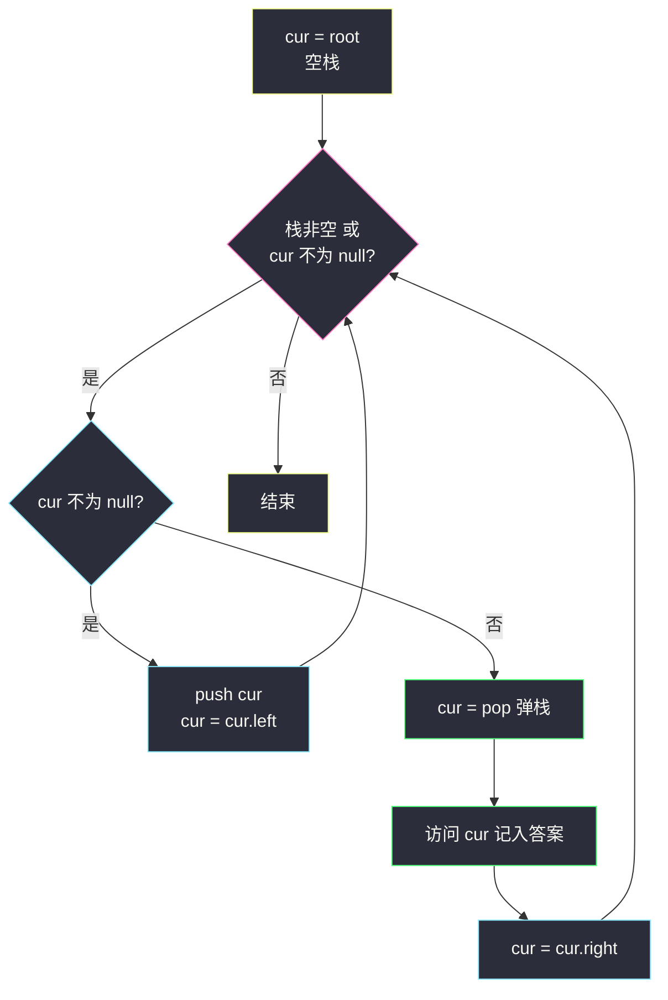
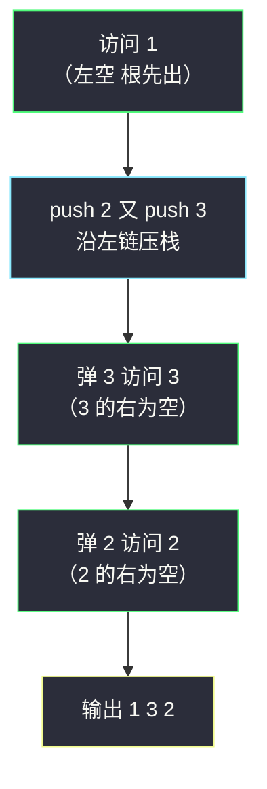

# 二叉树的中序遍历（递归分治 + 显式栈迭代）

## 一、问题描述

给定一个二叉树的根节点 `root`，返回它的**中序遍历**。

中序遍历（inorder traversal）按「**左 → 根 → 右**」的顺序访问节点：对每个节点，先完整遍历它的左子树，再访问它自己，最后遍历右子树。

> 🔗 LeetCode 94：https://leetcode.cn/problems/binary-tree-inorder-traversal/

**示例 1**

```
输入：root = [1,null,2,3]
输出：[1,3,2]
树形：
    1
     \
      2
     /
    3
中序：先左（空）→ 根 1 → 右子树（先 3 → 再 2）→ [1,3,2]
```

**示例 2**

```
输入：root = []
输出：[]
```

**示例 3**

```
输入：root = [1]
输出：[1]
```

**直观理解**

中序遍历对**二叉搜索树**有一个关键性质：访问顺序恰好是**升序**（左子树都小于根、右子树都大于根，先左后根再右天然从小到大）。这也是「验证 BST」「BST 中第 k 小」这类题的基石。写法上，递归版三行背下来即可；值得多花时间的是**显式栈的迭代版**——它把递归栈展开成看得见的循环，是理解「递归到底在做什么」的最好练习。

---

## 二、暴力解法（入门）

### 直观思路

「暴力」对遍历题来说就是**递归版本身**——它是最直白的翻译：函数体照着「左 → 自己 → 右」念出来。

```java
class Solution {
    public List<Integer> inorderTraversal(TreeNode root) {
        List<Integer> ans = new ArrayList<>();
        dfs(root, ans);
        return ans;
    }

    private void dfs(TreeNode node, List<Integer> ans) {
        if (node == null) {
            return;
        }
        dfs(node.left, ans);     // 1. 先走左子树
        ans.add(node.val);       // 2. 再访问自己
        dfs(node.right, ans);    // 3. 最后走右子树
    }
}
```

### 复杂度

- **时间**：`O(n)`，每个节点恰好访问一次。
- **空间**：`O(h)` 递归栈，`h` 为树高；平衡树 `O(log n)`，链状树 `O(n)`。

### 🔴 「瓶颈」在哪里

递归版本身没有效率问题（`O(n)` 已是下界），真正的短板是两点：

1. **依赖函数调用栈**：面试官常要求「不用递归」；极端深的树（链状 10⁴+）在受限环境下可能栈溢出。
2. **不可暂停**：递归一路扎到底，想要「中序流式输出」（如 BST 迭代器题）时没法停在中间状态。

于是引出本章主角：用显式栈模拟递归的控制流。

---

## 三、优化探索（核心章节）

### 3.1 观察特征

| 特征 | 说明 |
|------|------|
| 访问顺序左→根→右 | 递归天然适配；迭代需要手动管理「回来的路」 |
| 一直向左走是最长前缀 | 中序总是先冲到**最左下**的节点，路上节点都「欠一次访问」 |
| 弹栈 = 回溯 | 栈里存的是「右子树还没走」的祖先——回溯现场 |

### 3.2 递归 → 迭代：把调用栈搬进明面

递归版每层调用做了两件事：① 把当前节点压栈后钻进左子树；② 左子树返回后访问自己、再钻右子树。迭代版用 `cur` 指针 + 显式栈重演这两幕（对齐课源码 class018 `BinaryTreeTraversalIteration.inOrder` 的写法）：

```
cur = root
while (栈非空 或 cur != null):
    if (cur != null):        // 阶段一：一路向左，沿途压栈
        push(cur); cur = cur.left
    else:                    // 阶段二：左边到头
        cur = pop()          //   弹出最深的「欠访问」节点
        访问 cur             //   中序的"根"时机到了
        cur = cur.right      //   转向右子树（右子树整体重演两个阶段）
```

**为什么对**：栈中保存的恰是「已入栈未访问」的祖先链；弹出时其左子树必已处理完（左边到头才轮到它），此刻访问自己正是中序时序；随后交给右子树重复，右子树为空时继续弹上一代祖先——与递归的返回路径完全同构。



### 3.3 关键推导问题

| 问题 | 答案 |
|------|------|
| 循环条件为什么是「栈非空 **或** cur 非空」？ | 只写栈非空：根入栈前栈是空的，进不了循环；只写 cur 非空：回溯后 cur 暂时为 null 但栈里还有祖先，会提前退出 |
| 为什么弹出后立刻访问？ | 弹出节点被压栈的时机是「它的左路尚未走」；而此刻弹出说明左路已走完，中序时机恰好成熟 |
| `cur = cur.right` 之后为什么不做特判？ | 右子树为 null 时下一轮自动走「弹栈」分支，等于递归中「右子树直接返回」，无需 if |
| 中序对 BST 意味着什么？ | 输出升序序列——「验证 BST」= 检查中序结果是否递增 |
| 还有更省空间的遍历吗？ | Morris 遍历用线索指针做到 O(1) 空间（课源码 class124 有完整实现），代价是暂时改树结构、代码复杂，作拓展了解 |
| 递归与迭代谁该写进面试？ | 递归版 30 秒写出展示基础；主动补一句「也能写迭代版」并流畅写出，是加分项 |

### 3.4 一句话核心

> **一路向左全压栈，左边到头弹一个——弹出即访问，访问完往右钻；循环条件记「栈非空或 cur 非空」。**

---

## 四、代码实现详解

### Java（主解一：递归分治，最简洁）

```java
class Solution {
    public List<Integer> inorderTraversal(TreeNode root) {
        List<Integer> ans = new ArrayList<>();
        dfs(root, ans);
        return ans;
    }

    private void dfs(TreeNode node, List<Integer> ans) {
        if (node == null) {
            return;
        }
        dfs(node.left, ans);
        ans.add(node.val);
        dfs(node.right, ans);
    }
}
```

### Java（主解二：显式栈迭代，对齐 class018 课上版）

```java
// 中序遍历，非递归（显式栈）版
// 对齐 class018 BinaryTreeTraversalIteration.inOrder
class Solution {
    public List<Integer> inorderTraversal(TreeNode head) {
        List<Integer> ans = new ArrayList<>();
        if (head != null) {
            Deque<TreeNode> stack = new ArrayDeque<>();
            while (!stack.isEmpty() || head != null) {
                if (head != null) {          // 阶段一：一路向左
                    stack.push(head);
                    head = head.left;
                } else {                     // 阶段二：左边到头
                    head = stack.pop();      // 弹出最深的待访问节点
                    ans.add(head.val);       // 中序时机：此刻访问
                    head = head.right;       // 转向右子树
                }
            }
        }
        return ans;
    }
}
```

**变量含义（迭代版）**

| 变量 | 含义 |
|------|------|
| `head`（即 cur） | 当前探索位置的指针，等价于递归里「正在处理的那层调用」 |
| `stack` | 显式递归栈：存「左路已走、自己未访问、右路未走」的祖先链 |

**循环不变式**：任意时刻，栈中节点自底向上构成一条从根出发的左孩子链前缀；它们的右子树与它们自身都尚未访问，而所有「既不在栈中也不在已访问集合」的节点都已访问完毕。

### Python（同思路两版）

```python
# 递归版
class Solution:
    def inorderTraversal(self, root: Optional[TreeNode]) -> list[int]:
        ans = []
        def dfs(node):
            if node is None:
                return
            dfs(node.left)
            ans.append(node.val)
            dfs(node.right)
        dfs(root)
        return ans
```

```python
# 显式栈迭代版
class Solution:
    def inorderTraversal(self, root: Optional[TreeNode]) -> list[int]:
        ans = []
        stack = []
        cur = root
        while stack or cur:
            if cur:                  # 一路向左
                stack.append(cur)
                cur = cur.left
            else:                    # 左边到头：弹、访问、往右
                cur = stack.pop()
                ans.append(cur.val)
                cur = cur.right
        return ans
```

---

## 五、具体例子演示

### 例 1：`root = [1,null,2,3]`

```
    1
     \
      2
     /
    3
```

**递归版跟踪**：

| 步骤 | 动作 | 说明 |
|------|------|------|
| 1 | dfs(1)：先走 dfs(1.left) = dfs(null) | 左子树为空，立即返回 |
| 2 | 访问 1 → ans = [1] | 根的时机 |
| 3 | dfs(1.right) = dfs(2)：先走 dfs(2.left) = dfs(3) | 钻进右子树的左链 |
| 4 | dfs(3)：dfs(null) → 访问 3 → dfs(null) | ans = [1,3] |
| 5 | 回到 dfs(2)：访问 2 → dfs(2.right)=dfs(null) | ans = [1,3,2] |

**迭代版跟踪**（cur 用 ↓ 表示探索位置）：

| 轮 | cur | 栈（底→顶） | 动作 | ans |
|----|-----|-------------|------|-----|
| 1 | 1 | [1] | push 1，cur → left = null | [] |
| 2 | null | [1] | 左边到头：弹 1，**访问 1**，cur → 1.right = 2 | [1] |
| 3 | 2 | [2] | push 2，cur → 2.left = 3 | [1] |
| 4 | 3 | [2, 3] | push 3，cur → 3.left = null | [1] |
| 5 | null | [2, 3] | 弹 3，**访问 3**，cur → 3.right = null | [1,3] |
| 6 | null | [2] | 弹 2，**访问 2**，cur → 2.right = null | [1,3,2] |
| 7 | null | [] | 栈空且 cur 空 → 结束 | [1,3,2] ✔ |



### 例 2：满二叉树 `root = [2,1,3]`（左右各一孩子）

递归展开：dfs(2) → dfs(1) → 访问1 → 回来访问2 → dfs(3) → 访问3，输出 `[1,2,3]`——三个值从小到大，演示了「中序对 BST = 升序」的性质。

### 例 3：空树 `root = []`

递归版：dfs(null) 立即返回，ans = `[]`；迭代版：外层 `if (head != null)` 直接跳过，返回 `[]`。

---

## 六、复杂度分析

| 写法 | 时间 | 空间 |
|------|------|------|
| 递归 | `O(n)` | `O(h)` 函数调用栈（平衡 `O(log n)`，链状 `O(n)`） |
| 显式栈迭代 | `O(n)`：每个节点各进出栈一次 | `O(h)` 显式栈，与递归同阶但可控、不怕爆调用栈 |

---

## 七、方法对比与总结

| | 递归 | 显式栈迭代 | Morris（拓展） |
|--|------|------------|----------------|
| 代码量 | 3 行核心 | 10 行左右 | 最长，需建/拆线索 |
| 空间 | `O(h)` 调用栈 | `O(h)` 显式栈 | **`O(1)`** |
| 直观性 | 最像定义 | 需理解栈的回溯语义 | 指针操作多、易错 |
| 场景 | 默认写法 | 面试加分、防深栈 | 了解思想即可 |

**易错点**

1. **先左后访问再右的顺序**写反（先访问再左就成前序了）。
2. 迭代版循环条件漏掉「或 cur 非空」：根都进不了栈。
3. 弹出后忘记 `cur = cur.right`：死循环在同一个节点上。
4. 用 `Stack` 还是 `Deque`：Java 建议 `ArrayDeque`（课上老代码用 `Stack` 也行，两者行为一致，前者更快）。
5. 空树要能正常返回空列表而不是 null。

**模板（三序通用的迭代心法）**

> 中序：向左压栈 → 弹即访问 → 转右。  
> 前序：弹就访问，先压右再压左（栈反序）；后序：前序的「根右左」结果整体反转，或双栈收集。

---

## 八、举一反三

| 题目 | 链接 | 迁移点 |
|------|------|--------|
| 144. 二叉树的前序遍历 | https://leetcode.cn/problems/binary-tree-preorder-traversal/ | 换成「根左右」，迭代版弹即访问 |
| 145. 二叉树的后序遍历 | https://leetcode.cn/problems/binary-tree-postorder-traversal/ | 前序改「根右左」再反转，或双栈法 |
| 98. 验证二叉搜索树 | https://leetcode.cn/problems/validate-binary-search-tree/ | 中序保持严格递增 ⇔ 合法 BST |
| 230. 二叉搜索树中第 K 小的元素 | https://leetcode.cn/problems/kth-smallest-element-in-a-bst/ | 中序走到第 k 个即停，迭代版可提前 break |
| 173. 二叉搜索树迭代器 | https://leetcode.cn/problems/binary-search-tree-iterator/ | 把本章显式栈拆成 `next()/hasNext()` 两个动作 |

**思想迁移**：所有「递归转迭代」的题共享同一个心法——**用显式栈保存「回来还要做的事」**。中序遍历是这套心法最干净的标本：栈里永远是那条「欠访问的左链」。
