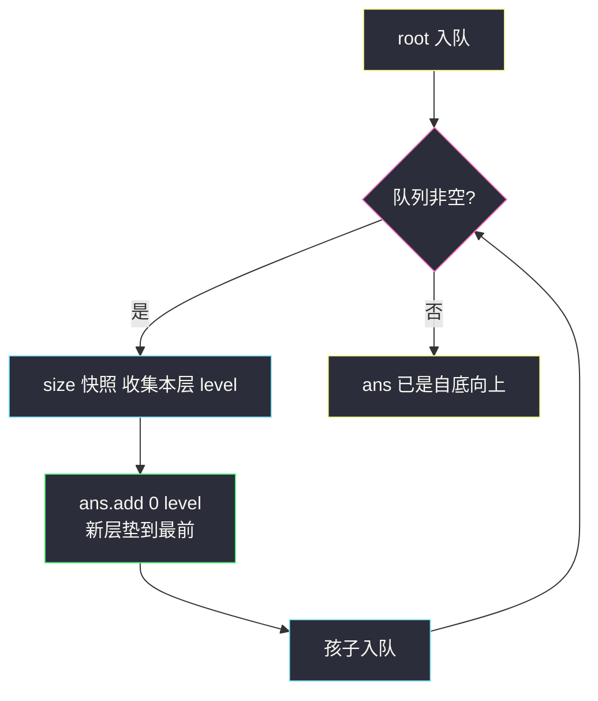
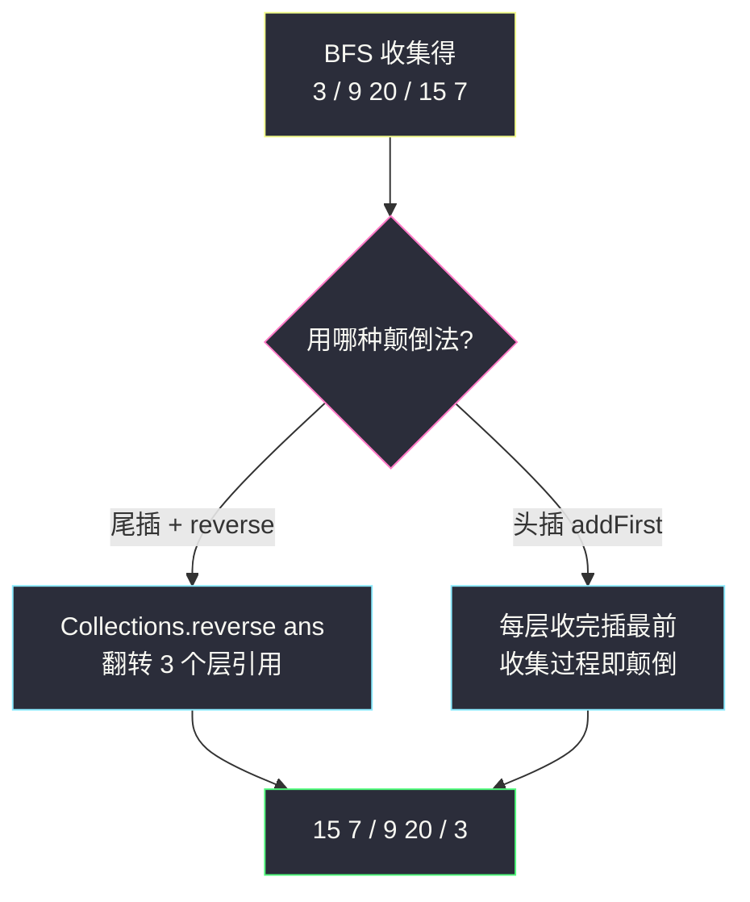

# 二叉树的层序遍历 II（自底向上的层序）

## 一、问题描述

给你二叉树的根节点 `root`，返回其节点值的**自底向上的层序遍历**：从最下面一层到根，逐层从左到右返回。

> 🔗 LeetCode 107：https://leetcode.cn/problems/binary-tree-level-order-traversal-ii/

**示例 1**

```
输入：root = [3,9,20,null,null,15,7]
输出：[[15,7],[9,20],[3]]
树形：
       3           第 0 层（输出在最后）
      / \
     9   20        第 1 层
         / \
        15  7      第 2 层（输出在最前）
```

**示例 2**

```
输入：root = [1]
输出：[[1]]
```

**直观理解**

把 #102 的答案**上下颠倒**就是本题答案。「自底向上」听起来要「从叶子往上走」，但 BFS 队列只会自顶向下扩展——不必为难队列：**先老老实实自顶向下一层层收，收完把层的顺序整体反过来**即可。层内顺序不变（每层依旧从左到右），翻的只是「层与层」的先后。

---

## 二、暴力解法（入门）

### 直观思路

每层照常 BFS 收集，得到自顶向下的 `[[3],[9,20],[15,7]]`，最后把外层列表反转成 `[[15,7],[9,20],[3]]`。

```java
class Solution {
    public List<List<Integer>> levelOrderBottom(TreeNode root) {
        List<List<Integer>> ans = new ArrayList<>();
        if (root == null) {
            return ans;
        }
        Queue<TreeNode> queue = new ArrayDeque<>();
        queue.offer(root);
        while (!queue.isEmpty()) {
            int size = queue.size();                 // 快照：当前层节点数
            List<Integer> level = new ArrayList<>();
            for (int i = 0; i < size; i++) {
                TreeNode cur = queue.poll();
                level.add(cur.val);
                if (cur.left != null)  queue.offer(cur.left);
                if (cur.right != null) queue.offer(cur.right);
            }
            ans.add(level);
        }
        Collections.reverse(ans);                    // 收完整体反转
        return ans;
    }
}
```

### 复杂度

- **时间**：`O(n)` 收集 + `O(h)` 反转（`h` 为层数，只有 `O(log n)` 到 `O(n)` 量级，远小于 n）。
- **空间**：`O(w)`，`w` 为最宽一层（不含输出）。

### 🔴 瓶颈在哪里

严格说这版**已经接近最优**（大 O 不可能更好），短板只在两处：

1. **多一次显式 reverse 调用**，虽然只反转 `h` 个层引用、开销极小，但它是「收完再补救」的思路。
2. 更深一层：答案列表的**插入位置**其实从第一层就确定了——「最底层」永远排在答案第 0 位。如果每层收集完直接**头插**进答案，连最后那步反转都省了。

---

## 三、优化探索（核心章节）

### 3.1 观察特征

| 特征 | 说明 |
|------|------|
| 层内顺序不变 | 每层依旧从左到右收集——颠倒的只是「层」的先后 |
| 答案第 0 位 = 最底层 | 无论树长什么样，最先确定「排最前」的是最后访问的层 |
| 头插天然倒序 | 每层收完 `ans.add(0, level)`，后来的层全部垫在前面，最终顺序自动自底向上 |

### 3.2 推导：头插代替尾插

```
BFS 每层照常收集 level（层内从左到右）
    ans.add(0, level)        ← 唯一的区别：插到答案头部
```

设各层自顶向下为 L0, L1, L2：

```
add(0, L0) → [L0]
add(0, L1) → [L1, L0]
add(0, L2) → [L2, L1, L0]   ← 自底向上 ✔
```

**代价提醒**：`ArrayList.add(0, x)` 是 `O(当前长度)` 的搬移操作，对 `h` 层总代价 `O(h²)`；`h ≤ n`，最坏（链状树）与 reverse 版同为 `O(n)`，平衡树时更是只有 `O(log²n)`。工程上更喜欢「尾插 + 一次 reverse」或 `LinkedList.addFirst`；两种都给出，理解「插入位置决定最终层序」才是本题要点。

另有 DFS 视角：递归携带层号 `d`，把值放进 `ans.get(d)`，最后统一反转——同样说明「颠倒层序」与「怎么遍历」正交。

> 课源码对齐说明：本题在 `/Users/zy/ai_learn/algorithm-journey/src/` 中无专门文件，按 class036 `Code01_LevelOrderTraversal.java` 的「每次处理一层」BFS 骨架（size 快照）+ 结果反转对齐，属层序家族的直系变体。



### 3.3 关键推导问题

| 问题 | 答案 |
|------|------|
| 能让队列「从叶子往根」走吗？ | 不能直接做：孩子持有父亲指针才可上行，普通 TreeNode 只有向下的指针；「自底向上」靠**颠倒输出顺序**实现，不靠反向遍历 |
| 为什么层内不反、只反层间？ | 题面限定「逐层从左到右」，颠倒的只有层的先后；若把层内也反，那是另一道题（锯齿 #103 的变体） |
| 头插和最后 reverse 谁好？ | 大 O 相同；`ArrayList` 头插每层搬移、总 `O(h²)`，reverse 只扫一遍 `O(h)`——面试讲清楚 trade-off 是加分点 |
| 反转的开销会不会拖垮 `O(n)`？ | 不会。反转的是 `h` 个层引用而非全部节点，`h ≤ n`，总量不超过主遍历 |
| DFS 版怎么写？ | `dfs(u, d)`：`ans` 尺寸等于 d 时先建层，把 `u.val` 放进 `ans.get(d)`，最后 `Collections.reverse(ans)` |

### 3.4 一句话核心

> **层序照常从上往下收，答案从前往后垫：新层永远插头部，收完自动自底向上。**

---

## 四、代码实现详解

### Java（主解：BFS + 尾插后反转，最稳默写版）

```java
// 二叉树的层序遍历 II（自底向上）
// 测试链接 : https://leetcode.cn/problems/binary-tree-level-order-traversal-ii/
// 按 class036 Code01_LevelOrderTraversal「每次处理一层」骨架 + 结果反转对齐
class Solution {
    public List<List<Integer>> levelOrderBottom(TreeNode root) {
        List<List<Integer>> ans = new ArrayList<>();
        if (root == null) {
            return ans;
        }
        Queue<TreeNode> queue = new ArrayDeque<>();
        queue.offer(root);
        while (!queue.isEmpty()) {
            int size = queue.size();                 // 快照：当前层节点数
            List<Integer> level = new ArrayList<>();
            for (int i = 0; i < size; i++) {
                TreeNode cur = queue.poll();
                level.add(cur.val);
                if (cur.left != null)  queue.offer(cur.left);
                if (cur.right != null) queue.offer(cur.right);
            }
            ans.add(level);                          // 正常尾插
        }
        Collections.reverse(ans);                    // 层序整体反转（只翻 h 个引用）
        return ans;
    }
}
```

### Java（可选：头插版，免最后反转）

```java
class Solution {
    public List<List<Integer>> levelOrderBottom(TreeNode root) {
        LinkedList<List<Integer>> ans = new LinkedList<>();
        if (root == null) {
            return ans;
        }
        Queue<TreeNode> queue = new ArrayDeque<>();
        queue.offer(root);
        while (!queue.isEmpty()) {
            int size = queue.size();
            List<Integer> level = new ArrayList<>();
            for (int i = 0; i < size; i++) {
                TreeNode cur = queue.poll();
                level.add(cur.val);
                if (cur.left != null)  queue.offer(cur.left);
                if (cur.right != null) queue.offer(cur.right);
            }
            ans.addFirst(level);                     // 双端列表头插 O(1)
        }
        return ans;
    }
}
```

### Python（同思路）

```python
from collections import deque

class Solution:
    def levelOrderBottom(self, root: Optional[TreeNode]) -> List[List[int]]:
        ans = []
        if root is None:
            return ans
        queue = deque([root])
        while queue:
            size = len(queue)              # 快照：当前层节点数
            level = []
            for _ in range(size):
                cur = queue.popleft()
                level.append(cur.val)
                if cur.left:
                    queue.append(cur.left)
                if cur.right:
                    queue.append(cur.right)
            ans.append(level)
        return ans[::-1]                   # 层序整体反转
```

**两版唯一差异**

| 版本 | 插入方式 | 反转时机 | 单层插入代价 |
|------|----------|----------|--------------|
| 主解 | 尾插 + 结尾 `reverse` | 收集完之后一次 | `O(1)` |
| 可选 | `addFirst` / `add(0, ·)` | 不需要 | `LinkedList` `O(1)`；`ArrayList` `O(h)` |

---

## 五、具体例子演示

### 例 1：`root = [3,9,20,null,null,15,7]`

```
       3
      / \
     9   20
         / \
        15  7
```

BFS 逐轮跟踪（主解）：

| 轮 | 队列（队头→队尾） | 弹出 | level | ans（尾插后） |
|----|-------------------|------|-------|---------------|
| 初始 | [3] | — | — | [] |
| 1 | [3] | 3 | [3]；9、20 入队 | [[3]] |
| 2 | [9,20] | 9, 20 | [9,20]；15、7 入队 | [[3],[9,20]] |
| 3 | [15,7] | 15, 7 | [15,7] | [[3],[9,20],[15,7]] |
| 反转 | — | — | — | **[[15,7],[9,20],[3]]** ✔ |

头插版对照（`addFirst` 逐步演化）：

| 轮 | 动作 | ans |
|----|------|-----|
| 1 | addFirst([3]) | [[3]] |
| 2 | addFirst([9,20]) | [[9,20],[3]] |
| 3 | addFirst([15,7]) | [[15,7],[9,20],[3]] ✔ |

两种方式殊途同归——**答案的层序在收集那一刻就被插入位置锁定**。



### 例 2：单链树 `root = [1,2,3]`（每层一个节点，向左斜）

```
    1
   /
  2
 /
3
```

逐层收集 `[[1],[2],[3]]`，反转得 `[[3],[2],[1]]`——层序家族里「深度」与「宽度」的极端对照：队列任何时刻最多 1 个节点，空间 `O(1)`。

### 例 3：空树 `root = []`

返回 `[]`；`[1]` 单节点反转后不变，仍 `[[1]]`。

---

## 六、复杂度分析

| 写法 | 时间 | 空间 |
|------|------|------|
| BFS + 尾插后 reverse（主解） | `O(n)`：遍历每节点一次；反转仅搬 `h` 个层引用 | `O(w)`，`w` 为最宽一层 |
| BFS + 头插（可选） | `O(n)`：`LinkedList.addFirst` `O(1)`；若用 `ArrayList.add(0,·)` 则头插总搬移 `O(h²)`，最坏仍 `O(n)` | 同上 |

结论：反转/头插的开销全部 `≤ O(h) ≤ O(n)`，不改变主遍历的量级；三版都是渐进最优。

---

## 七、方法对比与总结

### 三种写法对比

| | 尾插 + reverse（主解） | 头插 addFirst | DFS 层号 + 反转 |
|--|------------------------|----------------|-----------------|
| 代码量 | 最短 | 短 | 中（递归建层） |
| 颠倒时机 | 最后一步 | 收集时逐层 | 最后一步 |
| 直观性 | 「先收后倒」最好讲 | 要想通头插语义 | 要同时管层号与建层 |
| 推荐 | ✅ 首选 | ✅ 并列可选 | 理解层号视角即可 |

### 易错点

1. **把层内顺序也反了**：只颠倒数组里「层」的先后，层内部保持从左到右——`reverse` 作用于外层列表，别写成对每个 `level` 也反转。
2. **忘了空树判空**：null 入队必炸。
3. **误以为要「从底往上遍历」**：节点只有向下指针，反向遍历不可行；颠倒输出即可，别硬造「父指针」。
4. **`ArrayList.add(0, x)` 滥用**：单层头插 `O(h)` 搬移，量大时慢；讲 trade-off 比背结论重要。
5. **与 #103 混淆**：#107 是**层间**颠倒（层内不变）；#103 是**层内**交替换向（层间顺序不变）。

### 模板口诀

> **层序照常收，层内不动层间倒：或收完一次 reverse，或每层头插垫前头。**

---

## 八、举一反三

| 题目 | 链接 | 迁移点 |
|------|------|--------|
| 102. 二叉树的层序遍历 | https://leetcode.cn/problems/binary-tree-level-order-traversal/ | 本题去掉反转的正向版（本站已有题解） |
| 103. 锯齿形层序遍历 | https://leetcode.cn/problems/binary-tree-zigzag-level-order-traversal/ | 层内交替换向，层间不变（本站已有题解） |
| 199. 二叉树的右视图 | https://leetcode.cn/problems/binary-tree-right-side-view/ | 每层只取最右节点（本站已有题解） |
| 257. 二叉树的所有路径 | https://leetcode.cn/problems/binary-tree-paths/ | 「自底向上」思维在 DFS 回溯里的对应：叶子上报、沿途拼接 |
| 637. 二叉树的层平均值 | https://leetcode.cn/problems/average-of-levels-in-binary-tree/ | 同骨架层内求平均，正序输出 |

**迁移一句**：本题教的是「**遍历顺序与输出顺序解耦**」——遍历受数据结构（只有向下指针）限制，输出顺序靠插入位置（头插）或后处理（reverse）自由重排；这个思想在「倒序打印链表」「自底向上路径和」里反复出现。
