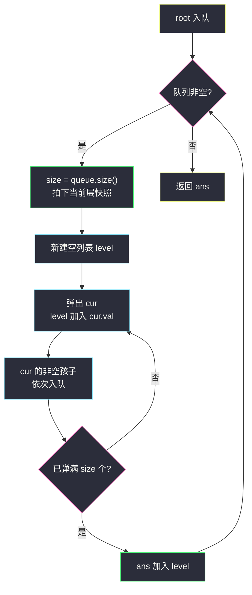
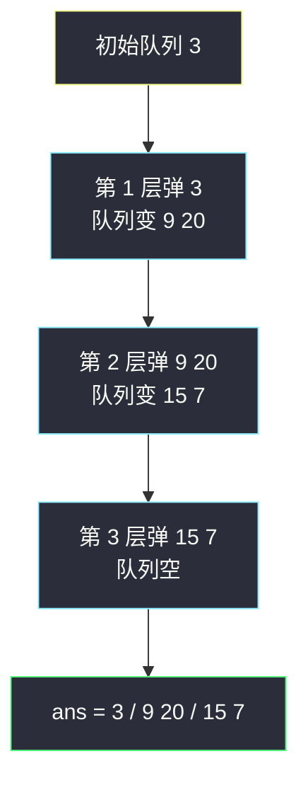

# 二叉树的层序遍历（BFS 按层模板：size 快照）

## 一、问题描述

给你二叉树的根节点 `root`，返回其节点值的**层序遍历**（从左到右，逐层访问）。

> 🔗 LeetCode 102：https://leetcode.cn/problems/binary-tree-level-order-traversal/

**示例 1**

```
输入：root = [3,9,20,null,null,15,7]
输出：[[3],[9,20],[15,7]]
树形：
       3
      / \
     9   20
         / \
        15  7
```

**示例 2**

```
输入：root = [1]
输出：[[1]]
```

**直观理解**

前序/中序/后序都是「**一条竖线走到底再回头**」（DFS），而层序遍历是「**横向一层一层扫**」（BFS）：先第 0 层的根，再第 1 层的 9、20，再第 2 层的 15、7。

实现上靠**队列（先进先出）**：把当前层节点依次出队，出队时把它的孩子（下一层）依次入队。队列天然保证「先遇到的先处理」，于是同一层的节点永远聚在一起——唯一的难点是**怎么知道哪些节点属于同一层**，这就是本题要带走的 `size` 快照技巧。

---

## 二、暴力解法（入门）

### 直观思路

最直白的想法：既然要区分层，那就**给每个节点记住它的层号**——用一个 `HashMap<TreeNode, Integer>` 记录「节点 → 所在层」，BFS 正常跑，出队时按层号放进对应的列表。

这正是课源码 class036 `Code01_LevelOrderTraversal.java` 里的 `levelOrder1`（课上注明此题不推荐这种写法）：

```java
class Solution {
    public List<List<Integer>> levelOrder(TreeNode root) {
        List<List<Integer>> ans = new ArrayList<>();
        if (root != null) {
            Queue<TreeNode> queue = new LinkedList<>();
            Map<TreeNode, Integer> levels = new HashMap<>();
            queue.add(root);
            levels.put(root, 0);
            while (!queue.isEmpty()) {
                TreeNode cur = queue.poll();
                int level = levels.get(cur);
                if (ans.size() == level) {        // 第一次到达这一层，建列表
                    ans.add(new ArrayList<>());
                }
                ans.get(level).add(cur.val);
                if (cur.left != null) {
                    queue.add(cur.left);
                    levels.put(cur.left, level + 1);
                }
                if (cur.right != null) {
                    queue.add(cur.right);
                    levels.put(cur.right, level + 1);
                }
            }
        }
        return ans;
    }
}
```

### 复杂度

- **时间**：`O(n)`，每个节点进出队列各一次（HashMap 读写均摊 `O(1)`）。
- **空间**：`O(n)`，队列最宽一层 `O(w)`，但 HashMap 装了**全部节点**，直接顶到 `O(n)`。

### 🔴 瓶颈在哪里

1. **HashMap 存了整棵树的节点**，白白多花一份 `O(n)` 空间，其实层号只在使用那一刻有意义。
2. 「先记层号再查表」绕了一圈：**层信息本来就在队列的入队顺序里**——第 `k` 层全部出队之后、队列里剩下的恰好全是第 `k+1` 层。这个规律可以直接数出来。

---

## 三、优化探索（核心章节）

### 3.1 观察特征

| 特征 | 说明 |
|------|------|
| 队列里同层节点天然连续 | 孩子入队总在父母出队之后，队列里永远是「上一层的尾巴 + 下一层的头」或「纯一层」 |
| 层与层交替的瞬间可观测 | 处理某层**开始时**记录 `size = queue.size()`，这 `size` 个节点出完，队列里就是干净的下一层 |
| 每个节点只关心两件事 | 自己的值（收集）、自己的孩子（入队） |

### 3.2 推导：size 快照（每次处理一层）

关键不变式：**外层 while 每转一圈，恰好处理完一整层**。

```
queue 放入 root
while queue 非空:
    size = queue.size()          # 快照：当前层节点数，此刻拍下
    level = []
    重复 size 次:
        cur = queue.poll()       # 出队一个当前层节点
        level.add(cur.val)
        cur 的非空孩子依次入队   # 全是下一层节点，不影响本次循环
    ans.add(level)
```

为什么 `size` 必须在循环前拍下？因为内层 for 里会往队列**追加下一层节点**，如果边弹边读 `queue.size()`，就会把下一层也当成当前层弹出来——层边界就乱了。对齐课源码 class036 `Code01_LevelOrderTraversal.java` 推荐的 `levelOrder2`（课上用数组 + `l/r` 双指针模拟队列，思路完全一致；站点版换 `ArrayDeque`，更好默写）。



### 3.3 关键推导问题

| 问题 | 答案 |
|------|------|
| 为什么不用 HashMap 也能分层？ | 层边界在「处理前快照 size」那一刻就确定了：快照个数出完 = 这一层完，剩下的必然全是下一层 |
| 快照之后新入队的节点去哪了？ | 它们排在队尾，属于下一层，本轮 for 根本不会碰到它们（只弹 size 个） |
| 为什么要判空孩子？ | 空节点没有值可收集，入了队只会让下一层混进 null，遍历结束条件也会出错 |
| 每层的列表何时创建？ | 快照后新建一个 `level`，弹满 size 个后整体加入 `ans`——比「`ans.size() == level` 时才建」直观 |
| 时间还能更快吗？ | 不能，每个节点至少进出队列一次，`O(n)` 是下界；优化的是**空间**（去掉 HashMap）和**代码可读性** |

### 3.4 一句话核心

> **外层转一圈 = 处理一层；入圈先拍 `size` 快照，弹满 size 个，剩下的全是下一层。**

---

## 四、代码实现详解

### Java（主解：size 快照，对齐 class036 Code01 推荐版）

```java
// 二叉树的层序遍历（每次处理一层）
// 测试链接 : https://leetcode.cn/problems/binary-tree-level-order-traversal/
// 对齐 class036 Code01_LevelOrderTraversal.levelOrder2（数组队列换成 ArrayDeque）
class Solution {
    public List<List<Integer>> levelOrder(TreeNode root) {
        List<List<Integer>> ans = new ArrayList<>();
        if (root == null) {
            return ans;
        }
        Queue<TreeNode> queue = new ArrayDeque<>();
        queue.offer(root);
        while (!queue.isEmpty()) {
            int size = queue.size();              // 快照：当前层节点数
            List<Integer> level = new ArrayList<>();
            for (int i = 0; i < size; i++) {
                TreeNode cur = queue.poll();      // 出队当前层节点
                level.add(cur.val);
                if (cur.left != null) {
                    queue.offer(cur.left);        // 下一层入队
                }
                if (cur.right != null) {
                    queue.offer(cur.right);
                }
            }
            ans.add(level);
        }
        return ans;
    }
}
```

### Python（同思路）

```python
from collections import deque

class Solution:
    def levelOrder(self, root: Optional[TreeNode]) -> List[List[int]]:
        ans = []
        if root is None:
            return ans
        queue = deque([root])
        while queue:
            size = len(queue)              # 快照：当前层节点数
            level = []
            for _ in range(size):
                cur = queue.popleft()
                level.append(cur.val)
                if cur.left:
                    queue.append(cur.left)
                if cur.right:
                    queue.append(cur.right)
            ans.append(level)
        return ans
```

**变量含义**

| 变量 | 含义 |
|------|------|
| `queue` | 待处理节点队列，任意时刻最多装「两层」：当前层剩余 + 已入队的下一层 |
| `size` | 外层每圈开始时的快照，即当前层节点数 |
| `level` | 当前层值的收集列表 |

**循环不变式**：外层 while 每轮开始时，队列里恰好是「同一层的全部节点」（从左到右）。

---

## 五、具体例子演示

### 例 1：`root = [3,9,20,null,null,15,7]`

```
       3          第 0 层
      / \
     9   20       第 1 层
         / \
        15  7     第 2 层
```

| 轮 | 快照 size | 队列（队头→队尾） | 动作 | ans |
|----|-----------|-------------------|------|-----|
| 初始 | — | [3] | root 入队 | [] |
| 1 | 1 | [3] | 弹 3，收集 3；孩子 9、20 入队 → [9,20] | [[3]] |
| 2 | 2 | [9,20] | 弹 9，收集 9（无孩子）；弹 20，收集 20；孩子 15、7 入队 → [15,7] | [[3],[9,20]] |
| 3 | 2 | [15,7] | 弹 15，收集 15（无孩子）；弹 7，收集 7（无孩子）→ [] | [[3],[9,20],[15,7]] |
| 结束 | — | [] | 队列空，返回 | [[3],[9,20],[15,7]] ✔ |

重点看第 2 轮：**开始时**队列 `[9,20]` 全是第 1 层，快照 size=2；循环里弹 20 时虽然把 15、7 追加到了队尾，但 for 只跑 2 次，它们安全留到第 3 轮。



### 例 2：`root = [1]`

快照 size=1，弹 1 收集，无孩子入队，队列空结束 → `[[1]]`。

### 例 3：空树 `root = []`

直接命中 `root == null` 分支，返回 `[]`——不判空的话第一轮 `queue.offer(root)` 会把 null 塞进队列，`cur.val` 直接空指针。

---

## 六、复杂度分析

| 写法 | 时间 | 空间 |
|------|------|------|
| HashMap 记层（暴力） | `O(n)` | `O(n)`：队列 `O(w)` + HashMap 存全部节点 |
| size 快照（主解） | `O(n)`：每个节点恰好入队出队各一次 | `O(w)`：`w` 为最宽一层节点数，满树约 `n/2`，链状树 `O(1)` |

`w ≤ n`，最坏（完美二叉树底层）约 `⌈n/2⌉`，链状树退化为 `O(1)`——队列空间只和**宽度**有关，和深度无关。

---

## 七、方法对比与总结

### 三种写法对比

| | HashMap 记层 | size 快照（主解） | 课上数组队列版 |
|--|--------------|------------------|----------------|
| 空间 | `O(n)` | `O(w)` | `O(w)`（数组预分配 MAXN） |
| 代码量 | 最长，层号判空建表绕 | 短而直白 | 与快照版同思路，省了泛型开销 |
| 适用面 | 换成 N 叉树要改不少 | 换 N 叉树只改「孩子入队」那段 | 同左 |
| 推荐 | 理解「为什么要分层」即可 | ✅ 首选，全站层序系模板 | 竞赛性能敏感时用 |

### 易错点

1. **快照写在循环外**：`int size = queue.size()` 必须在内层 for 之前拍下；写在条件里或循环里读 `queue.size()` 会把下一层一起弹掉。
2. **忘判空树**：`root == null` 直接返回空列表，否则 null 入队炸 `cur.val`。
3. **孩子判空**：`cur.left != null` 才入队——层序里 null 不占位（和 LeetCode 输入格式的「补 null」写法不同，见 #297 序列化）。
4. **用 `Stack` 或 `Deque` 当队列**：队列要 `offer/poll`（尾部进头部出），`push/pop` 是栈语义，顺序全反。
5. **误以为 BFS 空间是 `O(h)`**：那是 DFS 递归栈；BFS 队列存的是一整层，看的是**宽度**。

### 模板口诀

> **根先入队；圈前拍 size，弹一收一，孩子押尾；弹满一层，ans 收一列。**

---

## 八、举一反三

| 题目 | 链接 | 迁移点 |
|------|------|--------|
| 103. 锯齿形层序遍历 | https://leetcode.cn/problems/binary-tree-zigzag-level-order-traversal/ | 同模板，每层方向翻转（本站已有题解） |
| 107. 层序遍历 II | https://leetcode.cn/problems/binary-tree-level-order-traversal-ii/ | 同模板，结果整体反转（本站已有题解） |
| 199. 二叉树的右视图 | https://leetcode.cn/problems/binary-tree-right-side-view/ | 同模板，每层只取最后一个（本站已有题解） |
| 637. 二叉树的层平均值 | https://leetcode.cn/problems/average-of-levels-in-binary-tree/ | 层内边收边加，出层除以 size |
| 429. N 叉树的层序遍历 | https://leetcode.cn/problems/n-ary-tree-level-order-traversal/ | 「左右孩子入队」换成「遍历 children 列表」 |
| 515. 在每个树行中找最大值 | https://leetcode.cn/problems/find-largest-value-in-each-tree-row/ | 层内维护 max，模板一行不改 |

**迁移一句**：BFS「每次处理一层」的 size 快照是**层序家族的总模板**——锯齿、自底向上、右视图、层平均全是它的变体，改动只发生在「层内怎么收集」「层与层怎么拼」两处。
