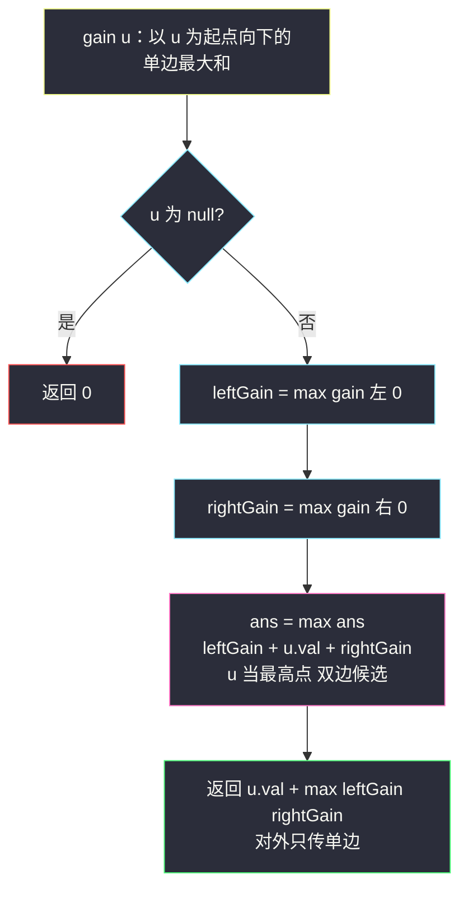
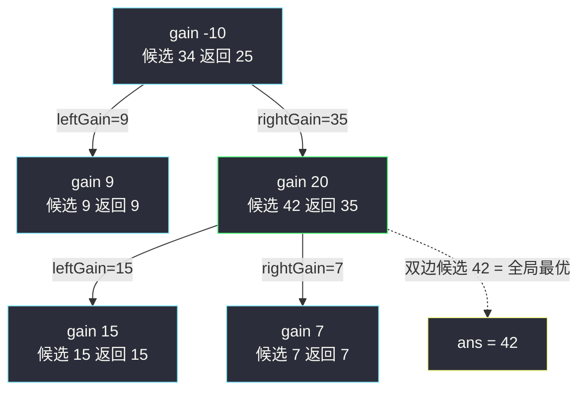

# 二叉树中的最大路径和（后序遍历 + 单分支贡献值）

## 一、问题描述

给你一棵二叉树的根节点 `root`，返回其中**任意**节点出发、**任意**节点结束的路径的**最大**路径和。

路径定义补充：

- 每个节点**至多出现一次**，路径是树中一条**简单路径**（点不重复）；
- 路径**至少包含一个节点**，不需要经过根节点，也不需要经过叶子节点；
- 节点值可为**负数**。

> 🔗 LeetCode 124：https://leetcode.cn/problems/binary-tree-maximum-path-sum/

**示例 1**

```
输入：root = [-10,9,20,null,null,15,7]
输出：42
最优路径：15 → 20 → 7，和 = 15 + 20 + 7 = 42
      -10
      /  \
     9    20
         /  \
       15    7
```

**示例 2**

```
输入：root = [2,-1]
输出：2
最优路径：只取节点 2（带上 -1 只会更小）
```

**直观理解**

路径在树里的形状千变万化，但有一个统一定位方式：**每条路径都有唯一的「最高点」**——路径上深度最小的那个节点。以最高点为锚，路径必然形如「左腿 + 最高点 + 右腿」：左腿是最高点左子树里**一条向下**的路径，右腿同理，任何一条腿都可以为空。

于是问题拆成两层：**枚举每个节点当最高点**，对每个最高点求「左右两条向下单边路径的最大和」。而「向下单边最大和」恰好是子问题的自相似定义——递归分治。

---

## 二、暴力解法（入门）

### 直观思路

按「枚举最高点」直译：对每个节点 `u`，**重新**做 DFS，求「从 u 出发向下的最大路径和」，左右各取最大拼起来更新答案。

```java
class Solution {
    private int ans = Integer.MIN_VALUE;

    public int maxPathSum(TreeNode root) {
        dfsAll(root);          // 枚举每个节点当一次最高点
        return ans;
    }

    private void dfsAll(TreeNode u) {
        if (u == null) {
            return;
        }
        // u 当最高点：左右两腿各自向下取最大（负腿不要，置 0）
        int left = Math.max(down(u.left), 0);
        int right = Math.max(down(u.right), 0);
        ans = Math.max(ans, left + u.val + right);
        dfsAll(u.left);
        dfsAll(u.right);
    }

    // 从 u 出发、一路向下、可为单边的最大路径和
    private int down(TreeNode u) {
        if (u == null) {
            return 0;
        }
        return u.val + Math.max(Math.max(down(u.left), down(u.right)), 0);
    }
}
```

### 复杂度

- **时间**：`O(n²)` 最坏。外层枚举 n 个节点，每个节点 `down()` 又是一整棵子树的 DFS；链状树时总代价平方级。
- **空间**：`O(h)` 递归栈。

### 🔴 瓶颈在哪里

`down(u)` 的答案被**重复计算**：算「5 当最高点」时算过 `down(2)`，枚举到 2 自己当最高点时又算一遍。`down` 本身就是一个定义良好的递归函数——让**每个节点只调一次自己的 `down`，返回时顺带用返回值更新全局答案**，重复计算瞬间蒸发，`O(n²)` 变 `O(n)`。

---

## 三、优化探索（核心章节 · Hard 重点推导）

### 3.1 观察特征

| 特征 | 说明 |
|------|------|
| 路径形状自由 | 起点/终点任意、可拐弯 → 不能按「根到叶」套路，必须换坐标系 |
| 最高点唯一 | 每条简单路径恰有一个深度最小的节点 → **按最高点划分不重不漏** |
| 腿是单边路径 | 最高点两腿各自「只能向下、只能选一边或都不要」 |
| 子问题自相似 | 「从 u 向下的最大单边和」= `u.val + max(左腿, 右腿, 0)`，正是孩子同一定义 |
| 后序时机 | 父节点当最高点需要先知道两腿答案 → 信息自底向上，天然后序 |

### 3.2 核心推导：贡献值函数 gain(u)

定义递归函数（「单分支贡献」）：

```
gain(u) = 以 u 为起点、一路向下、只选一个方向（或都不选）的最大路径和
        = u.val + max( max(gain(u.left), 0), max(gain(u.right), 0) )
```

两个关键决定，逐一论证：

**① 为什么返回值只许选一边？** 返回值代表「给父节点续接的一条腿」。父节点若同时接上 u 的左腿和右腿，路径就成了「父 → u → 左腿」+「父 → u → 右腿」，u 被经过两次，不再是简单路径。所以**对外（往上传）只能单边**。

**② 为什么在 u 处更新答案用双边？** 路径「左腿 + u + 右腿」的**最高点就是 u**，此时 u 作为拐点同时连两腿完全合法——这条路径不往外传，只用来更新全局答案：

```
ans = max(ans, max(gain(u.left), 0) + u.val + max(gain(u.right), 0))
```

**③ 为什么负腿置 0？** 腿是「可选」的：一条和为负的腿只会拖累答案，等效于「这条腿不存在」（路径允许只拐一边甚至不拐）。置 0 = 数学上的「max(·, 0)」即不选。

**不重不漏论证**：任意一条路径 P 的最高点 u 唯一；P 拆成（左腿 + u + 右腿），两腿分别是 u 左右子树中向下的单边路径；在递归到 u 时，`max(gain, 0)` 取「腿的最大值」，因此 P 的和 ≤ `左腿max + u.val + 右腿max` ≤ 该处更新的候选值。反之每个候选值都对应一条真实路径。所以答案 = 所有节点处候选值的最大值。✔

**不变式**：递归 `gain(u)` 返回时，全局 `ans` 已包含「最高点在 u 子树内」的所有路径的最优解。

> 注：课源码 `algorithm-journey` 未收录本题专门实现；本篇按课上二叉树后序分治骨架对齐——与 class036 `Code04_DepthOfBinaryTree` 的 `max(左, 右) + 1`（深度）同构，把「+1」换成「+u.val」、把统计量从「深度」换成「路径和」，再补一个双边候选即可。



### 3.3 关键推导问题

| 问题 | 答案 |
|------|------|
| `ans` 为什么初始化为负无穷而不是 0？ | 路径至少含一个节点，节点值可全为负（如 `[-3]` 答案 -3）；初始化 0 会错误输出 0 |
| 返回值可以为负吗？ | 可以（如单节点 -5 返回 -5）；负数传给父节点时由父层的 `max(gain, 0)` 过滤，逻辑自洽 |
| 为什么不能「父链上拐两次弯」？ | 拐两次弯意味着某个中间节点被经过两次，违反简单路径定义；本题路径至多一个拐点（即最高点） |
| 与 #543 直径的区别？ | 结构完全同构：直径 = 左深 + 右深，本题 = 左贡献 + 值 + 右贡献；「深度/贡献」都是单边、双边只用于更新答案 |
| 迭代版可行吗？ | 可行（显式栈后序），但本题递归版短小清晰，站点风格选好讲好默写的递归版 |

### 3.4 一句话核心

> **往上只能带一条腿（单边贡献），在拐点处两条腿自己合体（双边更新）——负腿一律砍成 0。**

---

## 四、代码实现

### Java（主解：后序递归 + 全局答案）

```java
class Solution {
    private int ans = Integer.MIN_VALUE;

    public int maxPathSum(TreeNode root) {
        gain(root);
        return ans;
    }

    // 返回：以 node 为起点、向下的单边最大路径和（只选一个方向）
    private int gain(TreeNode node) {
        if (node == null) {
            return 0;
        }
        int leftGain  = Math.max(gain(node.left), 0);   // 负腿置 0 = 不选
        int rightGain = Math.max(gain(node.right), 0);
        // node 当最高点：左右两腿 + 自己，双边候选
        ans = Math.max(ans, leftGain + node.val + rightGain);
        // 对外只传单边：父节点接我时只能接一条腿
        return node.val + Math.max(leftGain, rightGain);
    }
}
```

### Python（同思路）

```python
class Solution:
    def maxPathSum(self, root: Optional[TreeNode]) -> int:
        ans = float('-inf')

        def gain(node: Optional[TreeNode]) -> int:
            nonlocal ans
            if node is None:
                return 0
            left_gain = max(gain(node.left), 0)    # 负腿置 0 = 不选
            right_gain = max(gain(node.right), 0)
            ans = max(ans, left_gain + node.val + right_gain)  # 双边候选
            return node.val + max(left_gain, right_gain)        # 单边返回

        gain(root)
        return ans
```

**默写检查点**：① `ans` 初始化负无穷；② 两处 `max(·, 0)` 的位置（吸收返回值时）；③ 更新 `ans` 用双边、返回值用单边。三处全对，代码必对。

---

## 五、具体例子演示

### 例 1：`root = [-10,9,20,null,null,15,7]`（Hard 主例，全程跟踪）

```
      -10
      /  \
     9    20
         /  \
       15    7
```

递归采用后序：先算 9，再算 20（其下先 15 后 7），最后 −10。逐次跟踪：

| 步 | 递归调用 | leftGain | rightGain | 双边候选（更新 ans） | 返回值 gain |
|----|----------|----------|-----------|----------------------|-------------|
| 1 | gain(9)   | max(0,0)=0 | max(0,0)=0 | 0+9+0 = **9** | 9 + max(0,0) = 9 |
| 2 | gain(15)  | 0 | 0 | 0+15+0 = 15 | 15 |
| 3 | gain(7)   | 0 | 0 | 0+7+0 = 7 | 7 |
| 4 | gain(20)  | 15 | 7 | 15+20+7 = **42** ✨ | 20 + max(15,7) = **35** |
| 5 | gain(-10) | 9 | 35 | 9−10+35 = 34 | −10 + max(9,35) = 25 |

`ans` 演化轨迹：`−∞ → 9 → 15 → 15 → 42 → 42`，最终返回 **42**。

三个值得盯住的瞬间：

- **步 4**：双边候选 15+20+7=42 被记录，但**返回值只有 35**（只能挑一条腿带上 20）——「对外单边」的具象化；
- **步 5**：候选 9−10+35=34 输给了 42——「左腿过根再下右腿」想把 9 和 35 连起来，必须穿过 −10，付出 10 的代价后 34 < 42，最优路径根本不经过根；
- 若根值改成 +100，步 5 候选 = 9+100+35 = 144 会反超——路径要不要经过根，由数据说话，算法自动裁决。



### 例 2：`root = [2,-1]`（负腿置 0 的意义）

- gain(-1)：双边候选 = 0+(−1)+0 = **−1**（ans: −∞ → −1）；返回 −1 + max(0,0) = −1。
- gain(2)：leftGain = max(−1, 0) = **0**（负腿被砍掉！）；候选 = 0+2+0 = **2** → ans = 2；返回 2。

若没有 `max(gain, 0)` 这一步，leftGain = −1，候选 = −1+2 = 1，答案错成 1。**单节点负值要不要带，全靠这一刀**。

### 例 3：全负单节点 `root = [-3]`

gain(-3)：候选 = 0+(−3)+0 = −3，ans = −3；返回 −3。答案 **−3**——也是 `ans` 必须初始化负无穷的原因（初始化 0 会输出错误的 0）。

---

## 六、复杂度分析

| 项目 | 后序单遍（主解） | 枚举最高点 + 重复 DFS（暴力） |
|------|------------------|-------------------------------|
| 时间 | `O(n)`：每个节点恰好进入 gain 一次 | 最坏 `O(n²)`（链状树） |
| 空间 | `O(h)` 递归栈：平衡 `O(log n)`，链状 `O(n)` | `O(h)` |

主解把「腿信息」的复用做到了极致：**一次后序遍历同时完成「枚举所有最高点」和「计算所有向下腿」**两件事。

---

## 七、方法对比与总结

| | 暴力枚举 + 重复 DFS | 后序单遍（主解） |
|--|----------------------|-------------------|
| 时间 | `O(n²)` 最坏 | `O(n)` |
| 思路难度 | 直白，直接翻译定义 | 需要吃透「单边 / 双边」的分工 |
| 代码量 | 两层递归，较长 | 一个函数 10 行 |
| 推荐 | 理解「按最高点拆解」用 | ✅ 面试默写 |

**易错点**

1. **双边候选和单边返回混用**：把 `leftGain + val + rightGain` 当返回值传出 → 父节点拼出重复经过节点的非法路径（一般表现为答案虚高甚至爆栈）。
2. **负腿忘置 0**：例 2 会输出 1 而不是 2。
3. **ans 初始化 0**：全负树输出 0，错。
4. **把路径理解成必须到叶子**：本题路径可以「半路折返」，叶子终点毫无特殊性。
5. **以为要比较「不带自己」的子树答案**：双边候选在每层递归里都更新过 ans，子树答案天然包含在 ans 的演化里，无需额外传递。

**模板口诀**

> **后序算两腿，负腿砍成零；拐点双边更新答案，返回只带一条腿。**

---

## 八、举一反三

| 题目 | 链接 | 迁移点 |
|------|------|--------|
| 543. 二叉树的直径 | https://leetcode.cn/problems/diameter-of-binary-tree/ | 完全同构的入门版：贡献从「路径和」换成「节点数」，双边 = 左深+右深（本站已有题解） |
| 687. 最长同值路径 | https://leetcode.cn/problems/longest-univalue-path/ | 同款单边贡献，双边候选要加「孩子值等于自己」的门槛 |
| 112. 路径总和 | https://leetcode.cn/problems/path-sum/ | 路径题热身：固定「根到叶」的简单版（本站已有题解） |
| 437. 路径总和 III | https://leetcode.cn/problems/path-sum-iii/ | 路径同样「任意起止、只能向下」，用前缀和代替逐条枚举（本站已有题解） |
| 337. 打家劫舍 III | https://leetcode.cn/problems/house-robber-iii/ | 同款后序信息上传：递归同时返回「选/不选当前节点」两种状态，树形 DP 入门 |

**迁移一句**：树上「路径最值」问题的通用坐标系是**按最高点/拐点拆路径**——左右两腿各自向下、单边信息回传、双边结果就地更新。#543（数节点）、#124（求和）、#687（同值链）是同一模板换统计量，#437 则展示了「腿信息」还能用前缀和压缩。
