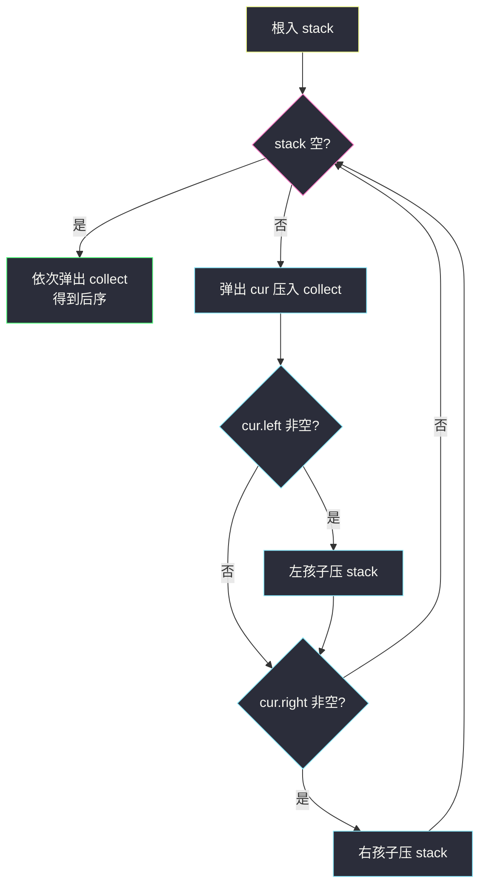
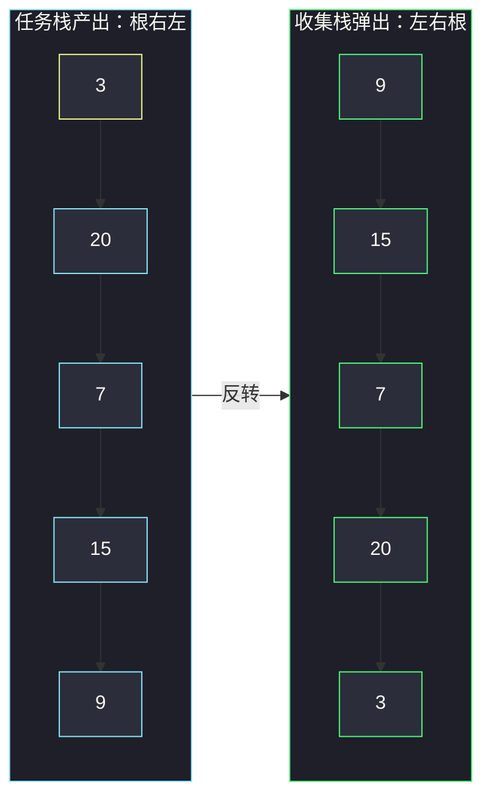

# 二叉树的后序遍历（双栈收集 + 单栈标记法）

## 一、问题描述

给出一棵二叉树的根节点 `root`，返回它的**后序遍历**结果（节点值的数组）。

后序遍历的访问顺序是：**左子树 → 右子树 → 根**，即每个节点要等左右孩子**全部处理完**才轮到自己。

> 🔗 LeetCode 145：https://leetcode.cn/problems/binary-tree-postorder-traversal/

**示例 1**

```
输入：root = [1,null,2,3]
输出：[3,2,1]
树形：
    1
     \
      2
     /
    3
先处理 2 的左子树（3），2 的右子树为空，最后才是根 1
```

**示例 2**

```
输入：root = [3,9,20,null,null,15,7]
输出：[9,15,7,20,3]
树形：
       3
      / \
     9   20
         / \
        15  7
9（左子树完）→ 15 → 7 → 20（右子树完）→ 3（根最后）
```

**直观理解**

后序 = 递归序里的**第 3 次到达**（左右都返回之后）。它有一个极其有用的观察角度：**「孩子先于父亲」**——所有「先收集子树信息、再合成父节点答案」的题（求高度、判平衡、算直径）本质上都在做后序遍历。所以后序不只是三种顺序之一，它是**自底向上**思维的载体。

---

## 二、暴力解法（递归：最直白的写法）

### 直观思路

按「左 → 右 → 根」直接翻译递归：先递归左孩子、再递归右孩子，两个都返回了才收集自己（对齐 class017 `BinaryTreeTraversalRecursion.posOrder`）。

```java
class Solution {
    public List<Integer> postorderTraversal(TreeNode root) {
        List<Integer> ans = new ArrayList<>();
        post(root, ans);
        return ans;
    }

    private void post(TreeNode node, List<Integer> ans) {
        if (node == null) {
            return;
        }
        post(node.left, ans);     // 左
        post(node.right, ans);    // 右
        ans.add(node.val);        // 根：第 3 次到达才输出
    }
}
```

### 复杂度

- **时间**：`O(n)`，每个节点恰好访问一次
- **空间**：`O(h)` 递归栈，链状树退化为 `O(n)`

### 🔴 瓶颈在哪里

与前序一样，正确但**依赖系统栈**。而且后序的迭代比前序**难写得多**：前序「弹出即输出」，后序的根必须**等左右都完事**，单靠「弹出即收集」做不到——必须想清楚「怎么知道左右处理完了」。这正是本题考察的核心。

---

## 三、优化探索（核心章节）

### 3.1 观察特征：后序 = 前序的镜像翻转

前序是 `根 左 右`。如果把它左右**交换**，得到 `根 右 左`；再**整体反转**，恰好是 `左 右 根` = 后序！

```
前序(根左右) --左右互换--> 根右左 --整体反转--> 左右根(后序)
```

于是有两种巧妙的迭代做法：

- **双栈法**：把「根右左」压进**收集栈**，最后统一弹出——收集栈弹出的顺序天然是反转的，连手动 reverse 都省了。
- **单栈法**：用一个变量 `h` 记录「上一个弹出的节点」，据此判断栈顶的左右孩子是否处理完毕。

### 3.2 推导一：双栈法（主解）

```
stack（任务栈）：负责产出「根右左」
collect（收集栈）：把任务栈弹出的顺序整个记录下来

1. 根入 stack
2. 循环直到 stack 空：
   弹出 cur，压入 collect        ← 根右左顺序进收集栈
   若 cur.left  非空 → 压 stack   （先压左）
   若 cur.right 非空 → 压 stack   （后压右，先弹）
3. collect 从顶往下弹出 = 左右根 = 后序
```

对齐 class018 `postorderTraversalTwoStacks`：注意与前序相比，**压栈顺序反了**（先左后右），产出「根右左」。



### 3.3 推导二：单栈法（可选进阶）

只留一个栈，`h` 记录「上一个弹出的节点」（初始为根的哨兵不指向任何孩子）：

- 栈顶 `cur` 的**左孩子没处理过**（`h != cur.left` 且 `h != cur.right`）→ 压左孩子；
- 否则若**右孩子没处理过**（`h != cur.right`）→ 压右孩子；
- 否则左右都处理完了 → **弹出 `cur`，令 `h = cur`**。

「左孩子没处理过」必须同时检查 `h != cur.right`，否则 cur 只有右孩子时会死循环——这是单栈版最易错的细节。对齐 class018 `postorderTraversalOneStack`。

### 3.4 关键推导问题

| 问题 | 答案 |
|------|------|
| 为什么压栈顺序和前序相反？ | 前序要「先左出」所以后压左；这里要产出「根右左」，右先出所以后压右 |
| 收集栈起什么作用？ | 它把「根右左」整体反转成「左右根」，反转是栈的天性 |
| 单栈法的 `h` 到底防什么？ | 防止把**已处理完的子树**再次压栈：左子树刚弹出（h = 左孩子）就不能再进左 |
| 为什么检查左孩子时要带 `h != cur.right`？ | 若 cur 只有右孩子，右子树处理完 h = cur.right，若只判 `h != cur.left` 会把空/已处理的左再压一遍造成死循环 |
| 双栈和单栈选哪个？ | 双栈好记好讲（两遍前序思想）；单栈省一个栈、`h` 标记思想可迁移到中序迭代，面试加分 |

### 3.5 一句话核心

> **后序 = 「根右左」的反转：压左再压右，收集栈帮你倒过来。**

---

## 四、代码实现详解

### Java（主解：双栈迭代，课上版）

```java
// 二叉树的后序遍历（两个栈）
// 测试链接 : https://leetcode.cn/problems/binary-tree-postorder-traversal/
// 对齐 class018 BinaryTreeTraversalIteration.postorderTraversalTwoStacks
class Solution {
    public List<Integer> postorderTraversal(TreeNode head) {
        List<Integer> ans = new ArrayList<>();
        if (head != null) {
            Deque<TreeNode> stack = new ArrayDeque<>();    // 任务栈：产出 根右左
            Deque<TreeNode> collect = new ArrayDeque<>();  // 收集栈：反转成 左右根
            stack.push(head);
            while (!stack.isEmpty()) {
                head = stack.pop();
                collect.push(head);
                if (head.left != null) {    // 先压左
                    stack.push(head.left);
                }
                if (head.right != null) {   // 后压右，先弹 → 根右左
                    stack.push(head.right);
                }
            }
            while (!collect.isEmpty()) {
                ans.add(collect.pop().val); // 收集栈弹出 = 反转后的后序
            }
        }
        return ans;
    }
}
```

### Java（可选：单栈标记法）

```java
// 对齐 class018 postorderTraversalOneStack，提交时同样改名为 postorderTraversal
class Solution {
    public List<Integer> postorderTraversal(TreeNode h) {
        List<Integer> ans = new ArrayList<>();
        if (h != null) {
            Deque<TreeNode> stack = new ArrayDeque<>();
            stack.push(h);
            while (!stack.isEmpty()) {
                TreeNode cur = stack.peek();
                if (cur.left != null && h != cur.left && h != cur.right) {
                    stack.push(cur.left);        // 左子树没碰过，进左
                } else if (cur.right != null && h != cur.right) {
                    stack.push(cur.right);       // 右子树没碰过，进右
                } else {
                    ans.add(stack.pop().val);    // 左右都完了，弹出自己
                    h = cur;                     // h 记住刚弹出的节点
                }
            }
        }
        return ans;
    }
}
```

### Python（同思路）

```python
# 双栈迭代（同主解思路）
class Solution:
    def postorderTraversal(self, root: Optional[TreeNode]) -> List[int]:
        ans, stack, collect = [], [], []
        if root:
            stack.append(root)
            while stack:
                node = stack.pop()
                collect.append(node)
                if node.left:
                    stack.append(node.left)     # 先压左
                if node.right:
                    stack.append(node.right)    # 后压右
        while collect:
            ans.append(collect.pop().val)       # 反转弹出
        return ans
```

```python
# 递归版（同第二章思路）
class Solution:
    def postorderTraversal(self, root: Optional[TreeNode]) -> List[int]:
        ans = []
        def post(node: Optional[TreeNode]) -> None:
            if node is None:
                return
            post(node.left)
            post(node.right)
            ans.append(node.val)
        post(root)
        return ans
```

---

## 五、具体例子演示

### 例 1：`root = [3,9,20,null,null,15,7]`（双栈法端到端跟踪）

初始：`stack = [3]`，`collect = []`，答案 `[]`。

| 步骤 | 动作 | stack（底→顶） | collect（底→顶） |
|------|------|----------------|-------------------|
| 1 | 弹 3 → collect；压左 9、压右 20 | `[9,20]` | `[3]` |
| 2 | 弹 20 → collect；压左 15、压右 7 | `[9,15,7]` | `[3,20]` |
| 3 | 弹 7 → collect；无孩子 | `[9,15]` | `[3,20,7]` |
| 4 | 弹 15 → collect；无孩子 | `[9]` | `[3,20,7,15]` |
| 5 | 弹 9 → collect；无孩子 | `[]` | `[3,20,7,15,9]` |
| 6 | stack 空；依次弹出 collect：**9,15,7,20,3** | — | 答案 `[9,15,7,20,3]` ✅ |

观察 collect 内部顺序 `3,20,7,15,9` = 「根右左」；反转弹出后正是「左右根」。



### 例 2：`root = [1,null,2,3]`（单栈法跟踪 `h`）

树形：`1 → 右 2 → 左 3`。初始 `h = 1`（根），`stack = [1]`。

| 步骤 | 栈（底→顶） | peek | 判断 | 动作 | h 变为 | 答案 |
|------|------------|------|------|------|--------|------|
| 1 | `[1]` | 1 | 无左；右 2 未处理 | 压 2 | 1 | `[]` |
| 2 | `[1,2]` | 2 | 左 3 存在且未处理 | 压 3 | 1 | `[]` |
| 3 | `[1,2,3]` | 3 | 无左无右 | **弹 3 收集** | 3 | `[3]` |
| 4 | `[1,2]` | 2 | 左 3 已是 h；右无 | **弹 2 收集** | 2 | `[3,2]` |
| 5 | `[1]` | 1 | 无左；右 2 已是 h | **弹 1 收集** | 1 | `[3,2,1]` ✅ |

每一步弹不弹，全看「左右孩子是否等于 h（刚处理过）」——h 就是单栈法的记忆。

### 例 3：空树 `root = []`

直接跳过循环，返回 `[]` ✅。

---

## 六、复杂度分析

| 项目 | 递归版 | 双栈迭代（主解） | 单栈迭代 |
|------|--------|------------------|----------|
| 时间 | `O(n)` | `O(n)`：每个节点进出两栈各一次 | `O(n)`：每个节点压弹一次，`peek` 判断常数次 |
| 空间 | `O(h)` 系统栈 | `O(n)`：collect 装下所有节点 | `O(h)`，只保留「待处理路径」上的节点 |

双栈用 `O(n)` 的收集栈换取**最好写好记**；单栈空间最优但 `h` 判断细节多。递归版空间 `O(h)`，链状树 `O(n)`。

---

## 七、方法对比与总结

### 三种写法对比

| | 递归 | 双栈（主解） | 单栈 |
|--|------|--------------|------|
| 好写好记 | ✅ 最直观 | ✅ 「前序镜像 + 反转」一句话 | ❌ h 判断易错 |
| 额外空间 | `O(h)` | `O(n)` | `O(h)` |
| 思想迁移 | 递归序 | 「遍历翻转」技巧 | 标记法可改写中序 |

### 易错点

1. **双栈压序照抄前序**：前序先压右后压左；双栈后序**先压左后压右**，方向全反，别背混。
2. **忘记从 collect 弹出**：收集完 collect 不弹，返回的是「根右左」，顺序错。
3. **单栈法判断条件不完整**：`cur.left != null && h != cur.left` 还要加 `&& h != cur.right`，否则「只有右孩子的节点」会死循环。
4. **把 `h = cur` 写成 `h = stack.pop()` 再用旧 cur**：语义一样但容易把自己绕晕，建议先 `peek` 再 `pop`。

### 模板口诀

> **前序镜像根右左，收集栈里倒一倒；单栈要看上一弹，左右全完轮到我。**

---

## 八、举一反三

| 题目 | 链接 | 迁移点 |
|------|------|--------|
| 144. 二叉树的前序遍历 | https://leetcode.cn/problems/binary-tree-preorder-traversal/ | 本题双栈法的源头：根左右（本站已有题解） |
| 590. N 叉树的后序遍历 | https://leetcode.cn/problems/n-ary-tree-postorder-traversal/ | 「前序镜像反转」技巧直接平移：孩子正序压栈出根右左，反转即后序 |
| 110. 平衡二叉树 | https://leetcode.cn/problems/balanced-binary-tree/ | 后序「孩子先于父亲」= 先拿子树高度再判平衡 |
| 543. 二叉树的直径 | https://leetcode.cn/problems/diameter-of-binary-tree/ | 后序求高度时顺带更新 `左深 + 右深`（本站已有题解） |

**迁移一句**：后序遍历的本质是**信息自底向上汇聚**——凡是「答案要从孩子算给父亲」的树题，无论求高度、判平衡还是算路径，骨架都是这一篇的 `左右根`。
