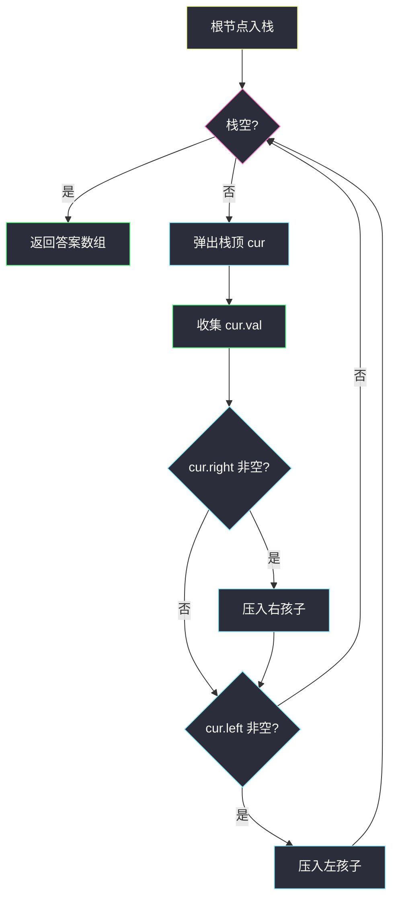
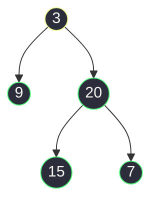

# 二叉树的前序遍历（递归序 + 单栈迭代）

## 一、问题描述

给出一棵二叉树的根节点 `root`，返回它的**前序遍历**结果（节点值的数组）。

前序遍历的访问顺序是：**根 → 左子树 → 右子树**，即每到一个节点，先处理它自己，再去处理左右孩子。

> 🔗 LeetCode 144：https://leetcode.cn/problems/binary-tree-preorder-traversal/

**示例 1**

```
输入：root = [1,null,2,3]
输出：[1,2,3]
树形：
    1
     \
      2
     /
    3
先访问 1（根），再进入右子树，2 是这棵子树的根先访问，最后访问左孩子 3
```

**示例 2**

```
输入：root = [3,9,20,null,null,15,7]
输出：[3,9,20,15,7]
树形：
       3
      / \
     9   20
         / \
        15  7
3 → 左子树 9（无孩子，到此结束）→ 右子树 20 → 20 的左 15 → 20 的右 7
```

**直观理解**

任何一棵二叉树的遍历都可以用**同一份递归骨架**描述：先递归左、再递归右，每个节点在这份骨架里会被「经过」**三次**——进入时一次、左子树返回时一次、右子树返回时一次。这就是课上说的**递归序**。

- 第 **1** 次到达就输出 → 前序（根左右）
- 第 **2** 次到达才输出 → 中序（左根右）
- 第 **3** 次到达才输出 → 后序（左右根）

三序遍历不是三套代码，而是同一套递归序里**选不同的时机**打印。

---

## 二、暴力解法（递归：最直白的写法）

### 直观思路

按「根 → 左 → 右」的定义直接翻译成递归：当前节点不为空，就先把值加入答案，再递归左孩子、递归右孩子。这是每个学过递归的人 1 分钟内能写出的版本（对齐 class017 `BinaryTreeTraversalRecursion.preOrder`）。

```java
class Solution {
    public List<Integer> preorderTraversal(TreeNode root) {
        List<Integer> ans = new ArrayList<>();
        pre(root, ans);
        return ans;
    }

    private void pre(TreeNode node, List<Integer> ans) {
        if (node == null) {
            return;
        }
        ans.add(node.val);      // 第 1 次到达：先输出根
        pre(node.left, ans);    // 再整棵左子树
        pre(node.right, ans);   // 最后整棵右子树
    }
}
```

### 复杂度

- **时间**：`O(n)`，每个节点恰好访问一次
- **空间**：`O(h)` 递归栈，`h` 为树高：平衡树 `O(log n)`，链状树 `O(n)`（不含输出的 `O(n)`）

### 🔴 瓶颈在哪里

这版**完全正确**，但它把遍历的实现细节全部交给了**系统函数调用栈**：

1. 递归栈由语言运行时管理，树很深时有爆栈风险，且无法自己控制；
2. 面试官常追问「不用递归怎么写」——考察你是否理解**递归的底层就是栈**；
3. 递归序是理解工具，工程上（迭代器、协程式遍历）需要**可暂停**的迭代写法。

---

## 三、优化探索（核心章节）

### 3.1 观察特征

| 特征 | 说明 |
|------|------|
| 递归调用本质是栈 | 进入函数 = 压栈，函数返回 = 弹栈；`ans.add` 发生在「进入时」 |
| 前序先输出自己 | 根一被拿到就处理，**不需要**像中序那样先一路压到底 |
| 左右顺序必须保证 | 左子树整体先于右子树；栈是后进先出，所以**先压右、后压左** |
| 输出顺序 = 弹出顺序 | 谁被弹出，谁就进入答案数组 |

### 3.2 暴力 → 优化：单栈迭代

自己维护一个栈 `stack` 模拟递归：

```
1. 根节点入栈
2. 循环直到栈空：
   弹出栈顶 cur        ← 这就是「第 1 次到达」，立刻收集 cur.val
   若 cur.right 非空 → 压栈   （先压右）
   若 cur.left  非空 → 压栈   （后压左，下次先弹出）
```

左孩子后压先弹，保证「根 → 左 → 右」；右孩子先压后弹，保证左子树**整棵**处理完才轮到它。对齐 class018 `BinaryTreeTraversalIteration.preorderTraversal`。



### 3.3 关键推导问题

| 问题 | 答案 |
|------|------|
| 为什么先压右再压左？ | 栈后进先出；想下次先处理左，就必须让左**最后压入** |
| 栈里存的是什么？ | 「已确定存在、但还没处理」的子树根；弹出即处理 |
| 和 BFS 层序遍历的区别？ | BFS 用**队列**（先见先处理，横向一层层）；这里用**栈**（后进先处理，纵向一头扎到底），二者只差一个数据结构 |
| 弹出时机为什么是「第 1 次到达」？ | 前序要求一碰到根就输出；压栈时节点已「被发现」，弹出即「被处理」，中间不需要等待 |
| 为什么中序不能这么写？ | 中序要在**左子树全部处理完之后**才轮到根，「弹出即输出」会太早，得改成「一路向左压到底」的写法 |
| 还能更省空间吗？ | Morris 遍历用线索指针做到 `O(1)` 空间，代价是临时改树结构、代码难写，面试了解即可 |

### 3.4 一句话核心

> **弹根、压右、压左——栈的后进先出恰好还原「根左右」。**

---

## 四、代码实现详解

### Java（主解：单栈迭代，课上版）

```java
// 二叉树的前序遍历（单栈迭代）
// 测试链接 : https://leetcode.cn/problems/binary-tree-preorder-traversal/
// 对齐 class018 BinaryTreeTraversalIteration.preorderTraversal
class Solution {
    public List<Integer> preorderTraversal(TreeNode head) {
        List<Integer> ans = new ArrayList<>();
        if (head != null) {
            Deque<TreeNode> stack = new ArrayDeque<>();
            stack.push(head);
            while (!stack.isEmpty()) {
                head = stack.pop();
                ans.add(head.val);          // 弹出即处理：根
                if (head.right != null) {   // 先压右
                    stack.push(head.right);
                }
                if (head.left != null) {    // 后压左，下次先弹
                    stack.push(head.left);
                }
            }
        }
        return ans;
    }
}
```

课堂原版用 `Stack`，这里换成 `Deque`（`ArrayDeque`）实现，语义完全一致且是 Java 官方推荐写法。

### Java（递归版，见第二章）

递归版代码见「二、暴力解法」，面试先会写它、再能推出迭代版，这题才算过关。

### Python（同思路）

```python
# 单栈迭代
class Solution:
    def preorderTraversal(self, root: Optional[TreeNode]) -> List[int]:
        ans, stack = [], [root] if root else []
        while stack:
            node = stack.pop()
            ans.append(node.val)            # 根
            if node.right:
                stack.append(node.right)    # 先压右
            if node.left:
                stack.append(node.left)     # 后压左
        return ans
```

```python
# 递归版（同第二章思路）
class Solution:
    def preorderTraversal(self, root: Optional[TreeNode]) -> List[int]:
        ans = []
        def pre(node: Optional[TreeNode]) -> None:
            if node is None:
                return
            ans.append(node.val)
            pre(node.left)
            pre(node.right)
        pre(root)
        return ans
```

---

## 五、具体例子演示

### 例 1：`root = [3,9,20,null,null,15,7]`

初始：栈 `[3]`，答案 `[]`。

| 步骤 | 动作 | 栈（底 → 顶） | 答案数组 |
|------|------|--------------|----------|
| 1 | 弹出 **3**，收集 3；3 无右，压左 9 | `[9]` | `[3]` |
| 2 | 弹出 **9**，收集 9；左右都空 | `[]` | `[3,9]` |
| 3 | 弹出 **20**，收集 20；压右 7、再压左 15 | `[7,15]` | `[3,9,20]` |
| 4 | 弹出 **15**，收集 15；无孩子 | `[7]` | `[3,9,20,15]` |
| 5 | 弹出 **7**，收集 7；无孩子 | `[]` | `[3,9,20,15,7]` |
| 6 | 栈空，结束 | — | 输出 `[3,9,20,15,7]` ✅ |

注意步骤 3：**先压 7 再压 15**，于是 15 先弹——「后进先出」把右子树整体压到了左边子树后面。



绿色 = 最终答案里的出现顺序：3 → 9 → 20 → 15 → 7，黄色起点是第一个被弹出的根。

### 例 2：`root = [1,null,2,3]`（右链套左孩子）

| 步骤 | 动作 | 栈 | 答案 |
|------|------|-----|------|
| 1 | 弹出 **1**，收集 1；压右 2（无左） | `[2]` | `[1]` |
| 2 | 弹出 **2**，收集 2；压右 null 跳过、压左 3 | `[3]` | `[1,2]` |
| 3 | 弹出 **3**，收集 3 | `[]` | `[1,2,3]` ✅ |

空节点从不入栈（`!= null` 判断挡掉），所以没有任何「弹出即空」的浪费。

### 例 3：空树 `root = []`

`head == null` 直接跳过循环，返回 `[]` ✅。

---

## 六、复杂度分析

| 项目 | 递归版 | 单栈迭代版（主解） |
|------|--------|-------------------|
| 时间 | `O(n)`，每个节点递归一次 | `O(n)`，每个节点压栈、弹栈各一次 |
| 空间 | `O(h)` 系统递归栈 | `O(h)` 自维护栈，`h` 为树高 |

两种写法的**渐进复杂度完全一样**，区别只在「栈由谁管理」：递归交给运行时（不可控、可能爆栈），迭代自己 `push/pop`（可控、可暂停）。`h` 在平衡树约 `O(log n)`，链状树退化为 `O(n)`。

---

## 七、方法对比与总结

### 三种写法对比

| | 递归 | 单栈迭代 | Morris |
|--|------|---------|--------|
| 代码量 | 最短，3 行核心 | 短，一个 while | 最长，线索指针 |
| 空间 | `O(h)` 系统栈 | `O(h)` 自管栈 | `O(1)` |
| 可控性 | 不可暂停 | 可暂停、可改造 | 临时改树 |
| 建议 | ✅ 必会 | ✅ 必会（本题考点） | 了解思路即可 |

### 易错点

1. **压栈顺序写反**：先压左后压右 → 输出变成「根右左」，是最高频的手误。
2. **和 BFS 混淆**：BFS 用队列 `offer/poll`；这里用栈 `push/pop`，一字之差结果天差地别。
3. **忘记判空**：孩子为 `null` 时压栈，下一轮 `pop().val` 直接空指针。
4. **空树返回 null**：应返回空列表 `[]`，不是 `null`。

### 模板口诀

> **弹根收集，先右后左；栈空即止，前序出炉。**

---

## 八、举一反三

| 题目 | 链接 | 迁移点 |
|------|------|--------|
| 94. 二叉树的中序遍历 | https://leetcode.cn/problems/binary-tree-inorder-traversal/ | 同一栈思想，改成「一路向左压到底，弹出收集后转右」 |
| 145. 二叉树的后序遍历 | https://leetcode.cn/problems/binary-tree-postorder-traversal/ | 把本题改成「根右左」，再整体翻转 = 左右根（本站已有题解） |
| 589. N 叉树的前序遍历 | https://leetcode.cn/problems/n-ary-tree-preorder-traversal/ | 孩子列表**逆序**压栈，保证第一个孩子先处理 |
| 897. 递增顺序搜索树 | https://leetcode.cn/problems/increasing-order-search-tree/ | 中序遍历 + 边遍历边串右链，遍历模板的改造练习 |

**迁移一句**：把「递归序三次到达」想透，前中后序只是**换打印时机**；把「栈模拟递归」想透，一切递归遍历都能改成迭代——这两件事是二叉树所有题的地基。
