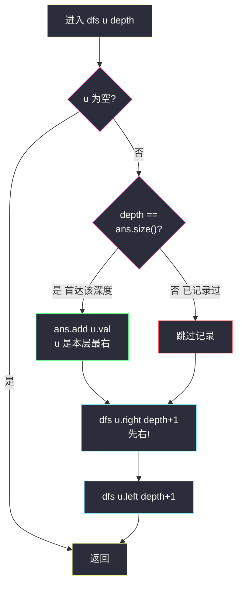
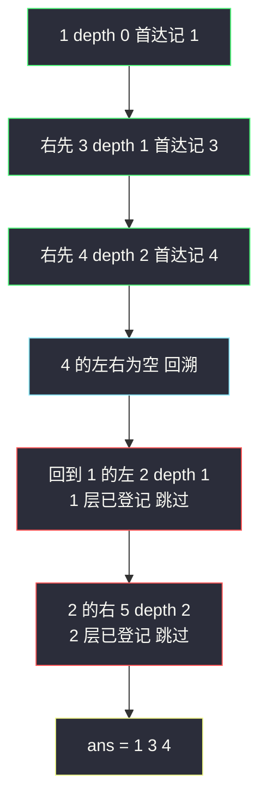

# 二叉树的右视图（层序取每层末尾 / DFS 根右左）

## 一、问题描述

给定一个二叉树的**根节点** `root`，想象你站在树的**右侧**，从上往下看，按从顶部到底部的顺序返回你能看到的节点值。

> 🔗 LeetCode 199：https://leetcode.cn/problems/binary-tree-right-side-view/

**示例 1**

```
输入：root = [1,2,3,null,5,null,4]
输出：[1,3,4]
树形：           站右侧看 →
        1        ● 1（第 0 层最右）
       / \
      2   3      ● 3（第 1 层最右）
       \   \
        5   4    ● 4（第 2 层最右）
```

**示例 2**

```
输入：root = [1,null,3]
输出：[1,3]
    1
     \
      3
```

**直观理解**

「站在右边看」翻译成数据结构语言：每一层**从右边数第一个节点**（该层**最靠右**的节点）会挡住它左边的所有同层节点。所以答案 = 「每层最右节点」自上而下排成一列，长度恰好等于树的深度。

两种自然实现：BFS 每层取最后一个；DFS 按「根 → 右 → 左」先走右路，每层第一个碰到的就是该层最右节点。

---

## 二、暴力解法（入门）

### 直观思路

直接复用 #102：完整层序遍历拿到**每一层的全部节点**，然后每层只留最后一个。

```java
class Solution {
    public List<Integer> rightSideView(TreeNode root) {
        List<Integer> ans = new ArrayList<>();
        if (root == null) {
            return ans;
        }
        Queue<TreeNode> queue = new ArrayDeque<>();
        queue.offer(root);
        while (!queue.isEmpty()) {
            int size = queue.size();                 // 快照：当前层节点数
            List<Integer> level = new ArrayList<>();
            for (int i = 0; i < size; i++) {
                TreeNode cur = queue.poll();
                level.add(cur.val);
                if (cur.left != null)  queue.offer(cur.left);
                if (cur.right != null) queue.offer(cur.right);
            }
            ans.add(level.get(level.size() - 1));    // 整层收完只取最后一个
        }
        return ans;
    }
}
```

### 复杂度

- **时间**：`O(n)`，每个节点仍要进出队列。
- **空间**：`O(w)` 队列 + `O(该层长度)` 临时列表，`w` 为最宽一层。

### 🔴 瓶颈在哪里

1. **整层都要存**：其实每层只需要「到目前为止最右」的那一个，左边的值收集了就扔，纯属浪费。
2. 优化方向有两条线：BFS 上**边弹边记**（弹到第 `size-1` 个时恰好是本层最后一个，顺手记录，列表都省了）；或者干脆换 DFS「根右左」，一路优先右行，天然先撞见每层最右。

---

## 三、优化探索（核心章节）

### 3.1 观察特征

| 特征 | 说明 |
|------|------|
| 每层答案唯一且是「层内最后一个」 | 右视图中同层左节点被最右节点遮挡 |
| BFS 层内从左到右出队 | 出队的**第 size 个（最后一个）** 就是本层最右——弹到 `i == size-1` 时记录即可，无需列表 |
| DFS「根→右→左」先右行 | 首次到达深度 `d` 的节点必是「右路优先」下最先暴露的，也即右视图节点 |

### 3.2 推导一：BFS 边弹边记

层序骨架不变，只改两处：不建 `level` 列表；内层 for 里判断 `i == size - 1`，是则把 `cur.val` 记入答案。

**正确性**：队列按「左孩子先、右孩子后」入队，同层节点出队顺序即从左到右，最后一个出队的必是本层最右。

### 3.3 推导二：DFS 根右左，depth 对齐才记

```
dfs(u, depth):
    若 u 为空 → 返回
    若 depth == ans.size()    ← 该深度还没记录过：u 就是这层第一个被"右先"访问的
        ans.add(u.val)
    dfs(u.right, depth + 1)   ← 先右！
    dfs(u.left,  depth + 1)
```

**正确性**：访问顺序里，任何深度 `d` 的**第一个**到达者，来自「尽量向右」的路径——它就是右视图节点；之后同层再来的（左侧）节点因 `depth < ans.size()` 被跳过。

> 课源码对齐说明：本题在 `/Users/zy/ai_learn/algorithm-journey/src/` 中无专门代码文件；class036 `Code01_LevelOrderTraversal.md` 讲义在「举一反三」中明确提示本题解法——「每层只取最后一个节点（内层 for 到 size-1 时记录）」，本篇 BFS 主解即按该提示 + 层序骨架对齐；DFS 版为站点补充视角。



### 3.4 关键推导问题

| 问题 | 答案 |
|------|------|
| 右视图一定是每层最右节点吗？ | 是。同层右边的节点挡住左边节点；深度不同的层互不遮挡，所以答案长度 = 树的深度 |
| 最右节点没有右孩子时视图会不会「断档」？ | 不会「缺行」但可能换人：某层最右若是左孩子（右侧没孩子），它仍出现在视图里——「最右」指**横向位置**最靠右，不是「右孩子」 |
| BFS 怎么不多存整层？ | 弹到本层最后一个（`i == size-1`）时记录；列表、reverse 全都省掉 |
| DFS 为什么必须先右后左？ | 先左会先记录左节点，之后右侧同层节点被 `depth < size` 拦掉，答案错成「左视图」 |
| `depth == ans.size()` 这个判据为什么对？ | ans 按「首达顺序」增长；首达深度 d 时 ans 恰有 d 个元素（0..d-1 各一），判据成立当且仅当 d 层还没人登记 |
| BFS 与 DFS 怎么选？ | 都 `O(n)`；BFS 空间 `O(w)`（矮胖树大），DFS 空间 `O(h)`（瘦高树大），极端树形互补，面试任选一个讲透即可 |

### 3.5 一句话核心

> **右视图 = 每层最右节点连成一列：BFS 弹到层尾记一笔，或 DFS 根右左首达即记。**

---

## 四、代码实现详解

### Java（主解：BFS 层尾记录）

```java
// 二叉树的右视图
// 测试链接 : https://leetcode.cn/problems/binary-tree-right-side-view/
// 对齐 class036 Code01 层序骨架 + 讲义提示「内层 for 到 size-1 时记录」
class Solution {
    public List<Integer> rightSideView(TreeNode root) {
        List<Integer> ans = new ArrayList<>();
        if (root == null) {
            return ans;
        }
        Queue<TreeNode> queue = new ArrayDeque<>();
        queue.offer(root);
        while (!queue.isEmpty()) {
            int size = queue.size();                 // 快照：当前层节点数
            for (int i = 0; i < size; i++) {
                TreeNode cur = queue.poll();
                if (i == size - 1) {                 // 本层最后一个出队 = 最右
                    ans.add(cur.val);
                }
                if (cur.left != null)  queue.offer(cur.left);
                if (cur.right != null) queue.offer(cur.right);
            }
        }
        return ans;
    }
}
```

### Java（并列解：DFS 根右左首达即记）

```java
class Solution {
    public List<Integer> rightSideView(TreeNode root) {
        List<Integer> ans = new ArrayList<>();
        dfs(root, 0, ans);
        return ans;
    }

    private void dfs(TreeNode node, int depth, List<Integer> ans) {
        if (node == null) {
            return;
        }
        if (depth == ans.size()) {      // 首达该深度：本层第一个被看到的
            ans.add(node.val);
        }
        dfs(node.right, depth + 1, ans); // 必须先右
        dfs(node.left, depth + 1, ans);
    }
}
```

### Python（同思路两版）

```python
from collections import deque

class Solution:
    def rightSideView(self, root: Optional[TreeNode]) -> List[int]:
        ans = []
        if root is None:
            return ans
        queue = deque([root])
        while queue:
            size = len(queue)              # 快照：当前层节点数
            for i in range(size):
                cur = queue.popleft()
                if i == size - 1:          # 本层最右
                    ans.append(cur.val)
                if cur.left:
                    queue.append(cur.left)
                if cur.right:
                    queue.append(cur.right)
        return ans
```

```python
# DFS 根右左
class Solution:
    def rightSideView(self, root: Optional[TreeNode]) -> List[int]:
        ans = []
        def dfs(node: Optional[TreeNode], depth: int) -> None:
            if node is None:
                return
            if depth == len(ans):          # 首达该深度
                ans.append(node.val)
            dfs(node.right, depth + 1)     # 先右
            dfs(node.left, depth + 1)
        dfs(root, 0)
        return ans
```

---

## 五、具体例子演示

### 例 1：`root = [1,2,3,null,5,null,4]`

```
        1
       / \
      2   3
       \   \
        5   4
```

**BFS 版逐轮跟踪**：

| 轮 | size | 出队顺序（带下标 i） | i == size-1 记录 | 队列变化 | ans |
|----|------|----------------------|------------------|----------|-----|
| 初始 | — | — | — | [1] | [] |
| 1 | 1 | 1(i=0) | 记 **1**；孩子 2、3 入队 → [2,3] | [2,3] | [1] |
| 2 | 2 | 2(i=0), 3(i=1) | 记 **3**；2 无左、右为 5 入队；3 右为 4 入队 → [5,4] | [5,4] | [1,3] |
| 3 | 2 | 5(i=0), 4(i=1) | 记 **4**；均无孩子 → [] | [] | [1,3,4] ✔ |

**DFS 版逐步跟踪**（访问序：根右左）：

| 步 | 访问 | depth | ans.size() | 首达？ | ans |
|----|------|-------|------------|--------|-----|
| 1 | dfs(1,0) | 0 | 0 | ✅ 记 1 | [1] |
| 2 | dfs(3,1)（1 的右先走） | 1 | 1 | ✅ 记 3 | [1,3] |
| 3 | dfs(4,2)（3 的右） | 2 | 2 | ✅ 记 4 | [1,3,4] |
| 4 | dfs(null,3)、dfs(null,3)（4 的左右空） | — | — | — | [1,3,4] |
| 5 | 回溯到 3 的左 dfs(null,1) | — | — | — | [1,3,4] |
| 6 | dfs(2,1)（1 的左） | 1 | 3 | ❌ 1 层已有 3，跳过 | [1,3,4] |
| 7 | dfs(2.right)=dfs(5,2) | 2 | 3 | ❌ 2 层已有 4，跳过 | [1,3,4] ✔ |

第 6、7 步是精髓：5 在第 2 层但**横向位置在 4 左边**，被 4 挡住——`depth < ans.size()` 精准拦截。



### 例 2：`root = [1,null,3]`

BFS：第 1 层记 1，第 2 层出队 3 记 3 → `[1,3]`；DFS：1 首达记、右 3 首达记 → `[1,3]`。空左子树完全不影响。

### 例 3：左斜树 `root = [1,2,null,3]`（全在左边）

```
    1
   /
  2
 /
3
```
每层只有一个节点，它就是「本层最右」→ 答案 `[1,2,3]`。说明「右视图」≠「右子树链」。

### 例 4：空树 `root = []`

返回 `[]`。

---

## 六、复杂度分析

| 写法 | 时间 | 空间 |
|------|------|------|
| BFS 层尾记录（主解） | `O(n)`：每节点进出队列一次 | `O(w)`，`w` 为最宽一层；完美树底层约 `n/2` |
| DFS 根右左 | `O(n)`：每节点访问一次（被挡的层也访问但不记录） | `O(h)` 递归栈，`h` 为树高；链状树 `O(n)` |

互补关系：矮胖树 BFS 队列吃紧而 DFS 轻松；瘦高树正相反。渐进都不超过 `O(n)`。

---

## 七、方法对比与总结

### 三种写法对比

| | BFS 整层收集（暴力） | BFS 层尾记录（主解） | DFS 根右左 |
|--|----------------------|----------------------|------------|
| 额外容器 | 每层一个临时列表 | 无 | 无 |
| 代码量 | 最多 | 少 | 最少 |
| 空间 | `O(w)` | `O(w)` | `O(h)` |
| 思想亮点 | 复用 #102 | 「层尾即答案」的位置技巧 | 「先右行 + 首达判据」的顺序技巧 |

### 易错点

1. **DFS 先左后右**：得到的是左视图（对应左下角值那类题），方向别记反。
2. **首达判据写成 `depth >= ans.size()`**：`>` 会漏记新层，`==` 才是「还没登记」的准确表达。
3. **BFS 判 `i == size-1` 的位置**：必须在循环内、弹出之后立刻判断；先收集完再找 last 就退化成暴力版。
4. **以为答案是「最右侧链」**：例 3 的左斜树全在答案里——右视图按「层」取人，不沿某条链走。
5. **忘判空树**：null 入队即空指针异常。

### 模板口诀

> **一层看一人：BFS 数到层尾记，DFS 根右左、首达即登记。**

---

## 八、举一反三

| 题目 | 链接 | 迁移点 |
|------|------|--------|
| 102. 二叉树的层序遍历 | https://leetcode.cn/problems/binary-tree-level-order-traversal/ | 右视图的骨架题（本站已有题解） |
| 107. 层序遍历 II | https://leetcode.cn/problems/binary-tree-level-order-traversal-ii/ | 同骨架 + 层序反转（本站已有题解） |
| 103. 锯齿形层序遍历 | https://leetcode.cn/problems/binary-tree-zigzag-level-order-traversal/ | 层内方向交替（本站已有题解） |
| 513. 找树左下角的值 | https://leetcode.cn/problems/find-bottom-left-tree-value/ | 镜像题：DFS「根左」首达 / BFS 每层记第一个 |
| 116. 填充每个节点的下一个右侧节点指针 | https://leetcode.cn/problems/populating-next-right-pointers-in-each-node/ | 「右侧视角」另一形态：把每层串成链（本站已有题解） |
| 515. 在每个树行中找最大值 | https://leetcode.cn/problems/find-largest-value-in-each-tree-row/ | 层尾技巧换成层内维护 max |

**迁移一句**：右视图的本质是「**按层取代表**」——代表规则换成每层第一个、每层最大值、每层最左，模板一字不改；DFS 版还揭示了「访问顺序 + 首达判据」这对组合能提取任何「每层第一个被特定顺序撞见」的节点。
