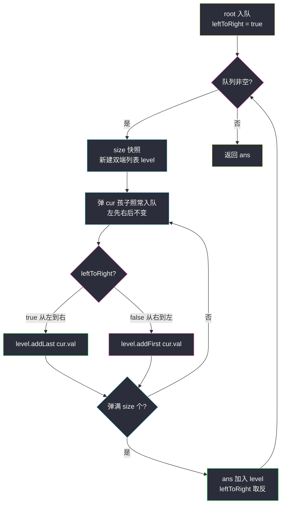
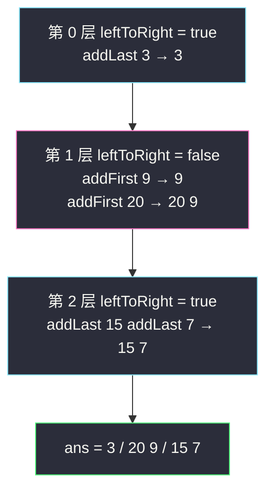

# 二叉树的锯齿形层序遍历（层序 + 方向翻转）

## 一、问题描述

给你二叉树的根节点 `root`，返回其节点值的**锯齿形层序遍历**：先从左到右，再从右到左，下一层再从左到右……逐层交替（蛇形 / Z 字形走位）。

> 🔗 LeetCode 103：https://leetcode.cn/problems/binary-tree-zigzag-level-order-traversal/

**示例 1**

```
输入：root = [3,9,20,null,null,15,7]
输出：[[3],[20,9],[15,7]]
树形：
       3           第 0 层：从左到右 → [3]
      / \
     9   20        第 1 层：从右到左 → [20,9]
         / \
        15  7      第 2 层：从左到右 → [15,7]
```

**示例 2**

```
输入：root = [1,2,3,4,null,null,5]
输出：[[1],[3,2],[4,5]]
树形：
        1
       / \
      2   3
     /     \
    4       5
第 0 层 [1]；第 1 层从右往左 [3,2]；第 2 层从左往右 [4,5]
```

**直观理解**

底层引擎还是 #102 的「每次处理一层」BFS，唯一的变化是**收集方向**：偶数层（0、2、4…）从左到右收，奇数层从右到左收。注意一个易混点：**树的遍历顺序永远是从左到右入队**（左孩子先于右孩子），变的只是「收集进本层列表时的方向」——不是把树倒着遍历。

---

## 二、暴力解法（入门）

### 直观思路

最省脑子的做法：每层**先正常从左到右收集**，收完一看是奇数层，就整层反转一下再放进答案。

```java
class Solution {
    public List<List<Integer>> zigzagLevelOrder(TreeNode root) {
        List<List<Integer>> ans = new ArrayList<>();
        if (root == null) {
            return ans;
        }
        Queue<TreeNode> queue = new ArrayDeque<>();
        queue.offer(root);
        boolean leftToRight = true;                 // 当前层方向
        while (!queue.isEmpty()) {
            int size = queue.size();
            List<Integer> level = new ArrayList<>();
            for (int i = 0; i < size; i++) {        // 永远从左到右收
                TreeNode cur = queue.poll();
                level.add(cur.val);
                if (cur.left != null)  queue.offer(cur.left);
                if (cur.right != null) queue.offer(cur.right);
            }
            if (!leftToRight) {
                Collections.reverse(level);         // 收完再整层反转
            }
            ans.add(level);
            leftToRight = !leftToRight;
        }
        return ans;
    }
}
```

### 复杂度

- **时间**：`O(n)` 收集 + 反转总开销 `O(总节点数)` = `O(n)`。
- **空间**：`O(w)`，`w` 为最宽一层（不含输出）。

### 🔴 瓶颈在哪里

1. **每层多一次 `O(该层长度)` 的反转**，常数翻倍；虽然大 O 不变，但「先收再倒」多走一遍总归不优雅。
2. 更重要的是：反转这个动作说明**收集时方向信息其实已经丢了**——如果收集那一刻就能决定「放头部还是放尾部」，反转根本不需要。这就引出双端队列解法。

---

## 三、优化探索（核心章节）

### 3.1 观察特征

| 特征 | 说明 |
|------|------|
| 遍历顺序固定、收集方向交替 | 入队永远「左先右后」；只有收集方向随层数奇偶翻转 |
| 「从右到左收集」= 反向添加 | 遍历到节点时把它**插到列表头部**，得到的正是逆序 |
| 头插 / 尾插是双端队列的基本功 | `Deque` 支持 `addFirst` / `addLast`，一个结构覆盖两个方向 |

### 3.2 推导：双端队列，收集时定向

维护一个布尔量 `leftToRight`（第 0 层初始为 true，每层取反）：

```
leftToRight == true  →  从左到右收：level.addLast(cur.val)
leftToRight == false →  从右到左收：level.addFirst(cur.val)
```

为什么对？设某层从左到右的节点是 `a, b, c`：

- 正向收：`addLast(a) addLast(b) addLast(c)` → `[a,b,c]` ✔
- 反向收：`addFirst(a) addFirst(b) addFirst(c)` → `[c,b,a]` ✔（每个后来者都垫到前面，先到的一路被推到队尾）

**孩子入队顺序永远不变**（先左后右），方向只作用于「值放进 level 的哪一头」。课源码 class036 `Code02_ZigzagLevelOrderTraversal.java` 用数组队列 + `i` 从 `r-1` 往 `l` 倒着收集实现同一思想（还省掉了每层列表的头插开销）；站点版用 `ArrayDeque` 双端队列表达，更直白好默写。



### 3.3 关键推导问题

| 问题 | 答案 |
|------|------|
| 方向翻转时孩子入队顺序要跟着反吗？ | **不要**。BFS 的入队永远左先右后，这保证下一层的「从左到右序」正确；如果入队也反，第 k+2 层会跟着错位 |
| addFirst 为什么等价于反向收集？ | 后 addFirst 的垫在最前，于是第一个遍历到的节点最终排在最后——列表呈现遍历序的精确倒序 |
| 用「弹 size-1 个再倒着读队列」行不行？ | 行，这就是课上的写法（数组队列 `i` 从 `r-1` 往 `l` 扫）；只是对 `ArrayDeque` 来说不能按下标访问，双端收集更自然 |
| 方向变量初始值怎么定？ | 第 0 层从左到右 → `true`。判错的典型症状：答案每层整体左右颠倒 |
| 这题 DFS 能做吗？ | 能：递归带层号 `d`，偶数层 `list.set` / 尾插、奇数层头插；但 BFS 逐层天然有序，更不易错 |
| 反转版和双端版复杂度差异？ | 均为 `O(n)` 时间；双端版省掉每层反转的一遍扫描，常数更小、单次操作即定向 |

### 3.4 一句话核心

> **遍历永远从左到右，收集看方向：正向 addLast，反向 addFirst；每层结束方向取反。**

---

## 四、代码实现详解

### Java（主解：双端队列定向收集，对齐 class036 Code02 思路）

```java
// 二叉树的锯齿形层序遍历
// 测试链接 : https://leetcode.cn/problems/binary-tree-zigzag-level-order-traversal/
// 对齐 class036 Code02_ZigzagLevelOrderTraversal（数组双向收集 → Deque 双端表达）
class Solution {
    public List<List<Integer>> zigzagLevelOrder(TreeNode root) {
        List<List<Integer>> ans = new ArrayList<>();
        if (root == null) {
            return ans;
        }
        Queue<TreeNode> queue = new ArrayDeque<>();
        queue.offer(root);
        boolean leftToRight = true;                  // 第 0 层从左到右
        while (!queue.isEmpty()) {
            int size = queue.size();                 // 快照：当前层节点数
            LinkedList<Integer> level = new LinkedList<>();   // 双端列表
            for (int i = 0; i < size; i++) {
                TreeNode cur = queue.poll();         // 出队顺序永远从左到右
                if (leftToRight) {
                    level.addLast(cur.val);          // 正向：尾插
                } else {
                    level.addFirst(cur.val);         // 反向：头插
                }
                if (cur.left != null)  queue.offer(cur.left);  // 入队顺序不变！
                if (cur.right != null) queue.offer(cur.right);
            }
            ans.add(level);
            leftToRight = !leftToRight;              // 方向取反
        }
        return ans;
    }
}
```

### Python（同思路）

```python
from collections import deque

class Solution:
    def zigzagLevelOrder(self, root: Optional[TreeNode]) -> List[List[int]]:
        ans = []
        if root is None:
            return ans
        queue = deque([root])
        left_to_right = True                # 第 0 层从左到右
        while queue:
            size = len(queue)               # 快照：当前层节点数
            level = deque()                 # 双端队列
            for _ in range(size):
                cur = queue.popleft()       # 出队顺序永远从左到右
                if left_to_right:
                    level.append(cur.val)       # 正向：尾插
                else:
                    level.appendleft(cur.val)   # 反向：头插
                if cur.left:
                    queue.append(cur.left)      # 入队顺序不变！
                if cur.right:
                    queue.append(cur.right)
            ans.append(list(level))
            left_to_right = not left_to_right
        return ans
```

**变量含义**

| 变量 | 含义 |
|------|------|
| `leftToRight` | 当前层收集方向；奇偶层交替，每层末尾取反 |
| `level`（双端） | 收集容器：尾插 = 正序，头插 = 倒序 |
| `queue` | 普通 FIFO 队列，入队顺序恒为「左孩子先、右孩子后」 |

**循环不变式**：外层每轮开始时，队列中恰好是从左到右排列的一整层；`level` 结束时的方向由 `leftToRight` 唯一决定。

---

## 五、具体例子演示

### 例 1：`root = [3,9,20,null,null,15,7]`

```
       3
      / \
     9   20
         / \
        15  7
```

| 轮 | leftToRight | 队列 | 弹出顺序 | level 逐步变化 | ans |
|----|-------------|------|----------|----------------|-----|
| 初始 | true | [3] | — | — | [] |
| 1 | true | [3] | 3 | `addLast(3)` → [3]；孩子 9、20 入队 → 队列 [9,20] | [[3]] |
| 2 | false | [9,20] | 9, 20 | `addFirst(9)` → [9]；`addFirst(20)` → [20,9]；孩子 15、7 入队 → 队列 [15,7] | [[3],[20,9]] |
| 3 | true | [15,7] | 15, 7 | `addLast(15)` → [15]；`addLast(7)` → [15,7]；队列空 | [[3],[20,9],[15,7]] |

第 2 轮细看：遍历到 9 时它先头插，遍历到 20 时头插把 20 垫到 9 前面——**先来的被挤到后面**，正是「从右到左」的成因。



### 例 2：`root = [1,2,3,4,null,null,5]`

```
        1
       / \
      2   3
     /     \
    4       5
```

| 轮 | leftToRight | 弹出顺序 | level 演化 | 结果层 |
|----|-------------|----------|------------|--------|
| 1 | true | 1 | [1] | [1] |
| 2 | false | 2, 3 | addFirst(2) → [2]；addFirst(3) → [3,2] | [3,2] |
| 3 | true | 4, 5 | addLast(4) → [4]；addLast(5) → [4,5] | [4,5] |

注意第 3 轮：**弹出顺序是 4 先于 5**（因为入队时 2 先于 3，2 的孩子 4 先入队）——再次证明入队顺序与方向无关，锯齿只体现在收集端。

### 例 3：空树 `root = []`

返回 `[]`；单节点 `[1]` 只有一层，方向没机会翻转，输出 `[[1]]`。

---

## 六、复杂度分析

| 写法 | 时间 | 空间 |
|------|------|------|
| 收集后整层反转（暴力） | `O(n)`：收集一遍 + 全部节点反转一遍 | `O(w)`，`w` 为最宽一层 |
| 双端定向收集（主解） | `O(n)`：每个节点出队一次、addFirst/addLast 均 `O(1)` | `O(w)`：队列 + 当前层双端列表，同一量级 |

说明：`LinkedList.addFirst` 虽然理论 `O(1)`，但常数比 `ArrayList.add` 大；若追求极致可用「`ArrayList` + 奇数层 `Collections.reverse`」或课上数组倒着扫——大 O 完全相同，按默写顺手程度选即可。

---

## 七、方法对比与总结

### 三种写法对比

| | 收集后反转 | 双端定向（主解） | 课上数组倒扫 |
|--|------------|------------------|--------------|
| 思路难度 | 最低 | 中 | 中 |
| 单层开销 | 收集 + 反转两遍 | 一遍定向插入 | 一遍定向读 |
| 额外结构 | 无 | `LinkedList`/`deque` | 自管数组 + l/r |
| 推荐 | ✅ 最快写对 | ✅ 教学最清晰 | 性能敏感场景 |

### 易错点

1. **方向翻转时把孩子入队顺序也反了**：入队永远左先右后，反了会导致隔层错位。
2. **leftToRight 初值 / 取反位置错**：初值 true（第 0 层左→右）；取反必须放在「整层收完之后」，放内层 for 里方向每弹一个变一次。
3. **误用 `Stack` 的 push/pop**：层序骨架仍是 FIFO 队列，别被「锯齿」带偏成栈。
4. **Java 用 `ArrayList` 却调 `addFirst`**：`addFirst` 是 `Deque`/`LinkedList` 的方法；`ArrayList` 没有头插（只能 `add(0, v)`，是 `O(层宽)`）。
5. **忘判空树**：null 入队会在 `cur.val` 处空指针。

### 模板口诀

> **队列只管从左到右，收集端看旗子：旗真尾插、旗假头插，一层收完旗取反。**

---

## 八、举一反三

| 题目 | 链接 | 迁移点 |
|------|------|--------|
| 102. 二叉树的层序遍历 | https://leetcode.cn/problems/binary-tree-level-order-traversal/ | 去掉方向旗，恒为尾插（本站已有题解） |
| 107. 层序遍历 II | https://leetcode.cn/problems/binary-tree-level-order-traversal-ii/ | 层序 + 结果反转（本站已有题解） |
| 199. 二叉树的右视图 | https://leetcode.cn/problems/binary-tree-right-side-view/ | 每层只取一个（本站已有题解） |
| 515. 在每个树行中找最大值 | https://leetcode.cn/problems/find-largest-value-in-each-tree-row/ | 层内收集换成维护 max |
| 637. 二叉树的层平均值 | https://leetcode.cn/problems/average-of-levels-in-binary-tree/ | 层内求和取平均 |
| 103→剑指 Offer 32-III | https://leetcode.cn/problems/cong-shang-dao-xia-da-yin-er-cha-shu-iii-lcof/ | 同题换皮，验证模板 |

**迁移一句**：锯齿题的本质是给 #102 的层序模板加一个**层属性（方向）**——凡是「按层收集 + 每层有点变化」的题（方向、顺序、取最值、取均值），改的都只是内层收集那两行，外层骨架一行不动。
