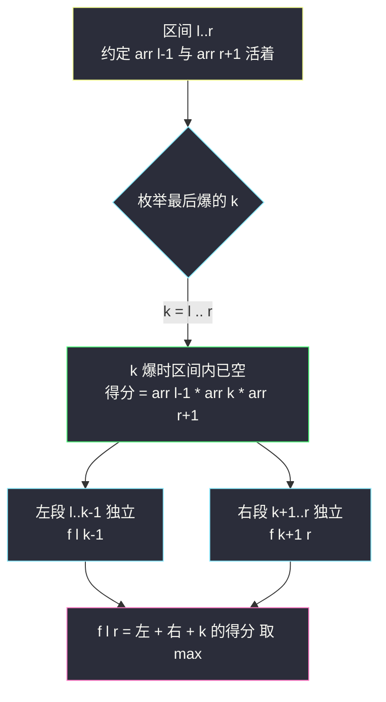
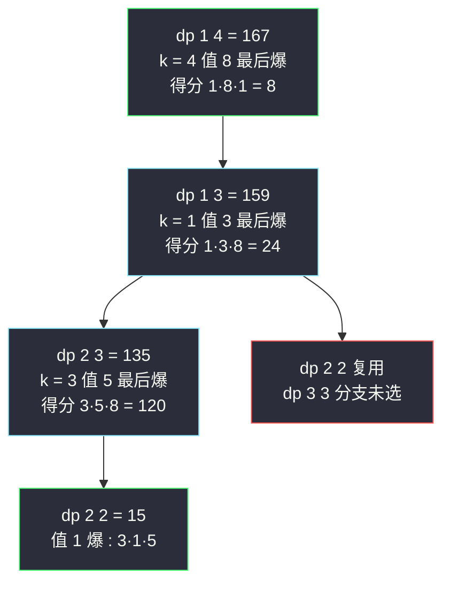

# 戳气球（区间 DP 封神题：逆向枚举最后操作）

## 一、问题描述

有 `n` 个气球排成一排，编号 `0..n-1`，数字存在 `nums` 里。戳破第 `i` 个气球获得 `nums[i-1] * nums[i] * nums[i+1]` 枚硬币，其中 `i-1`、`i+1` 是**当时与它相邻**的气球（越界当 1）。要求把气球**全部戳破**，返回能获得的最大硬币数。

> 🔗 LeetCode 312：https://leetcode.cn/problems/burst-balloons/

**示例 1**

```
输入：nums = [3,1,5,8]
输出：167
解释：
nums = [3,1,5,8] --> [3,5,8] --> [3,8] --> [8] --> []
硬币 = 3*1*5 + 3*5*8 + 1*3*8 + 1*8*1 = 15 + 120 + 24 + 8 = 167
```

**示例 2**

```
输入：nums = [1,5]
输出：10
解释：1*5*1 + 5*1*1（先戳 5 或先戳 1 顺序不同但总数 10）
```

**直观理解**

戳破一个气球后，两侧气球「跨过它」变成邻居——**每次操作的得分依赖当前还活着的邻居**，顺序一变得分全变。直觉的做法是「先戳谁」逐步尝试，但戳完第一个后，剩余气球被分成左右两段，**右段的左邻居会被左段的气球顶替**，左右两段互相纠缠，子问题不独立。

这题的封神之处在于**把决策方向反过来**：不决定「谁先爆」，而决定「谁**最后**爆」。这一反转让纠缠瞬间解开，成为区间 DP 的教科书案例（class076 Code05）。

---

## 二、暴力解法

### 直观思路

尝试直接递归：枚举**第一个**戳爆的气球 `k`，得 `nums[k-1]*nums[k]*nums[k+1]`，再对左右两段递归——立刻发现两个致命问题：

1. 左段最右气球的右邻居不再是 `k`，而是**右段的某个气球**（哪个还不确定）——两段不独立；
2. 硬要传递「边界邻居」参数，状态变成 (区间, 左邻居, 右邻居)，指数膨胀。

真正可行的暴力是**回溯全排列**：枚举 `n!` 个戳破顺序，逐个模拟求和取最大：

```java
// 暴力：全排列枚举戳破顺序（仅用于理解，n=10 就跑不动）
public static int maxCoinsBrute(int[] nums) {
    return permute(nums, new boolean[nums.length], 1, 1, 0);
}

// aliveLeft / aliveRight : 当前未戳区间外侧最近的存活值（模拟时动态维护）
private static int permute(int[] nums, boolean[] dead, int l, int r, int sum) { ... } // 伪码示意
```

### 复杂度

- **时间**：`O(n! · n)`——全排列 × 每次模拟
- **空间**：`O(n)`

### 🔴 瓶颈在哪里

顺序的组合爆炸 + 子问题纠缠。**出路不是优化枚举，而是换决策视角**（见下）。

---

## 三、优化探索（核心章节：为什么「最后爆」能解纠缠）

### 3.1 加虚拟边界

先做无伤大雅的预处理：首尾各补一个 `1`（越界当 1 的规则内置）：

```
原:  a b c d e
新:  1 a b c d e 1      （下标 0..n+1）
```

此后所有「邻居越界」的特判消失，只在 `1..n` 范围内考虑原气球。

### 3.2 正向失败的根源

假设先爆 `k`（区间 `l..r` 内）：

- 得分 = `arr[l-1] * arr[k] * arr[r+1]`？**错！** 先爆时 `k` 的邻居是区间内紧挨着的存活气球，不是 `arr[l-1]`、`arr[r+1]`；
- 且爆掉 `k` 后 `(l..k-1)` 与 `(k+1..r)` 两段**直接相邻**，右段的左邻居成了左段的某个气球——两段的最优顺序互相影响，**子问题不独立**。

### 3.3 逆向成功：枚举「最后爆」的气球

考察区间 `arr[l..r]`（`1 ≤ l ≤ r ≤ n`），**约定：区间外的 `arr[l-1]` 与 `arr[r+1]` 一定还活着**（它们在区间之后才被爆）。枚举区间内**最后爆**的气球 `k`：

1. `k` 爆的那一刻，区间 `l..r` 里其他气球全没了，`k` 的邻居**恰好**是 `arr[l-1]` 和 `arr[r+1]`：
   `得分 = arr[l-1] * arr[k] * arr[r+1]` —— **与内部爆序完全无关，确定！**
2. `k` 爆完前，`(l..k-1)` 和 `(k+1..r)` 两段被 `k` 隔开、互为邻居但互不影响对方的邻居假设——**各自独立求最优**。
3. 两段的「外部保证」依然成立：左段的右外侧 `arr[k]` 当时活着（它最后爆），右段的左外侧 `arr[k]` 同理。✓ 自洽！

```
f(l, r) = 区间 l..r 全部爆完的最大得分
边界 : f(l, l) = arr[l-1] * arr[l] * arr[l+1]   （单气球，最后爆就是唯一爆）
转移 : f(l, r) = max over k ∈ [l, r] of
                  f(l, k-1) + f(k+1, r) + arr[l-1] * arr[k] * arr[r+1]
```

这就是「**最后操作确定外部代价 + 剩余部分独立**」的区间 DP 封神套路（与 #516、#1039 同表不同魂）。



### 3.4 关键问题

| 问题 | 答案 |
|------|------|
| 为什么「先爆谁」不行，「后爆谁」可以？ | 先爆时 k 的邻居未知（取决于内部爆序）；最后爆时 k 的邻居只剩区间外两个**保证活着**的哨兵，代价确定 |
| 「arr[l-1]、arr[r+1] 一定活着」这个假设怎么保证自洽？ | 递归只处理连续区间，区间外元素的爆序天然排在区间之后；分出的子区间外部恰是 `arr[k]`（区间内最后爆的那个，存活到子区间结束） |
| `k` 的得分为什么不含区间内的数？ | `k` 最后爆，爆的瞬间区间内其他气球已全部消失，邻居只可能是区间外的 `arr[l-1]`、`arr[r+1]` |
| 单气球区间的得分？ | `arr[l-1] * arr[l] * arr[l+1]`：唯一气球最后（也是第一个）爆，邻居就是两侧哨兵 |
| 状态数与遍历顺序？ | `O(n²)` 个区间；`f(l, r)` 依赖更短的 `f(l, k-1)`、`f(k+1, r)` → l 从大到小、r 从小到大 |

### 3.5 一句话核心

> **首尾补 1；枚举「区间内最后爆的气球 k」：得分 arr[l-1]·arr[k]·arr[r+1] + 左右两段独立最优，取 max。**

---

## 四、代码实现

### Java（主解：记忆化搜索，对齐 class076 Code05 的 maxCoins1）

```java
// 戳气球
// 戳破第 i 个气球获得 nums[i-1] * nums[i] * nums[i+1] 枚硬币，求最大总得分
// 测试链接 : https://leetcode.cn/problems/burst-balloons/
// 对齐 class076 Code05_BurstBalloons
public class Solution {

    public int[][] dp;   // dp[l][r] : 区间 l..r 的最大得分；-1 表示未算

    // 时间复杂度 O(n^3)，空间复杂度 O(n^2)
    public int maxCoins(int[] nums) {
        int n = nums.length;
        // 首尾补 1 : a b c d e --> 1 a b c d e 1
        int[] arr = new int[n + 2];
        arr[0] = 1;
        arr[n + 1] = 1;
        for (int i = 0; i < n; i++) {
            arr[i + 1] = nums[i];
        }
        dp = new int[n + 2][n + 2];
        for (int l = 1; l <= n; l++) {
            for (int r = l; r <= n; r++) {
                dp[l][r] = -1;
            }
        }
        return f(arr, 1, n);
    }

    // arr[l..r] 这些气球全部爆完的最大得分
    // 约定 : arr[l-1] 与 arr[r+1] 一定没爆（作为 k 的最终邻居）
    private int f(int[] arr, int l, int r) {
        if (dp[l][r] != -1) {
            return dp[l][r];
        }
        int ans;
        if (l == r) {
            // 单气球 : 邻居就是两侧哨兵
            ans = arr[l - 1] * arr[l] * arr[r + 1];
        } else {
            // 枚举区间内"最后爆"的气球 k
            ans = Math.max(
                    arr[l - 1] * arr[l] * arr[r + 1] + f(arr, l + 1, r),      // k = l
                    arr[l - 1] * arr[r] * arr[r + 1] + f(arr, l, r - 1));     // k = r
            for (int k = l + 1; k < r; k++) {
                ans = Math.max(ans,
                        arr[l - 1] * arr[k] * arr[r + 1] + f(arr, l, k - 1) + f(arr, k + 1, r));
            }
        }
        dp[l][r] = ans;
        return ans;
    }
}
```

### Java（对照版：严格位置依赖，对齐 class076 Code05 的 maxCoins2）

```java
// 填表版 : dp[i][i] 初始化后，l 从大到小、r 从小到大
public class Solution {

    public static int maxCoins(int[] nums) {
        int n = nums.length;
        int[] arr = new int[n + 2];
        arr[0] = 1;
        arr[n + 1] = 1;
        for (int i = 0; i < n; i++) {
            arr[i + 1] = nums[i];
        }
        int[][] dp = new int[n + 2][n + 2];
        for (int i = 1; i <= n; i++) {
            dp[i][i] = arr[i - 1] * arr[i] * arr[i + 1];   // 边界 : 单气球
        }
        // 依赖方向 : 更短区间先算（左下方向）
        for (int l = n; l >= 1; l--) {
            for (int r = l + 1; r <= n; r++) {
                int ans = Math.max(
                        arr[l - 1] * arr[l] * arr[r + 1] + dp[l + 1][r],   // k = l
                        arr[l - 1] * arr[r] * arr[r + 1] + dp[l][r - 1]);  // k = r
                for (int k = l + 1; k < r; k++) {
                    ans = Math.max(ans,
                            arr[l - 1] * arr[k] * arr[r + 1] + dp[l][k - 1] + dp[k + 1][r]);
                }
                dp[l][r] = ans;
            }
        }
        return dp[1][n];
    }
}
```

### Python（严格位置依赖版）

```python
class Solution:
    def maxCoins(self, nums: list[int]) -> int:
        n = len(nums)
        arr = [1] + nums + [1]          # 首尾补哨兵
        # dp[l][r] : 区间 l..r 的最大得分（约定区间外两侧存活）
        dp = [[0] * (n + 2) for _ in range(n + 2)]
        for i in range(1, n + 1):
            dp[i][i] = arr[i - 1] * arr[i] * arr[i + 1]
        for l in range(n, 0, -1):        # l 从大到小
            for r in range(l + 1, n + 1):  # r 从小到大
                best = max(
                    arr[l - 1] * arr[l] * arr[r + 1] + dp[l + 1][r],
                    arr[l - 1] * arr[r] * arr[r + 1] + dp[l][r - 1],
                )
                for k in range(l + 1, r):
                    cand = arr[l - 1] * arr[k] * arr[r + 1] + dp[l][k - 1] + dp[k + 1][r]
                    best = max(best, cand)
                dp[l][r] = best
        return dp[1][n]
```

---

## 五、具体例子演示

以 `nums = [3,1,5,8]` 为例。补哨兵后 `arr = [1, 3, 1, 5, 8, 1]`（下标 0..5），有效区间下标 `1..4`，即 `arr[1..4] = 3, 1, 5, 8`。

### 第一步：长度 1 的边界（每个气球单独成区间时，邻居就是哨兵）

| 格 | 计算 | 值 |
|----|------|-----|
| dp[1][1] | arr[0]·arr[1]·arr[2] = 1·3·1 | 3 |
| dp[2][2] | arr[1]·arr[2]·arr[3] = 3·1·5 | 15 |
| dp[3][3] | arr[2]·arr[3]·arr[4] = 1·5·8 | 40 |
| dp[4][4] | arr[3]·arr[4]·arr[5] = 5·8·1 | 40 |

### 第二步：长度 2 的区间（枚举最后爆的是左端还是右端）

| 格 | k=左端 | k=右端 | 结果 |
|----|--------|--------|------|
| dp[1][2] | 1·3·5 + dp[2][2] = 15+15 = **30** | 1·1·5 + dp[1][1] = 5+3 = 8 | 30 |
| dp[2][3] | 3·1·8 + dp[3][3] = 24+40 = **64** | 3·5·8 + dp[2][2] = 120+15 = **135** | 135 |
| dp[3][4] | 1·5·1 + dp[4][4] = 5+40 = 45 | 1·8·1 + dp[3][3] = 8+40 = **48** | 48 |

以 dp[2][3] 的 k=右端（5 最后爆）为例核对语义：区间 `1,5` 里 **1 先爆、5 最后爆**——5 爆时邻居是哨兵 `arr[1]=3`（左外）与 `arr[4]=8`（右外），得分 `3·5·8=120`；1 爆时邻居 `3`（左哨兵）与 `5`（区间内还活着），`3·1·5=15`。合计 135 ✓。

### 第三步：长度 3 的区间

| 格 | k=1 | k=2 | k=3 | 结果 |
|----|-----|-----|-----|------|
| dp[1][3] | 1·3·8 + dp[2][3] = 24+135 = **159** | 1·1·8 + dp[1][1]+dp[3][3] = 8+43 = 51 | 1·5·8 + dp[1][2] = 40+30 = 70 | 159 |
| dp[2][4] | 3·1·1 + dp[3][4] = 3+48 = 51 | 3·5·1 + dp[2][2]+dp[4][4] = 15+55 = 70 | 3·8·1 + dp[2][3] = 24+135 = **159** | 159 |

### 第四步：最终区间 dp[1][4]

| k（最后爆） | 计算 | 候选 |
|-------------|------|------|
| 1（值 3） | 1·3·1 + dp[2][4] = 3+159 | 162 |
| 2（值 1） | 1·1·1 + dp[1][1]+dp[3][4] = 1+3+48 | 52 |
| 3（值 5） | 1·5·1 + dp[1][2]+dp[4][4] = 5+30+40 | 75 |
| 4（值 8） | 1·8·1 + dp[1][3] = 8+159 | **167** ✓ |

答案 **167**。



**还原真实戳序**（把「最后爆」倒过来读）：8 最后爆 → 区间 `3,1,5` 中 3 最后爆 → 区间 `1,5` 中 5 最后爆 → 1 最先爆。真实顺序：**1 → 5 → 3 → 8**，得分 `3·1·5 + 3·5·8 + 1·3·8 + 1·8·1 = 15+120+24+8 = 167` ✓ 与示例一致。

---

## 六、复杂度分析

| 版本 | 时间 | 空间 | 说明 |
|------|------|------|------|
| 全排列回溯 | `O(n! · n)` | `O(n)` | 组合爆炸，n=10 已不可用 |
| 记忆化搜索（主解） | `O(n³)` | `O(n²)` | `O(n²)` 区间 × 每区间枚举 `O(n)` 个 k |
| 严格位置依赖 | `O(n³)` | `O(n²)` | 同阶；填表版无递归开销 |

---

## 七、方法对比与总结

### 区间 DP 三种「枚举对象」对照（一表看穿）

| 题 | 枚举对象 | 本次决策代价 | 子问题 |
|----|----------|--------------|--------|
| #516 最长回文子序列 | 无（看两端） | +2 或 +0 | 去掉端点的区间 |
| #1039 三角剖分 | 边 (l,r) 的第三顶点 m | 三值乘积 | `(l..m)`、`(m..r)` |
| **#312 戳气球（本题）** | **区间内最后爆的 k** | `arr[l-1]·arr[k]·arr[r+1]` | `(l..k-1)`、`(k+1..r)` |
| #375 猜数字 | 本次猜的 m（minimax） | m + max(左,右) | `(l..m-1)`、`(m+1..r)` |

**共性**：决策把区间切成两个独立子区间 + 一个确定的本次代价；填表都是 l 大→小、r 小→大（短区间先算）。

### 为什么本题是「封神题」

它教会一个可迁移的**思维动作**：当「先做的操作会改变后续子问题的环境」（邻居变化）时，**枚举最后一步**——最后一步时环境已定格，代价可确定，剩余部分自动独立。矩阵链乘法、#1000 合并石头、#1039 都是同一动作。

### 易错点

1. **不加哨兵直接写**：`nums[i-1]`、`nums[i+1]` 越界判断铺满代码，极易错；首尾补 1 一劳永逸。
2. **枚举「第一个爆」**：子问题纠缠，转移写不出来——必须枚举最后爆。
3. **k 的得分写成 `arr[k-1]·arr[k]·arr[k+1]`**：那是「k 先爆」的得分；最后爆时邻居是区间外两侧。
4. **遍历顺序**：`l` 必须从大到小（依赖 `dp[l+1][...]`），`r` 从小到大（依赖 `dp[...][r-1]`）。
5. **记忆化缓存初始化**：区间内格子填 -1 表示未算，别把 0 当「未算」标记（合法得分可为 0，如 `nums` 含 0）。

### 模板口诀

> **首尾补一当哨兵，最后爆谁定乾坤；得分只看区间外，左右两段各归真。**

---

## 八、举一反三

| 题目 | 链接 | 迁移点 |
|------|------|--------|
| 1039. 多边形三角剖分 | https://leetcode.cn/problems/minimum-score-triangulation-of-polygon/ | 「枚举分割点」最简形态，先练它再来本题 |
| 375. 猜数字大小 II | https://leetcode.cn/problems/guess-number-higher-or-lower-ii/ | 同骨架 + minimax 双层取值 |
| 1000. 合并石头 | https://leetcode.cn/problems/minimum-cost-to-merge-stones/ | 「最后合并」= 本题动作 + k 堆分组约束 |
| 664. 奇怪的打印机 | https://leetcode.cn/problems/strange-printer/ | 区间 DP + 枚举分割点，去重技巧 |
| 546. 移除盒子 | https://leetcode.cn/problems/remove-boxes/ | 区间 DP 加一维（三维状态），本题的深水区续集 |

**迁移一句**：区间 DP 的通用心法是「**定一个锚点决策（第一个/最后一个/分割点），让本次代价确定、剩余子区间独立**」。当顺序敏感导致环境变化时（戳气球、合并石头），一律优先试「**枚举最后一步**」。
