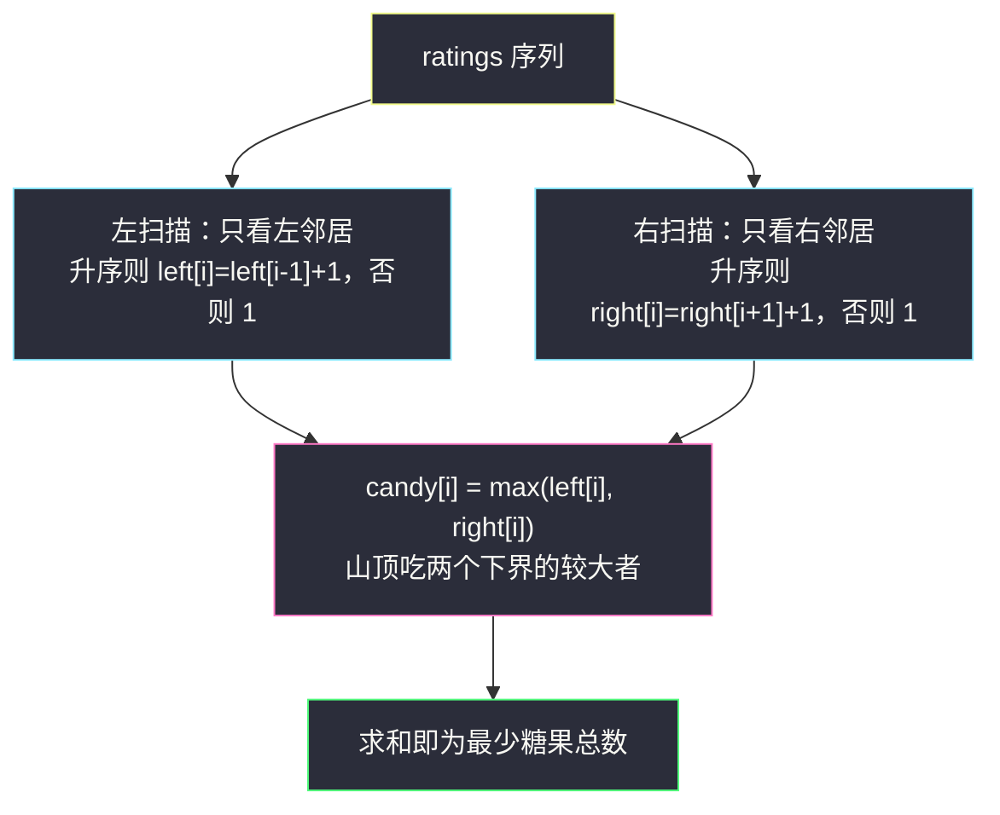
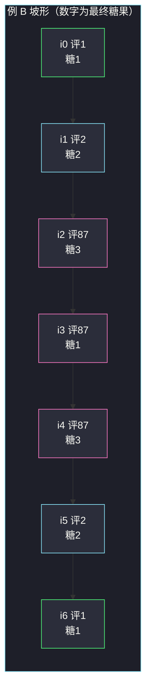

# 分发糖果（左右两次扫描：坡道爬升计数）

## 一、问题描述

`n` 个孩子站成一排。给你一个整数数组 `ratings` 表示每个孩子的评分。你需要按照以下要求，给这些孩子分发糖果：

- 每个孩子**至少分配到 1 个**糖果；
- 相邻两个孩子中，**评分更高**的孩子必须获得**更多**糖果（评分相等不要求相等，相邻两个相同评分的孩子糖果数可以任意）。

请你分发最少数量的糖果，返回**需要准备的最少糖果数目**。

> 🔗 LeetCode 135：https://leetcode.cn/problems/candy/

**示例 1**

```
输入：ratings = [1,0,2]
输出：5
解释：分别给 0、1、2 号孩子 2、1、2 颗糖果，共 5 颗。
     （1 号评分 0 最低拿 1 颗；两侧邻居评分更高，各拿 2 颗）
```

**示例 2**

```
输入：ratings = [1,2,2]
输出：4
解释：分别给 1、2、1 颗：[1,2,1]。
     第三个孩子评分 2 与第二个相同，不要求更多，1 颗即可满足。
```

**直观理解**

把评分画成折线图，糖果数要跟随**坡道**起伏：每爬升一格，糖果 +1；每下降一格，也必须 +1（往另一个方向看仍是爬升）。  
难点在于一个**山峰**同时属于左右两条坡道——它既要满足"比左边高"，又要满足"比右边高"，两边的要求**取最大值**才能同时满足，而且这个最大值恰好还是最省的。

---

## 二、暴力解法（入门）

### 直观思路

先每人发 1 颗，然后反复扫描：只要还存在违反约束的相邻对（左高右糖少、或右高左糖少），就给糖少的那位 +1。直到不再有违例。

```java
public int candy(int[] ratings) {
    int n = ratings.length;
    int[] c = new int[n];
    Arrays.fill(c, 1);
    boolean changed = true;
    while (changed) {
        changed = false;
        for (int i = 0; i + 1 < n; i++) {
            if (ratings[i] > ratings[i + 1] && c[i] <= c[i + 1]) {
                c[i] = c[i + 1] + 1;   // 左边评分高但糖不多 → 补
                changed = true;
            }
            if (ratings[i + 1] > ratings[i] && c[i + 1] <= c[i]) {
                c[i + 1] = c[i] + 1;   // 右边评分高但糖不多 → 补
                changed = true;
            }
        }
    }
    int ans = 0;
    for (int x : c) ans += x;
    return ans;
}
```

### 复杂度

- **时间**：`O(n²)` 最坏——单调递增的输入，每轮只能把"糖不够"往前推一格，要推 `n` 轮
- **空间**：`O(n)`

### 🔴 瓶颈在哪里

修约束是"传染式"的：给中间某位补糖，可能又破坏它另一侧的约束，于是再来一轮……  
但换个视角看，约束其实只有**两个方向**：只看左邻居（左约束）、只看右邻居（右约束）。**每个方向单独看都是平凡的**（从坡底往上数台阶），分别一遍扫完，再合并即可——暴力的"传染"正是因为把两个方向的约束搅在一轮里处理。

---

## 三、优化探索（核心章节）

### 3.1 观察特征：约束可拆成两个单向问题

| 特征 | 说明 |
|------|------|
| 约束只涉及相邻对 | 每个位置的糖果数由左邻居、右邻居**各自独立**地施加下界 |
| 左约束链条简单 | 只看左边：`ratings[i] > ratings[i-1]` ⟹ `candy[i] ≥ candy[i-1] + 1`，从左往右一遍就能取到下界 |
| 右约束同理 | 只看右边：从右往左一遍取到右约束下界 |
| 评分相等无约束 | 相等处两个方向的链条都断开，各回 1 颗 |
| 求最少总数 | 每个位置取"两个下界的最大值"，既合法又最省 |

### 3.2 推导：left 数组、right 数组、取 max

**第一步（左扫描）**：设 `left[i]` 为"只考虑左约束时，位置 i 的最少糖果数"。

```
left[0] = 1
left[i] = left[i-1] + 1   若 ratings[i] > ratings[i-1]（比左邻居高，多拿一颗）
       = 1                否则（≤ 左邻居，链条断开，回到最少）
```

归纳可证 `left[i]` 是左约束下的**精确下界**：每个爬升都恰好 +1，平地/下降回到 1，没有任何一步可以更省。

**第二步（右扫描）**：对称地设 `right[i]`，从右往左，`ratings[i] > ratings[i+1]` 时 `right[i] = right[i+1] + 1`，否则 1。

**第三步（合并，本题灵魂）**：合法解必须**同时**满足两个方向，所以

```
candy[i] = max(left[i], right[i])
```

三条论证（Hard 题推导必须扎实）：

1. **合法性**：要证任意相邻对不违约。设 `ratings[i] > ratings[i-1]`（需证 `candy[i] ≥ candy[i-1] + 1`）。第一步，左扫描保证 `left[i] = left[i-1] + 1`；第二步，看 `right[i-1]`：右扫描里它大于 1 的唯一途径是 `ratings[i-1] > ratings[i]`，与假设矛盾，故 `right[i-1] = 1 ≤ left[i-1]`，于是 `candy[i-1] = max(left[i-1], right[i-1]) = left[i-1]`；合并两步：`candy[i] ≥ left[i] = left[i-1] + 1 = candy[i-1] + 1` ✓。右方向完全对称（i 与 i-1 对调、left 换 right）✓
2. **最小性**：任何合法解 `c` 都满足 `c[i] ≥ left[i]`（左约束下界）且 `c[i] ≥ right[i]`（右约束下界），故 `c[i] ≥ max(left[i], right[i])`。逐位取等号即得总量的全局下界，而第 1 条已证取等号合法——**它就是最优解**。
3. **为什么两次扫描就收敛**：`left` 数组已把所有"向右看"的约束一次性锁死（链式传播在单方向扫描里天然完成）；`right` 同理。max 合并不再引发新的传播——这就是暴力 `O(n²)` 传染的病根所在：它没有先拆方向。



### 3.3 关键推导问题

| 问题 | 答案 |
|------|------|
| 为什么取 max 而不是 left + right？ | 加法会把"同一个约束"算两遍：山顶的 1 颗基础糖只发一次。max 是同时满足两侧下界的**精确**值 |
| 山顶会不会被右边"顶"得不够高？ | 不会。`right` 扫描对山顶给出的下界就是"从右侧谷底爬上来要的级数"，max 已包含 |
| 山谷（两侧都比它高）拿几颗？ | 恰好 1 颗：left[i] = right[i] = 1（两个方向的链条都在它这里断开） |
| 相等评分怎么处理？ | 两处扫描的条件都是**严格大于**才 +1；相等 ⟹ 链条断开、回到 1（示例 2 的 [1,2,2] → [1,2,1]） |
| 不开数组行不行？ | 行（见 4.x 可选附录）：右扫描时用滚动变量边扫边累加；但主推两数组版，推导与演示都最直观 |

### 3.4 一句话核心

> **左约束一遍扫、右约束一遍扫，每人取两个下界的 max——合法性与最优性同时到手。**

---

## 四、代码实现详解

### Java（主解：left/right 两次扫描）

> 说明：课源码仓库未收录 LeetCode 135（`class190/Code08_Candy1.java` 是洛谷 P3275"糖果"——差分约束 + Tarjan 的另一道题，见第八章延伸）。主解按经典「左右两次扫描」骨架书写，好讲、好默写。

```java
// 分发糖果：相邻评分更高者糖果更多的最少总量
// 测试链接 : https://leetcode.cn/problems/candy/
import java.util.Arrays;

public class Solution {

    public int candy(int[] ratings) {
        int n = ratings.length;
        int[] left = new int[n];   // 只看左约束时的最少糖果
        Arrays.fill(left, 1);
        for (int i = 1; i < n; i++) {
            if (ratings[i] > ratings[i - 1]) {
                left[i] = left[i - 1] + 1; // 比左邻居高：多拿一颗
            }
        }
        int[] right = new int[n];  // 只看右约束时的最少糖果
        Arrays.fill(right, 1);
        for (int i = n - 2; i >= 0; i--) {
            if (ratings[i] > ratings[i + 1]) {
                right[i] = right[i + 1] + 1; // 比右邻居高：多拿一颗
            }
        }
        int ans = 0;
        for (int i = 0; i < n; i++) {
            ans += Math.max(left[i], right[i]); // 两个下界取大
        }
        return ans;
    }
}
```

### Java（可选附录：O(1) 空间，坡道计数）

右扫描不建数组，用"当前下坡长度"滚动推糖果增量；上坡时计数、下坡时用等差数列补回。思路同源，省一个数组但细节多，了解即可。

```java
public int candy2(int[] ratings) {
    int n = ratings.length, ans = 1;
    int up = 0, down = 0, peak = 0; // 连续上/下坡长度与最近山顶高度
    for (int i = 1; i < n; i++) {
        if (ratings[i] > ratings[i - 1]) {          // 上坡
            up = down > 0 ? 0 : up; down = 0; peak = ++up;
            ans += 1 + up;
        } else if (ratings[i] < ratings[i - 1]) {   // 下坡
            up = 0; down++;
            ans += down + (down > peak ? 1 : 0);    // 山顶也要跟着抬高
        } else { up = down = peak = 0; ans += 1; }  // 平地：断链
    }
    return ans;
}
```

### Python

```python
# 分发糖果（left/right 两次扫描）
# 测试链接 : https://leetcode.cn/problems/candy/
class Solution:
    def candy(self, ratings: list[int]) -> int:
        n = len(ratings)
        left = [1] * n
        for i in range(1, n):
            if ratings[i] > ratings[i - 1]:
                left[i] = left[i - 1] + 1     # 左约束：爬升 +1
        ans, right = 0, 1
        for i in range(n - 1, -1, -1):
            if i < n - 1 and ratings[i] > ratings[i + 1]:
                right += 1                     # 右约束：向左爬升 +1
            else:
                right = 1                      # 链条断开
            ans += max(left[i], right)
        return ans
```

---

## 五、例子演示

### 例 A：`ratings = [1,0,2]`（答案 5）

**左扫描**（`ratings[i] > ratings[i-1]` 才 +1）：

| i | ratings[i] | 与左邻居比较 | left[i] |
|---|-----------|--------------|---------|
| 0 | 1 | —（起点） | 1 |
| 1 | 0 | 0 ≤ 1，断链 | 1 |
| 2 | 2 | 2 > 0，爬升 | left[1]+1 = **2** |

**右扫描**（`ratings[i] > ratings[i+1]` 才 +1）：

| i | ratings[i] | 与右邻居比较 | right[i] |
|---|-----------|--------------|----------|
| 2 | 2 | —（终点） | 1 |
| 1 | 0 | 0 ≤ 2，断链 | 1 |
| 0 | 1 | 1 > 0，爬升 | right[1]+1 = **2** |

**合并**：

| i | left | right | max = candy |
|---|------|-------|-------------|
| 0 | 1 | 2 | **2** |
| 1 | 1 | 1 | **1** |
| 2 | 2 | 1 | **2** |

总计 2+1+2 = **5** ✓。位置 0 是"左谷右坡"（1 > 0），靠右约束抬到 2；位置 2 是"右谷左坡"（2 > 0），靠左约束抬到 2；位置 1 两侧都比它高，是山谷，恰好 1 颗。

### 例 B：`ratings = [1,2,87,87,87,2,1]`（经典多峰例，答案 13）

**左扫描**：

| i | ratings | 比较 | left |
|---|---------|------|------|
| 0 | 1 | 起点 | 1 |
| 1 | 2 | 2>1 ↑ | 2 |
| 2 | 87 | 87>2 ↑ | 3 |
| 3 | 87 | 相等，断链 | 1 |
| 4 | 87 | 相等，断链 | 1 |
| 5 | 2 | 2<87 ↓ | 1 |
| 6 | 1 | 1<2 ↓ | 1 |

**右扫描**（从右往左）：

| i | ratings | 比较 | right |
|---|---------|------|-------|
| 6 | 1 | 终点 | 1 |
| 5 | 2 | 2>1 ↑ | 2 |
| 4 | 87 | 87>2 ↑ | 3 |
| 3 | 87 | 相等，断链 | 1 |
| 2 | 87 | 相等，断链 | 1 |
| 1 | 2 | 2<87 ↓ | 1 |
| 0 | 1 | 1<2 ↓ | 1 |

**合并**：`max(1,1)=1, max(2,1)=2, max(3,1)=3, max(1,1)=1, max(1,3)=3, max(1,2)=2, max(1,1)=1` → 总计 **13**。  
注意位置 4：left 给 1（右边邻居相等不涨），right 给 3（往右看在爬升 87>2）——**两个方向给出完全不同的下界，max 把两边都照顾到**，这正是本题最容易翻车的点。



（粉色列：i2 是"左坡山顶"由 left 定；i4 是"右坡山顶"由 right 定；i3 两侧相等，两个链条都断，只拿 1 颗。）

### 例 C：`ratings = [1,2,2]`（答案 4）

left = [1,2,1]（i2 与 i1 相等断链）；right = [1,1,1]（没有任何 `ratings[i] > ratings[i+1]`，因为右侧都 ≤）。合并 [1,2,1] → **4** ✓。相等评分不涨糖，是"断链回 1"的直接体现。

---

## 六、复杂度分析

| 项目 | 复杂度 | 说明 |
|------|--------|------|
| 主解时间 | `O(n)` | 左扫一遍 + 右扫一遍 + 合并一遍，共 3 次线性扫描 |
| 主解空间 | `O(n)` | left 数组（Python 版右扫描滚动化后只留 left 一个数组） |
| 附录坡道计数 | `O(n)` / `O(1)` | 单次扫描、常数变量 |
| 暴力时间 | `O(n²)` 最坏 | 单调输入下约束修复一轮推进一格 |

---

## 七、对比总结

### 易错点

1. **合并时用加法**：`left[i] + right[i]` 把基础 1 颗算了两次，山顶多算整条短坡，例 B 的 i4 会得 1+3=4 而非 3。
2. **扫描条件带等号**：`ratings[i] >= ratings[i-1]` 就 +1，会把相等评分也拉成爬升，例 C [1,2,2] 错算成 [1,2,3]=6。**必须严格大于**。
3. **右扫描方向搞反**：right 数组要从 **n-2 往 0** 扫，依赖的是 `right[i+1]`（尚未被本轮覆盖的旧值——从右往左扫时 i+1 先算好）。
4. **山顶只看一边**：只做左扫描（只算 left）就交卷，例 B 的 i4 拿 1 颗，违反 `87 > 2` 的右约束。
5. **n = 1 特判多余**：单孩子直接 1 颗，两轮扫描自然覆盖。

### 方法对比

| | 暴力修复 | 两次扫描（主解） | 坡道计数（附录） |
|--|----------|------------------|------------------|
| 时间 | `O(n²)` | `O(n)` | `O(n)` |
| 空间 | `O(n)` | `O(n)` | `O(1)` |
| 好讲好懂 | 一般 | ✅ 最直观 | 细节多、易错 |
| 推荐 | 仅用于对拍理解 | ✅ 面试主写 | 空间敏感时 |

### 模板口诀

> **左看一眼，右看一眼，两边下界取大填；严格大于才爬坡，相等断链回到一。**

---

## 八、举一反三

| 题目 | 链接 | 迁移点 |
|------|------|--------|
| 42. 接雨水 | https://leetcode.cn/problems/trapping-rain-water/ | 同款"左右各扫一遍取 min/max"结构：`leftMax/rightMax` 两数组思想完全同源，站内题解 [trapping-rain-water](/solutions/base/trapping-rain-water.md) |
| 2100. 适合打劫银行的日子 | https://leetcode.cn/problems/find-good-days-to-rob-the-bank/ | 左右两个方向各做"连续递减/递增计数"，再取交集——两次扫描的又一实例 |
| 1846. 减小和重新排列数组后的最大元素 | https://leetcode.cn/problems/maximum-element-after-decreasing-and-rearranging/ | 排序后逐位"最多比前一位大 1"的贪心，与糖果的爬坡计数同族 |
| 洛谷 P3275 糖果（进阶） | https://www.luogu.com.cn/problem/P3275 | 约束从"相邻比较"推广到任意两点不等式 ⟹ 差分约束 + Tarjan 缩点，课源码 `class190/Code08_Candy1.java` |

**迁移一句**：约束只牵扯**相邻**位置、且每个方向独立可解时，先**拆方向、各扫一遍、再取 max/min 合并**——接雨水（#42）与分发糖果（#135）是这套"双向扫描"模板的最佳搭档。
