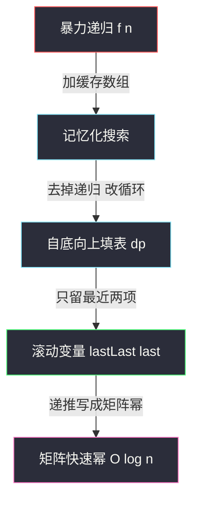
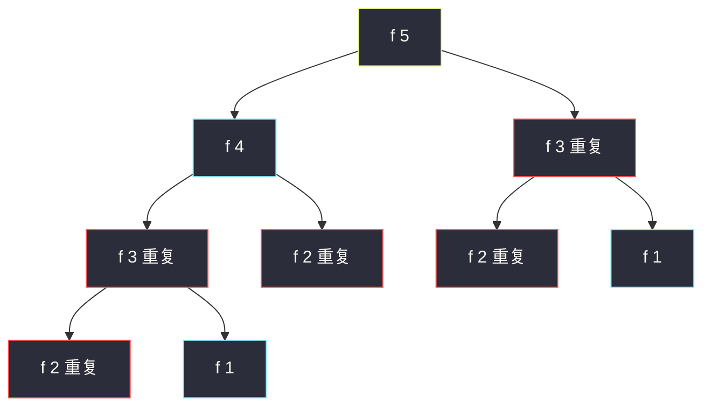

# 爬楼梯（DP 入门：递推 + 滚动变量）

## 一、问题描述

你正在爬楼梯，每次可以爬 **1 或 2 个台阶**。问爬到第 `n` 层共有多少种不同的方法。

> 🔗 LeetCode 70：https://leetcode.cn/problems/climbing-stairs/

**示例 1**

```
输入：n = 2
输出：2
解释：两种爬法 —— 1+1、2
```

**示例 2**

```
输入：n = 3
输出：3
解释：三种爬法 —— 1+1+1、1+2、2+1
```

**直观理解**

正着列举方法数会爆炸；换个方向想——**站在第 `n` 层回头看**：最后一步要么从第 `n-1` 层跨 1 阶上来，要么从第 `n-2` 层跨 2 阶上来。两类走法互不重叠又覆盖全部，所以

```
f(n) = f(n-1) + f(n-2)
```

这正是**斐波那契数列**平移一版：`f(1)=1, f(2)=2, f(3)=3, f(4)=5, f(5)=8 ...`

本题是动态规划的「第一课」：从暴力递归出发，一路优化到 O(n) 时间、O(1) 空间，最后还有矩阵快速幂的 O(log n) 进阶。

---

## 二、暴力解法（入门）

### 直观思路

把上面的分类讨论直接翻译成**从顶向下的递归**：要求 `f(n)`，就先去算 `f(n-1)` 和 `f(n-2)`，加起来返回。这与课上 class066 斐波那契数（Code01）的 `f1` 完全同构。

```java
// 爬楼梯：直接递归（对齐 class066 斐波那契的写法）
public static int climb1(int n) {
    return f1(n);
}

public static int f1(int i) {
    if (i == 1) {
        return 1;
    }
    if (i == 2) {
        return 2;
    }
    return f1(i - 1) + f1(i - 2);
}
```

### 复杂度

- **时间**：`O(2ⁿ)`（宽松上界；精确值与斐波那契数同阶，约为 `1.618ⁿ`）
- **空间**：`O(n)`，递归栈深度

### 🔴 瓶颈在哪里

画出 `f(5)` 的递归树：

```
                 f(5)
               /      \
           f(4)        f(3)   ← 重复
          /    \      /    \
       f(3)   f(2)  f(2)  f(1)
       /  \    ↑重复  ↑重复
    f(2) f(1)
     ↑重复
```

`f(3)` 被算了 2 次，`f(2)` 被算了 3 次……越往下重复越多。`n` 稍大（比如 45）就会超时。**子问题被重复求解**，是所有 DP 题的第一个突破口。

---

## 三、优化探索（核心章节）

### 3.1 观察特征

| 特征 | 说明 |
|------|------|
| 无后效性 | 「怎么走到第 i 层」不影响「从第 i 层还能怎么走」，`f(i)` 只由 `f(i-1)`、`f(i-2)` 决定 |
| 重叠子问题 | 暴力递归树里 `f(i)` 大量重复出现——缓存一次，处处复用 |
| 子问题规模有序 | `f(1), f(2), ... , f(n)` 天然从小到大，可自底向上填表 |
| 只依赖最近两项 | 递推只看 `f(i-1)`、`f(i-2)`，整张表可以压缩成两个变量 |

### 3.2 暴力 → 优化：四步演进（对齐 class066 斐波那契课）

课上讲斐波那契（class066 Code01）时给过一条完整演进链，爬楼梯逐字适用：

1. **记忆化搜索**（`f2`）：递归照旧，但加一个 `dp` 数组当缓存，算过的 `f(i)` 直接返回 → `O(n)`
2. **自底向上 DP**（`f3`）：干脆不算递归，从 `f(1)`、`f(2)` 出发 `for` 循环填到 `f(n)` → `O(n)`
3. **空间压缩**（`f4`）：表里每个位置只依赖前两个，用 `lastLast`、`last` 两个变量滚动 → `O(1)` 空间
4. **矩阵快速幂**（class098 Code03）：把递推写成矩阵乘法，用快速幂做到 `O(log n)`——本题 `n ≤ 45` 用不上，作为进阶附录

```
f(1)=1, f(2)=2
for i = 3 .. n:
    f(i) = f(i-1) + f(i-2)
答案 = f(n)
```



### 3.3 关键推导问题

| 问题 | 答案 |
|------|------|
| 为什么 `f(n) = f(n-1) + f(n-2)`？ | 按最后一步分类：跨 1 阶（来自 n-1）或跨 2 阶（来自 n-2），两类**不重不漏** |
| 会不会有第三类「先到 n-1 再跳回 n-2」？ | 不会，只能向上爬；每个状态只依赖更小的下标，天然无后效 |
| 爬楼梯和斐波那契什么关系？ | 同一条递推，初值平移：斐波那契 `F(1)=1, F(2)=1`，爬楼梯 `f(1)=1, f(2)=2`，即 `f(n) = F(n+1)` |
| 边界为什么取 `f(1)=1, f(2)=2`？ | 1 层只有 1 种；2 层有 1+1 和 2 共 2 种；由题意直接数出 |
| 会溢出吗？ | 约束 `1 ≤ n ≤ 45`，`f(45) = 1836311903 < 2³¹ - 1`，`int` 恰好够 |

### 3.4 一句话核心

> **按最后一步把 f(n) 拆成 f(n-1) + f(n-2)，从 f(1)=1、f(2)=2 往上滚两个变量即可。**

---

## 四、代码实现详解

### Java（主解：空间压缩版，课上风格）

```java
// 爬楼梯
// 假设你正在爬楼梯，每次你可以爬1或2个台阶
// 你有多少种不同的方法可以爬到n层
// 测试链接 : https://leetcode.cn/problems/climbing-stairs/
// 对齐 class066 斐波那契 Code01 的空间压缩写法 / class098 Code02 的 O(n) 版
public class Solution {

    // 时间复杂度 O(n)，空间复杂度 O(1)
    public static int climbStairs(int n) {
        if (n == 1) {
            return 1;
        }
        if (n == 2) {
            return 2;
        }
        int lastLast = 1, last = 2; // f(1), f(2)
        for (int i = 3, cur; i <= n; i++) {
            cur = lastLast + last;
            lastLast = last;
            last = cur;
        }
        return last;
    }
}
```

### Java（演进版：记忆化 → 自底向上）

```java
// 演进过程：先记忆化，再自底向上填表（帮助理解 dp 表怎么来的）
public class Solution {

    // 记忆化搜索：递归 + 缓存
    public static int climb2(int n) {
        int[] dp = new int[n + 1];
        Arrays.fill(dp, -1);
        return f2(n, dp);
    }

    public static int f2(int i, int[] dp) {
        if (i == 1) {
            return 1;
        }
        if (i == 2) {
            return 2;
        }
        if (dp[i] != -1) {
            return dp[i];
        }
        int ans = f2(i - 1, dp) + f2(i - 2, dp);
        dp[i] = ans;
        return ans;
    }

    // 自底向上：显式填 dp 表
    public static int climb3(int n) {
        if (n == 1) {
            return 1;
        }
        if (n == 2) {
            return 2;
        }
        int[] dp = new int[n + 1];
        dp[1] = 1;
        dp[2] = 2;
        for (int i = 3; i <= n; i++) {
            dp[i] = dp[i - 1] + dp[i - 2];
        }
        return dp[n];
    }
}
```

### Java（进阶附录：矩阵快速幂 O(log n)，class098 Code03 同构）

```java
// 时间复杂度 O(log n)，矩阵快速幂的解法（class098 Code03 原版）
// 本题 n ≤ 45 用 O(n) 已绰绰有余；当递推叠加取模、n 到 10^9 级别时才有优势
public class Solution {

    public static int climbStairs(int n) {
        if (n == 0) {
            return 1;
        }
        if (n == 1) {
            return 1;
        }
        // {f(n), f(n-1)} = {f(1), f(0)} * base^(n-1)，f(1)=1, f(0)=1
        int[][] start = { { 1, 1 } };
        int[][] base = {
                { 1, 1 },
                { 1, 0 }
                };
        int[][] ans = multiply(start, power(base, n - 1));
        return ans[0][0];
    }

    // 矩阵相乘
    // a的列数一定要等于b的行数
    public static int[][] multiply(int[][] a, int[][] b) {
        int n = a.length;
        int m = b[0].length;
        int k = a[0].length;
        int[][] ans = new int[n][m];
        for (int i = 0; i < n; i++) {
            for (int j = 0; j < m; j++) {
                for (int c = 0; c < k; c++) {
                    ans[i][j] += a[i][c] * b[c][j];
                }
            }
        }
        return ans;
    }

    // 矩阵快速幂
    public static int[][] power(int[][] m, int p) {
        int n = m.length;
        int[][] ans = new int[n][n];
        for (int i = 0; i < n; i++) {
            ans[i][i] = 1;
        }
        for (; p != 0; p >>= 1) {
            if ((p & 1) != 0) {
                ans = multiply(ans, m);
            }
            m = multiply(m, m);
        }
        return ans;
    }
}
```

### Python（同思路）

```python
# 爬楼梯：滚动变量版，O(n) / O(1)
class Solution:
    def climbStairs(self, n: int) -> int:
        if n == 1:
            return 1
        if n == 2:
            return 2
        last_last, last = 1, 2  # f(1), f(2)
        for _ in range(3, n + 1):
            last_last, last = last, last_last + last
        return last
```

```python
# 自底向上填表版（帮助理解 dp 表）
class Solution:
    def climbStairs(self, n: int) -> int:
        if n <= 2:
            return n
        dp = [0] * (n + 1)
        dp[1], dp[2] = 1, 2
        for i in range(3, n + 1):
            dp[i] = dp[i - 1] + dp[i - 2]
        return dp[n]
```

---

## 五、具体例子演示

以 `n = 5` 为例，先看暴力递归怎么浪费，再看滚动变量怎么一步步滚出答案。

### 暴力递归的重复计算

```
调用 f(5)
 ├─ 调用 f(4)
 │   ├─ 调用 f(3)
 │   │   ├─ 调用 f(2) → 2
 │   │   └─ 调用 f(1) → 1
 │   │   返回 3
 │   └─ 调用 f(2) → 2      ← 第 2 次算 f(2)
 │   返回 5
 └─ 调用 f(3)               ← 第 2 次算 f(3)
     ├─ 调用 f(2) → 2       ← 第 3 次算 f(2)
     └─ 调用 f(1) → 1
     返回 3
f(5) = 5 + 3 = 8
```



红框节点都是**算过还要再算**的子问题——这正是记忆化 / DP 要消灭的部分。

### 滚动变量的逐步跟踪

初始：`lastLast = 1 (f(1))`，`last = 2 (f(2))`

| 轮次 i | cur = lastLast + last | 更新后 lastLast | 更新后 last | 含义 |
|--------|----------------------|-----------------|-------------|------|
| 3 | 1 + 2 = 3 | 2 | 3 | f(3) = 3 |
| 4 | 2 + 3 = 5 | 3 | 5 | f(4) = 5 |
| 5 | 3 + 5 = 8 | 5 | 8 | f(5) = 8 |

循环结束返回 `last = 8`。对照暴力版结果一致，但只算了 3 次加法。

---

## 六、复杂度分析

| 版本 | 时间 | 空间 | 说明 |
|------|------|------|------|
| 暴力递归 | `O(2ⁿ)` | `O(n)` | 递归树指数展开，n=45 直接超时 |
| 记忆化搜索 | `O(n)` | `O(n)` | 每个 f(i) 只算一次；递归栈 O(n) |
| 自底向上 DP | `O(n)` | `O(n)` | 显式 dp 数组 |
| 滚动变量（主解） | `O(n)` | `O(1)` | 只留最近两项 |
| 矩阵快速幂 | `O(log n)` | `O(1)` | 2×2 矩阵乘法 O(1)，快速幂 O(log n) 次 |

---

## 七、方法对比与总结

### 演进链（背下来，所有一维线性 DP 通用）

```
暴力递归 → 记忆化 → 自底向上填表 → 滚动变量 → 矩阵快速幂
   ↑加缓存        ↑改循环        ↑砍数组      ↑仅线性递推可用
```

### 易错点

1. **边界写错**：`f(1)=1, f(2)=2` 是数出来的，不是 `f(2)=1`——别和斐波那契 `F(2)=1` 混了。
2. **滚动更新顺序反了**：必须先 `cur = lastLast + last`，再 `lastLast = last; last = cur`；直接写 `lastLast = last; last = lastLast + last` 会把旧值覆盖掉。
3. **把 `f(0)` 也纳入**：本题约束 `1 ≤ n ≤ 45`，不需要 `f(0)`；若按课上矩阵版约定 `f(0)=1`（原地不动算一种），两种初值都能推对，只是含义不同。
4. **以为必须开数组**：只依赖前两项的递推，永远可以压到 O(1)。

### 模板口诀

> **最后一步分两类，f(n)=f(n-1)+f(n-2)；从小到大滚两项，O(n) 时间 O(1) 空间。**

---

## 八、举一反三

| 题目 | 链接 | 迁移点 |
|------|------|--------|
| 509. 斐波那契数 | https://leetcode.cn/problems/fibonacci-number/ | 同一条递推，只换初值；课上 class066 题 1 的原型 |
| 746. 使用最小花费爬楼梯 | https://leetcode.cn/problems/min-cost-climbing-stairs/ | 从「计数」变「最小花费」，递推加 `cost[i]` 取 min |
| 1137. 第 N 个泰波那契数 | https://leetcode.cn/problems/n-th-tribonacci-number/ | 递推变成三项之和，滚动变量多留一个 |
| 790. 多米诺和托米诺平铺 | https://leetcode.cn/problems/domino-and-tromino-tiling/ | 更复杂的「最后一步分类」，课上 class098 题 5 |

**迁移一句**：凡是「过程由若干步组成、每步选择有限」的计数/最值题，先想**最后一步的分类**写递推，再走「记忆化 → 填表 → 滚动」这条演进链。
