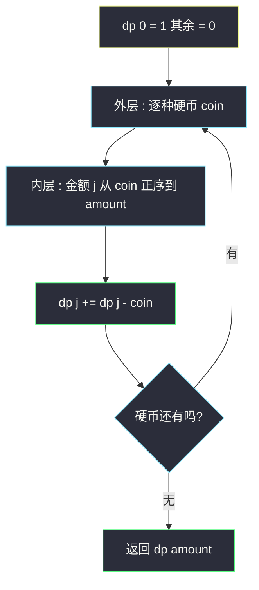

# 零钱兑换 II（完全背包：恰好装满求组合数）

## 一、问题描述

给你不同面额的硬币 `coins` 和总金额 `amount`，每种硬币**数量无限**。计算凑成总金额的**组合数**（同一组合的不同排列只算一种）。

> 🔗 LeetCode 518：https://leetcode.cn/problems/coin-change-ii/

**示例 1**

```
输入：amount = 5, coins = [1,2,5]
输出：4
解释：4 种组合 —— 5=5、5=2+2+1、5=2+1+1+1、5=1+1+1+1+1
（注意 1+2+2 与 2+2+1 与 2+1+2 是同一组合）
```

**示例 2**

```
输入：amount = 3, coins = [2]
输出：0
解释：2 的任意组合凑不出 3
```

**直观理解**

和 #322 零钱兑换同一个「无限硬币凑金额」的完全背包，但目标从**最少件数（min）**变成**方案数（累加计数）**。计数版有个著名陷阱：**外层循环放谁决定算的是组合还是排列**——想清楚「每种面额的硬币在方案里聚成一段、按面额顺序扩展」，就不掉坑。

---

## 二、暴力解法

### 直观思路

按硬币种数递归：`f(i, j)` = 用**第 i 种及以后**的硬币凑出金额 `j` 的组合数。每种硬币从 0 枚到 `j/c` 枚逐个枚举：

```java
// 暴力递归：固定硬币处理顺序 → 天然去重
public static int change1(int amount, int[] coins) {
    return f(coins, 0, amount);
}

// coins[i...] 每种随便用，凑出恰好 rest 的组合数
public static int f(int[] coins, int i, int rest) {
    if (rest == 0) {
        return 1; // 找到一种组合
    }
    if (i == coins.length) {
        return 0; // 没硬币了还欠着钱
    }
    int ans = 0;
    // 第 i 种硬币用 0 枚、1 枚、2 枚 ...
    for (int cnt = 0; cnt * coins[i] <= rest; cnt++) {
        ans += f(coins, i + 1, rest - cnt * coins[i]);
    }
    return ans;
}
```

### 复杂度

- **时间**：指数级（最坏每种硬币枚举 `amount/c` 个用量再组合）
- **空间**：`O(k + amount/k)` 递归栈

### 🔴 瓶颈在哪里

「第 i 种用几枚」的内层枚举是重复劳动：`f(i, j - c)` 的展开里已经包含了「第 i 种再用一枚」的所有后续。把枚举压缩成一行转移，就是完全背包计数。

---

## 三、优化探索

### 3.1 可变参数分析

两个可变参数：硬币进度 `i`、剩余金额 `j` → 二维表。

| dp 定义 | 含义 |
|---------|------|
| `dp[i][j]` | 只用**前 i 种**硬币（每种无限），恰好凑出金额 j 的组合数 |

```
dp[0][0] = 1，dp[0][j>0] = 0
dp[i][j] = dp[i-1][j]                       // 第 i 种一枚不用
         + (j >= c ? dp[i][j-c] : 0)        // 第 i 种再用一枚（同层！）
答案 = dp[k][amount]
```

同层转移 `dp[i][j-c]` 正是「无限量」的体现（class074 完全背包模板同款结构）。

### 3.2 组合数 vs 排列数：外层循环定生死（本题灵魂）

压缩成一维后必须**外层硬币、内层金额正序**：

- **外层硬币**：任何时刻，一个组合都按硬币种类的固定顺序被「分段生成」——先只考虑第 1 种，再放第 2 种……同一组合只会按一种顺序生成一次 → **组合数** ✓
- **外层金额**（内层枚举硬币，如 #377 组合总和 IV）：每加一枚都会考虑**所有**硬币，`1+2` 和 `2+1` 被当成两种 → **排列数**

### 3.3 关键问题

| 问题 | 答案 |
|------|------|
| 为什么 dp[0] = 1？ | 「一分不花」本身是一种合法组合（空组合），是计数转移的种子 |
| 和 #322 的差异？ | 转移 min 换成加法、初值 ∞ 换成 0；容量都正序、物品都在外层 |
| `dp[j] += dp[j-coin]` 为什么不会重复计同一组合？ | 每轮外层只引入一种新硬币；已处理的硬币组合在上一轮已固化，不会回头重排 |
| 需要考虑顺序不同算不同方案吗？ | 本题不用（求组合）；#377 要求排列，循环层次对调即可 |

### 3.4 一句话核心

> **dp[0]=1 起步，外层硬币内层金额正序：dp[j] += dp[j-coin]，dp[amount] 即组合数。**



---

## 四、代码实现

### Java（主解：完全背包计数 + 空间压缩）

```java
// 零钱兑换 II
// 每种硬币数量无限，计算凑成总金额的硬币组合数
// 测试链接 : https://leetcode.cn/problems/coin-change-ii/
// 说明 : 课上 class099 Code05 NumberOfBuyWay 的 build() 就是这个骨架
//        （dp 0 = 1，外层硬币、内层金额正序，dp j += dp j - value），
//        class074 Code03 为完全背包模板，本题按同一体系对齐
public class Solution {

    // 时间复杂度 O(k * amount)，空间复杂度 O(amount)
    public static int change(int amount, int[] coins) {
        // dp[j] : 恰好凑出金额 j 的组合数
        int[] dp = new int[amount + 1];
        dp[0] = 1; // 空组合，计数的种子
        for (int coin : coins) {
            // 完全背包 + 求组合数 :
            // 硬币在外层 → 组合按面种顺序生成，天然去重
            // 金额正序 → dp[j-coin] 是本层新值 → 同种硬币可叠加
            for (int j = coin; j <= amount; j++) {
                dp[j] += dp[j - coin];
            }
        }
        return dp[amount];
    }
}
```

### Java（对照版：二维 dp 表）

```java
// dp[i][j] : 只用前 i 种硬币凑出 j 的组合数
// 对齐 class074 Code03 compute1 的结构（max 换加法计数）
public class Solution {

    public static int change(int amount, int[] coins) {
        int k = coins.length;
        int[][] dp = new int[k + 1][amount + 1];
        dp[0][0] = 1;
        for (int i = 1; i <= k; i++) {
            for (int j = 0; j <= amount; j++) {
                // 第 i 种一枚不用
                dp[i][j] = dp[i - 1][j];
                // 第 i 种再用一枚（同层转移 → 无限件）
                if (j >= coins[i - 1]) {
                    dp[i][j] += dp[i][j - coins[i - 1]];
                }
            }
        }
        return dp[k][amount];
    }
}
```

### Python

```python
# 完全背包计数 + 滚动数组
class Solution:
    def change(self, amount: int, coins: list[int]) -> int:
        # dp[j] : 恰好凑出金额 j 的组合数
        dp = [1] + [0] * amount
        for coin in coins:
            # 外层硬币、内层金额正序 → 组合数
            for j in range(coin, amount + 1):
                dp[j] += dp[j - coin]
        return dp[amount]
```

---

## 五、具体例子演示

以 `amount = 5, coins = [1,2,5]` 为例，逐轮跟踪。约定每轮只动一种硬币，金额正序推进。

### dp 表逐硬币、逐金额跟踪

**初始**：`dp = [1, 0, 0, 0, 0, 0]`（下标 0..5，dp[0]=1 是计数种子）

**硬币 1**（j = 1..5，`dp[j] += dp[j-1]`，正序传播）：

| j | dp[j-1]（本层新值） | dp[j] | 对应组合 |
|---|--------------------|-------|---------|
| 1 | dp[0]=1 | 1 | （1） |
| 2 | dp[1]=1 | 1 | （1+1） |
| 3 | dp[2]=1 | 1 | （1+1+1） |
| 4 | dp[3]=1 | 1 | （1×4） |
| 5 | dp[4]=1 | 1 | （1×5） |

处理后：`[1,1,1,1,1,1]`——只有硬币 1 可用时，每个金额恰 1 种组合。

**硬币 2**（j = 2..5，`dp[j] += dp[j-2]`，dp[j-2] 含本层新值）：

| j | dp[j-2] | 旧 dp[j] | 新 dp[j] = 旧 + dp[j-2] | 新增的组合 |
|---|---------|----------|------------------------|-----------|
| 2 | dp[0]=1 | 1 | **2** | +（2） |
| 3 | dp[1]=1 | 1 | **2** | +（2+1） |
| 4 | dp[2]=**2**（本层刚更） | 1 | **3** | +（2+2）、（2+1+1） |
| 5 | dp[3]=**2**（本层刚更） | 1 | **3** | +（2+2+1）、（2+1+1+1） |

处理后：`[1,1,2,2,3,3]`。

注意 `j=4` 读的 `dp[2]=2` 是**本层更新后**的值，含义是「用前两种硬币凑出 2 的两种方式：(2) 与 (1+1)」。于是「凑 4 时再补一枚 2」把两条路径都继承下来，得到 (2+2)、(2+1+1)。这正是「正序 = 同种硬币可叠加」与「外层硬币 = 组合按面种顺序扩展」的直观体现。

**硬币 5**（j = 5，`dp[5] += dp[0]`）：

| j | dp[j-5] | 旧 dp[5] | 新 dp[5] | 新增组合 |
|---|---------|----------|----------|---------|
| 5 | dp[0]=1 | 3 | **4** | +（5） |

最终 `dp[5] = 4` ✓，与示例 1 一致。四种组合：`(5)`、`(2+2+1)`、`(2+1+1+1)`、`(1+1+1+1+1)`。

### 汇总表

| 阶段 | dp[0..5] | dp[5] 对应组合 |
|------|----------|---------------|
| 初始 | 1,0,0,0,0,0 | — |
| +硬币 1 | 1,1,1,1,1,1 | 1×5 |
| +硬币 2 | 1,1,2,2,3,3 | 1×5、2+1+1+1、2+2+1 |
| +硬币 5 | 1,1,2,2,3,**4** | 上述 3 种 + 单独一枚 5 |

### 汇总表

| 阶段 | dp[0..5] | dp[5] 对应组合 |
|------|----------|---------------|
| 初始 | 1,0,0,0,0,0 | — |
| +硬币 1 | 1,1,1,1,1,1 | 1×5 |
| +硬币 2 | 1,1,2,2,3,3 | 1×5、2+1+1+1、2+2+1 |
| +硬币 5 | 1,1,2,2,3,**4** | 上述 3 种 + 单独一枚 5 |


---

## 六、复杂度分析

| 版本 | 时间 | 空间 | 说明 |
|------|------|------|------|
| 暴力递归 | 指数级 | `O(k)` | 枚举每种硬币的用量组合 |
| 二维 dp 表 | `O(k * amount)` | `O(k * amount)` | 状态清晰 |
| 一维 dp（主解） | `O(k * amount)` | `O(amount)` | 外层硬币、内层金额正序 |

---

## 七、方法对比与总结

### #322（最少件数）vs #518（组合数）

| | #322 零钱兑换 | #518 零钱兑换 II |
|---|---------------|------------------|
| 问什么 | 最少几枚 | 几种组合 |
| dp 初值 | `dp[0]=0`，其余 ∞ | `dp[0]=1`，其余 0 |
| 转移 | `dp[j] = min(dp[j], dp[j-c]+1)` | `dp[j] += dp[j-c]` |
| 不可达判定 | 最后查 ∞ → -1 | 天然为 0 |

### 组合 vs 排列（循环层次）

| 循环层次 | 语义 | 代表题 |
|----------|------|--------|
| 外层硬币、内层金额 | **组合**（不区分顺序） | 本题 #518、#322 |
| 外层金额、内层硬币 | **排列**（区分顺序） | 377 组合总和 IV |

### 易错点

1. **dp[0] 忘记置 1**：计数 DP 的种子，全表会算成 0。
2. **循环层次写反**：内层硬币算出的是排列数，`amount=5, coins=[1,2,5]` 会得到 9 而不是 4。
3. **想用 #322 的代码直接改**：min→加法之外，初值语义（0 vs ∞）也要换，否则计数全错。
4. **正序叠加时口径混乱**：手推 dp 表务必一轮硬币一轮地更新，同一轮里 dp[j] 只能依赖本轮已更新的 dp[j-coin] 与上一轮的旧 dp[j]，别自己脑补多算一层。

### 模板口诀

> **计数种子 dp[0]=1，硬币在外金额在内；累加一句 dp[j]+=dp[j-coin]，组合排列看循环层次。**

---

## 八、举一反三

| 题目 | 链接 | 迁移点 |
|------|------|--------|
| 322. 零钱兑换 | https://leetcode.cn/problems/coin-change/ | 同骨架求最少件数（min 版） |
| 377. 组合总和 IV | https://leetcode.cn/problems/combination-sum-iv/ | 循环层次对调 → 排列数 |
| 279. 完全平方数 | https://leetcode.cn/problems/perfect-squares/ | 完全背包求最少，与 #322 同型 |
| 494. 目标和 | https://leetcode.cn/problems/target-sum/ | 计数思想但物品每个一次（0-1 背包计数，容量倒序） |
| 70. 爬楼梯 | https://leetcode.cn/problems/climbing-stairs/ | 一维完全背包计数的退化形态：硬币就是 {1,2}、求排列 |

**迁移一句**：**背包计数三件套**——可行性（or）、最值（min/max）、方案数（+）都是同一张表换运算符；先辨 0-1 / 完全（倒序/正序），再辨组合 / 排列（物品/金额谁在外层），模板即成。
