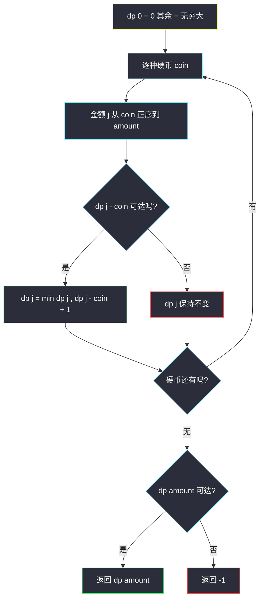
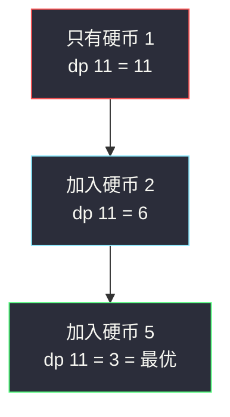

# 零钱兑换（完全背包：恰好装满求最少件数）

## 一、问题描述

给你不同面额的硬币数组 `coins` 和总金额 `amount`，每种硬币**数量无限**。计算凑成总金额所需的**最少硬币个数**；无法凑出返回 `-1`。

> 🔗 LeetCode 322：https://leetcode.cn/problems/coin-change/

**示例 1**

```
输入：coins = [1,2,5], amount = 11
输出：3
解释：11 = 5 + 5 + 1，用 3 枚硬币
```

**示例 2**

```
输入：coins = [2], amount = 3
输出：-1
解释：2 的任意倍数凑不出 3
```

**直观理解**

「每种硬币无限个」= **完全背包**：物品（硬币）可重复选，容量 = 金额。与 0-1 背包（#416 分割等和子集）唯一骨架差异：**容量正序遍历**，让「同一物品在本行内反复可用」。目标是「恰好装满时的最少件数」——这是一个求 min 的完全背包。

---

## 二、暴力解法

### 直观思路

金额 `j` 的最少硬币数 = 枚举**最后一枚**是哪种硬币，转移到更小的金额：

```java
// 暴力递归：凑出 j 的最少硬币数（对齐 class074 完全背包的尝试）
public static int coinChange1(int[] coins, int amount) {
    int ans = f(coins, amount);
    return ans == Integer.MAX_VALUE ? -1 : ans;
}

// 凑出金额 j 最少要几枚硬币，凑不出返回 MAX_VALUE
public static int f(int[] coins, int j) {
    if (j == 0) {
        return 0;
    }
    int ans = Integer.MAX_VALUE;
    for (int coin : coins) {
        if (coin <= j) {
            int next = f(coins, j - coin);
            if (next != Integer.MAX_VALUE) {
                ans = Math.min(ans, next + 1);
            }
        }
    }
    return ans;
}
```

### 复杂度

- **时间**：`O(k^amount)` 级别（k = 硬币种数），金额稍大指数爆炸
- **空间**：`O(amount)` 递归栈

### 🔴 瓶颈在哪里

`f(j)` 会被以不同顺序反复求解（比如 `1+2` 和 `2+1` 最后都落到 `f(j-3)`）。子问题只有一个可变参数 `j`，共 `amount+1` 个 → 加缓存即 DP。

---

## 三、优化探索

### 3.1 可变参数分析

单个金额参数 `j` → 一维表。为了看清与 0-1 背包的区别，先看标准**二维完全背包**形态（对齐 class074 Code03 UnboundedKnapsack 模板）：

| dp 定义 | 含义 |
|---------|------|
| `dp[i][j]` | 只用前 i 种硬币，凑出**恰好**金额 j 的最少硬币数 |

```
dp[0][0] = 0，dp[0][j>0] = +∞
dp[i][j] = min( dp[i-1][j],                    // 第 i 种一枚不用
                dp[i][j - c] + 1 )  若 j>=c    // 再用一枚第 i 种（同层！）
答案 = dp[k][amount]
```

**关键**：选硬币时转移自 `dp[i][j - c]`（**同一层**，说明第 i 种硬币用完后还能再用）——0-1 背包则是 `dp[i-1][j - c]`（上一层，用完即走）。

### 3.2 空间压缩 + 正序的秘密

按行压缩成一维 `dp[j]` 后：

- **正序**（j 从小到大）：计算 `dp[j]` 时读的 `dp[j - c]` 已是**本行更新后**的值 ⟹ 同一硬币可叠加使用 ⟹ 完全背包 ✓（class074 模板 `for (j = cost[i]; j <= t; j++)`）
- **倒序**：读到的是上一行旧值 ⟹ 每种只选一次 ⟹ 0-1 背包（#416）

### 3.3 「恰好装满」的初始化

求最少件数且**金额必须分毫不差**：`dp[0] = 0`，其余初始化为 `+∞`（不可达）。转移时先判断 `dp[j - c]` 是否可达再 +1，防止 `+∞ + 1` 溢出。这与 class074 Code06 购买干草题（`dp[0]` 起步、不可达用 `Integer.MAX_VALUE` 占位、转移前检查）完全同源。

### 3.4 关键问题

| 问题 | 答案 |
|------|------|
| 为什么贪心（每次拿最大面额）不行？ | 面额不成倍数时贪心错：`coins=[1,3,4], amount=6`，贪心 4+1+1 = 3 枚，最优 3+3 = 2 枚 |
| BFS 视角？ | 每个金额是节点，花一枚硬币连一条边，求 0→amount 的最短路——与 DP 本质相同 |
| 溢出风险？ | `Integer.MAX_VALUE + 1` 会绕成负数，必须先判可达 |
| 和 #518 零钱兑换 II 的区别？ | #518 求**组合数**（计数），本题求**最少件数**（最值）；dp 初值与转移（min vs +）都不同 |

### 3.5 一句话核心

> **dp[0]=0 其余无穷大；逐硬币、正序扫金额：dp[j] = min(dp[j], dp[j-coin]+1)。**



---

## 四、代码实现

### Java（主解：完全背包 + 空间压缩，对齐 class074 模板）

```java
// 零钱兑换
// 每种硬币数量无限，计算凑成总金额所需的最少硬币个数
// 测试链接 : https://leetcode.cn/problems/coin-change/
// 说明 : 课上 class074 Code03 是完全背包模板（正序容量、同层转移），
//        class074 Code06 购买干草题是"完全背包求最少花费 + 不可达占位"，
//        本题按同一体系对齐 : 恰好凑出 amount 的最少硬币数
public class Solution {

    // 时间复杂度 O(k * amount)，空间复杂度 O(amount)
    public static int coinChange(int[] coins, int amount) {
        int INF = Integer.MAX_VALUE;
        // dp[j] : 恰好凑出金额 j 的最少硬币数；不可达为 INF
        int[] dp = new int[amount + 1];
        Arrays.fill(dp, INF);
        dp[0] = 0; // 金额 0 用 0 枚
        for (int coin : coins) {
            // 完全背包 : 容量正序，dp[j-coin] 是本层新值 → 同一硬币可重复用
            for (int j = coin; j <= amount; j++) {
                if (dp[j - coin] != INF) {
                    // 转移 : 再补一枚 coin
                    dp[j] = Math.min(dp[j], dp[j - coin] + 1);
                }
            }
        }
        return dp[amount] == INF ? -1 : dp[amount];
    }
}
```

### Java（对照版：二维 dp 表，看清"同层转移"）

```java
// dp[i][j] : 只用前 i 种硬币，恰好凑出 j 的最少硬币数
// 对齐 class074 Code03 compute1 的结构（max 换 min）
public class Solution {

    public static int coinChange(int[] coins, int amount) {
        int k = coins.length;
        int INF = Integer.MAX_VALUE;
        int[][] dp = new int[k + 1][amount + 1];
        Arrays.fill(dp[0], 1, amount + 1, INF); // 0 种硬币只能凑出 0
        for (int i = 1; i <= k; i++) {
            for (int j = 0; j <= amount; j++) {
                // 第 i 种硬币一枚不用
                dp[i][j] = dp[i - 1][j];
                // 再用一枚（注意是 dp[i][...]，同层 → 无限重复）
                if (j >= coins[i - 1] && dp[i][j - coins[i - 1]] != INF) {
                    dp[i][j] = Math.min(dp[i][j], dp[i][j - coins[i - 1]] + 1);
                }
            }
        }
        return dp[k][amount] == INF ? -1 : dp[k][amount];
    }
}
```

### Python

```python
# 完全背包 + 滚动数组（正序扫金额）
class Solution:
    def coinChange(self, coins: list[int], amount: int) -> int:
        INF = float('inf')
        # dp[j] : 恰好凑出 j 的最少硬币数
        dp = [0] + [INF] * amount
        for coin in coins:
            # 正序：每种硬币可重复使用
            for j in range(coin, amount + 1):
                dp[j] = min(dp[j], dp[j - coin] + 1)
        return -1 if dp[amount] == INF else dp[amount]
```

---

## 五、具体例子演示

以 `coins = [1,2,5]`、`amount = 11` 为例。约定 `∞` 表示不可达。

### dp 表逐硬币、逐金额跟踪

**初始**（处理任何硬币前）：`dp = [0, ∞, ∞, ∞, ∞, ∞, ∞, ∞, ∞, ∞, ∞, ∞]`（下标 0..11）

**硬币 1**（正序 j = 1..11，每格看 `dp[j-1]`）：

| j | dp[j-1] | 更新 dp[j] | 说明 |
|---|---------|-----------|------|
| 1 | dp[0]=0 | 1 | 一枚 1 |
| 2 | dp[1]=1 | 2 | 两枚 1 |
| 3 | dp[2]=2 | 3 | ... |
| ... | ... | j | dp[j] = j（只能用 1） |

处理后：`[0,1,2,3,4,5,6,7,8,9,10,11]`

**硬币 2**（正序 j = 2..11，看 `dp[j-2]`——注意已是本层新值，2 可叠加）：

| j | dp[j-2] | min(旧 dp[j], dp[j-2]+1) | 新 dp[j] |
|---|---------|--------------------------|----------|
| 2 | dp[0]=0 | min(2, 1) | **1** |
| 3 | dp[1]=1 | min(3, 2) | 2 |
| 4 | dp[2]=**1**（本层刚更） | min(4, 2) | **2**（1+1 或 2+2） |
| 5 | dp[3]=2 | min(5, 3) | 3 |
| 6 | dp[4]=**2** | min(6, 3) | **3**（2+2+2） |
| 7 | dp[5]=3 | min(7, 4) | 4 |
| 8 | dp[6]=**3** | min(8, 4) | **4** |
| 9 | dp[7]=4 | min(9, 5) | 5 |
| 10 | dp[8]=**4** | min(10, 5) | **5** |
| 11 | dp[9]=5 | min(11, 6) | 6 |

处理后：`[0,1,1,2,2,3,3,4,4,5,5,6]`。注意 `j=4` 读的 `dp[2]` 是本层更新过的 1——这正是**正序 = 硬币可重复**的体现（2+2 凑 4）。

**硬币 5**（正序 j = 5..11，看 `dp[j-5]`）：

| j | dp[j-5] | min(旧, +1) | 新 dp[j] |
|---|---------|-------------|----------|
| 5 | dp[0]=0 | min(3, 1) | **1** |
| 6 | dp[1]=1 | min(3, 2) | **2** |
| 7 | dp[2]=1 | min(4, 2) | **2** |
| 8 | dp[3]=2 | min(4, 3) | **3** |
| 9 | dp[4]=2 | min(5, 3) | **3** |
| 10 | dp[5]=**1**（本层刚更） | min(5, 2) | **2**（5+5） |
| 11 | dp[6]=**2**（本层刚更） | min(6, 3) | **3**（5+5+1） |

最终 `dp[11] = 3` → 返回 **3**。



倒推还原方案：`dp[11]=3 ← dp[6]+1 ← dp[1]+1 ← dp[0]+1`，即 `5 + 5 + 1`。

---

## 六、复杂度分析

| 版本 | 时间 | 空间 | 说明 |
|------|------|------|------|
| 暴力递归 | `O(k^amount)` | `O(amount)` | 指数级 |
| 记忆化搜索 | `O(k * amount)` | `O(amount)` | 与填表同阶 |
| 一维 dp（主解） | `O(k * amount)` | `O(amount)` | k = 硬币种数 |

---

## 七、方法对比与总结

### #416（0-1 背包）vs #322（完全背包）

| | #416 分割等和子集 | #322 零钱兑换 |
|---|------------------|---------------|
| 物品可用次数 | 每个一次 | 每种无限次 |
| 二维转移 | `dp[i-1][j-nums[i]]`（上一层） | `dp[i][j-coins[i]]`（**同一层**） |
| 压缩后容量循环 | **倒序** | **正序** |
| 求什么 | 可行性（or） | 最少件数（min） |
| 不可达语义 | dp[j] = false | dp[j] = ∞ |

**容量循环方向就是 0-1 与完全的分水岭**——其他全是细节。

### 易错点

1. **贪心思维残留**：面额不成倍数时贪心必错，老老实实 DP。
2. **初始化成 -1**：不可达必须用 ∞（或 -1 但转移前判断），用 0 会错误传播。
3. **溢出**：`INF + 1` 绕回负数，Java 里必须先判 `!= INF`。
4. **倒序正序搞反**：倒序会把 5+5+1 算成「5 只能用一次」，amount=11 只能得 1+2 共 7 枚。
5. **忘了 `dp[0]=0`**：一切转移的根。

### 模板口诀

> **无限硬币正序灌，dp[0] 零来其余空；可达方才加一枚，min 完了 -1 收工。**

---

## 八、举一反三

| 题目 | 链接 | 迁移点 |
|------|------|--------|
| 518. 零钱兑换 II | https://leetcode.cn/problems/coin-change-ii/ | 同骨架，min 换成方案数累加（dp[j] += dp[j-coin]） |
| 279. 完全平方数 | https://leetcode.cn/problems/perfect-squares/ | 硬币就是 1,4,9,16,...，一模一样的完全背包 |
| 139. 单词拆分 | https://leetcode.cn/problems/word-break/ | 完全背包可行性：单词当硬币，长度当金额 |
| 416. 分割等和子集 | https://leetcode.cn/problems/partition-equal-subset-sum/ | 对比 0-1 背包的倒序与「每个一次」 |
| 322 之外课上同款 | https://www.luogu.com.cn/problem/P2918 | class074 Code06 购买干草：完全背包求最少花费（至少装满版） |

**迁移一句**：**「若干种无限量的资源凑一个目标，求最少/最多/可行/计数」= 完全背包**。先定 dp[j] 的语义与初值（min 用 ∞、计数用 0、可行用 false），再正序扫容量，转移基本就一行。
