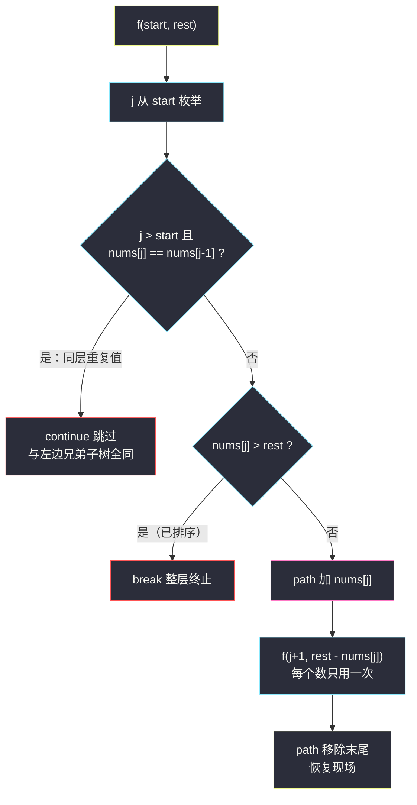
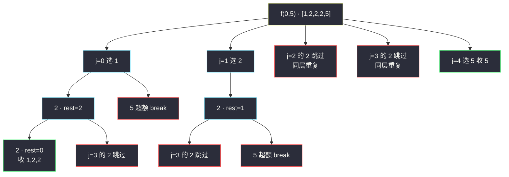

# 组合总和 II（回溯：每个数只用一次 + 排序同层去重）

## 一、问题描述

给定一个**可能含有重复数字**的候选集合 `candidates` 和一个目标数 `target`，找出 `candidates` 中所有可以使数字和为 `target` 的组合。

`candidates` 中的**每个数字在每个组合中只能使用一次**；解集不能包含重复的组合。

> 🔗 LeetCode 40：https://leetcode.cn/problems/combination-sum-ii/

**示例 1**

```
输入：candidates = [10,1,2,7,6,1,5], target = 8
输出：[[1,1,6],[1,2,5],[1,7],[2,6]]
解释：两个 1 都在候选集里，但 [1,7] 只能出现一次。
```

**示例 2**

```
输入：candidates = [2,5,2,1,2], target = 5
输出：[[1,2,2],[5]]
```

**直观理解**

这是组合家族里**最经典的去重题**：候选集里有两个 `1`，凑 `[1,7]` 时用「第一个 1」和用「第二个 1」是**同一组答案**——但朴素回溯会把两条路径都走一遍，产出两份 `[1,7]`。

去重的本质是给「值相同的一批数」立规矩：**同层里，同一个值只允许被尝试一次**。谁排到最前面的谁先试，跟班直接跳过。这套「排序 + 同层跳过」是站内 #47、#90 的同款思想。

---

## 二、暴力解法（入门）

### 直观思路

照搬 [#39 组合总和](./combination-sum.md) 的骨架，只把递归起点改成 `j + 1`（每个数只用一次），然后用 `HashSet` 在收集端把重复组合滤掉——「先污染后治理」。

```java
public List<List<Integer>> combinationSum2Brute(int[] candidates, int target) {
    Set<List<Integer>> set = new HashSet<>();
    Arrays.sort(candidates);                 // 让重复组合字面一致，HashSet 才滤得掉
    dfs(candidates, 0, target, new ArrayList<>(), set);
    return new ArrayList<>(set);
}

private void dfs(int[] nums, int start, int rest, List<Integer> path, Set<List<Integer>> set) {
    if (rest == 0) {
        set.add(new ArrayList<>(path));      // 靠 HashSet 去重
        return;
    }
    for (int j = start; j < nums.length; j++) {
        if (nums[j] > rest) break;           // 排序后可 break
        path.add(nums[j]);
        dfs(nums, j + 1, rest - nums[j], path, set); // j+1：只用一次
        path.remove(path.size() - 1);        // 恢复现场
    }
}
```

### 复杂度

- **时间**：`O(2^n · n)` 量级——每个候选「要/不要」全展开，重复组合照单全收再过滤；每组答案还要 O(n) 拷贝与哈希
- **空间**：`O(n)` 递归栈 + path（不计输出与 HashSet）

### 🔴 瓶颈在哪里

重复组合是**成批**产生的：候选里有 3 个 `2` 时，`[2,5]` 会被生成 `C(3,1)=3` 次、`[2,2,5]` 会被生成 `C(3,2)=3` 次。n 稍大时，计算量几乎全花在「生成马上要扔掉的重复品」上。  
更糟的是，这些重复**天生就长得一样**（排序后字面相同）——既然一定能预判，为什么不在生成前就掐掉？

---

## 三、优化探索（核心章节）

### 3.1 观察特征

| 特征 | 说明 |
|------|------|
| 候选含重复值 | 排序后相同值相邻 → 「跟班」可被一眼识别 |
| 每个数只用一次 | 起点 `j + 1`，回到 #77/#39 的普通模式 |
| 重复组合的来源唯一 | **同一层**里先试过值 x，再试另一个值 x 的分支，产出的集合完全一样 |

### 3.2 关键洞察：重复从哪来，就在哪掐

把决策树画出来看：**纵向（深度方向）选相同值是合法的**——`[1,1,6]` 里第二个 1 是第一个 1 的孩子；**横向（同层）再选相同值是冗余的**——同层第二个 1 能凑出的所有组合，第一个 1 的子树里全都有。

排序后这个判断只需一行：`j > start && nums[j] == nums[j - 1]` 时 `continue`——  
`nums[j-1]` 是**同层刚刚**试过的相同值（此刻它已恢复现场、回到候选池），再试必然重复。



### 3.3 关键推导问题

| 问题 | 答案 |
|------|------|
| 为什么 `j > start` 是关键限定？ | `j == start` 是本层第一个候选（纵向上父节点刚选过的同值也合法）；`j > start` 才说明 `nums[j-1]` 是**同层**试过的相同值 |
| 纵向选重复值为什么合法？ | `[1,1,6]`：第二个 1 是「第一个 1 分支的孩子」，语义是「这一组里放两个 1」，不是重复方案 |
| 跳过会不会漏答案？ | 不会：同层第一个 x 的子树**包含**第二个 x 子树能产生的一切（候选集更靠前、其余相同） |
| 和 #39 的区别只有两处？ | 是：起点 `j+1`（一次性）+ 同层去重 continue |
| 为什么必须先排序？ | 相同值要相邻，`nums[j-1]` 才是「同层同值」的可靠信号；顺带获得 break 剪枝 |

### 3.4 一句话核心

> **排序让重复值相邻，`j > start && nums[j] == nums[j-1]` 一行掐掉同层跟班——重复在生成前就被消灭，无需 HashSet。**

---

## 四、代码实现详解

### Java（主解：排序 + 同层去重，对齐 class038 去重思想）

> 课源码说明：本题无直接课源码；主解按左程云 `class038` 的去重范式对齐——课上 `Code02_Combinations.java`（子集 II，排序 + 分组不重选）与 `Code04_PermutationWithoutRepetition.java`（全排列 II，同层跳过重复候选）用的正是「**源头治理：同层同值只试一次**」这套思想。

```java
// 组合总和 II：每个数只能用一次，组合不能重复
// 测试链接 : https://leetcode.cn/problems/combination-sum-ii/
class Solution {

    public static List<List<Integer>> combinationSum2(int[] candidates, int target) {
        List<List<Integer>> ans = new ArrayList<>();
        Arrays.sort(candidates);                 // 排序：同值相邻 + break 剪枝
        f(candidates, 0, target, new ArrayList<>(), ans);
        return ans;
    }

    // 只能从 nums[start...] 挑，还差 rest 没凑满
    public static void f(int[] nums, int start, int rest,
                         List<Integer> path, List<List<Integer>> ans) {
        if (rest == 0) {
            ans.add(new ArrayList<>(path));      // 收集时拷贝
            return;
        }
        for (int j = start; j < nums.length; j++) {
            // 同层去重：nums[j-1] 是本层刚试过的相同值，跳过
            if (j > start && nums[j] == nums[j - 1]) {
                continue;
            }
            if (nums[j] > rest) {
                break;                           // 已排序：后面更大，整层终止
            }
            path.add(nums[j]);                   // 做选择
            f(nums, j + 1, rest - nums[j], path, ans); // j+1：只用一次
            path.remove(path.size() - 1);        // 恢复现场
        }
    }
}
```

### Python

```python
# 组合总和 II：每个数只能用一次，组合不能重复
# 测试链接 : https://leetcode.cn/problems/combination-sum-ii/
class Solution:
    def combinationSum2(self, candidates: list[int], target: int) -> list[list[int]]:
        nums = sorted(candidates)                # 同值相邻 + break 剪枝
        ans: list[list[int]] = []
        path: list[int] = []
        self.f(nums, 0, target, path, ans)
        return ans

    def f(self, nums: list[int], start: int, rest: int,
          path: list[int], ans: list[list[int]]) -> None:
        if rest == 0:
            ans.append(path[:])                  # 拷贝收集
            return
        for j in range(start, len(nums)):
            if j > start and nums[j] == nums[j - 1]:
                continue                         # 同层去重
            if nums[j] > rest:
                break                            # 后面只会更大
            path.append(nums[j])
            self.f(nums, j + 1, rest - nums[j], path, ans)  # 只用一次
            path.pop()                           # 恢复现场
```

---

## 五、例子演示

以 `candidates = [2,5,2,1,2], target = 5` 为例。排序后 `nums = [1,2,2,2,5]`，端到端跟踪主流程，重点看**两个 2 的不同待遇**。

**第 1 棵子树：选 1（rest 5→4）**

| 步骤 | 选择 | path | rest | 说明 |
|------|------|------|------|------|
| 1 | 1 | `[1]` | 4 | 递归 f(start=1, rest=4) |
| 2 | 2 | `[1,2]` | 2 | 递归 f(start=2, rest=2) |
| 3 | 2 | `[1,2,2]` | 0 | **收集 ① [1,2,2]**，return |
| 4 | 回到 start=2 层，j=3 的 2 | — | — | `j>start && nums[3]==nums[2]` → **continue 跳过** |
| 5 | j=4 的 5 | — | 2-5<0 | break，`[1,2]` 分支结束退回 |
| 6 | 回到 start=1 层，j=2 的 2 | — | — | 同层 2 已试过 → **continue** |
| 7 | j=4 的 5 | — | 4-5<0 | break，`[1]` 分支结束 |

**第 2 棵子树：同层 j=1 选 2（rest 5→3）**

| 步骤 | 选择 | path | rest | 说明 |
|------|------|------|------|------|
| 8 | 2 | `[2]` | 3 | 递归 f(start=2, rest=3) |
| 9 | 2 | `[2,2]` | 1 | 递归 f(start=3, rest=1) |
| 10 | j=3 的 2 | — | — | 同层重复 → continue |
| 11 | j=4 的 5 | — | 1-5<0 | break，退回；`[2,2]` 无果 |
| 12 | 回到 start=2 层，j=3 的 2 | — | — | 同层重复 → continue |
| 13 | j=4 的 5 | — | 3-5<0 | break，`[2]` 无果退回 |

**第 3 棵子树：同层 j=2 的 2、j=3 的 2**

| 步骤 | 说明 |
|------|------|
| 14 | `j>start(=0) && nums[2]==nums[1]` → **continue**，整棵「第二个 2 当根」的子树不进 |
| 15 | 同理 j=3 的 2 也 continue |

**第 4 棵子树：j=4 选 5（rest 5→0）** → **收集 ② [5]**

最终 `[[1,2,2],[5]]`，与示例 2 一致。对比暴力版：步骤 14-15 若不跳过，「2 当根」的三棵子树长得一模一样，`[2,2,1]`（排序后同为 `[1,2,2]` 字面）会被产出 3 份再靠 HashSet 扔掉 2 份。



---

## 六、复杂度分析

| 项目 | 复杂度 | 说明 |
|------|--------|------|
| 时间 | `O(2^n · n)` 最坏上界 | 去重后树退化为「不同多重集」树；最坏（元素互异）仍指数级，每组答案 O(n) 拷贝 |
| 空间 | `O(n)` | 递归栈深 ≤ n + path（不计输出） |

**对比暴力**：复杂度阶相同，但重复值越多差距越大——`[2,2,2,2]` 类输入的重复分支被整层砍掉，实际节点数可差一个乘法因子，还省掉了 HashSet 的构建与查询。

---

## 七、对比总结

### 组合家族四题一览

| | #77 组合 | #39 组合总和 | #40 本题 | #216 组合总和 III |
|--|----------|--------------|-----------|-------------------|
| 候选集 | `[1..n]` 无重复 | 无重复正数 | **可能重复** | 固定 1..9 |
| 复用 | 否 | 无限次 | 否 | 否 |
| 起点 | `j+1` | `j` | `j+1` | `j+1` |
| 去重 | 不需要 | 不需要 | **同层跳过** | 不需要 |
| 收集 | `size==k` | `rest==0` | `rest==0` | `size==k && rest==0` |

### 易错点

1. **去重条件丢掉 `j > start`** → 变成「纵向也去重」，`[1,1,6]` 这种合法答案直接漏掉。
2. **先 continue 去重还是先 break**：顺序无碍（两者互斥条件），但**忘了排序**会让两者双双失效。
3. **不排序直接比较 `nums[j-1]`** → 相同值不相邻，去重形同虚设。
4. **起点传 `j`** → 退回 #39（可复用），答案里出现 `[1,1,1,1,...]`。

### 模板口诀

> **排序同值排排坐，同层跟班 continue；纵放横禁记心间，起点加一不回头。**

---

## 八、举一反三

| 题目 | 链接 | 迁移点 |
|------|------|--------|
| 39. 组合总和 | https://leetcode.cn/problems/combination-sum/ | 无重复可复用：起点传 `j`（站内已有题解） |
| 216. 组合总和 III | https://leetcode.cn/problems/combination-sum-iii/ | 无重复候选，加个数约束 |
| 90. 子集 II | https://leetcode.cn/problems/subsets-ii/ | 同款「排序 + 同层去重」，改为每个节点都收集（站内已有题解） |
| 47. 全排列 II | https://leetcode.cn/problems/permutations-ii/ | 排列版去重：swap 法 + 每层 set 记录试过的值（站内已有题解） |
| 698. 划分为 k 个相等的子集 | https://leetcode.cn/problems/partition-to-k-equal-sum-subsets/ | 组合思想的进阶：桶装回溯 + 更强的剪枝 |

**迁移一句**：回溯去重三板斧——**排序、同层跳过、源头治理**；#40/#47/#90 三题表面不同（组合/排列/子集），去重内核一模一样，放在一起刷一次就通。
