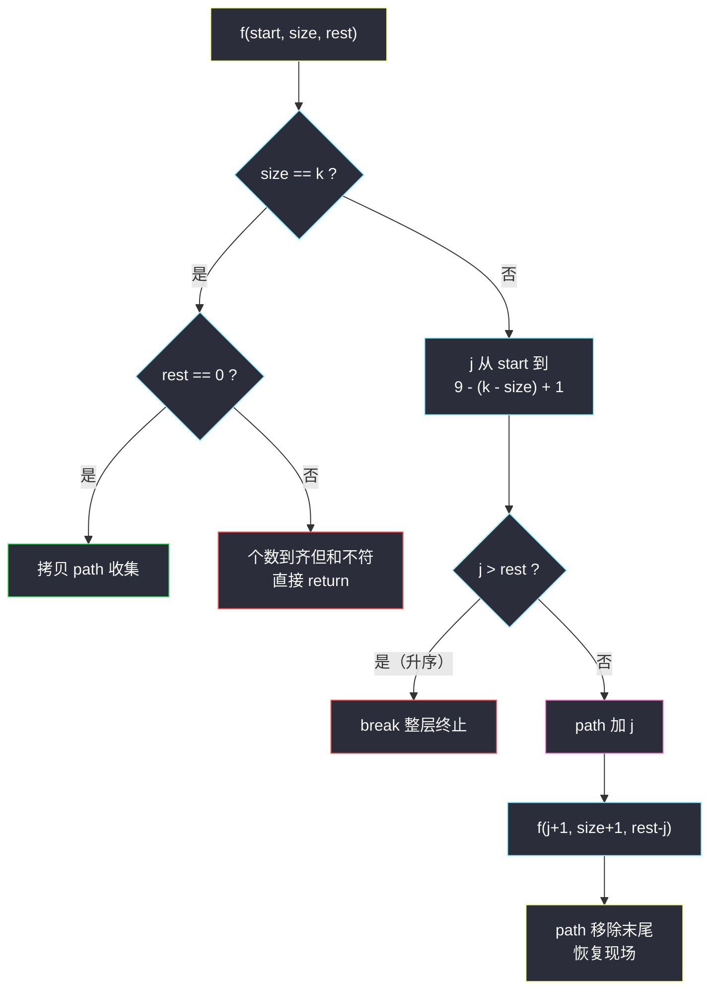
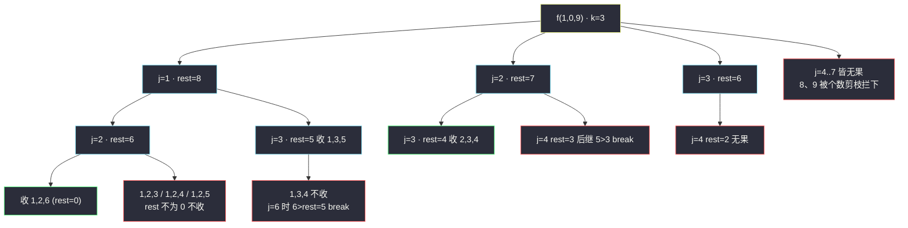

# 组合总和 III（回溯：1..9 选 k 个数凑和 n）

## 一、问题描述

找出所有相加之和为 `n` 的 `k` 个数的组合，且满足下列条件：

- 只使用数字 `1` 到 `9`；
- 每个数字**最多使用一次**（候选集本身无重复，天然无重复组合）。

返回所有可能的有效组合的列表。列表中的组合可以按任何顺序返回，且**不应包含重复组合**。

> 🔗 LeetCode 216：https://leetcode.cn/problems/combination-sum-iii/

**示例 1**

```
输入：k = 3, n = 7
输出：[[1,2,4]]
解释：1 + 2 + 4 = 7，没有其他符合条件的三数组合。
```

**示例 2**

```
输入：k = 3, n = 9
输出：[[1,2,6],[1,3,5],[2,3,4]]
解释：1+2+6=9、1+3+5=9、2+3+4=9，共三组。
```

**直观理解**

它是组合家族的「双约束定长版」：[#77 组合](./combinations.md) 管「选满 k 个」，[#39 组合总和](./combination-sum.md) 管「和恰好为 target」，本题**两个约束一起管**——从 1..9 里挑恰好 k 个互不相同的数，总和还得是 n。

候选集只有 9 个数、天然升序无重复，是练习「**多维剪枝**」的最佳小操场：个数不够要剪、和超了要剪、剩余数字凑不满也要剪。

---

## 二、暴力解法（入门）

### 直观思路

9 个数每个「要 / 不要」二选一，全枚举 `2^9 = 512` 条路径，走到头检查「恰好 k 个且和为 n」才收集（对齐课上 class038 `Code01_Subsequences.java` 子序列骨架、站内 [#78 子集](./subsets.md) 同款）。

```java
public List<List<Integer>> combinationSum3Brute(int k, int n) {
    List<List<Integer>> ans = new ArrayList<>();
    dfs(1, k, n, 0, new ArrayList<>(), ans);
    return ans;
}

private void dfs(int i, int k, int n, int sum, List<Integer> path, List<List<Integer>> ans) {
    if (i == 10) {                                  // 1..9 全部决策完
        if (path.size() == k && sum == n) {
            ans.add(new ArrayList<>(path));         // 双条件都满足才收
        }
        return;
    }
    path.add(i);                                    // 要 i
    dfs(i + 1, k, n, sum + i, path, ans);
    path.remove(path.size() - 1);                   // 恢复现场
    dfs(i + 1, k, n, sum, path, ans);               // 不要 i
}
```

### 复杂度

- **时间**：`O(2^9 · k)` = `O(512 · k)`——n、k 规模锁死在 512 内，不会超时但白白多走
- **空间**：`O(9)` 递归栈 + path

### 🔴 瓶颈在哪里

512 条路径里绝大多数是废话：`k=3, n=7` 时，`[1,2,3,4,5]`（超个数）、`[9]`（和不够还差 2 个数）、`[8,9]`（超和）这类分支全部走到第 9 层才被判死。规模小所以能 AC，但**「装满才检查、越界不回头」的结构性浪费**一眼可见——规模一旦放大（比如候选改成 1..30）立刻爆炸。

---

## 三、优化探索（核心章节）

### 3.1 观察特征

| 特征 | 说明 |
|------|------|
| 候选集固定 1..9 且升序无重复 | 直接 for-starti，无需排序、无需同层去重 |
| 双约束：个数 = k、总和 = n | 两维都能剪：`size > k` 或 `sum > n` 即死 |
| 剩余数字是连续段 `[start..9]` | 「剩余不够个数」和「剩余最大和不够 / 最小和超编」都能 O(1) 算出 |

### 3.2 for-starti + 三重剪枝

递归 `f(start, size, rest)`：path 已选 `size` 个、还差 `rest` 没凑满。

1. **收集即停**：`size == k` 时，`rest == 0` 才收（个数与和同时达标），立刻 return——继续选必然超个数；
2. **个数剪枝（循环上界）**：`j` 最大到 `9 - (k - size) + 1`，再大剩余数字不够凑满 k 个（#77 同款）；
3. **求和剪枝（break）**：候选升序，`j > rest` 后面只会更大，整层 break（#39 同款）。

还可以再加一个「**剩余和上下界**」剪枝：剩余 `k - size` 个数从 `[start..9]` 里选，其和最大为「最大 `k-size` 个数之和」、最小为「最小 `k-size` 个数之和」，`rest` 不在区间内整层必死——本题主解采用前三个剪枝已足够（n ≤ 45 时剪得极干净），这个进阶剪枝留给「举一反三」思考。



### 3.3 关键推导问题

| 问题 | 答案 |
|------|------|
| 为什么不用去重？ | 候选 1..9 互不相同 + 只许往后挑，每组组合只有升序一条生成路径 |
| `size == k` 但 `rest > 0` 为什么直接死？ | 再选必然 size > k；且 1..9 全正，sum 只增不减，rest 永远差着 |
| 上界 `9 - (k - size) + 1` 怎么来的？ | 还要选 `k - size` 个，连 `j` 自己算上需要 `9 - j + 1 ≥ k - size`，解出 j 上界 |
| `rest < 0` 需要单独判吗？ | 循环里 `j > rest` 已把它拦住（rest 是「还差的额度」，j 超过它一选就负）；保险起见在循环外加 `rest < 0` 防御亦可 |

### 3.4 一句话核心

> **#77 的个数约束 + #39 的求和约束拼在一起：装满 k 个查 rest，升序超额就 break，剩余不够卡上界。**

---

## 四、代码实现详解

### Java（主解：for-starti + 三重剪枝，对齐 class038 组合骨架）

> 课源码说明：本题无直接课源码；主解按左程云 `class038` 组合/子集的「f + starti + 恢复现场」决策树骨架对齐，是 [#77](./combinations.md) 与 [#39](./combination-sum.md) 双剪枝的直接合体。

```java
// 组合总和 III：1..9 选 k 个互不相同的数，和为 n
// 测试链接 : https://leetcode.cn/problems/combination-sum-iii/
class Solution {

    public static List<List<Integer>> combinationSum3(int k, int n) {
        List<List<Integer>> ans = new ArrayList<>();
        f(1, 0, n, k, new ArrayList<>(), ans);
        return ans;
    }

    // 从 start..9 里挑，已选 size 个，还差 rest 没凑满
    public static void f(int start, int size, int rest, int k,
                         List<Integer> path, List<List<Integer>> ans) {
        if (size == k) {                       // 个数到齐
            if (rest == 0) {                   // 和也恰好达标
                ans.add(new ArrayList<>(path)); // 收集时拷贝
            }
            return;                            // 再选必超个数，立刻回头
        }
        // 个数剪枝：j 最大到 9 - (k - size) + 1；求和剪枝：j > rest 直接 break
        for (int j = start; j <= 10 - (k - size); j++) {
            if (j > rest) {
                break;                         // 升序候选：后面只会更大
            }
            path.add(j);                       // 做选择
            f(j + 1, size + 1, rest - j, k, path, ans); // 只用一次
            path.remove(path.size() - 1);      // 恢复现场
        }
    }
}
```

### Python

```python
# 组合总和 III：1..9 选 k 个互不相同的数，和为 n
# 测试链接 : https://leetcode.cn/problems/combination-sum-iii/
class Solution:
    def combinationSum3(self, k: int, n: int) -> list[list[int]]:
        ans: list[list[int]] = []
        path: list[int] = []
        self.f(1, 0, n, k, path, ans)
        return ans

    def f(self, start: int, size: int, rest: int, k: int,
          path: list[int], ans: list[list[int]]) -> None:
        if size == k:
            if rest == 0:
                ans.append(path[:])            # 拷贝收集
            return
        for j in range(start, 10 - (k - size) + 1):
            if j > rest:
                break                          # 升序：后面更大
            path.append(j)
            self.f(j + 1, size + 1, rest - j, k, path, ans)
            path.pop()                         # 恢复现场
```

---

## 五、例子演示

以 `k = 3, n = 9` 为例（示例 2），端到端跟踪。`rest = 9 - path 之和`。

**第 1 棵子树：j=1（rest 9→8）**

| 步骤 | 选择 | path | rest | 说明 |
|------|------|------|------|------|
| 1 | 1 | `[1]` | 8 | f(2, 1, 8)，上界 `10-(3-1)=8` |
| 2 | 2 | `[1,2]` | 6 | f(3, 2, 6)，上界 `10-(3-2)=9` |
| 3 | 3 | `[1,2,3]` | 3 | size==k 但 rest=3≠0 → **不收，return** |
| 4 | 回退试 4 | `[1,2,4]` | 2 | 不收 |
| 5 | 试 5 | `[1,2,5]` | 1 | 不收 |
| 6 | 试 6 | `[1,2,6]` | 0 | **收集 ① [1,2,6]** |
| 7 | 试 7 | `[1,2,7]` | -1 | rest 不足 → 其实 j=7 时 `7 > rest=6` → **break，7、8、9 全跳过** |
| 8 | 回到 f(2,1,8)，试 3 | `[1,3]` | 5 | f(4, 2, 5) |
| 9 | 试 4 | `[1,3,4]` | 2 | 不收 |
| 10 | 试 5 | `[1,3,5]` | 0 | **收集 ② [1,3,5]** |
| 11 | 试 6 | — | 6>5 | **break**；退回 f(2,1,8) |
| 12 | 试 4 | `[1,4]` | 4 | f(5,2,4)：5>4 → break，无果 |

**第 2 棵子树：j=2（rest 9→7）**

| 步骤 | 选择 | path | rest | 说明 |
|------|------|------|------|------|
| 13 | 2 | `[2]` | 7 | f(3, 1, 7) |
| 14 | 3 | `[2,3]` | 4 | f(4, 2, 4) |
| 15 | 4 | `[2,3,4]` | 0 | **收集 ③ [2,3,4]** |
| 16 | 试 5 | — | 5>4 | break，退回 |
| 17 | 4 | `[2,4]` | 3 | f(5,2,3)：5>3 → break，无果 |

**第 3 棵子树：j=3（rest 9→6）**

| 步骤 | 说明 |
|------|------|
| 18 | `[3]` rest=6，f(4,1,6) |
| 19 | 试 4：`[3,4]` rest=2；f(5,2,2)：5>2 → break，无果 |
| 20 | f(4,1,6) 试 5：`[3,5]` rest=1，f(6,2,1) 无果 |

**第 4 棵子树：j=4（个数剪枝现身）**

| 步骤 | 说明 |
|------|------|
| 21 | 顶层循环上界 `10 - (3-0) = 7`，j 只到 7——`8、9` 连试都不用试（选 8 后剩 1 个数没法凑 3 个） |
| 22 | j=4：`[4]` rest=5，f(5,1,5) 试 5：`[4,5]` rest=0 差 1 个数，f(6,2,0) 里 j>rest 全 break，无果 |

最终 `[[1,2,6],[1,3,5],[2,3,4]]`，与示例 2 一致。步骤 7 与 21 分别展示了**求和 break 剪枝**与**个数上界剪枝**如何各自砍掉一整段循环。



---

## 六、复杂度分析

| 项目 | 复杂度 | 说明 |
|------|--------|------|
| 时间 | `O(C(9,k) · k)` 最坏 | 候选仅 9 个，答案组合数最多 `C(9,4)=126`；每组 O(k) 拷贝，剪枝后无白走分支 |
| 空间 | `O(k)` | 递归栈深 ≤ k + path（不计输出） |

对比暴力 `O(2^9)`：阶上差别不大（规模封顶），但结构上「装满即收 + 上界 + break」三重剪枝让递归节点数压到与答案数同阶——这套多维剪枝思路才是本题的**可迁移资产**，候选集换成 1..30 时暴力直接死、剪枝版照常跑。

---

## 七、对比总结

### 本题在组合家族中的位置

| | #77 | #39 | #40 | #216（本题） |
|--|-----|-----|-----|--------------|
| 约束 | 个数 k | 和 target | 和 target + 去重 | **个数 k + 和 n** |
| 剪枝 | 个数上界 | 求和 break | 上界 + 同层跳过 | **个数上界 + 求和 break** |
| 排序 | 不需要 | 需要 | 需要 | **天然升序，白送** |

### 易错点

1. **`size == k` 时只查个数不查 rest** → 收进一堆和不对的；两个条件必须同时成立。
2. **收集后忘 return** → 继续往下选，size 超编，path 越长越乱（虽然会因 `rest` 为负被 break 拦住，但结构上必须回）。
3. **上界写成 `9 - (k - size)`** → 差一错误，最后凑满的分支被误杀（验证：k=3、size=0 时上界应为 7）。
4. **把「1..9」当参数 `n` 传入混淆**：本题 n 是目标和不 Candidate 上限，语义别串。

### 模板口诀

> **个数求和双约束，装满先查 rest 零；升序超额整层 break，剩余不够上界封。**

---

## 八、举一反三

| 题目 | 链接 | 迁移点 |
|------|------|--------|
| 77. 组合 | https://leetcode.cn/problems/combinations/ | 只有个数约束：`size == k` 收集（站内已有题解） |
| 39. 组合总和 | https://leetcode.cn/problems/combination-sum/ | 只有和约束且可复用（站内已有题解） |
| 40. 组合总和 II | https://leetcode.cn/problems/combination-sum-ii/ | 和约束 + 同层去重（站内已有题解） |
| 17. 电话号码的字母组合 | https://leetcode.cn/problems/letter-combinations-of-a-phone-number/ | 「分组每组挑一个」的组合变体（站内已有题解） |
| 698. 划分为 k 个相等的子集 | https://leetcode.cn/problems/partition-to-k-equal-sum-subsets/ | 双约束升级为「分组 + 装桶」，剪枝思路完全同源 |

**迁移一句**：回溯剪枝永远是「**每多一个约束，就多一个提前判死的维度**」——个数、和、上界、下界，能 O(1) 算出的死路都值得在进递归前拦下；#216 就是把这句原则一次用满的小型教科书。
