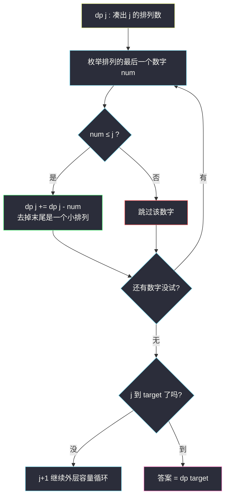
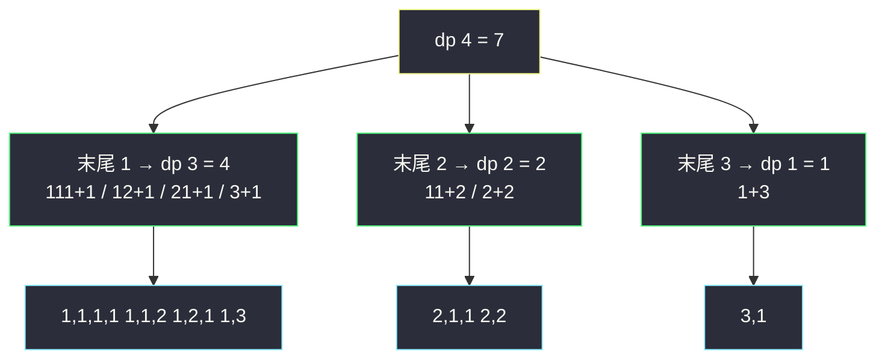

# 组合总和 Ⅳ（排列数 DP：顺序不同算不同）

## 一、问题描述

给你一个**互不相同**的整数数组 `nums` 和目标整数 `target`，返回并返回可以凑成 `target` 的**元素组合个数**。注意：题目尽管叫「组合」，实际语义是**排列**——答案统计的是不同的**排列**数，`(1,1,2)` 和 `(1,2,1)` 算两种。

序列里可以使用重复元素，每个数字可以无限次使用。

> 🔗 LeetCode 377：https://leetcode.cn/problems/combination-sum-iv/

**示例 1**

```
输入：nums = [1,2,3], target = 4
输出：7
解释：(1,1,1,1) (1,1,2) (1,2,1) (1,3) (2,1,1) (2,2) (3,1)，共 7 种
```

**示例 2**

```
输入：nums = [9], target = 3
输出：0
```

**直观理解**

这是**完全背包的「排列计数」版**：每种数字无限个、问凑出 `target` 的**有序**方案数。它与 #518 零钱兑换 II（站内已写 `coin-change-ii.md`）是对照题——518 求**组合**数（顺序无关），本题求**排列**数（顺序有关）。两题代码只差一个**循环嵌套顺序**：

- **组合**：外层物品、内层容量 ⟹ 同一组合只按固定顺序被数一次
- **排列**：外层容量、内层物品 ⟹ 每个状态可以任何数字收尾，顺序不同分头计数

按「最后一步」想最自然：凑出 `target` 的排列，**最后一个数字**必然是某个 `nums[i]`。

---

## 二、暴力解法

### 直观思路

按**最后一个数字**分类：长度 ≥ 1 的排列，末尾若是 `nums[i]`，前面部分就是凑出 `target - nums[i]` 的一个排列——递归：

```java
// 暴力递归：凑出 target 的排列个数
public static int combinationSum41(int[] nums, int target) {
    if (target == 0) {
        return 1; // 空排列
    }
    int ans = 0;
    for (int num : nums) {
        if (num <= target) {
            ans += combinationSum41(nums, target - num);
        }
    }
    return ans;
}
```

### 复杂度

- **时间**：`O(k^target)` 级别（k = nums 长度），指数爆炸
- **空间**：`O(target)` 递归栈

### 🔴 瓶颈在哪里

单个可变参数 `target`，状态只有 `target+1` 个，递归却指数展开——重叠子问题，填表即解。

---

## 三、优化探索

### 3.1 可变参数分析

一个可变参数 `target` → **一维表**：

| dp 定义 | 含义 |
|---------|------|
| `dp[j]` | 凑出 `target = j` 的**排列**个数 |

### 3.2 转移方程推导（核心：枚举最后一个数字）

凑出 `j` 的每个非空排列，**最后一个数字**恰是某一个 `nums[i]`；去掉它，剩下的是凑出 `j - nums[i]` 的排列。按末尾分类**不重不漏**：

```
dp[0] = 1                     // 空排列是唯一方案（计数之源）
dp[j] = Σ dp[j - nums[i]]    // 对所有 nums[i] ≤ j 求和
```

### 3.3 与 #518 组合计数的循环顺序对比（本题灵魂）

同样是「dp[j] += dp[j - cost]」，嵌套方向决定语义：

**排列（本题）——外层容量、内层物品：**

```java
for (int j = 1; j <= target; j++)          // 容量从小到大
    for (int num : nums)                    // 每个状态尝试所有数字收尾
        if (num <= j) dp[j] += dp[j - num];
```

计算 `dp[j]` 时，`dp[j - num]` 已经是「所有更小容量的完整排列数」——`1+2`（dp[3] 经 dp[2] 用 1 收尾，dp[2] 里已有 2+…）与 `2+1`（dp[3] 用 2 收尾）会被分别统计。

**组合（#518）——外层物品、内层容量：**

```java
for (int num : nums)                       // 逐个数字加入
    for (int j = num; j <= target; j++)    // 该数字只能接在已有组合后面
        dp[j] += dp[j - num];
```

每轮只允许「新数字接在旧组合末尾」，天然把顺序固定成 nums 的处理顺序，`1,2` 与 `2,1` 只数一次。

### 3.4 溢出警告（本题特有）

题目说「答案保证在 32 位整数范围内」，但**中间状态 dp[j] 可能超出**吗？——测试数据保证不会（LeetCode 官方说明）。但 Java 里若不放心，可用 `long` 数组累加、返回时再转。Python 无此烦恼。

### 3.5 关键问题

| 问题 | 答案 |
|------|------|
| 为什么叫「组合总和」却数排列？ | 历史命名问题；题面强调 sequence，`[1,2,1]` 与 `[2,1,1]` 不同 |
| 能不能先按 #518 算组合，再乘排列数？ | 组合内元素可重复，多重集排列数 = 阶乘除以重复阶乘，可行但易错，不如直接换循环顺序 |
| dp[0] 为什么是 1？ | 「什么都不选」凑出 0 是 1 种方案；它是所有计数的源头 |
| 和爬楼梯（#70，站内已写）什么关系？ | 完全同构：爬楼梯 = nums=[1,2] 的本题！dp[j] = dp[j-1] + dp[j-2] |
| 有负数怎么办？ | nums 全正（题面 1 ≤ nums[i]），有负数会无限递归 |

### 3.6 一句话核心

> **外层容量、内层物品；按最后一个数字分类求和，dp[0]=1 起步。**



---

## 四、代码实现

### Java（主解：一维排列 DP）

```java
// 组合总和 Ⅳ
// 由互不相同正整数组成 nums，返回凑成 target 的排列个数（顺序不同算不同）
// 测试链接 : https://leetcode.cn/problems/combination-sum-iv/
// 课上无原题：按 class074 背包体系对齐（完全背包计数，
// 与 #518 coin-change-ii 仅差循环嵌套顺序 : 外层容量 + 内层物品 = 排列）
public class Solution {

    // 时间复杂度 O(target * k)，k = nums.length
    // 空间复杂度 O(target)
    public int combinationSum4(int[] nums, int target) {
        // dp[j] : 凑出 j 的排列个数
        // 转移 : dp[j] = sum(dp[j - num])，枚举排列最后一个数字
        // 依赖方向 : 只依赖更小容量 → j 从小到大
        long[] dp = new long[target + 1];
        dp[0] = 1; // 空排列，计数之源
        for (int j = 1; j <= target; j++) {
            for (int num : nums) {
                if (num <= j) {
                    dp[j] += dp[j - num];
                }
            }
        }
        return (int) dp[target];
    }
}
```

### Java（对照版：#518 组合计数，看嵌套顺序的差异）

```java
// 同一笔数据 : 外层物品 + 内层容量 = 组合数（#518 零钱兑换 II 的骨架）
// nums=[1,2,3], target=4 时本版返回 4（1111,112,13,22），主解返回 7
public class Solution {

    public int combinationSum4(int[] nums, int target) {
        int[] dp = new int[target + 1];
        dp[0] = 1;
        for (int num : nums) {              // 外层 : 物品（数字）
            for (int j = num; j <= target; j++) { // 内层 : 容量正序（完全背包）
                dp[j] += dp[j - num];
            }
        }
        return dp[target]; // 注意 : 这是组合数，不是本题要的排列数！仅作对照
    }
}
```

### Python

```python
# 主解：一维排列 DP（外层容量、内层物品）
class Solution:
    def combinationSum4(self, nums: list[int], target: int) -> int:
        # dp[j] : 凑出 j 的排列个数
        dp = [1] + [0] * target
        for j in range(1, target + 1):
            for num in nums:
                if num <= j:
                    dp[j] += dp[j - num]
        return dp[target]
```

```python
# 记忆化版（对应暴力递归，帮助理解"最后一个数字"分类）
from functools import lru_cache

class Solution:
    def combinationSum4(self, nums: list[int], target: int) -> int:
        @lru_cache(maxsize=None)
        def f(j: int) -> int:
            if j == 0:
                return 1
            return sum(f(j - num) for num in nums if num <= j)
        return f(target)
```

---

## 五、具体例子演示

以 `nums = [1,2,3]`、`target = 4` 为例。

### dp 表逐格填充（外层 j 从 1 到 4，内层枚举 1、2、3）

| j | 枚举过程 | 计算 | dp[j] |
|---|---------|------|-------|
| 0 | —— | 空排列 | 1 |
| 1 | 末尾 1：dp[0]=1；末尾 2,3 超额跳过 | 1 | **1** |
| 2 | 末尾 1：dp[1]=1；末尾 2：dp[0]=1 | 1 + 1 | **2** |
| 3 | 末尾 1：dp[2]=2；末尾 2：dp[1]=1；末尾 3：dp[0]=1 | 2 + 1 + 1 | **4** |
| 4 | 末尾 1：dp[3]=4；末尾 2：dp[2]=2；末尾 3：dp[1]=1 | 4 + 2 + 1 | **7** |

返回 `dp[4] = 7` ✓。

### dp[4] 的 7 种来源逐一对应（验证不重不漏）



每个排列按**最后一个数字**归入唯一分支：`1,1,2` 末尾是 2 进 `dp[2]`，`1,2,1` 末尾是 1 进 `dp[3]`——顺序不同，归宿不同，分头计数。

### 对照：换成 #518 的循环顺序（外层数字）会得到什么

| 处理数字 | dp[0..4] | 说明 |
|---------|----------|------|
| 初始 | 1 0 0 0 0 | |
| 数字 1 | 1 1 1 1 1 | 只用 1 |
| 数字 2 | 1 1 2 2 3 | 新增 12（=dp[2]贡献）22、112 |
| 数字 3 | 1 1 2 3 4 | 新增 13、123 等以 3 结尾（按固定顺序） |

`dp[4] = 4`：`1111, 112, 13, 22`——**顺序不同不再重复计数**，这就是组合语义。同一份 `dp[j] += dp[j-num]`，嵌套方向一换，语义天差地别。

---

## 六、复杂度分析

| 版本 | 时间 | 空间 | 说明 |
|------|------|------|------|
| 暴力递归 | `O(k^target)` | `O(target)` | 指数爆炸 |
| 记忆化搜索 | `O(target*k)` | `O(target)` | 与填表同阶 |
| 一维 dp（主解） | `O(target*k)` | `O(target)` | k = nums 长度 |

`target ≤ 1000, k ≤ 200`，主解最多 2×10^5 次加法，稳过。

---

## 七、方法对比与总结

### 组合 vs 排列：一图定乾坤（家族互引）

| | #518 零钱兑换 II（组合，站内已写） | **#377 本题（排列）** |
|---|----------------------------------|----------------------|
| 循环嵌套 | **外层物品**、内层容量 | **外层容量**、内层物品 |
| 容量方向 | 正序（完全背包） | 从小到大 |
| `(1,2)` 与 `(2,1)` | 只数 1 次 | 数 2 次 |
| nums=[1,2,3], target=4 | 4 | 7 |
| 思考角度 | 新数字能接在哪些组合后 | 排列以哪个数字**收尾** |

记忆锚点：**「组合看物品入队顺序，排列看最后一个数字」**——写代码前先问自己「同一批数字换个顺序算不算新方案」。

### 易错点

1. **循环顺序照抄 #518**：外层物品算出组合数，答案直接错（4 ≠ 7）。
2. **dp[0] 初始化成 0**：全表归零。
3. **Java 中间溢出**：题面保证最终答案不超 int，但稳妥起见用 `long` 累加（或确认数据无坑）。
4. **把「正序 = 完全背包」和「外层容量」混淆**：正序解决「能不能重复用」，外层谁解决「计不计顺序」——两个独立旋钮。

### 模板口诀

> **排列外层容量内层物，末尾分类求和；组合外层物品内层容，入队不问顺序。**

---

## 八、举一反三

| 题目 | 链接 | 迁移点 |
|------|------|--------|
| 518. 零钱兑换 II | https://leetcode.cn/problems/coin-change-ii/ | 组合版对照（站内已写题解） |
| 70. 爬楼梯 | https://leetcode.cn/problems/climbing-stairs/ | 本题 nums=[1,2] 的特例（站内已写题解） |
| 2466. 统计构造好字符串的方案数 | https://leetcode.cn/problems/count-ways-to-build-good-strings/ | nums=[zero,one] 的排列计数 + 取模 |
| 322. 零钱兑换 | https://leetcode.cn/problems/coin-change/ | 同骨架求最少件数（min）（站内已写题解） |
| 139. 单词拆分 | https://leetcode.cn/problems/word-break/ | 排列可行性版：外层容量、内层枚举末尾单词 |

**迁移一句**：完全背包计数题先分清「组合还是排列」再动笔——**循环嵌套顺序就是语义开关**；再进一步，把「dp[j] += dp[j-num]」换成 min/max/or，就是求最少件数/可行性的一族变体。
