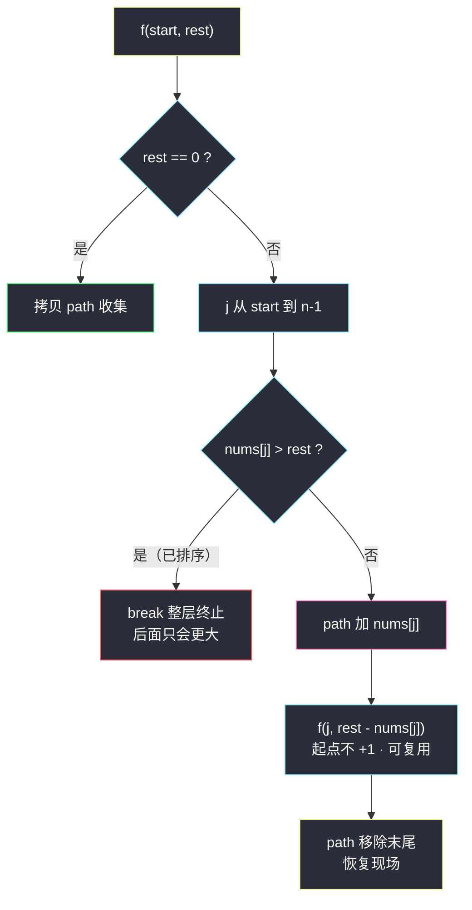
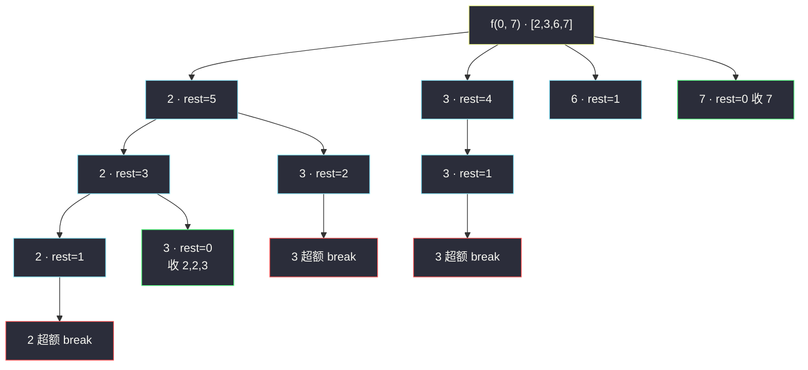

# 组合总和（回溯：元素可无限复用）

## 一、问题描述

给你一个**无重复元素**的整数数组 `candidates` 和一个目标整数 `target`，找出 `candidates` 中可以使数字和为目标数 `target` 的**所有不同组合**，并以列表形式返回。

列表中的组合**可以按任意顺序**返回；同一个数字在组合里可以**无限次重复出现**。两种组合如果元素频率不同，即视为不同组合。

> 🔗 LeetCode 39：https://leetcode.cn/problems/combination-sum/

**示例 1**

```
输入：candidates = [2,3,6,7], target = 7
输出：[[2,2,3],[7]]
解释：
2 + 2 + 3 = 7
7 = 7
其余组合不满足。
```

**示例 2**

```
输入：candidates = [2,3,5], target = 8
输出：[[2,2,2,2],[2,3,3],[3,5]]
```

**直观理解**

这就是「付钱问题」：面额不限量供应，问凑出 `target` 元的所有付法。  
因为每种面额可以重复拿，决策树**不再是「每个元素选一次」的 k 层树**，而是一棵深度不定的树：每一层都面对同一排面额，任选一个往下走，直到总和恰好等于 target（收）或超出（死）。

与 [#77 组合](./combinations.md) 唯一的代码级区别：递归传起点时**不 +1**——选了 `nums[j]`，下一层还从 `j` 开始（同一个还能再选）。

---

## 二、暴力解法（入门）

### 直观思路

不限制顺序的暴力：每层从头到尾试每个候选数，`rest`（剩余待凑额度）减去它就往下递归；`rest == 0` 收集、`rest < 0` 停。

```java
public List<List<Integer>> combinationSumBrute(int[] candidates, int target) {
    Set<List<Integer>> set = new HashSet<>();      // 收集端去重
    dfs(candidates, target, new ArrayList<>(), set);
    return new ArrayList<>(set);
}

private void dfs(int[] nums, int rest, List<Integer> path, Set<List<Integer>> set) {
    if (rest < 0) return;                          // 超了，死路
    if (rest == 0) {
        set.add(new ArrayList<>(path));            // 靠 HashSet 过滤重复
        return;
    }
    for (int num : nums) {                         // 每层从头试，可以回头
        path.add(num);
        dfs(nums, rest - num, path, set);
        path.remove(path.size() - 1);              // 恢复现场
    }
}
```

### 复杂度

- **时间**：不排序无剪枝时是 `O(n^(T/m))` 级别的满展开（`m` 为最小面额，决定树的最大深度 `T/m`），还要乘上 HashSet 去重的开销
- **空间**：`O(T/m)` 递归栈

### 🔴 瓶颈在哪里

1. **重复组合爆炸**：`target = 7` 时 `[2,2,3]、[2,3,2]、[3,2,2]` 会各被生成一次，靠 HashSet 事后扔——先生成、再过滤，浪费大量计算；
2. **候选乱序时剪不了枝**：不排序就无法在 `rest - num < 0` 后判断「后面的也全超」，只能全试。

---

## 三、优化探索（核心章节）

### 3.1 观察特征

| 特征 | 说明 |
|------|------|
| 组合与顺序无关 | 和 #77 同理：强制「只从 start 往后挑」，`[2,2,3]` 只保留升序那条生成路径 |
| 元素可无限复用 | 递归起点传 `j`（不是 `j+1`）——同一面额下一层还能再选 |
| 面额都是正整数 | `rest` 严格递减，树天然有界：深度 ≤ `target / min(candidates)` |

### 3.2 排序 + for-starti + 剪枝（课上组合骨架的「无限复用」变体）

递归 `f(nums, start, rest, path, ans)`：

- `rest == 0` → 拷贝收集；
- `j` 从 `start` 枚举到结尾：
  1. 若 `nums[j] > rest`：**数组已升序，后面的只会更大 → `break`**（不是 continue！这是排序换来的最强剪枝）；
  2. `path.add(nums[j])` → 递归 `f(nums, j, rest - nums[j], ...)`（注意起点是 `j` 不是 `j+1`）→ `path.removeLast()` 恢复现场。



### 3.3 关键推导问题

| 问题 | 答案 |
|------|------|
| 为什么不会重复？ | 每层只从 `start` 往后选，任何组合只有「非降序」一条生成路径；重复选同值靠 `f(j, ...)` 传递 |
| 为什么必须排序？ | 为了把 `nums[j] > rest` 从「跳过这一个」升级成 `break`「砍掉后面全部」；也保证同层候选有序 |
| 递归起点为什么传 `j`？ | 可复用语义：选了 `j` 还能继续选 `j`；若传 `j+1` 就退化成 #40（每个只用一次） |
| `rest == 0` 后还要往下试吗？ | 不要：面额全正，再选必超；收集后直接 return |
| 树会不会无限深？ | 不会：`rest` 每层至少减 `min(nums)`，深度 ≤ `target / min` |

### 3.4 一句话核心

> **可复用组合 = #77 的 for-starti 模板里把 `f(j+1)` 换成 `f(j)`，再用排序把「超了」升级成 break。**

---

## 四、代码实现详解

### Java（主解：排序 + for-starti，对齐 class038 组合骨架）

> 课源码说明：本题无直接课源码；主解按左程云 `class038` 组合/子集的「f + starti + 恢复现场」决策树骨架对齐，并叠加课上反复强调的「排序换剪枝」思想（同 [#77 组合](./combinations.md)）。

```java
// 组合总和：元素可无限次重复选取
// 测试链接 : https://leetcode.cn/problems/combination-sum/
class Solution {

    public static List<List<Integer>> combinationSum(int[] candidates, int target) {
        List<List<Integer>> ans = new ArrayList<>();
        Arrays.sort(candidates);                 // 排序：超了就能 break
        f(candidates, 0, target, new ArrayList<>(), ans);
        return ans;
    }

    // 只能从 candidates[start...] 里挑，还差 rest 没凑满
    public static void f(int[] nums, int start, int rest,
                         List<Integer> path, List<List<Integer>> ans) {
        if (rest == 0) {
            ans.add(new ArrayList<>(path));      // 收集时必须拷贝
            return;
        }
        for (int j = start; j < nums.length; j++) {
            if (nums[j] > rest) {
                break;                           // 已排序：后面更大，整层终止
            }
            path.add(nums[j]);                   // 做选择
            f(nums, j, rest - nums[j], path, ans); // 起点传 j：可复用！
            path.remove(path.size() - 1);        // 恢复现场
        }
    }
}
```

### Python

```python
# 组合总和：元素可无限次重复选取
# 测试链接 : https://leetcode.cn/problems/combination-sum/
class Solution:
    def combinationSum(self, candidates: list[int], target: int) -> list[list[int]]:
        nums = sorted(candidates)                # 排序：超了就能 break
        ans: list[list[int]] = []
        path: list[int] = []
        self.f(nums, 0, target, path, ans)
        return ans

    def f(self, nums: list[int], start: int, rest: int,
          path: list[int], ans: list[list[int]]) -> None:
        if rest == 0:
            ans.append(path[:])                  # 拷贝收集
            return
        for j in range(start, len(nums)):
            if nums[j] > rest:
                break                            # 后面只会更大
            path.append(nums[j])
            self.f(nums, j, rest - nums[j], path, ans)  # 可复用
            path.pop()                           # 恢复现场
```

---

## 五、例子演示

以 `candidates = [2,3,6,7]`（排序后不变）、`target = 7` 为例，端到端跟踪。`rest` 是剩余额度。

**第 1 棵子树：start=0，选 2（rest 7→5）**

| 步骤 | 选择 | path | rest | 结果 |
|------|------|------|------|------|
| 1 | 2 | `[2]` | 5 | 继续从 j=0（即 2）挑 |
| 2 | 2 | `[2,2]` | 3 | 继续从 2 挑 |
| 3 | 2 | `[2,2,2]` | 1 | 继续 |
| 4 | 试 2 | — | 1-2=-1 | `2 > rest=1` → **break**，死路退回 |
| 5 | 退回 `[2,2]`，试 3 | `[2,2,3]` | 0 | **收集 ① [2,2,3]**，return |
| 6 | 退回 `[2,2]`，试 6 | — | 3-6<0 | break |
| 7 | 退回 `[2]`，试 3 | `[2,3]` | 2 | 从 j=1（即 3）继续 |
| 8 | 试 3 | — | 2-3<0 | break；`[2,3]` 后继全灭，退回 |

**第 2 棵子树：start=0，选 3（rest 7→4）**

| 步骤 | 选择 | path | rest | 结果 |
|------|------|------|------|------|
| 9 | 3 | `[3,3]` | 1 | 试 3：3 > 1 → break，无果退回 |

**第 3 棵子树：start=0，选 6（rest 7→1）**

| 步骤 | 选择 | path | rest | 结果 |
|------|------|------|------|------|
| 10 | 6 | `[6]` | 1 | 试 6：break；无果退回 |

**第 4 棵子树：start=0，选 7（rest 7→0）**

| 步骤 | 选择 | path | rest | 结果 |
|------|------|------|------|------|
| 11 | 7 | `[7]` | 0 | **收集 ② [7]** |

最终 `[[2,2,3],[7]]`，与示例 1 一致。注意步骤 4 的 break：`rest=1` 时 2 已超，**无需再试 3、6、7**——排序带来的不是省一次比较，是砍掉三条整子树。



---

## 六、复杂度分析

| 项目 | 复杂度 | 说明 |
|------|--------|------|
| 时间 | `O(n^(T/m + 1))` 上界 | `T/m` 是树的最大深度（`m` 为最小面额），实际被剪枝大幅压缩；排序 `O(n log n)` 可忽略 |
| 空间 | `O(T/m)` | 递归栈最深 `target / min(candidates)` 层，path 同深（不计输出） |

**剪枝的实际威力**：满展开每层 n 个分支、深 T/m 层；排序 + break 后，靠近叶子的「必超」分支几乎全被拦在循环里，实测规模下递归节点数远小于上界。

---

## 七、对比总结

### 与 #77 组合的差异表（一字之差）

| | #77 组合 | #39 组合总和（本题） |
|--|----------|----------------------|
| 候选集 | `[1..n]` 固定 | 任意正整数数组 |
| 元素使用次数 | 每个 ≤ 1 次 | 无限次 |
| 递归起点 | `f(j + 1, ...)` | `f(j, ...)` ← **唯一区别** |
| 终止条件 | `size == k`（计数） | `rest == 0`（求和） |
| 排序必要性 | 可选（只为剪枝上界） | 强烈建议（break 级剪枝） |

### 易错点

1. **递归起点手滑写成 `j + 1`** → 立刻退化成「每个元素只用一次」，`[2,2,3]` 这种答案直接消失。
2. **不排序就 break** → 未排序时 `nums[j] > rest` 后面可能还有小的，只能 `continue`，剪枝大打折扣。
3. **收集后忘 return** → `rest==0` 还继续循环，全部死路，白跑且正确性侥幸（面额全正不会出错，但浪费）。
4. **path 忘 remove 恢复现场** → 同层兄弟分支的 path 里残留上一个选择，答案长度错乱。

### 模板口诀

> **排序换来 break 剪，起点传 j 不加一；额度归零收拷贝，回退一步删末尾。**

---

## 八、举一反三

| 题目 | 链接 | 迁移点 |
|------|------|--------|
| 40. 组合总和 II | https://leetcode.cn/problems/combination-sum-ii/ | 每个元素只能用一次 + 排序去重：起点回到 `j+1` 并加同层跳过 |
| 216. 组合总和 III | https://leetcode.cn/problems/combination-sum-iii/ | 候选固定 1..9、限定个数 k：计数 + 求和双约束 |
| 77. 组合 | https://leetcode.cn/problems/combinations/ | 定长组合：`size == k` 收集（站内已有题解） |
| 322. 零钱兑换 | https://leetcode.cn/problems/coin-change/ | 同场景只要最少张数：改 DP，不要枚举全部 |
| 377. 组合总和 IV | https://leetcode.cn/problems/combination-sum-iv/ | 顺序不同算不同（实为排列）：回溯退化，用 DP 数组合计数 |

**迁移一句**：组合家族三兄弟（#39 可复用 / #40 去重 / #216 定长）共用同一副 for-starti 骨架，改动只在**起点怎么传、要不要跳过重复、收集条件是什么**三处——刷完这篇，另外两篇等于半送。
