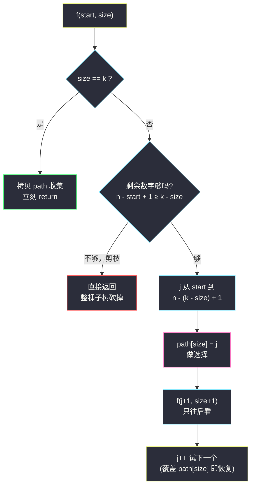
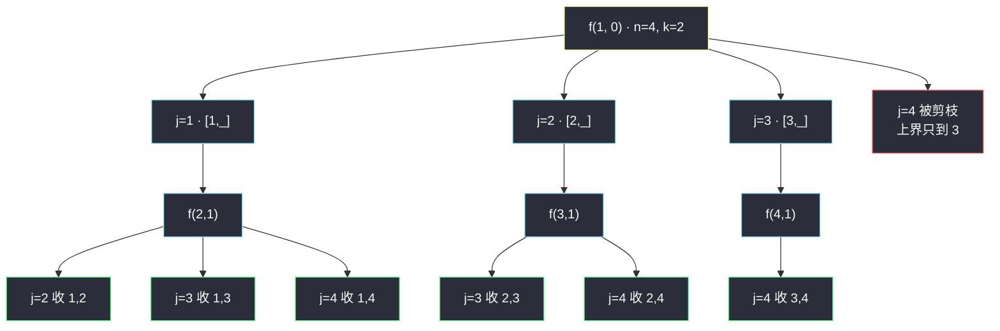

# 组合（回溯 for-starti：从 n 个数里选 k 个）

## 一、问题描述

给定两个整数 `n` 和 `k`，返回范围 `[1, n]` 中所有可能的 `k` 个数的组合。

你可以按**任何顺序**返回答案。

> 🔗 LeetCode 77：https://leetcode.cn/problems/combinations/

**示例 1**

```
输入：n = 4, k = 2
输出：
[[1,2],[1,3],[1,4],
 [2,3],[2,4],
 [3,4]]
```

**示例 2（最小规模）**

```
输入：n = 1, k = 1
输出：[[1]]
```

**直观理解**

组合和排列的区别就一句话：**排列讲究顺序，组合不讲究顺序**。  
`[1,2]` 和 `[2,1]` 是两个不同的排列，却是**同一个组合**。

所以枚举组合时，我们要人为定一条规矩：**每个数只能选比它大的数当后继**——先选 1 再选 2 可以，先选 2 再选 1 不允许。这样每条路径天然升序，`[2,1]` 这种「回头」路径根本不会被生成，重复从源头消灭。

这条「只往后看」的规矩，落到代码里就是回溯函数的核心参数：**start（starti）——本层只能从 start 往后的数字里挑**。

---

## 二、暴力解法（入门）

### 直观思路

最直白的方法是把每个数当成「要 / 不要」的二叉决策（对齐课上 class038 `Code01_Subsequences.java` 字符串子序列的骨架、站内 [#78 子集](./subsets.md) 同款）：

- 走到数字 `i`：分支一「要」，放进 path，递归 `i+1`；分支二「不要」，直接递归 `i+1`；
- 走过 `n` 之后，看 path 里是不是恰好 `k` 个，是才收集。

```java
public List<List<Integer>> combineBrute(int n, int k) {
    List<List<Integer>> ans = new ArrayList<>();
    dfs(1, new ArrayList<>(), n, k, ans);
    return ans;
}

private void dfs(int i, List<Integer> path, int n, int k, List<List<Integer>> ans) {
    if (i > n) {                       // 所有数字决策完毕
        if (path.size() == k) {
            ans.add(new ArrayList<>(path)); // 收集时拷贝！
        }
        return;
    }
    path.add(i);                       // 要 i
    dfs(i + 1, path, n, k, ans);
    path.remove(path.size() - 1);      // 恢复现场：撤销「要」
    dfs(i + 1, path, n, k, ans);       // 不要 i
}
```

### 复杂度

- **时间**：`O(2^n)`——不管 k 多大都把整棵「要/不要」树走完，叶子全是 2 的幂
- **空间**：`O(n)` 递归栈 + path

### 🔴 瓶颈在哪里

以 `n = 100, k = 2` 为例：答案是 `C(100,2) = 4950` 组，暴力却要展开 `2^100` 个节点——**绝大多数分支早在 path 远未凑满或早已超编时就被无意义地继续探索了**。两个明显浪费：

1. path 已经攒够 k 个了，还在往下递归（必然白走）；
2. 剩下的数字全要也不够凑满 k 个，还在往下递归（必然白走）。

要砍掉这两类分支，得换一个「按层收集 + 只往后看」的视角。

---

## 三、优化探索（核心章节）

### 3.1 观察特征

| 特征 | 说明 |
|------|------|
| 组合与顺序无关 | 固定「升序选取」，`[1,2]` 与 `[2,1]` 只保留前者 |
| path 装满 k 个即是一组答案 | 不必走到 n，**装满就收、立刻回头** |
| 「剩余可选数字数」随时可算 | `n - j + 1` 个剩余 < `k - size` 个缺口 → 该分支必失败 |

### 3.2 for-starti 决策树视角（课上组合类回溯标准骨架）

重新组织递归 `f(start, size)`：`path[0..size-1]` 是已定好的前缀，本层**从 start 到 n 挨个试**一个新数字 `j`：

1. `path[size] = j`——做选择（j 上位）；
2. 递归 `f(j + 1, size + 1)`——下一个数只能从 `j+1` 往后挑（**starti 只进不退**）；
3. 回来后不需要显式恢复——下一轮 `j+1` 会直接覆盖 `path[size]`（这是 `int[]` 定长 path 的省事写法；用 `List` 的话要 `remove` 恢复现场）。

**边界收集**：`size == k` 时拷贝 path 收集，立刻 return——不再深入，这就是剪枝一。

**剪枝二（可行性剪枝）**：`j` 枚举的上界不必到 `n`——若 `n - j + 1 < k - size`，从 j 开始的剩余数字全要也不够 k 个，循环可以直接停：

```java
// 还需要 k - size 个，所以 j 最大只能到 n - (k - size) + 1
for (int j = start; j <= n - (k - size) + 1; j++) { ... }
```



### 3.3 关键推导问题

| 问题 | 答案 |
|------|------|
| 为什么不会重复？ | 每层候选从 `j+1` 起只往后看，任何一组组合只有「升序」这一条生成路径 |
| 为什么不会遗漏？ | 第 size 个位置的候选 `j` 取遍 `[start, n-(k-size)+1]`，按乘法原理恰好覆盖全部 `C(n,k)` 组 |
| 剪枝二为什么对？ | `j` 再大，可用的数字 `n-j+1` 个连缺口 `k-size` 都填不满，整个子树一个答案也产不出 |
| `path` 用 `int[]` 还要恢复现场吗？ | 不用 remove——同层下一个 `j` 会覆盖 `path[size]`；若用 `ArrayList` 则必须 `remove` 撤销 |
| 收集时为什么必须拷贝？ | path 是复用的工作数组，后续会不断被覆盖，引用直存的话所有答案都被改花 |

### 3.4 一句话核心

> **组合 = 排列树砍掉所有「回头边」：给递归一个 start，本层只许从 start 往后挑，装满 k 个就收。**

---

## 四、代码实现详解

### Java（主解：for-starti + 双剪枝，对齐 class038 组合骨架）

> 课源码说明：左程云 `class038` 的组合相关源码 `Code02_Combinations.java` 讲的是含重复数组的子集去重（对应 LC #90，见本站 [subsets-ii.md](./subsets-ii.md)）；LC #77 本题无独立课源码，主解按同 class 的「f + 索引 + 恢复现场」决策树骨架对齐。

```java
// 组合：从 [1, n] 中选 k 个数（for-starti + 剪枝）
// 测试链接 : https://leetcode.cn/problems/combinations/
class Solution {

    public static List<List<Integer>> combine(int n, int k) {
        List<List<Integer>> ans = new ArrayList<>();
        int[] path = new int[k];            // 定长工作数组
        f(1, 0, n, k, path, ans);
        return ans;
    }

    // 当前从 start 开始挑，path 已选 size 个
    public static void f(int start, int size, int n, int k,
                         int[] path, List<List<Integer>> ans) {
        if (size == k) {                    // 剪枝一：装满就收，立刻回头
            List<Integer> cur = new ArrayList<>();
            for (int j = 0; j < size; j++) {
                cur.add(path[j]);           // 收集时必须拷贝
            }
            ans.add(cur);
            return;
        }
        // 剪枝二：j 再大就凑不满 k 个，上界卡在 n - (k - size) + 1
        for (int j = start; j <= n - (k - size) + 1; j++) {
            path[size] = j;                 // 做选择：j 上位
            f(j + 1, size + 1, n, k, path, ans); // 只往后看
            // 恢复现场：int[] 不用显式撤销，下一个 j 会覆盖 path[size]
        }
    }
}
```

### Python

```python
# 组合：从 [1, n] 中选 k 个数（for-starti + 剪枝）
# 测试链接 : https://leetcode.cn/problems/combinations/
class Solution:
    def combine(self, n: int, k: int) -> list[list[int]]:
        ans: list[list[int]] = []
        path: list[int] = []
        self.f(1, n, k, path, ans)
        return ans

    def f(self, start: int, n: int, k: int,
          path: list[int], ans: list[list[int]]) -> None:
        if len(path) == k:                  # 剪枝一：装满就收
            ans.append(path[:])             # 拷贝收集
            return
        # 剪枝二：上界卡在 n - (k - len(path)) + 1
        for j in range(start, n - (k - len(path)) + 2):
            path.append(j)                  # 做选择
            self.f(j + 1, n, k, path, ans)  # 只往后看
            path.pop()                      # 恢复现场
```

---

## 五、例子演示

以 `n = 4, k = 2` 为例，端到端跟踪整棵 for-starti 树。path 用 `int[2]`。

**第 1 棵子树：j=1 上位**

| 步骤 | 动作 | path | 说明 |
|------|------|------|------|
| 1 | f(1,0)，j=1 | `[1, _]` | size 0→1，递归 f(2,1) |
| 2 | f(2,1)，j=2 | `[1, 2]` | size 1→2，递归 f(3,2) |
| 3 | f(3,2) | — | **size==k，收集 ① [1,2]**，return |
| 4 | 回到 f(2,1)，j=3 | `[1, 3]` | path[1] 被覆盖（2→3），这就是恢复 |
| 5 | f(4,2) | — | **收集 ② [1,3]** |
| 6 | 回到 f(2,1)，j=4 | `[1, 4]` | **收集 ③ [1,4]** |
| 7 | j 上界到头 | — | f(2,1) 结束，退回 f(1,0) |

**第 2 棵子树：j=2 上位**

| 步骤 | 动作 | path | 说明 |
|------|------|------|------|
| 8 | f(1,0)，j=2 | `[2, _]` | 覆盖 path[0]（1→2） |
| 9 | f(3,1)，j=3 | `[2, 3]` | **收集 ④ [2,3]** |
| 10 | f(3,1)，j=4 | `[2, 4]` | **收集 ⑤ [2,4]** |

**第 3 棵子树：j=3 上位（剪枝二现身）**

| 步骤 | 动作 | 说明 |
|------|------|------|
| 11 | f(1,0)，j=3 | `[3, _]`，递归 f(4,1) |
| 12 | f(4,1)，循环条件 `j ≤ 4-(2-1)+1 = 4`，j=4 | `[3, 4]`，**收集 ⑥ [3,4]** |
| 13 | f(1,0)，j=4 | 上界 `4-(2-0)+1=3` < 4，**j=4 直接被剪掉** |

最终恰好 6 组答案，与示例 1 一致。注意第 13 步：若没有剪枝二，j=4 进去后 f(5,1) 一个数都挑不到，白递归一层——剪枝把这种「必死分支」挡在循环外。



---

## 六、复杂度分析

| 项目 | 复杂度 | 说明 |
|------|--------|------|
| 时间 | `O(C(n,k) · k)` | 答案共 `C(n,k)` 组，每组 O(k) 拷贝；剪枝后递归节点数与答案数同阶，无白走分支 |
| 空间 | `O(k)` | 递归栈深度 ≤ k + path 数组（不计输出） |

对比暴力 `O(2^n)`：n=100、k=2 时从天文数字降到约 `100 · 99 / 2 · 2` 量级——**剪枝的收益不在复杂度阶，而在把无解分支整棵砍掉**，这正是回溯「回溯 = 暴力 + 剪枝」的含义。

---

## 七、对比总结

### for-starti 型 vs 要/不要二叉树型

| | for-starti（主解） | 要/不要二叉树（暴力） |
|--|--------------------|------------------------|
| 时间 | `O(C(n,k) · k)`，无白走 | `O(2^n)`，与 k 无关地全展开 |
| 收集时机 | 装满 k 个立刻收 | 走完 n 个才检查 |
| 剪枝位置 | 循环上界 + 收集即 return | 几乎没有 |
| 推广性 | 直接推广到 #39/#40/#216（改条件即可） | 只适合纯子集型（#78） |
| path 恢复 | int[] 靠覆盖 / List 靠 pop | 必须成对 add/remove |

### 易错点

1. **`f(j + 1, ...)` 写成 `f(start + 1, ...)`** → 同层多个 j 的孩子 start 都一样，重复爆炸；下一层起点必须跟着 j 走。
2. **收集时不拷贝** → 所有答案共享同一个 path，最后全是最后一组值。
3. **剪枝上界差一**：是 `n - (k - size) + 1` 不是 `n - (k - size)`；拿 `n=4,k=2,size=0` 代入验证应得 3。
4. **int[] 版忘掉「覆盖即恢复」** 的前提：同一层内 path[size] 会被下一个 j 覆盖，跨层不会残留错误值。

### 模板口诀

> **组合只许往后挑，start 随 j 往前跑；装满 k 个收拷贝，剩余不够循环早。**

---

## 八、举一反三

| 题目 | 链接 | 迁移点 |
|------|------|--------|
| 39. 组合总和 | https://leetcode.cn/problems/combination-sum/ | 元素可重复用：start 不 +1，传 `j` 即可 |
| 40. 组合总和 II | https://leetcode.cn/problems/combination-sum-ii/ | 元素用一次 + 同层去重：排序后 `j > start && nums[j]==nums[j-1]` 跳过 |
| 216. 组合总和 III | https://leetcode.cn/problems/combination-sum-iii/ | 候选集固定 1..9，加「剩余和」剪枝 |
| 78. 子集 | https://leetcode.cn/problems/subsets/ | 不定长收集：每个节点都收 path（站内已有题解） |
| 46. 全排列 | https://leetcode.cn/problems/permutations/ | 去掉「只往后看」限制，允许回头（站内已有题解） |

**家族全景**：组合家族 = 「候选集 + 两个问句」——① 同一个元素能用几次？（#77 一次 / #39 无限次 / #40 一次且去重）② 收集时机？（定长收 / 每个节点收）。把这四个变体一起刷完，for-starti 模板就焊死在肌肉记忆里了。
