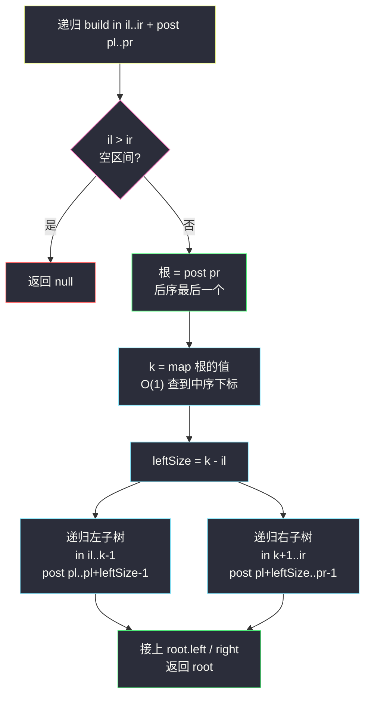
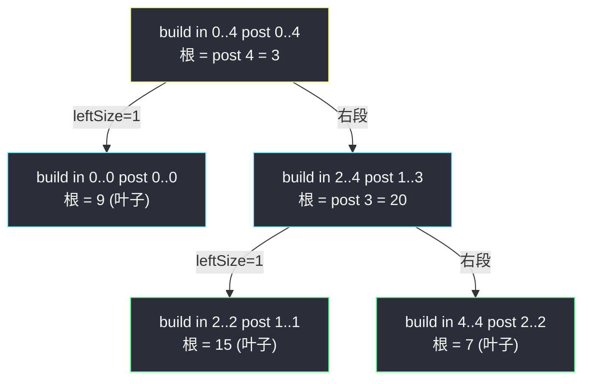

# 从中序与后序遍历序列构造二叉树（后序定根 + 中序分左右）

## 一、问题描述

给定一棵树的中序遍历 `inorder` 与后序遍历 `postorder`（**节点值互不相同**），请构造出这棵二叉树并返回它的根节点。

> 🔗 LeetCode 106：https://leetcode.cn/problems/construct-binary-tree-from-inorder-and-postorder-traversal/

**示例 1**

```
输入：inorder = [9,3,15,20,7], postorder = [9,15,7,20,3]
输出：[3,9,20,null,null,15,7]
树形：
      3
     / \
    9   20
       /  \
      15    7
```

**示例 2**

```
输入：inorder = [-1], postorder = [-1]
输出：[-1]
```

**直观理解**

和 #105（前序 + 中序）是同一枚硬币的两面，只是「根在哪」变了：

- **后序**（左 → 右 → 根）**最后一个元素**一定是根；
- **中序**里根左边仍是左子树、右边仍是右子树。

于是母题不变：**后序定根，中序分左右**。理解了 #105，本题只是把「取前序段第一个」换成「取后序段最后一个」，区间划分公式跟着平移。

---

## 二、暴力解法（入门）

### 直观思路

每次取 `postorder` 当前段的**最后一个**作根，顺序扫描中序段找根位置 `k`，切成左右两半递归。

```java
class Solution {
    public TreeNode buildTree(int[] inorder, int[] postorder) {
        return build(inorder, 0, inorder.length - 1, postorder, 0, postorder.length - 1);
    }

    private TreeNode build(int[] in, int il, int ir, int[] post, int pl, int pr) {
        if (il > ir) {
            return null;
        }
        TreeNode root = new TreeNode(post[pr]);    // 后序最后一个 = 根
        int k = il;
        while (in[k] != root.val) {                // 暴力：线性扫中序找根
            k++;
        }
        int leftSize = k - il;
        root.left  = build(in, il, k - 1, post, pl, pl + leftSize - 1);
        root.right = build(in, k + 1, ir, post, pl + leftSize, pr - 1);
        return root;
    }
}
```

### 复杂度

- **时间**：`O(n²)` 最坏（链状树时每层扫整段中序）。
- **空间**：`O(h)` 递归栈。

### 🔴 瓶颈在哪里

和 #105 一模一样：**线性找根**是唯一的浪费。「值 → 中序下标」哈希预处理一遍，查找降到 `O(1)`，整体 `O(n)`。

---

## 三、优化探索（核心章节）

### 3.1 观察特征

| 特征 | 说明 |
|------|------|
| 根的位置固定 | 后序段最后一个元素永远是当前子树的根 |
| 与 #105 仅差切法 | 中序仍负责分左右；变的只是前序/后序段的左右子树排列 |
| 后序段布局 | 根在最末；前面**先整段左子树、再整段右子树**（左 → 右 → 根） |
| 子问题自相似 | 两段等长序列确定一棵子树，规模严格变小 |

### 3.2 推导：区间怎么切

设中序段 `in[il..ir]`、后序段 `post[pl..pr]` 对应同一棵子树：

1. 根 = `post[pr]`，哈希查到中序下标 `k`；
2. 左子树大小 `leftSize = k - il`；
3. 后序里去掉末尾的根，剩下**先左段后右段**：

```
post: [ pl ......... pl+leftSize-1 | pl+leftSize ....... pr-1 | pr(根) ]
      └─────── 左子树 ───────┘└─────── 右子树 ───────┘
in:   [ il ........... k-1 | k(根) | k+1 ........... ir ]
      └────── 左子树 ────┘         └────── 右子树 ────┘
```

**不变式**：任意递归调用的中序段与后序段**长度相等**且包含同一批节点；`il > ir` 即空树返回 `null`。

> 课源码 class036 `Code07_PreorderInorderBuildBinaryTree` 只实现了前序 + 中序版本（`f(pre, l1, r1, in, l2, r2, map)`）。本篇按课上同一骨架推导中序 + 后序：定根位置从 `pre[l1]` 换成 `post[pr]`，其余（哈希定位 + `k - il` 定左长）与课上完全一致。



### 3.3 关键推导问题

| 问题 | 答案 |
|------|------|
| 为什么不能「前序 + 后序」构造？ | 两者都只告诉你「根」和「整块左右」，没有信息切开左右边界；单孩子节点挂在左边还是右边无法区分 |
| 右子树的后序段为什么是 `post[pl+leftSize..pr-1]`？ | 去掉根 `pr` 后剩下的就是左段 + 右段；左段占 `leftSize` 个，右段从 `pl+leftSize` 到 `pr-1` |
| 递归顺序重要吗？ | 区间版先左先右都行（区间已经把左右算清楚）；若用「全局指针从后往前消耗 postorder」，则必须**先右后左** |
| `pr - 1` 漏写怎么办？ | 右子树区间仍含根，`post[pr]` 被当根无限递归 → 栈溢出，调试时注意这个症状 |
| 与 #105 的公式能互相推吗？ | 能。#105：根 `pl`，左段 `pl+1..pl+leftSize`；本题：根 `pr`，左段 `pl..pl+leftSize-1`。都由「根 + 左段长 leftSize」唯一确定 |

### 3.4 一句话核心

> **后序末尾是根，中序切左右；哈希查根位，左长定两段。**

---

## 四、代码实现

### Java（主解：哈希 + 区间递归）

```java
import java.util.HashMap;
import java.util.Map;

class Solution {
    private Map<Integer, Integer> indexMap = new HashMap<>();

    public TreeNode buildTree(int[] inorder, int[] postorder) {
        for (int i = 0; i < inorder.length; i++) {
            indexMap.put(inorder[i], i);
        }
        return build(inorder, 0, inorder.length - 1,
                     postorder, 0, postorder.length - 1);
    }

    // 用 in[il..ir] 与 post[pl..pr] 构造子树，返回根
    private TreeNode build(int[] in, int il, int ir, int[] post, int pl, int pr) {
        if (il > ir) {
            return null;
        }
        TreeNode root = new TreeNode(post[pr]);    // 后序最后一个 = 根
        int k = indexMap.get(root.val);            // O(1) 定位根在中序的位置
        int leftSize = k - il;                     // 左子树节点数
        root.left  = build(in, il,     k - 1, post, pl,                pl + leftSize - 1);
        root.right = build(in, k + 1,  ir,    post, pl + leftSize,     pr - 1);
        return root;
    }
}
```

### Python（同思路）

```python
class Solution:
    def buildTree(self, inorder: List[int], postorder: List[int]) -> Optional[TreeNode]:
        index_map = {v: i for i, v in enumerate(inorder)}

        def build(il: int, ir: int, pl: int, pr: int) -> Optional[TreeNode]:
            if il > ir:
                return None
            root = TreeNode(postorder[pr])         # 后序最后一个 = 根
            k = index_map[root.val]
            left_size = k - il
            root.left = build(il, k - 1, pl, pl + left_size - 1)
            root.right = build(k + 1, ir, pl + left_size, pr - 1)
            return root

        return build(0, len(inorder) - 1, 0, len(postorder) - 1)
```

> 进阶可选：全局下标 `postIdx = n - 1` 从右往左消耗后序数组，配合**先递归右子树再递归左子树**，可省掉后序的两个参数。与 #105 的 `preIdx` 版镜像对称。

---

## 五、具体例子演示

### 例 1：`inorder = [9,3,15,20,7]`，`postorder = [9,15,7,20,3]`

哈希：`{9:0, 3:1, 15:2, 20:3, 7:4}`。逐步跟踪：

| 步 | 调用 build(in 段, post 段) | 根 | k | leftSize | 左递归 | 右递归 |
|----|---------------------------|----|---|----------|--------|--------|
| 1 | in[0..4], post[0..4] | **3**（post[4]） | 1 | 1 | in[0..0], post[0..0] | in[2..4], post[1..3] |
| 2 | in[0..0], post[0..0] | **9**（post[0]） | 0 | 0 | 均空 → null | 均空 → null |
| 3 | in[2..4], post[1..3] | **20**（post[3]） | 3 | 1 | in[2..2], post[1..1] | in[4..4], post[2..2] |
| 4 | in[2..2], post[1..1] | **15**（post[1]） | 2 | 0 | 均空 → null | 均空 → null |
| 5 | in[4..4], post[2..2] | **7**（post[2]） | 4 | 0 | 均空 → null | 均空 → null |

第 1 步的划分可视化（根 3 在中序下标 1：左 1 个、右 3 个；后序去掉末尾根，前 1 个是左段、中间 3 个是右段）：

```
post: 9 | 15 7 20 | 3      ← 左段(1) + 右段(3) + 根
in:   9 | 3 | 15 20 7      ← 左段 | 根 | 右段
```



递归返回拼装出的树：

```
      3
     / \
    9   20
       /  \
      15    7
```

**自检**：对结果做后序 = `9,15,7,20,3`、中序 = `9,3,15,20,7`，与输入一致 ✔

### 例 2：只有左孩子的链 `inorder = [2,1]`，`postorder = [2,1]`

- 步 1：in[0..1], post[0..1]：根 = post[1] = 1，k = 1，leftSize = 1 → 左 in[0..0], post[0..0]；右 in[2..1] 空。
- 步 2：根 = 2，叶子。

结果 `1` 的左孩子是 `2`，右孩子为空——这正是「前序 + 后序」无法区分、而「中序在场」才能搞定的场景。

---

## 六、复杂度分析

| 项目 | 哈希版（主解） | 暴力线性扫版 |
|------|---------------|--------------|
| 时间 | `O(n)`：每节点建一次，定位根 `O(1)` | 最坏 `O(n²)`（链状树） |
| 空间 | `O(n)`：哈希表 + 递归栈 `O(h)` | `O(h)` 递归栈 |

---

## 七、方法对比与总结

| | 暴力线性找根 | 哈希定位（主解） | 全局 postIdx 版 |
|--|--------------|------------------|-----------------|
| 时间 | `O(n²)` 最坏 | `O(n)` | `O(n)` |
| 参数 | 4 区间 + 扫描 | 4 区间 + 查表 | 2 区间 + 全局下标 |
| 隐式依赖 | 无 | 无 | **必须先递归右再左** |
| 推荐 | 理解阶段 | ✅ 面试默写 | 了解镜像关系即可 |

**与 #105 的镜像关系一图流**

| | #105 前+中 | #106 中+后 |
|--|-----------|------------|
| 根 | 前序段**第一个** | 后序段**最后一个** |
| 左段（前/后序） | `pl+1 .. pl+leftSize` | `pl .. pl+leftSize-1` |
| 右段（前/后序） | `pl+leftSize+1 .. pr` | `pl+leftSize .. pr-1` |
| 全局指针消耗方向 | 从左往右，先左后右递归 | 从右往左，先右后左递归 |

**易错点**

1. 根取成 `post[pl]`（惯性照抄 #105 的「第一个」）。
2. 右子树后序段忘了排除根（`pr` 而非 `pr-1`）。
3. `leftSize = k - il` 忘减 `il`（与 #105 同坑）。
4. 全局指针版忘记先递归右子树，构造出镜像错树。

**模板口诀**

> **后序尾巴是根，中序一刀切左右；哈希定位置，左长切两段。**

---

## 八、举一反三

| 题目 | 链接 | 迁移点 |
|------|------|--------|
| 105. 从前序与中序遍历序列构造二叉树 | https://leetcode.cn/problems/construct-binary-tree-from-preorder-and-inorder-traversal/ | 镜像母题：根取前序第一个，本站已有题解 |
| 108. 将有序数组转换为二叉搜索树 | https://leetcode.cn/problems/convert-sorted-array-to-binary-search-tree/ | 构造家族：有序数组当「现成中序」，取中点当根，本站已有题解 |
| 654. 最大二叉树 | https://leetcode.cn/problems/maximum-binary-tree/ | 同款分治：定根的依据从「遍历位置」换成「区间最大值」 |
| 99. 恢复二叉搜索树 | https://leetcode.cn/problems/recover-binary-search-tree/ | 逆方向：树 → 中序，检查中序是否有序定位错误节点 |
| 145. 二叉树的后序遍历 | https://leetcode.cn/problems/binary-tree-postorder-traversal/ | 后序「根在尾」性质的来源（本站已有题解） |

**迁移一句**：#105 与 #106 是同一模板的两次实例化——**「哪个序列定根、哪个序列定界」**。面试中能把两题公式当场互推，比背两份代码更有说服力。
