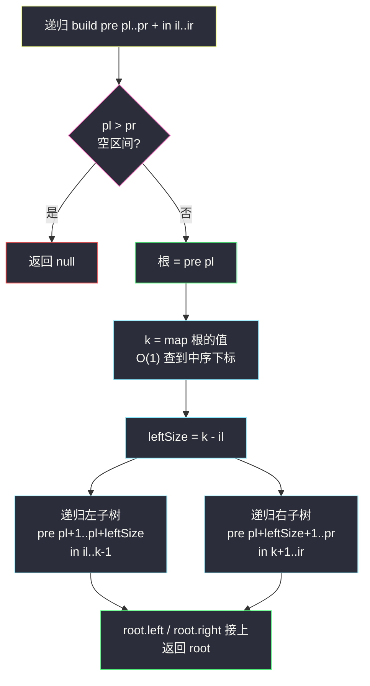
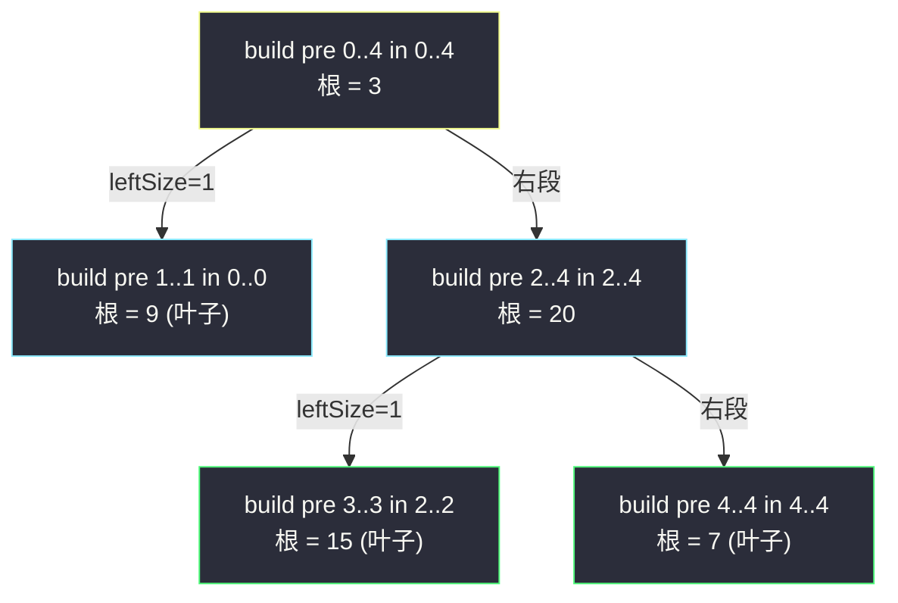

# 从前序与中序遍历序列构造二叉树（前序定根 + 中序分左右）

## 一、问题描述

给定一棵树的前序遍历 `preorder` 与中序遍历 `inorder`（**节点值互不相同**），请构造出这棵二叉树并返回它的根节点。

> 🔗 LeetCode 105：https://leetcode.cn/problems/construct-binary-tree-from-preorder-and-inorder-traversal/

**示例 1**

```
输入：preorder = [3,9,20,15,7], inorder = [9,3,15,20,7]
输出：[3,9,20,null,null,15,7]
树形：
      3
     / \
    9   20
       /  \
      15    7
```

**示例 2**

```
输入：preorder = [-1], inorder = [-1]
输出：[-1]
```

**直观理解**

两种遍历各自「泄露」了树的一部分信息：

- **前序**第一个元素一定是**根**（根 → 左 → 右，根永远打头）；
- **中序**里根的左边全是**左子树**、右边全是**右子树**（左 → 根 → 右）。

两者一配合：「前序定根，中序分左右」，再把左右两段各自递归处理，整棵树就被还原出来了。这也是「构造家族」（#105 / #106 / #108 / #297）共同的母题。

---

## 二、暴力解法（入门）

### 直观思路

按上面的直觉直接写：每次取 `preorder` 当前段的第一个值作根，然后**顺序扫描**中序段找到根的位置 `k`，据此把两个序列各切成两半，递归构造。

```java
class Solution {
    public TreeNode buildTree(int[] preorder, int[] inorder) {
        return build(preorder, 0, preorder.length - 1, inorder, 0, inorder.length - 1);
    }

    private TreeNode build(int[] pre, int pl, int pr, int[] in, int il, int ir) {
        if (pl > pr) {
            return null;
        }
        TreeNode root = new TreeNode(pre[pl]);      // 前序第一个 = 根
        int k = il;
        while (in[k] != root.val) {                 // 暴力：线性扫中序找根
            k++;
        }
        int leftSize = k - il;                      // 左子树节点个数
        root.left  = build(pre, pl + 1, pl + leftSize, in, il, k - 1);
        root.right = build(pre, pl + leftSize + 1, pr, in, k + 1, ir);
        return root;
    }
}
```

### 复杂度

- **时间**：`O(n²)` 最坏。每个节点都要在中序里线性找自己；树退化成链时每层扫描代价 `O(n)`。
- **空间**：`O(h)` 递归栈，链状树 `O(n)`。

### 🔴 瓶颈在哪里

算法骨架完全正确，唯一的浪费是**重复扫中序找根**——同一个值可能被找多次。而「值 → 中序下标」是个静态映射，一遍预处理进哈希表，之后每次查根位置 `O(1)`，整体降到 `O(n)`。

---

## 三、优化探索（核心章节）

### 3.1 观察特征

| 特征 | 说明 |
|------|------|
| 根的位置固定 | 前序段第一个元素永远是当前子树的根，无需搜索 |
| 划分信息静态 | 值 → 中序下标的映射建树过程中**从不变**，天然适合哈希预处理 |
| 子问题自相似 | 两段序列（前序子段 + 中序子段）确定一棵子树，规模严格变小 |
| 值互不相同 | 保证哈希映射无冲突，划分唯一——这是本题的前提 |

### 3.2 推导：区间怎么切

设前序段 `pre[pl..pr]`、中序段 `in[il..ir]` 对应同一棵子树：

1. 根 = `pre[pl]`，用哈希查到它在中序中的下标 `k`；
2. 中序里 `[il, k-1]` 是左子树、`[k+1, ir]` 是右子树 → **左子树大小** `leftSize = k - il`；
3. 前序里根后面**先紧跟着左子树整段**，再是右子树整段：

```
pre: [ pl(根) | pl+1 ........... pl+leftSize | pl+leftSize+1 ...... pr ]
              └────── 左子树 ──────┘└─────── 右子树 ───────┘
in : [ il ........... k-1 | k(根) | k+1 ........... ir ]
     └────── 左子树 ────┘         └────── 右子树 ────┘
```

**不变式**：任意时刻传给递归的前序段与中序段**长度相等**，且包含的是同一批节点（只是顺序不同）。左端越界右端（`pl > pr`）即空树，返回 `null`。

> 与课源码 class036 `Code07_PreorderInorderBuildBinaryTree` 完全同一思路（课上记作 `f(pre, l1, r1, in, l2, r2, map)`），本篇按站点结构题风格改用 `leftSize` 命名，更好讲好默写。



### 3.3 关键推导问题

| 问题 | 答案 |
|------|------|
| 为什么前序 + 中序能唯一确定一棵树？ | 前序给根、中序给左右边界；递归每一步的根与划分都唯一。反过来只有前序（无中序）无法区分左右孩子数量，不唯一 |
| 为什么必须值互不相同？ | 有重复值时中序里「找到的 k」不唯一，左右子树大小无法确定，需要换用计数等更麻烦的做法 |
| `leftSize` 为什么是 `k - il` 而不是 `k`？ | 中序段左端是 `il` 不是 0；左子树长度 = 根下标 − 段左端。忘减 `il` 是本题第一大错 |
| 前序的右子树左端为什么是 `pl + leftSize + 1`？ | 根占 1 个 + 左子树占 `leftSize` 个，右子树紧随其后 |
| 哈希表为什么放成员变量只建一次？ | 中序数组全程不变，建一次全局复用；放进递归里重建会退化成 `O(n²)` |

### 3.4 一句话核心

> **前序第一个是根，哈希查它在中序的位置；左边全归左子树，右边全归右子树，两段各自再递归。**

---

## 四、代码实现

### Java（主解：哈希 + 区间递归）

```java
import java.util.HashMap;
import java.util.Map;

class Solution {
    private Map<Integer, Integer> indexMap = new HashMap<>();

    public TreeNode buildTree(int[] preorder, int[] inorder) {
        for (int i = 0; i < inorder.length; i++) {
            indexMap.put(inorder[i], i);           // 值 → 中序下标，建一次
        }
        return build(preorder, 0, preorder.length - 1,
                     inorder,  0, inorder.length  - 1);
    }

    // 用 pre[pl..pr] 与 in[il..ir] 构造子树，返回根
    private TreeNode build(int[] pre, int pl, int pr, int[] in, int il, int ir) {
        if (pl > pr) {
            return null;
        }
        TreeNode root = new TreeNode(pre[pl]);     // 前序第一个 = 根
        int k = indexMap.get(root.val);            // O(1) 定位根在中序的位置
        int leftSize = k - il;                     // 左子树节点数
        root.left  = build(pre, pl + 1, pl + leftSize,     in, il,     k - 1);
        root.right = build(pre, pl + leftSize + 1, pr,     in, k + 1,  ir);
        return root;
    }
}
```

### Python（同思路）

```python
class Solution:
    def buildTree(self, preorder: List[int], inorder: List[int]) -> Optional[TreeNode]:
        index_map = {v: i for i, v in enumerate(inorder)}

        def build(pl: int, pr: int, il: int, ir: int) -> Optional[TreeNode]:
            if pl > pr:
                return None
            root = TreeNode(preorder[pl])          # 前序第一个 = 根
            k = index_map[root.val]                # O(1) 定位
            left_size = k - il
            root.left = build(pl + 1, pl + left_size, il, k - 1)
            root.right = build(pl + left_size + 1, pr, k + 1, ir)
            return root

        return build(0, len(preorder) - 1, 0, len(inorder) - 1)
```

> 进阶可选：用一个**全局下标 `preIdx` 从左往右消耗前序数组**（先递归左再递归右），可省掉前序的两个参数。本质相同，这里选区间版是为了「左右区间看得见、好检查」。

---

## 五、具体例子演示

### 例 1：`preorder = [3,9,20,15,7]`，`inorder = [9,3,15,20,7]`

先建哈希：`{9:0, 3:1, 15:2, 20:3, 7:4}`。逐层跟踪递归：

| 步 | 调用 build(pre 段, in 段) | 根 | k | leftSize | 左递归 | 右递归 |
|----|--------------------------|----|---|----------|--------|--------|
| 1 | pre[0..4], in[0..4] | 3 | 1 | 1 | pre[1..1], in[0..0] | pre[2..4], in[2..4] |
| 2 | pre[1..1], in[0..0] | 9 | 0 | 0 | pre[2..1] 空 → null | pre[2..1] 空 → null |
| 3 | pre[2..4], in[2..4] | 20 | 3 | 1 | pre[3..3], in[2..2] | pre[4..4], in[4..4] |
| 4 | pre[3..3], in[2..2] | 15 | 2 | 0 | 均空 → null | 均空 → null |
| 5 | pre[4..4], in[4..4] | 7 | 4 | 0 | 均空 → null | 均空 → null |

第 1 步的划分可视化（根 3 在中序下标 1，左边 1 个节点、右边 3 个节点）：

```
pre:  3 | 9 | 20 15 7      ← 根 + 左段(1个) + 右段(3个)
in:   9 | 3 | 15 20 7      ← 左段 | 根 | 右段
```



递归返回时树自底向上拼装：`15`、`7` 挂到 `20` 两边，`9` 与 `20` 挂到 `3` 两边，最终：

```
      3
     / \
    9   20
       /  \
      15    7
```

**自检**：对构造结果做前序 = `3,9,20,15,7`、中序 = `9,3,15,20,7`，与输入一致 ✔

### 例 2：`preorder = [-1]`，`inorder = [-1]`

build(pre[0..0], in[0..0])：根 −1，`k = 0`，`leftSize = 0`；左右递归均为空区间直接返回 `null`。结果为单节点树 `[−1]`。

---

## 六、复杂度分析

| 项目 | 哈希版（主解） | 暴力线性扫版 |
|------|---------------|--------------|
| 时间 | `O(n)`：每个节点恰好被建一次，定位根 `O(1)` | 最坏 `O(n²)`（链状树每层扫整段中序） |
| 空间 | `O(n)`：哈希表 `O(n)` + 递归栈 `O(h)`（链状 `O(n)`，平衡 `O(log n)`） | `O(h)` 递归栈 |

注：哈希表的 `O(n)` 是「用空间买时间」的典型交易，几乎所有构造题的标准解都这么干。

---

## 七、方法对比与总结

| | 暴力线性找根 | 哈希定位（主解） | 全局 preIdx 版 |
|--|--------------|------------------|----------------|
| 时间 | `O(n²)` 最坏 | `O(n)` | `O(n)` |
| 参数 | 4 个区间参数 + 扫描 | 4 个区间参数 + 查表 | 2 个区间 + 1 个全局下标 |
| 可读性 | 直观 | 区间对应关系一目了然 | 少两个参数但「隐式依赖先左后右」 |
| 推荐 | 理解阶段 | ✅ 面试默写 | 了解即可 |

**易错点**

1. `leftSize = k - il` 忘减段左端 `il`（误写成 `k`），右子树区间整体错位。
2. 前序右段起点写成 `pl + leftSize`（漏 +1 跳过根），无限递归。
3. 哈希表写进递归里每层重建，退化 `O(n²)`。
4. 空区间判断写成 `pl >= pr`——会把「单节点子树」误判为空。
5. 题目前提「值互不相同」没看清就上通用模板。

**模板口诀**

> **前序定根，中序切半；哈希查位，左长定界；空段返回 null。**

---

## 八、举一反三

| 题目 | 链接 | 迁移点 |
|------|------|--------|
| 106. 从中序与后序遍历序列构造二叉树 | https://leetcode.cn/problems/construct-binary-tree-from-inorder-and-postorder-traversal/ | 姊妹题：根换成「后序最后一个」，本站已有题解 |
| 108. 将有序数组转换为二叉搜索树 | https://leetcode.cn/problems/convert-sorted-array-to-binary-search-tree/ | 构造家族：有序数组本身就是一个「中序」，取中点当根，本站已有题解 |
| 1008. 前序遍历构造二叉搜索树 | https://leetcode.cn/problems/construct-binary-search-tree-from-preorder-traversal/ | 只有前序 + BST 性质，用「上下界」代替中序定位 |
| 297. 二叉树的序列化与反序列化 | https://leetcode.cn/problems/serialize-and-deserialize-binary-tree/ | 把「序列 ↔ 树」的互转做成通用协议 |
| 94. 二叉树的中序遍历 | https://leetcode.cn/problems/binary-tree-inorder-traversal/ | 逆问题的地基：中序为何能「分左右」（本站已有题解） |

**迁移一句**：所有「给遍历序列还原树」的题，都是在回答同一个问题——**哪个信息定根、哪个信息切分左右**。前序+中序用「第一个 + 位置」，后序+中序用「最后一个 + 位置」，BST 前序用「上下界」。
