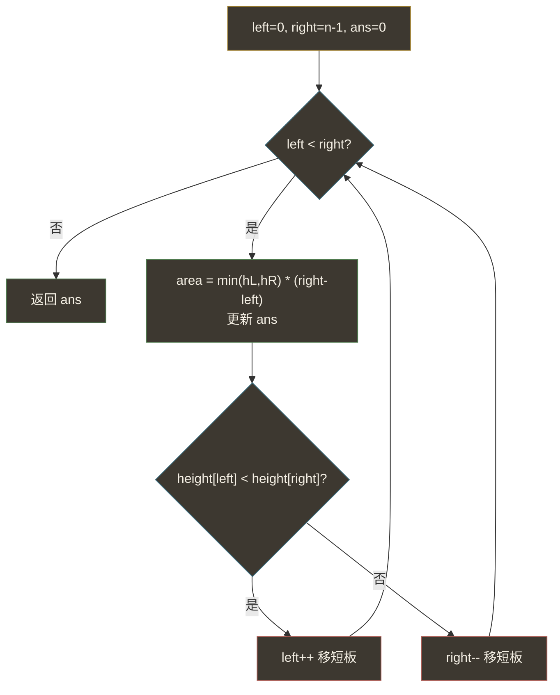
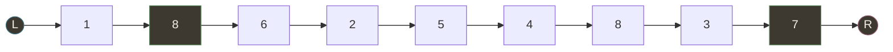
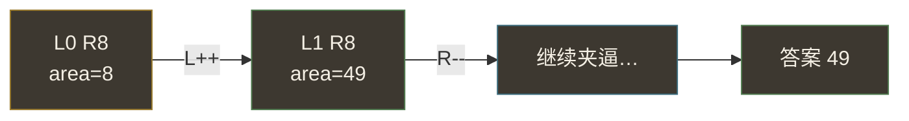

# 盛最多水的容器（对撞双指针 · 贪心缩边）

## 一、问题描述

给定一个长度为 `n` 的整数数组 `height`。有 `n` 条竖线，第 `i` 条线的两个端点是 `(i, 0)` 和 `(i, height[i])`。

找出其中的两条线，使得它们与 x 轴共同构成的容器可以**容纳最多的水**，返回该最大容量。

> 容器不能倾斜。容量公式：`面积 = min(height[i], height[j]) × (j - i)`（高度取较矮那根，宽度是下标差）。

> 🔗 LeetCode 11：https://leetcode.cn/problems/container-with-most-water/

**示例 1（经典）**

```
输入：height = [1,8,6,2,5,4,8,3,7]
输出：49
解释：选下标 1（高 8）和下标 8（高 7），面积 = min(8,7) × (8-1) = 7×7 = 49。
```

**示例 2（简单）**

```
输入：height = [1,1]
输出：1
解释：只有一对线，面积 = min(1,1) × 1 = 1。
```

**直观理解**

两根柱子夹住一桶水：水不会超过较矮的那根，宽度是两柱间距。要在所有柱对里找面积最大的那一对。

```
高
8 |     █           █
7 |     █           █     █
6 |     █ █         █     █
5 |     █ █     █   █     █
4 |     █ █     █ █ █     █
3 |     █ █     █ █ █   █ █
2 |     █ █ █   █ █ █   █ █
1 | █   █ █ █   █ █ █ █ █ █
  +--------------------------→ 下标
    0 1 2 3 4 5 6 7 8
```

---

## 二、暴力解法（入门）

### 直观思路

枚举所有柱对 `(i, j)`（`i < j`），算 `min(height[i], height[j]) * (j - i)`，取最大值。

```java
public int maxArea(int[] height) {
    int n = height.length, ans = 0;
    for (int i = 0; i < n; i++) {
        for (int j = i + 1; j < n; j++) {
            int area = Math.min(height[i], height[j]) * (j - i);
            ans = Math.max(ans, area);
        }
    }
    return ans;
}
```

### 复杂度

- **时间**：`O(n²)`。`n` 到 `10⁵` 时会超时。
- **空间**：`O(1)`。

### 🔴 瓶颈在哪里

绝大多数柱对不可能是最优解，却都被算了一遍。  
观察：若已经固定了左右边界 `L、R`，面积由**较短边**和宽度决定。下一步若想变大，必须移动较短边去碰更高的柱——移动较长边只会让宽度变小，而高度仍被短边卡死，面积不可能变大。这就是「贪心缩边」的信号。

---

## 三、优化探索（核心章节）

### 3.1 观察特征

| 特征 | 说明 |
|------|------|
| 面积 = 短板高 × 宽度 | 宽度随两端靠近单调变小 |
| 两端对撞 | 典型左右双指针 |
| 决策可证明 | 每次只移动较短边，不会漏掉最优解 |

### 3.2 暴力 → 优化：对撞双指针

1. `left = 0`，`right = n - 1`（从最宽开始）。
2. 用当前面积更新答案。
3. **谁矮就移动谁**：
   - `height[left] < height[right]` → `left++`
   - 否则 → `right--`（相等时移哪边都行，常约定移右边或同时跳过相等段）
4. 直到 `left >= right`。

**为何正确（直觉证明）**

当前 `L、R`，不妨设 `height[L] ≤ height[R]`。  
若移动 `R`（较长边）：新宽度 `R'-L < R-L`，高度仍 ≤ `height[L]`，面积一定 ≤ 当前。  
所以所有「以 `L` 为左端、右端在 `(L, R)`」的组合都被安全淘汰；必须移动 `L`，才可能找到更高的左板、做出更大面积。对称地，右边矮就移右边。



指针对撞示意：



### 3.3 关键推导问题（双指针）

| 问题 | 答案 |
|------|------|
| 何时移左？ | 左柱更矮（或相等时按约定移左/右）时 `left++` |
| 何时移右？ | 右柱不更高时 `right--` |
| 为何不两边一起移？ | 一步只淘汰一侧不可能更优的候选即可；两边同移可能漏解 |
| 为何是 O(n)？ | `left`、`right` 各最多走 n 步，不回头 |

### 3.4 一句话核心

> **从最宽两端夹逼：每次丢掉较短边，因为以它为短板的更窄容器不可能更大。**

---

## 四、代码实现详解

### Java（逐行说明）

```java
class Solution {
    public int maxArea(int[] height) {
        int left = 0;
        int right = height.length - 1;
        int ans = 0;

        // 循环不变式：最优解的左右端点仍在 [left, right] 内
        while (left < right) {
            int h = Math.min(height[left], height[right]);
            int area = h * (right - left);
            if (area > ans) {
                ans = area;
            }
            // 移动较短边；相等时移右边（或左边）均可
            if (height[left] < height[right]) {
                left++;
            } else {
                right--;
            }
        }
        return ans;
    }
}
```

**变量含义**

| 变量 | 含义 |
|------|------|
| `left` / `right` | 当前考虑的左右柱下标 |
| `h` | 当前容器高度（短板） |
| `ans` | 历史最大面积 |

**可选加速**：移动短板后，可一路跳过「仍 ≤ 原短板高度」的柱子（它们不可能立刻贡献更大面积），正确性不变，常数更优：

```java
if (height[left] < height[right]) {
    int cur = height[left];
    while (left < right && height[left] <= cur) left++;
} else {
    int cur = height[right];
    while (left < right && height[right] <= cur) right--;
}
```

### Python（同结构）

```python
class Solution:
    def maxArea(self, height: list[int]) -> int:
        left, right = 0, len(height) - 1
        ans = 0
        while left < right:
            h = min(height[left], height[right])
            ans = max(ans, h * (right - left))
            if height[left] < height[right]:
                left += 1
            else:
                right -= 1
        return ans
```

---

## 五、具体例子演示

以 `height = [1,8,6,2,5,4,8,3,7]` 跟踪。

| 步 | left | right | hL,hR | 面积 | 动作 | ans |
|----|------|-------|-------|------|------|-----|
| 0 | 0 | 8 | 1,7 | 1×8=8 | 左矮 → L++ | 8 |
| 1 | 1 | 8 | 8,7 | 7×7=**49** | 右矮 → R-- | **49** |
| 2 | 1 | 7 | 8,3 | 3×6=18 | 右矮 → R-- | 49 |
| 3 | 1 | 6 | 8,8 | 8×5=40 | 相等 → R-- | 49 |
| 4 | 1 | 5 | 8,4 | 4×4=16 | 右矮 → R-- | 49 |
| 5 | 1 | 4 | 8,5 | 5×3=15 | 右矮 → R-- | 49 |
| 6 | 1 | 3 | 8,2 | 2×2=4 | 右矮 → R-- | 49 |
| 7 | 1 | 2 | 8,6 | 6×1=6 | 右矮 → R-- | 49 |
| 结束 | 1 | 1 | — | — | left==right | **49** |

最优就是第 1 步算到的 `49`（柱 8 与柱 7）。



**极简例**：`[1,1]` → 一次计算面积 1，然后指针相遇，返回 1。

---

## 六、复杂度分析

| 方法 | 时间 | 空间 | 说明 |
|------|------|------|------|
| 暴力枚举所有柱对 | `O(n²)` | `O(1)` | n=1e5 超时 |
| 对撞双指针 | `O(n)` | `O(1)` | 每步淘汰一侧 |

---

## 七、方法对比与总结

| | 暴力 | 对撞双指针 |
|--|------|------------|
| 思路 | 枚举所有 `(i,j)` | 从两端端夹逼，移短板 |
| 关键 | 双重循环 | `while (L < R)` + 比高低 |
| 适用 | 理解题意 | **本题默认解** |

**模板（Java）**

```java
int L = 0, R = n - 1, ans = 0;
while (L < R) {
    ans = Math.max(ans, Math.min(h[L], h[R]) * (R - L));
    if (h[L] < h[R]) L++;
    else R--;
}
```

**易错点**

1. 宽度是 `right - left`，不是 `right - left + 1`（柱在整数坐标上，间距就是下标差）。
2. 高度必须用 `min`，别写成左右高度之积或之和。
3. 每次只移**较短**边；移错边会漏解或得到错误答案。
4. `ans` 初值用 `0` 即可（高度非负）。

---

## 八、举一反三

| 题目 | 关系 |
|------|------|
| [42. 接雨水](https://leetcode.cn/problems/trapping-rain-water/) | 也看左右柱与短板，但是「每格能接多少」；可用双指针或单调栈 |
| [84. 柱状图中最大的矩形](https://leetcode.cn/problems/largest-rectangle-in-histogram/) | 面积 = 高 × 宽，单调栈维护左右更矮边界 |
| [167. 两数之和 II](https://leetcode.cn/problems/two-sum-ii-input-array-is-sorted/) | 有序数组对撞双指针另一经典 |
| [15. 三数之和](https://leetcode.cn/problems/3sum/) | 排序后固定一端 + 对撞双指针 |

**思想迁移**

- 题面像「两端夹一段、由短板决定」→ 想对撞双指针 + 贪心移动短板。
- 和滑动窗口不同：本题不是维护区间内合法性，而是**证明一侧候选可整批淘汰**。
