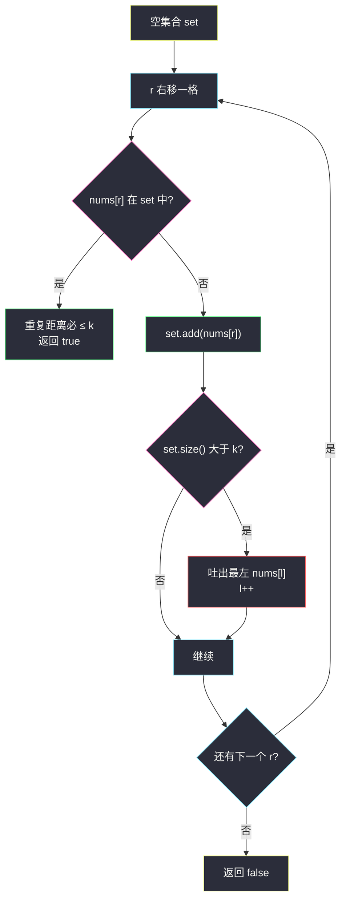
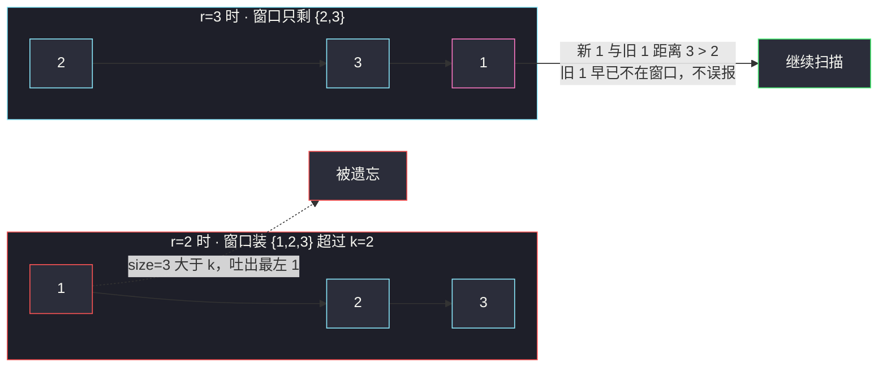

# 存在重复元素 II（定长窗口判重复）

## 一、问题描述

给定一个整数数组 `nums` 和一个整数 `k`，判断数组中是否存在**两个不同下标** `i` 和 `j`，使得：

- `nums[i] == nums[j]`（值相等）
- `|i - j| <= k`（下标距离不超过 `k`）

存在返回 `true`，否则返回 `false`。

> 🔗 LeetCode 219：https://leetcode.cn/problems/contains-duplicate-ii/

**示例 1（答案为真）**

```
输入：nums = [1,2,3,1], k = 3
输出：true
解释：nums[0] = nums[3] = 1，|0 - 3| = 3 <= 3
```

**示例 2（答案为真）**

```
输入：nums = [1,0,1,1], k = 1
输出：true
解释：nums[2] = nums[3] = 1，|2 - 3| = 1 <= 1
```

**示例 3（答案为假）**

```
输入：nums = [1,2,3,1,2,3], k = 2
输出：false
解释：所有重复对（1、2、3 各出现两次）的距离都是 3 > 2
```

**直观理解**

「距离 ≤ k 的相同值」等价于：**存在一个长度不超过 `k+1` 的窗口，窗口内出现重复**。  
于是把「下标距离」翻译成「窗口长度」，问题就变成了经典的**定长窗口判重**。

---

## 二、暴力解法（入门）

### 直观思路

对每个下标 `i`，只往右检查 `k` 格：`j` 取 `i+1 .. i+k`，看有没有相等值。

```java
public boolean containsNearbyDuplicate(int[] nums, int k) {
    int n = nums.length;
    for (int i = 0; i < n; i++) {
        // j 只需要扫 i 右边的 k 格
        for (int j = i + 1; j < n && j <= i + k; j++) {
            if (nums[i] == nums[j]) {
                return true;
            }
        }
    }
    return false;
}
```

### 复杂度

- **时间**：`O(n · min(n, k+1))`，每个 `i` 最多扫 `k` 格
- **空间**：`O(1)`

### 🔴 瓶颈在哪里

`k` 很大（比如 `10⁵`）时接近 `O(n²)`，必然超时。  
观察重复劳动：下标 `i+1` 的检查范围 `[i+2, i+k+1]` 与 `i` 的范围 `[i+1, i+k]` 有 `k-1` 格**完全重合**——滑动窗口正是为消除这种重叠扫描而生。

---

## 三、优化探索（核心章节）

### 3.1 观察特征

| 特征 | 说明 |
|------|------|
| 判重条件是「距离 ≤ k」 | 换算成窗口：任意窗口长度 `k+1` 内不出现重复 → 答案为假；一出现 → 真 |
| 只需存在性，不需要位置 | 命中即可 `return true`，是「判定型」窗口题，比「求最长/最短」简单 |
| 窗口内判重 O(1) 手段 | 哈希集合 `HashSet`：`contains` / `add` 都是 O(1) |
| 定长，不是变长 | 不用「扩到不合法再收缩」那套模板，每步右进一、必要时左出一 |

### 3.2 暴力 → 优化：定长窗口 + 哈希集合

维护一个**最多容纳最近 `k` 个互异值**的集合（即窗口 `[l, r-1]` 的值域）：

1. `r` 从左往右扫，**先查后加**：`nums[r]` 已在集合里 → 它和上一次出现（必然在窗口内）距离 ≤ k，返回 `true`。
2. 把 `nums[r]` 加入集合。
3. 集合大小超过 `k` → 窗口太长，吐出最左端 `nums[l]`，`l++`。

骨架与课上定长窗口完全一致：`for (int l = 0, r = 0; r < n; r++) { 纳入; 吐左; 更新 }`——本题「更新」变成了「查重即返回」。



### 3.3 更直接的写法：哈希表记「上次出现的下标」

窗口思维训练归训练，这题还有个更省事的等价实现：  
`last` 表记录每个值**最后一次出现的下标**。扫到 `nums[i]` 时：

- 表里有记录且 `i - last.get(v) <= k` → 返回 `true`
- 否则更新 `last.put(v, i)`（只留最近的下标——它离未来的下标最近，最有希望满足 ≤ k，留旧的毫无意义）

两法等价：集合法是「显式维护窗口」，哈希法是「只记每个值最近的影子」。

### 3.4 关键推导问题

| 问题 | 答案 |
|------|------|
| 为什么「在 set 中命中」就能断言距离 ≤ k？ | set 只装最近 `k` 个互异值，命中者的上一次出现下标 ≥ l，而 `r - l ≤ k` |
| 吐左的条件是 `> k` 还是 `>= k`？ | 先加再判 `size > k` 才吐。窗口互异值最多保留 `k` 个，恰好覆盖距离 k 的判重 |
| `k = 0` 会怎样？ | 每次加入后 `size(1) > 0` 立即吐出自己 → 永远查不到重复，返回 `false`，与题意（|i-j| ≥ 1 > 0）一致 |
| 先查后加，还是先加后查？ | **先查后加**。先把自己加进去再查会命中自己，`k >= 0` 时必返回 `true`，全错 |
| 哈希法为什么只留最后一次下标？ | 若 `i2 > i1` 都出现过值 v，对任意未来下标 j，`j - i2 < j - i1`，旧的更难满足 ≤ k |

### 3.5 一句话核心

> **窗口只装最近 k 个互异值，进窗先查重，命中即 true；哈希法则只记每个值最近下标，差值 ≤ k 即 true。**

---

## 四、代码实现详解

### Java（主解：定长窗口 + HashSet，课上骨架）

> 说明：课源码仓库未收录本题（题单在 `coupang_interview/滑动窗口与双指针.md`，`src/class*` 无对应文件），主解按课上 class049 系列的定长窗口骨架 `for (l, r; r < n; r++)` 与 `l/r` 命名书写。

```java
// 存在重复元素 II
// 测试链接 : https://leetcode.cn/problems/contains-duplicate-ii/
public class Solution {

    public static boolean containsNearbyDuplicate(int[] nums, int k) {
        HashSet<Integer> set = new HashSet<>();
        // 定长窗口：set 里始终只保留最近 k 个互异的值
        for (int l = 0, r = 0; r < nums.length; r++) {
            if (set.contains(nums[r])) {
                return true; // 命中的两次出现距离必然 <= k
            }
            set.add(nums[r]);
            if (set.size() > k) {
                set.remove(nums[l++]); // 窗口超长，吐出最左端
            }
        }
        return false;
    }
}
```

### Java（附：哈希表记最近下标，一次遍历）

```java
// 等价写法：last 记录每个值最后一次出现的下标
public static boolean containsNearbyDuplicate2(int[] nums, int k) {
    HashMap<Integer, Integer> last = new HashMap<>();
    for (int i = 0; i < nums.length; i++) {
        if (last.containsKey(nums[i]) && i - last.get(nums[i]) <= k) {
            return true;
        }
        last.put(nums[i], i); // 只保留最近的下标
    }
    return false;
}
```

### Python

```python
# 存在重复元素 II（定长窗口 + set）
# 测试链接 : https://leetcode.cn/problems/contains-duplicate-ii/
class Solution:
    def containsNearbyDuplicate(self, nums: list[int], k: int) -> bool:
        window = set()
        l = 0
        for r in range(len(nums)):
            if nums[r] in window:
                return True  # 两次出现距离必 <= k
            window.add(nums[r])
            if len(window) > k:
                window.remove(nums[l])  # 吐出最左端
                l += 1
        return False
```

```python
# 附：哈希表记最近下标
class Solution:
    def containsNearbyDuplicate(self, nums: list[int], k: int) -> bool:
        last = {}
        for i, v in enumerate(nums):
            if v in last and i - last[v] <= k:
                return True
            last[v] = i
        return False
```

---

## 五、例子演示

### 例 A：`nums = [1,2,3,1]`，`k = 3`（窗口法逐步跟踪）

初始 `l = 0`，`set = {}`：

| r | nums[r] | 查 set | 动作 | set 内容 | 说明 |
|---|---------|--------|------|----------|------|
| 0 | 1 | 不在 | add | {1} | size 1 ≤ 3，不吐 |
| 1 | 2 | 不在 | add | {1,2} | size 2 ≤ 3 |
| 2 | 3 | 不在 | add | {1,2,3} | size 3 ≤ 3 |
| 3 | 1 | **在！** | — | — | **返回 true**：与下标 0 的 1 距离 `3 - 0 = 3 ≤ 3` |

### 例 B：`nums = [1,2,3,1,2,3]`，`k = 2`（含吐左的完整过程）

初始 `l = 0`，`set = {}`：

| r | nums[r] | 查 set | 动作 | set 内容 | l |
|---|---------|--------|------|----------|---|
| 0 | 1 | 不在 | add | {1} | 0 |
| 1 | 2 | 不在 | add | {1,2} | 0 |
| 2 | 3 | 不在 | add 后 size=3 > 2 → 吐 nums[0]=1 | {2,3} | 1 |
| 3 | 1 | 不在（旧 1 已被吐掉，距离 3 > 2） | add 后 size=3 > 2 → 吐 nums[1]=2 | {1,3} | 2 |
| 4 | 2 | 不在（旧 2 距离 3 > 2） | add 后吐 nums[2]=3 | {1,2} | 3 |
| 5 | 3 | 不在（旧 3 距离 3 > 2） | add 后吐 nums[3]=1 | {2,3} | 4 |

扫完无命中 → **返回 false**。可以看到：`k=2` 时窗口永远只认「身边 2 格」，远处同值靠吐左自然遗忘。



### 例 C：`nums = [1,0,1,1]`，`k = 1`（哈希法视角）

`last` 表演化：`{1:0}` → `{1:0, 0:1}` → i=2 时 `1` 在表，`2-0=2 > 1` 未命中，更新 `{1:2, 0:1}` → i=3 时 `1` 在表，`3-2=1 ≤ 1` **命中，返回 true**。  
关键：i=2 那步把 `1` 的记录从 0 刷成 2，i=3 才能擦着 1 的距离命中——这正是「只留最近下标」的意义。

---

## 六、复杂度分析

| 项目 | 复杂度 | 说明 |
|------|--------|------|
| 窗口法时间 | `O(n)` | 每个 `r` 一次 `contains` + `add` + 至多一次 `remove`，均摊 O(1) |
| 哈希法时间 | `O(n)` | 一次遍历，每步 O(1) 哈希操作 |
| 窗口法空间 | `O(min(n, k))` | set 大小被限制在 k 以内 |
| 哈希法空间 | `O(min(n, D))` | `D` 为不同值的个数，最坏 `O(n)` |

`k` 远小于 `n` 时窗口法空间优势明显；两法时间同为线性，任选其一都可通过。

---

## 七、对比总结

### 易错点

1. **先 add 后 contains** → 自己查到自己，永远返回 `true`。必须**先查后加**。
2. **吐左条件写成 `size >= k`** → 窗口只留 `k-1` 个互异值，恰好距离 `k` 的合法重复对会被漏判（如例 A 的 `k=3` 会被误判 false）。
3. **忘记 `l++`** → 集合越攒越大，后面的命中可能距离远超 `k`，误报 true。
4. **哈希法用 `put` 的返回值判断存在** → 能用但语义绕；直接 `containsKey` + 距离判断最清晰。
5. **以为要排序** → 判重靠哈希即可，排序反而把下标距离信息搅乱。

### 两法对比

| | 定长窗口 + HashSet | 哈希记最近下标 |
|--|--------------------|----------------|
| 时间 | `O(n)` | `O(n)` |
| 空间 | `O(min(n, k))` | `O(min(n, 不同值数))` |
| 思维 | 显式窗口，可迁移到 III / 变长窗口 | 一次遍历，代码最短 |
| 何时选 | k 较小、想练窗口模板 | 只求通过 / 面试口述最快 |

### 模板口诀

> **窗口只留最近 k，进窗先查后加入；超长吐左莫忘记，命中即真返回去。**

---

## 八、举一反三

| 题目 | 链接 | 迁移点 |
|------|------|--------|
| 217. 存在重复元素 | https://leetcode.cn/problems/contains-duplicate/ | 本题 `k` 放开到无限的版本，一个 HashSet 判全局重复 |
| 220. 存在重复元素 III | https://leetcode.cn/problems/contains-duplicate-iii/ | 距离 ≤ k **且值差 ≤ t**：窗口 + 按值分桶（桶宽 t+1），同一桶或相邻桶命中 |
| 3. 无重复字符的最长子串 | https://leetcode.cn/problems/longest-substring-without-repeating-characters/ | 同款「窗口 + 哈希判重」，但改成变长窗口求最长不重复段 |
| 904. 水果成篮 | https://leetcode.cn/problems/fruit-into-baskets/ | 窗口内「种类数 ≤ 2」的变长版本，哈希计数吐左 |

**迁移一句**：看到「下标距离 ≤ k」就想到**定长窗口**，看到「窗口内判重/统计种类」就想到**哈希集合/计数表**——两者组合是滑窗判重题的万能钥匙。
