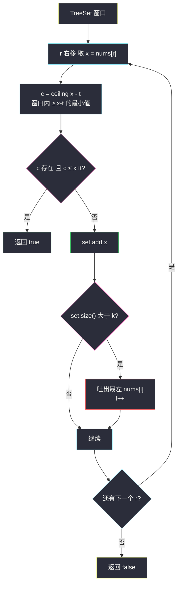
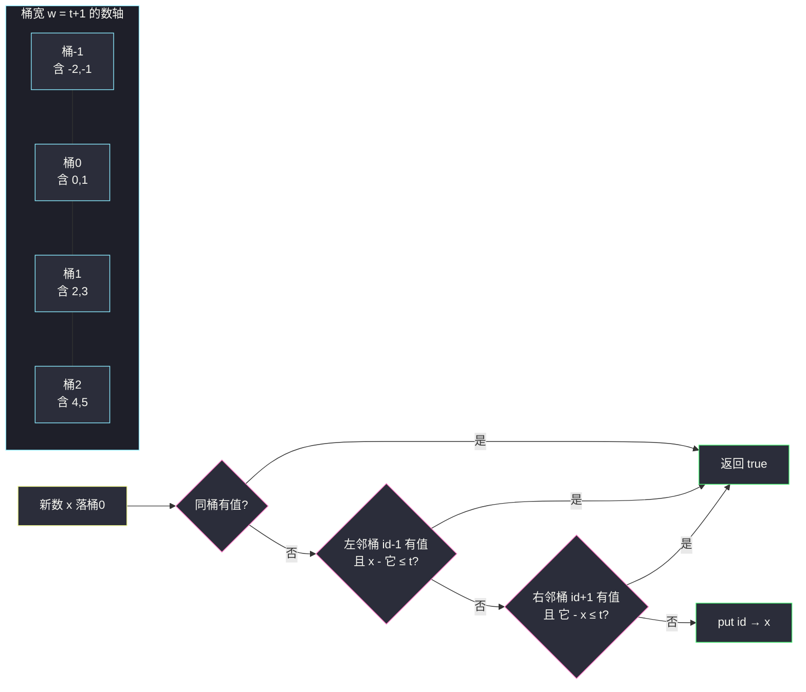

# 存在重复元素 III（有序窗口 / 桶分组）

## 一、问题描述

给你一个整数数组 `nums` 和两个整数 `k`、`t`。判断是否存在**两个不同下标** `i` 和 `j`，使得：

- `abs(nums[i] - nums[j]) <= t`（值的差距不超过 `t`）
- `abs(i - j) <= k`（下标的距离不超过 `k`）

存在返回 `true`，否则返回 `false`。

> 🔗 LeetCode 220：https://leetcode.cn/problems/contains-duplicate-iii/

**示例 1（答案为真）**

```
输入：nums = [1,2,3,1], k = 3, t = 0
输出：true
解释：nums[0] = nums[3] = 1，|1-1| = 0 ≤ 0，|0-3| = 3 ≤ 3
```

**示例 2（答案为真）**

```
输入：nums = [1,5,9,1,5,9], k = 2, t = 3
输出：false
解释：值相同的两对 (1,1)、(5,5)、(9,9) 下标距离都是 3 > 2；
距离 ≤ 2 的数对值差分别是 |1-5|=4、|5-9|=4、…，都 > 3
```

**直观理解**

本题是 [219. 存在重复元素 II](/solutions/base/contains-duplicate-ii.md)（判「值相等」）的升级版：相等放松为「值差 ≤ t」，窗口长度 ≤ k 的约束不变。  
「下标距离 ≤ k」依然翻译成**长度 k+1 的滑动窗口**；而「窗口内存在两数差 ≤ t」——第 219 题的 HashSet 只能查「恰好相等」，现在需要一种**能查『最近的邻居』**的数据结构：有序集合（`TreeSet`），或者更巧的**按值域分桶**。

---

## 二、暴力解法（入门）

### 直观思路

对每个下标 `i`，只往右检查 `k` 格，看值差是否 ≤ `t`。

```java
public boolean containsNearbyAlmostDuplicate(int[] nums, int k, int t) {
    int n = nums.length;
    for (int i = 0; i < n; i++) {
        for (int j = i + 1; j < n && j <= i + k; j++) {
            if (Math.abs((long) nums[i] - nums[j]) <= t) {
                return true;
            }
        }
    }
    return false;
}
```

### 复杂度

- **时间**：`O(n·min(n, k))`，`n ≤ 10⁴`、`k ≤ 10⁴` 时最坏约 10⁸ 次比较，会超时。
- **空间**：`O(1)`。

### 🔴 瓶颈在哪里

内层在窗口里**线性扫值**。第 219 题靠 HashSet 把「查等值」降到 O(1)；本题查的是「差 ≤ t」，需要一个**有序**的窗口，才能用「找最近的邻居」代替「逐个比」。

---

## 三、优化探索（核心章节）

### 3.1 观察特征

| 特征 | 结论 |
|------|------|
| 下标距离 ≤ k | 长度 `k+1` 的**定长窗口**，与 219 题同款：`for (r; r < n; r++) { 纳入; 吐左; 更新 }` |
| 值差 ≤ t 是**数值邻域**条件 | 窗口内元素需要按**值**有序，才能二分找邻居 |
| 只需判断存在性 | 每步 O(log k) 的查询即可，不必维护全部答案 |

### 3.2 优化一：有序窗口（TreeSet，主解）

窗口维护在 `TreeSet<Long>` 中。纳入 `nums[r] = x` 前，回答一个问题：**窗口里有没有落在 `[x - t, x + t]` 区间内的数？**

等价于找「 ≥ x-t 的最小数」（`ceiling(x - t)`），若它同时 ≤ x+t，命中：

- `c = set.ceiling((long) x - t)`：窗口内 ≥ x-t 的最小值；
- 若 `c != null && c <= (long) x + t` → 返回 `true`。

对称地也可以查 `floor(x + t)` 是否 ≥ x-t，一正一反任选其一即可（ceiling 版只需一次查询）。

先查后加（防止自己命中自己）；窗口装满 `k` 个互异槽位后吐出最左端 `nums[l]`，`l++`——正是第 219 题 HashSet 窗口的有序版。



### 3.3 优化二：桶分组（O(n) 最优解）

TreeSet 每步 `O(log k)`。利用「值差 ≤ t」的特殊结构可以降到 O(1)：**把值域切成宽度 `w = t + 1` 的桶**。

- 桶编号：`id = floorDiv(x, w)`。同桶内任意两数之差 ≤ `w - 1 = t`——**同桶 ⇒ 必命中**。
- 相邻桶（`id-1` 与 `id+1`）里的数与 `x` 的差可能 ≤ t，也可能 > t，需显式比一次差值。
- 相隔 ≥ 2 的桶差必 ≥ `w + 1 > t`，无需考虑。
- **一个桶里只需保留一个代表值**：若两个数落进同一个桶，它俩已经差 ≤ t，前一个数命中即返回，永远到不了「同桶两数共存」——所以 `map[id]` 有值就直接命中。
- **桶的过期**：窗口吐出 `nums[i-k]` 时，删除它所在桶；`t = 0` 时 `w = 1`，每个数一个桶，退化为「完全相等才命中」，与 219 题口径一致。

**为什么这样对**：桶宽取 `t+1` 而非 `t`，正是让「同桶 ⇒ 差 ≤ t」无例外成立（宽 t 会漏掉 0..t-1 的对齐问题，且 t=0 时无法分桶）。而「同桶即命中」免去了桶内排序与多存——这是整个方案 O(n) 的来源。

### 3.4 关键推导问题

| 问题 | 答案 |
|------|------|
| 为什么查 `ceiling(x - t)` 一次就够？ | `ceiling` 给出 ≥ x-t 的**最小**候选；若它都 > x+t，比它更大的更不行；若它 ≤ x+t 即命中。区间存在性被一个最小值回答 |
| 为什么用 `Long` 装箱？ | `x - t` 可能 int 下溢（x=-2³¹、t 大），题目 `t ≤ 2³¹-1`，差值必须用 long 算 |
| 桶编号除法为什么用 `floorDiv`？ | Java 整数除法向零取整：`(-3) / 5 = 0`，会把 -3 和 3 分进同一桶导致误判；`Math.floorDiv(-3, 5) = -1` 才是按数轴连续切桶 |
| 吐左时机为什么是 `size > k`？ | 窗口最多装 k 个先来的数（加上自己共 k+1 个下标），保证查询时所有已存元素与 r 的下标距离 ≤ k，口径与 219 题一致 |
| `t < 0` 会怎样？ | 题目保证 t ≥ 0；若 t 为负，`|差| ≤ t` 不可能成立，直接返回 false（防御性写法） |
| 相邻桶为什么要显式比差值？ | 例如 w=4：桶 0 装 [0,3]、桶 1 装 [4,7]，0 与 7 差 7 > t=3 虽相邻但并不命中，必须实比 |

### 3.5 一句话核心

> **窗口管下标距离（≤ k），有序结构管值邻域：TreeSet 用 ceiling 一步问到最近邻居；桶分组按值切成宽 t+1 的格子，同桶即命中、邻桶比一次。**

---

## 四、代码实现详解

> 说明：课源码仓库 `src/class*` 未收录 #220（与站内 [contains-duplicate-ii.md](/solutions/base/contains-duplicate-ii.md) 同口径），主解按课上 class049 系列定长窗口骨架 `for (l, r; r < n; r++) { 纳入; 吐左; 更新 }` 与 `l/r` 命名书写，「更新」是「查邻域即返回」。

### Java（主解：有序窗口 TreeSet）

```java
// 存在重复元素 III
// 测试链接 : https://leetcode.cn/problems/contains-duplicate-iii/
public class Solution {

    public static boolean containsNearbyAlmostDuplicate(int[] nums, int k, int t) {
        if (t < 0) {
            return false;
        }
        TreeSet<Long> set = new TreeSet<>();   // 窗口内的值，按值有序
        for (int l = 0, r = 0; r < nums.length; r++) {
            // 窗口内是否存在 ≥ nums[r]-t 的最小值 c，且 c ≤ nums[r]+t
            Long c = set.ceiling((long) nums[r] - t);
            if (c != null && c <= (long) nums[r] + t) {
                return true;
            }
            set.add((long) nums[r]);
            if (set.size() > k) {              // 窗口长度不超过 k+1
                set.remove((long) nums[l++]);  // 吐出最左端
            }
        }
        return false;
    }
}
```

**变量含义**

| 变量 | 含义 |
|------|------|
| `set` | 当前窗口（≤ k 个先到元素）的有序值集合 |
| `l, r` | 窗口左右端，`r` 每轮纳入，`set` 超过 k 时 `l` 吐左 |
| `c` | `ceiling(x - t)`：窗口内 ≥ x-t 的最小值 |

**循环不变式**：查询发生在纳入 `nums[r]` 之前，集合恰含下标落在 `[l..r-1]` 且下标距离 r ≤ k 的那些值——命中即可保证两个条件同时满足。

### Java（最优解：桶分组 O(n)）

```java
// 桶分组：值域按宽度 w = t+1 切桶，同桶必命中，邻桶比一次
public class Solution {

    public static boolean containsNearbyAlmostDuplicate(int[] nums, int k, int t) {
        if (t < 0) {
            return false;
        }
        int w = t + 1;                          // 桶宽
        HashMap<Long, Long> buckets = new HashMap<>();
        for (int l = 0, r = 0; r < nums.length; r++) {
            long x = nums[r];
            long id = Math.floorDiv(x, w);      // 负数也按数轴切桶
            if (buckets.containsKey(id)) {
                return true;                    // 同桶：差 ≤ w-1 = t
            }
            Long left = buckets.get(id - 1);
            if (left != null && x - left <= t) {
                return true;                    // 左邻桶显式比差
            }
            Long right = buckets.get(id + 1);
            if (right != null && right - x <= t) {
                return true;                    // 右邻桶显式比差
            }
            buckets.put(id, x);
            if (buckets.size() > k) {           // 窗口过期：吐出最左端所在桶
                long old = nums[l++];
                buckets.remove(Math.floorDiv(old, w));
            }
        }
        return false;
    }
}
```

注意每个桶只存**一个**值：`buckets.size() > k` 时逐桶删除，与 TreeSet 版的吐左一一对应。

### Python（桶分组版，推荐默写）

Python 标准库没有 TreeSet；工程上可用 `sortedcontainers.SortedList`（LeetCode 环境可用）仿照 Java 主解。更通用的做法是直接写桶分组——而且 Python 的 `//` 对负数**天然向下取整**，恰好就是 `floorDiv` 语义，比 Java 版还省心：

```python
class Solution:
    def containsNearbyAlmostDuplicate(self, nums: list[int], k: int, t: int) -> bool:
        if t < 0:
            return False
        w = t + 1                      # 桶宽
        buckets = {}
        l = 0
        for r, x in enumerate(nums):
            bid = x // w               # Python // 即向下取整，负数自动正确
            if bid in buckets:
                return True            # 同桶必命中
            if bid - 1 in buckets and x - buckets[bid - 1] <= t:
                return True            # 左邻桶显式比差
            if bid + 1 in buckets and buckets[bid + 1] - x <= t:
                return True            # 右邻桶显式比差
            buckets[bid] = x
            if r - l >= k:             # 窗口已满，吐出最左端所在桶
                buckets.pop(nums[l] // w, None)
                l += 1
        return False
```

若想严格对齐 Java 主解（TreeSet 版），用 `SortedList` 等价改写：查询改为 `pos = sl.bisect_left(x - t)`，若 `pos < len(sl)` 且 `sl[pos] <= x + t` 则返回 true；纳入后 `len(sl) > k` 时 `sl.remove(nums[l])` 并 `l += 1`。

---

## 五、具体例子演示

### 例 1：`nums = [1,5,9,1,5,9], k = 2, t = 3`（TreeSet 版，预期 false）

| r | x | ceiling(x-t) 查询 | 命中? | 动作 | 集合（含下标） |
|---|---|--------------------|-------|------|----------------|
| 0 | 1 | ceiling(-2) = null | 否 | add 1 | {1(0)} |
| 1 | 5 | ceiling(2) = null（集合里只有 1，1 < 2） | 否 | add 5 | {1(0), 5(1)} |
| 2 | 9 | ceiling(6) = null（5 不够大） | 否 | add 9；size=3 > 2 → 吐左 1 | {5(1), 9(2)} |
| 3 | 1 | ceiling(-2) = 5，但 5 ≤ 4 不成立 | 否 | add 1；吐左 5 | {9(2), 1(3)} |
| 4 | 5 | ceiling(2) = 9（9 是 ≥ 2 的最小值），但 9 ≤ 8 不成立 | 否 | add 5；吐左 9 | {1(3), 5(4)} |
| 5 | 9 | ceiling(6) = null（5 不够大） | 否 | add 9；吐左 1 | {5(4), 9(5)} |

扫描结束，返回 **false** ✔。注意两处「擦肩而过」：r=4 时集合里最近的是 9，但 `9 > x+t = 8`，差 4；r=5 时最近的是 5，差 4——都不满足 t=3。而真正差 ≤ 3 的数对（两个 1、两个 5、两个 9）下标距离都是 3 > k=2，早被窗口吐掉了。**k 和 t 两把尺子必须同时满足，正是本题比 219 难的地方。**


### 例 2：`nums = [1,2,1,5], k = 2, t = 1`（桶版，预期 true）

`w = 2`：桶划分 [0,1]=桶0、[2,3]=桶1、[4,5]=桶2…

| r | x | bid | 查同桶/邻桶 | 动作 |
|---|---|-----|-------------|------|
| 0 | 1 | 0 | 桶-1、0、1 均空 | put(0,1)；size=1 ≤ 2 |
| 1 | 2 | 1 | 桶0 有 1：`2-1=1 ≤ t=1` → **true** | — |

返回 **true**（数对 (1,2) 值差 1 ≤ 1、下标差 1 ≤ 2）✔。这里走的是「左邻桶显式比差」的分支；而「同桶必命中」的更强不变量留给例 3。

### 例 3：`nums = [1,3,1], k = 2, t = 1`（同桶命中）

`w = 2`：1→桶0，3→桶1，1→桶0。

| r | x | bid | 过程 |
|---|---|-----|------|
| 0 | 1 | 0 | 桶0/±1 空，put(0,1) |
| 1 | 3 | 1 | 桶1 空；左邻桶0 有 1，`3-1=2 > 1` 不命中；put(1,3) |
| 2 | 1 | 0 | **桶0 已有 1 → 同桶必命中**，返回 true |

两个 1 值差 0 ≤ 1、下标差 2 ≤ 2 ✔——同桶直接返回，连差值都不用比。



---

## 六、复杂度分析

| 方法 | 时间 | 空间 |
|------|------|------|
| 暴力双扫 | `O(n·min(n,k))` | `O(1)` |
| TreeSet 有序窗口 | `O(n log k)`，每步一次 ceiling/删除 | `O(min(n,k))` |
| 桶分组 | **`O(n)`**，每步 O(1) 的哈希查询 | `O(min(n,k))` 个桶 |

---

## 七、方法对比与总结

| | 暴力 | HashSet（219 的做法） | TreeSet 有序窗口 | 桶分组 |
|--|------|----------------------|------------------|--------|
| 查询能力 | 全比一遍 | 只能查等值 | 查区间内最近值 | 查同桶/邻桶 |
| 值条件 | 值差 ≤ t | 值相等 | 值差 ≤ t | 值差 ≤ t |
| 时间 | `O(nk)` | —（不适用） | `O(n log k)` | `O(n)` |

**易错点**

1. **先查后加**：`ceiling` 查询必须发生在 `add` 之前，否则自己命中自己。
2. **long 防溢出**：`(long) nums[r] - t` 若用 int，`-2³¹ - 3` 直接下溢出成大正数，查询悄悄变错。
3. Java 桶编号必须 `Math.floorDiv`：`/` 对负数向零取整，-3 与 3 会挤进同一桶。
4. 桶宽取 `t + 1` 不是 `t`：保证「同桶 ⇒ 差 ≤ t」零例外，`t = 0` 时宽 1 仍可分桶。
5. 吐左别删错：TreeSet 删的是值 `nums[l]`；桶版删的是 `floorDiv(nums[l], w)` 那个桶。
6. 一个桶只留一个代表值：同桶第二个数进来时前一个必然已让算法返回，存两个没有意义还会让「同桶即命中」失效。

**模板（窗口 + 有序邻居查询）**

```java
// for (l=0, r=0; r<n; r++) {
//     查询窗口内是否存在落在 [x-t, x+t] 的值（ceiling 或 桶）；
//     命中返回 true；否则纳入 x；
//     if (size > k) 吐出 nums[l++]；
// }
```

---

## 八、举一反三

| 题目 | 链接 | 迁移点 |
|------|------|--------|
| 219. 存在重复元素 II | https://leetcode.cn/problems/contains-duplicate-ii/ | 本题 t=0 的特例，HashSet 即可（[站内题解](/solutions/base/contains-duplicate-ii.md)） |
| 217. 存在重复元素 | https://leetcode.cn/problems/contains-duplicate/ | 撤掉下标约束（k = n-1），只剩值判重 |
| 220 进阶：870. 优势洗牌 | https://leetcode.cn/problems/advantage-shuffle/ | 同样依赖「有序结构找最近邻居」的 ceiling 思想 |
| 352. 将数据流变为多个不相交区间 | https://leetcode.cn/problems/data-stream-as-disjoint-intervals/ | 有序集合维护数值邻域的进阶练习 |

**思想迁移**：滑动窗口管「**下标维度**的近邻」，有序结构/桶管「**数值维度**的近邻」。二维约束（位置近 + 值近）的题，套路就是「窗口裁空间 + 有序结构裁值域」——本题是这个组合拳的最小完整样本。
