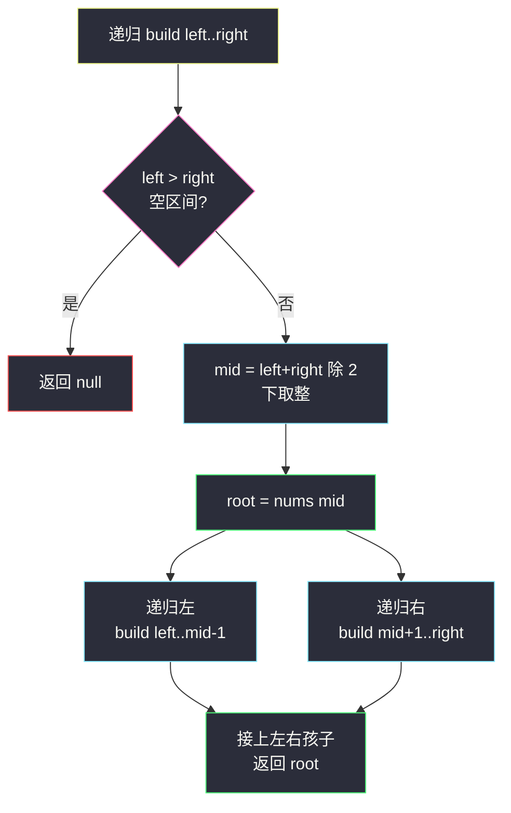
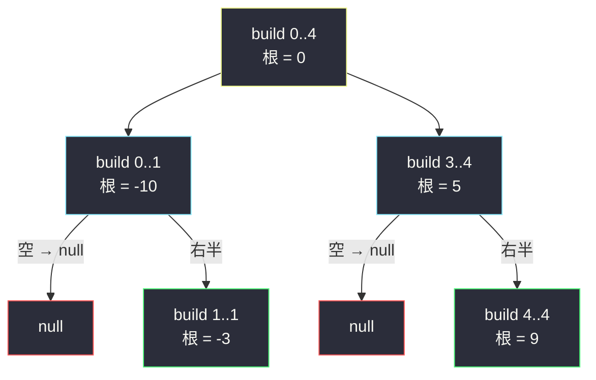

# 将有序数组转换为二叉搜索树（二分取中点为根）

## 一、问题描述

给定一个**升序**整数数组 `nums`，请将其转换为一棵**高度平衡**的二叉搜索树（BST），返回根节点。

「高度平衡」指每个节点左右两棵子树的高度差不超过 1。

> 🔗 LeetCode 108：https://leetcode.cn/problems/convert-sorted-array-to-binary-search-tree/

**示例 1**

```
输入：nums = [-10,-3,0,5,9]
输出：[0,-3,9,-10,null,5]
树形：
        0
       / \
     -3    9
     /    /
  -10    5
（答案不唯一，任何高度平衡的合法 BST 都算对）
```

**示例 2**

```
输入：nums = [1,3]
输出：[3,1] 或 [1,null,3]，两者都对
```

**直观理解**

两个性质天然咬合：

- **BST 的中序遍历是升序**——而 `nums` 本身就是升序的，所以数组**就是一个现成的中序序列**；
- 要**平衡**，就希望左右子树节点数尽量均等——取**中点**当根，左边全做左子树、右边全做右子树，天然均分。

于是「构造家族」（#105 / #106 / #108）里本题是最舒展的一道：**不用哈希定根，中点就是根**，直接区间递归。

---

## 二、暴力解法（入门）

### 直观思路

最省脑子的写法：每次把当前区间**拷贝**成左右两个新数组，递归构造，再把结果拼起来——分治骨架正确，但每一层都付出拷贝数组的代价。

```java
class Solution {
    public TreeNode sortedArrayToBST(int[] nums) {
        if (nums.length == 0) {
            return null;
        }
        int mid = nums.length / 2;                       // 中点当根
        TreeNode root = new TreeNode(nums[mid]);
        root.left  = sortedArrayToBST(Arrays.copyOfRange(nums, 0, mid));       // 拷贝左半
        root.right = sortedArrayToBST(Arrays.copyOfRange(nums, mid + 1, nums.length)); // 拷贝右半
        return root;
    }
}
```

### 复杂度

- **时间**：`O(n log n)`。每层拷贝总量 `O(n)`，共 `O(log n)` 层（每次几乎对半砍）。
- **空间**：`O(n log n)` 量级的临时数组 + 递归栈 `O(log n)`。

### 🔴 瓶颈在哪里

拷贝完全没有必要——数组从头到尾**不动**，用 `left`/`right` 两个下标描述「当前子树对应哪一段」就够了。优化后时间 `O(n)`、额外空间 `O(log n)`，且代码更短。

顺带一问：**为什么取中点而不是第一个元素当根？** 取 `nums[0]` 当根也能造出合法 BST（中序仍升序），但所有节点挤到右链上，树高 `O(n)`，不满足「高度平衡」——中点是平衡的来源。

---

## 三、优化探索（核心章节）

### 3.1 观察特征

| 特征 | 说明 |
|------|------|
| 数组有序 | 升序数组 = BST 的中序序列，左小右大的划分**天然给出** |
| 无重复元素干扰 | 每个值唯一，中点划分无歧义 |
| 子问题自相似 | 「一段区间 → 一棵平衡 BST」，区间长度严格变小 |
| 定根零成本 | 中点下标 `mid = (left + right) / 2` 一步算出，无需哈希 |

### 3.2 推导：为什么中点保证平衡

设区间长度 `len = right - left + 1`，取 `mid = ⌊(left + right) / 2⌋`：

- 左子树段 `[left, mid-1]` 长度 = `mid - left = ⌊(len-1)/2⌋`
- 右子树段 `[mid+1, right]` 长度 = `right - mid = ⌈(len-1)/2⌉`

两段长度**至多相差 1**。归纳下去：每个节点的左右子树节点数差 ≤ 1，且两棵子树内部同样均分，所以整棵树任何节点的左右高度差 ≤ 1——这正是「高度平衡」的定义。整树高约 `⌊log₂ n⌋ + 1`。

**不变式**：传给递归的区间 `[left, right]` 永远对应一段**连续且升序**的子数组；`left > right` 即空树返回 `null`。

> 注：课源码 `algorithm-journey` 未收录本题专门实现；本篇按课上二叉树递归分治骨架（同 class036 Code07 构造题、class036 Code04 后序统计题一脉）对齐成「简洁易懂」版。



### 3.3 关键推导问题

| 问题 | 答案 |
|------|------|
| 中点取 `⌊(l+r)/2⌋` 还是 `⌈(l+r)/2⌉`？ | 都行。偶数长度时中点偏左或偏右，左右子树大小只差 1，两种都平衡——所以本题答案不唯一 |
| 为什么不用 `⌊(l+r)/2⌋` 而用 `l + (r-l)/2`？ | 防溢出习惯写法。本题 `n ≤ 10⁴` 不会溢出，但 `l + (r-l)/2` 是值得养成的肌肉记忆 |
| 树一定是完全二叉树吗？ | 不一定。是完全二叉树按层填的形状被砍掉尾部若干节点后的形态（比如 `n=2` 时只有左孩子或只有右孩子——取 `⌊mid⌋` 时是右孩子为空） |
| 如何验证构造正确？ | 两个检查：① 中序遍历结果 = 原数组（升序）；② 任一节点左右子树高度差 ≤ 1 |
| 能否从有序**链表**做同样的事？ | 能（#109），只是链表找中点要快慢指针，或先转数组 |

### 3.4 一句话核心

> **有序数组就是中序序列；取中点当根、左右各一半，平衡与搜索性同时到手。**

---

## 四、代码实现

### Java（主解：下标区间递归）

```java
class Solution {
    public TreeNode sortedArrayToBST(int[] nums) {
        return build(nums, 0, nums.length - 1);
    }

    // 用升序段 nums[left..right] 构造平衡 BST，返回根
    private TreeNode build(int[] nums, int left, int right) {
        if (left > right) {
            return null;
        }
        int mid = left + (right - left) / 2;      // 中点当根，防溢出写法
        TreeNode root = new TreeNode(nums[mid]);
        root.left  = build(nums, left, mid - 1);  // 左半 → 左子树（全部更小）
        root.right = build(nums, mid + 1, right); // 右半 → 右子树（全部更大）
        return root;
    }
}
```

### Python（同思路）

```python
class Solution:
    def sortedArrayToBST(self, nums: List[int]) -> Optional[TreeNode]:
        def build(left: int, right: int) -> Optional[TreeNode]:
            if left > right:
                return None
            mid = (left + right) // 2
            root = TreeNode(nums[mid])
            root.left = build(left, mid - 1)
            root.right = build(mid + 1, right)
            return root

        return build(0, len(nums) - 1)
```

两版核心都是五行：判空 → 取中 → 建根 → 左右递归。**中序遍历这棵树会恰好还原 `nums`**，可当作现场自检手段。

---

## 五、具体例子演示

### 例 1：`nums = [-10,-3,0,5,9]`

递归展开（每层看区间与中点）：

| 步 | 调用 build(区间) | 区间内容 | mid | 根 | 左递归 | 右递归 |
|----|-----------------|----------|-----|----|--------|--------|
| 1 | [0..4] | -10,-3,0,5,9 | 2 | **0** | [0..1] | [3..4] |
| 2 | [0..1] | -10,-3 | 0 | **-10** | 空 | [1..1] |
| 3 | [1..1] | -3 | 1 | **-3** | 空 | 空 |
| 4 | [3..4] | 5,9 | 3 | **5** | 空 | [4..4] |
| 5 | [4..4] | 9 | 4 | **9** | 空 | 空 |



拼装结果：

```
        0
       / \
     -3    9
     /    /
  -10    5
```

**自检两件事**：
- 中序遍历 = `-10, -3, 0, 5, 9` = 原数组（升序 ✓，BST 合法）；
- 任一节点左右子树高度差：0（左高 2 右高 2）、-3（0 与 1）、5（0 与 1）……均 ≤ 1（平衡 ✓）。

### 例 2：`nums = [1,3]`（偶数长度）

build[0..1]：`mid = 0`，根 **1**，左空、右 build[1..1] = **3** → `[1,null,3]`。
若取 `mid = 1` 则得 `[3,1]`。**两个答案都被判对**——本题不要求唯一形态。

### 例 3：空数组 `nums = []`

build[0..-1] 直接 `left > right`，返回 `null` ✔

---

## 六、复杂度分析

| 项目 | 下标递归（主解） | 拷贝数组版（暴力） |
|------|-----------------|--------------------|
| 时间 | `O(n)`：每个节点恰好建一次 | `O(n log n)`：每层拷贝 `O(n)` |
| 空间 | `O(log n)` 递归栈（树必然平衡，高度 `⌊log₂ n⌋ + 1`） | 数组拷贝 `O(n log n)` 量级 + 递归栈 |

主解的空间有个亮点：因为**每次取中点**，递归深度被钉死在 `O(log n)`，不存在链状树的最坏情况。

---

## 七、方法对比与总结

| | 拷贝数组 | 下标区间（主解） | 中序 + 占位恢复（拓展） |
|--|----------|------------------|--------------------------|
| 时间 | `O(n log n)` | `O(n)` | `O(n)`，但要把 105/106 的构造再套一层，绕远 |
| 空间 | `O(n log n)` 级 | `O(log n)` 栈 | `O(n)` |
| 代码量 | 短 | 最短 | 明显更长 |
| 推荐 | 理解分治用 | ✅ 面试默写 | 理解「数组即中序」的联系即可 |

**易错点**

1. `mid` 拿 `nums.length / 2` 而不是区间中点——第一层就对，递归进去就全错（必须 `(left + right) / 2`）。
2. 空区间判断写成 `left >= right`，单元素区间 `[1..1]` 被误判为空，少建节点。
3. 误以为要返回**唯一**答案，在偶数区间的中点选择上纠结——两种都对。
4. 把「平衡」误解为「完全二叉树」，`n=2` 时硬要补满两层——不必要。
5. 忘写空数组 `[]` 的出口（虽然 `left > right` 已天然覆盖）。

**模板口诀**

> **区间判空，中点建根；左半归左，右半归右；中序即原数组。**

---

## 八、举一反三

| 题目 | 链接 | 迁移点 |
|------|------|--------|
| 105. 从前序与中序遍历序列构造二叉树 | https://leetcode.cn/problems/construct-binary-tree-from-preorder-and-inorder-traversal/ | 构造家族：哈希定根 + 中序分界，本站已有题解 |
| 106. 从中序与后序遍历序列构造二叉树 | https://leetcode.cn/problems/construct-binary-tree-from-inorder-and-postorder-traversal/ | 构造家族：后序定根镜像版，本站已有题解 |
| 109. 有序链表转换二叉搜索树 | https://leetcode.cn/problems/convert-sorted-list-to-binary-search-tree/ | 数组换链表：中点要靠快慢指针，或链表转数组 |
| 1382. 将二叉搜索树变平衡 | https://leetcode.cn/problems/balance-a-binary-search-tree/ | 先中序收集成有序数组，再走本题流程——完美闭环 |
| 110. 平衡二叉树 | https://leetcode.cn/problems/balanced-binary-tree/ | 「高度平衡」的判定端（本站已有题解） |

**迁移一句**：看到「有序数组/链表 → 树」或「树 → 平衡」，第一反应应该是**中序序列是桥梁**——数组就是中序，取中点二分是制造平衡最便宜的手段（#1382 就是这两招的串联）。
