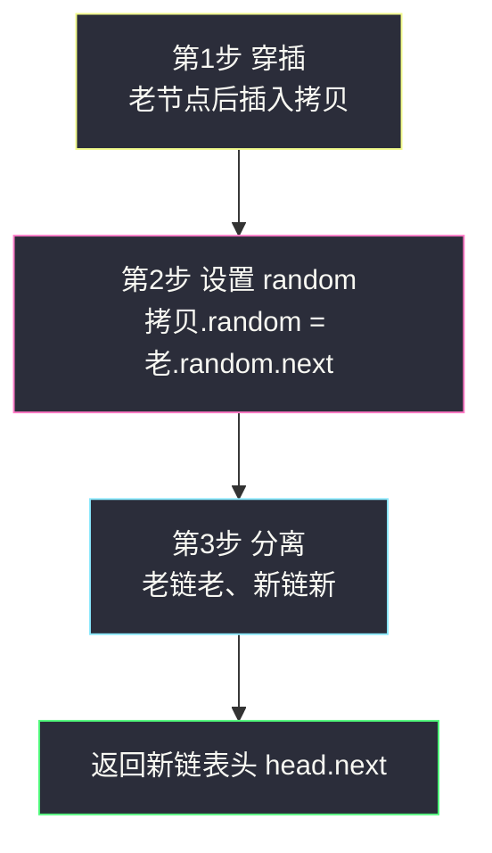
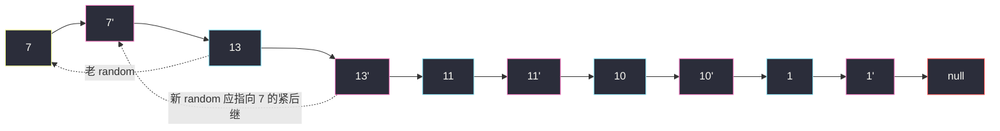

# 复制带随机指针的链表（哈希映射 / 原地穿插）

## 一、问题描述

给你一个长度为 `n` 的链表，每个节点除了普通的 `next` 指针，还有一个 **`random` 指针**，它可以指向链表中的任何节点或空节点。

请你**深拷贝**这个链表：构造一个新链表，使新链表中每个节点的 `val`、`next`、`random` 都正确指向**新链表**中的对应节点（而不是原链表的节点）。返回新链表的头节点 `head'`。

> 🔗 LeetCode 138：https://leetcode.cn/problems/copy-list-with-random-pointer/

节点定义：

```java
class Node {
    int val;
    Node next;
    Node random;
}
```

**示例 1**

```
输入：head = [[7,null],[13,0],[11,4],[10,2],[1,0]]
输出：[[7,null],[13,0],[11,4],[10,2],[1,0]]
（每个元素 [val, random索引]，random 为 null 表示空）
```

**示例 2**

```
输入：head = []（空链表）
输出：[]
解释：给定的链表为空，返回 null。
```

**直观理解**

拷贝 `next` 方向很容易——顺着走一遍就行。麻烦全在 `random`：

- `random` 乱指，可能指向**还没创建**的节点，也可能指向**已经创建**的节点；
- 新节点的 `random` 必须指向**新链表里**的对应节点——直接抄老指针（`newNode.random = oldNode.random`）会让两条链表搅在一起，是本题最经典的错误。

所以核心矛盾是：**「老节点」到「新节点」的对应关系怎么维护**。三种解法（数位置、哈希表、原地穿插）本质都是在回答这个问题。

---

## 二、暴力解法（数位置索引）

### 思路

第一遍顺着 `next` 把新链表拷出来；第二遍处理 `random`：对每个老节点，从头数一遍确定它的 `random` 是第几个节点，再到新链表里从头走同样多步，接上新指针。

```java
class Solution {
    public Node copyRandomList(Node head) {
        if (head == null) {
            return null;
        }
        // 第一遍：只拷 next
        Node newHead = new Node(head.val);
        Node p = head.next, q = newHead;
        while (p != null) {
            q.next = new Node(p.val);
            q = q.next;
            p = p.next;
        }
        // 第二遍：数位置，对齐 random
        p = head;
        q = newHead;
        while (p != null) {
            if (p.random != null) {
                Node a = head, b = newHead;
                while (a != p.random) { // 从头数 random 是第几个
                    a = a.next;
                    b = b.next;
                }
                q.random = b;
            }
            p = p.next;
            q = q.next;
        }
        return newHead;
    }
}
```

### 复杂度

- **时间**：`O(n²)`（每个节点都可能从头数一遍）
- **空间**：`O(1)`

### 🔴 瓶颈在哪里

1. 定位 `random` 对应节点要 `O(n)`，整体 `O(n²)`，链表一长就炸。
2. 根源：**「老 → 新」的映射关系没有存下来**，每次都要现场重新找。

---

## 三、优化探索（核心章节）

### 3.1 优化一：哈希表存「老节点 → 新节点」

把映射关系用 `HashMap<Node, Node>` 存下来，定位从「数一遍」变成「查表 `O(1)`」：

- 第一遍：顺 `next` 创建所有新节点，同时 `map.put(老, 新)`；
- 第二遍：再顺一遍，新节点的 `next` 和 `random` 都通过 `map.get(老指针)` 直达。

时间降到 `O(n)`，代价是 `O(n)` 空间。到这里已经是很好的面试答案了。

### 3.2 优化二：原地穿插法，把映射织进链表

能不能连哈希表也省掉？课源码（`class034/Code03_CopyListWithRandomPointer.java`）的原地穿插法给出惊艳答案——**用链表自己的 next 指针当哈希表**：

**第 1 步 · 穿插**：每个老节点后面立刻插一个它的拷贝：

```
原:  1 → 2 → 3
新:  1 → 1' → 2 → 2' → 3 → 3'
```

此时「老节点的 `next`」天然就是它的新拷贝——`老.next == 老'`，映射关系被编码进了结构里，哈希表退役。

**第 2 步 · 设置 random**：对新节点 `cur.next` 来说，它的 `random` 应指向 `cur.random` 的拷贝。而 `cur.random` 的拷贝恰好是 `cur.random.next`（第 1 步的成果）：

```
cur.next.random = cur.random == null ? null : cur.random.next
```

**第 3 步 · 分离**：把交织的大链表拆成两条：老节点互相连、新节点互相连，恢复原链表的同时得到答案。

### 3.3 关键推导问题

| 问题 | 答案 |
|------|------|
| 为什么不能直接 `新.random = 老.random`？ | 那是老链表的节点，深拷贝要求完全独立 |
| 哈希法为什么要两遍循环？ | 第一遍建全所有新节点，保证第二遍查 `random` 映射时目标一定存在 |
| 穿插法第 2 步为什么是 `cur.random.next`？ | 穿插后 `老.random` 的紧后继就是它的拷贝，即新节点要指的目标 |
| 穿插法第 2 步能不能和第 3 步合并？ | 不能：先分离会破坏「老.next 是拷贝」的映射，random 就找不到了 |
| 分离时链尾怎么处理？ | 最后一个新节点的 `next` 要置 null（其后继不存在），注意三元判断 |
| 原链表必须恢复原样吗？ | 本题不强制，但穿插法顺手就恢复了，是加分项 |

### 3.4 一句话核心

> 拷贝的难点只有一个：**维护「老 → 新」的映射**。哈希表用 `O(n)` 空间买映射；穿插法把映射藏进 `next` 指针里，`O(1)` 空间办同样的事。



---

## 四、代码实现详解

### Java（哈希表 · 主解，最好讲最稳）

```java
class Solution {
    public Node copyRandomList(Node head) {
        if (head == null) {
            return null;
        }
        Map<Node, Node> map = new HashMap<>(); // 老节点 -> 新节点
        // 第一遍：创建所有新节点
        for (Node cur = head; cur != null; cur = cur.next) {
            map.put(cur, new Node(cur.val));
        }
        // 第二遍：连接 next 和 random
        for (Node cur = head; cur != null; cur = cur.next) {
            Node copy = map.get(cur);
            copy.next = map.get(cur.next);         // cur.next 为 null 时 get 返回 null，正好
            copy.random = map.get(cur.random);
        }
        return map.get(head);
    }
}
```

（细节：`map.get(null)` 返回 `null`，所以尾部和空 `random` 不需要任何特判。）

### Java（原地穿插 · 第二思路，对齐课源码 class034/Code03，`O(1)` 空间）

```java
class Solution {
    public Node copyRandomList(Node head) {
        if (head == null) {
            return null;
        }
        // 第 1 步：穿插 1 -> 1' -> 2 -> 2' -> ...
        for (Node cur = head; cur != null; ) {
            Node next = cur.next;
            cur.next = new Node(cur.val); // 拷贝插在老节点后面
            cur.next.next = next;
            cur = next;
        }
        // 第 2 步：设置每个新节点的 random
        for (Node cur = head; cur != null; cur = cur.next.next) {
            if (cur.random != null) {
                cur.next.random = cur.random.next; // 老random的紧后继=它的新拷贝
            }
        }
        // 第 3 步：新老分离
        Node newHead = head.next;
        for (Node cur = head; cur != null; ) {
            Node next = cur.next.next;   // 下一个老节点
            Node copy = cur.next;        // 当前老节点的拷贝
            cur.next = next;             // 老链表恢复原样
            copy.next = (next != null) ? next.next : null; // 新链表串起来
            cur = next;
        }
        return newHead;
    }
}
```

### Python（两版同思路）

```python
class Solution:
    def copyRandomList(self, head: "Node | None") -> "Node | None":
        if head is None:
            return None
        mapping = {}
        cur = head
        while cur:
            mapping[cur] = Node(cur.val)
            cur = cur.next
        cur = head
        while cur:
            copy = mapping[cur]
            copy.next = mapping.get(cur.next)
            copy.random = mapping.get(cur.random)
            cur = cur.next
        return mapping[head]
```

```python
class Solution:
    def copyRandomList(self, head: "Node | None") -> "Node | None":
        if head is None:
            return None
        # 第 1 步：穿插
        cur = head
        while cur:
            nxt = cur.next
            cur.next = Node(cur.val)
            cur.next.next = nxt
            cur = nxt
        # 第 2 步：设置 random
        cur = head
        while cur:
            if cur.random is not None:
                cur.next.random = cur.random.next
            cur = cur.next.next
        # 第 3 步：分离
        new_head = head.next
        cur = head
        while cur:
            nxt = cur.next.next
            copy = cur.next
            cur.next = nxt
            copy.next = nxt.next if nxt else None
            cur = nxt
        return new_head
```

---

## 五、具体例子演示

以示例 1 跟踪穿插法。原链表：

```
7 → 13 → 11 → 10 → 1 → null
random: 7→null, 13→7, 11→1, 10→11, 1→7
```

### 第 1 步：穿插（每个老节点后插入拷贝）

```
7 → 7' → 13 → 13' → 11 → 11' → 10 → 10' → 1 → 1' → null
```



（青色 = 老节点，粉色 = 新拷贝。）

### 第 2 步：设置新节点的 random（`cur.next.random = cur.random.next`）

| cur（老） | cur.random | 新节点 cur.next | 新节点的 random | 推导 |
|-----------|-----------|-----------------|-----------------|------|
| 7 | null | 7' | null | `cur.random == null`，跳过 |
| 13 | 7 | 13' | **7'** | `7.next` 在穿插结构里是 7' ✅ |
| 11 | 1 | 11' | **1'** | `1.next` 是 1' ✅ |
| 10 | 11 | 10' | **11'** | `11.next` 是 11' ✅ |
| 1 | 7 | 1' | **7'** | `7.next` 是 7' ✅ |

注意 `7.next` 已不是原来的 13——穿插后它暂时指向 7'，这正是「映射藏进 next」的魔法。

### 第 3 步：分离（cur 沿老链跳两格前进）

| cur | next = cur.next.next | copy = cur.next | 老链恢复 | 新链连接 |
|-----|----------------------|-----------------|----------|----------|
| 7 | 13 | 7' | 7→13 | 7'→13'（13.next 原是 13'） |
| 13 | 11 | 13' | 13→11 | 13'→11' |
| 11 | 10 | 11' | 11→10 | 11'→10' |
| 10 | 1 | 10' | 10→1 | 10'→1' |
| 1 | null | 1' | 1→null | 1'→null（三元兜底） |

最终两条干净的链表：

```
老（已还原）: 7 → 13 → 11 → 10 → 1 → null
新（答案）  : 7' → 13' → 11' → 10' → 1' → null
              13'.random = 7'   11'.random = 1'
              10'.random = 11'  1'.random = 7'   7'.random = null
```

返回 `newHead = 7'`，与原链表完全独立、逐位对应 ✅。

**极简边界**：`head = []` 直接返回 `null`（开头的判空，也避免第 3 步 `head.next` 空指针）；单节点 `[[5,null]]`：穿插成 `5→5'`，random 为 null 不处理，分离后老 `5→null`、新 `5'→null`。

---

## 六、复杂度分析

| 方法 | 时间 | 额外空间 | 说明 |
|------|------|----------|------|
| 数位置索引 | `O(n²)` | `O(1)` | 定位 random 逐个从头数 |
| **哈希表** | **`O(n)`** | `O(n)` | 主解：查表 O(1)，两遍循环 |
| **原地穿插** | **`O(n)`** | **`O(1)`** | 课源码方法：映射织进 next 指针 |

穿插法三个阶段各扫一遍链表，共 `3n` 次节点访问，仍为 `O(n)`；全程只用常数个临时指针。

---

## 七、方法对比与总结

### 易错点

1. **新节点的 random 指向了老链表节点**（直接 `copy.random = cur.random`）→ 两条链表纠缠，深拷贝失败，本题头号错误。
2. **哈希法一遍循环里又建节点又连 random** → `random` 目标节点可能还没创建，必须两遍。
3. **穿插法第 2 步先分离再设 random** → 顺序反了：分离后 `老.random.next` 不再是拷贝，映射丢失。
4. **穿插法第 3 步忘记链尾** → 最后一个新节点的 `next` 没置 null，新链表尾部挂着老链表的尾巴。
5. **穿插法第 1 步忘了保存原 next** → 插入拷贝后老链表的连接被覆盖，走不下去了。
6. **忘了判空** `head == null` → 第 3 步 `head.next` 空指针异常。

### 三种方法对比

| | 数位置 | 哈希表 | 原地穿插 |
|--|-------|--------|---------|
| 时间 | `O(n²)` | `O(n)` | `O(n)` |
| 空间 | `O(1)` | `O(n)` | `O(1)` |
| 编码难度 | 低但慢 | **最低，面试先写** | 中，三步顺序严格 |
| 原链表是否还原 | 是 | 是（根本没动过） | 是（第 3 步顺手恢复） |

### 模板口诀

> **拷贝难在映射：先建节点再连针（哈希两遍）；更绝的是穿插——老后插新、新 random 找老的 next、最后拆两条。**

---

## 八、举一反三

| 题目 | 链接 | 迁移点 |
|------|------|--------|
| 133. 克隆图 | https://leetcode.cn/problems/clone-graph/ | 同款难题：图的深拷贝，哈希表防重复建节点，思想与哈希法完全同源 |
| 138. 复制带随机指针的链表 | https://leetcode.cn/problems/copy-list-with-random-pointer/ | 本题 |
| 116. 填充每个节点的下一个右侧节点指针 | https://leetcode.cn/problems/populating-next-right-pointers-in-each-node/ | 「在原结构上临时织入新指针」的空间 `O(1)` 技巧同款 |
| 430. 扁平化多级双向链表 | https://leetcode.cn/problems/flatten-a-multilevel-doubly-linked-list/ | 多指针链表的结构拆装基本功 |
| 206. 反转链表 | https://leetcode.cn/problems/reverse-linked-list/ | 穿插法第 1、3 步大量「先存后路再改指针」，手感来自这题 |

**迁移一句**：凡「深拷贝 / 克隆 / 建对应结构」，核心永远是**维护老对象到新对象的映射**——哈希表是通用解，能用结构本身编码映射（穿插法）就是 `O(1)` 空间的惊艳解。
