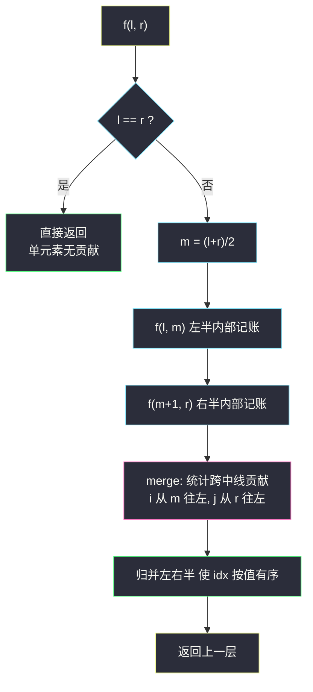
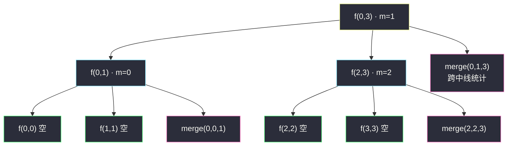

# 右侧小于当前元素的个数（归并分治求逆序贡献）

## 一、问题描述

给你一个整数数组 `nums`，返回一个新数组 `counts`。数组 `counts` 有该性质：`counts[i]` 的值是 `nums[i]` **右侧**小于 `nums[i]` 的元素的数量。

> 🔗 LeetCode 315：https://leetcode.cn/problems/count-of-smaller-numbers-after-self/

**示例 1**

```
输入：nums = [5,2,6,1]
输出：[2,1,1,0]
解释：
5 的右侧有 2 和 1 更小（2 个）
2 的右侧有 1 更小（1 个）
6 的右侧有 1 更小（1 个）
1 的右侧没有更小的（0 个）
```

**示例 2**

```
输入：nums = [-1,-1]
输出：[0,0]
解释：-1 的右侧没有严格更小的元素（相等不算）。
```

**直观理解**

对每个位置统计「右边比我小的数」——这正是一类**逆序对**问题：`(i, j)` 满足 `i < j` 且 `nums[i] > nums[j]`。区别只是：经典逆序对要**总数**（课上讲解109「逆序对数量」），本题要**按左端点分组计数**——每个 i 自己的名下记一笔。分治归并的骨架完全一致：递归把数组一分为二，**统计「跨越中线」的逆序对**（左半的 i、右半的 j），左右半内部的交给子递归。唯一的额外要求是「记账要记回原位置」——归并会打乱元素位置，所以排序的是**下标**，贡献累加到原下标头上。

---

## 二、暴力解法（入门）

### 直观思路

每个位置向后扫一遍，数出严格小于自己的元素个数。

```java
public List<Integer> countSmaller(int[] nums) {
    List<Integer> ans = new ArrayList<>();
    for (int i = 0; i < nums.length; i++) {
        int cnt = 0;
        for (int j = i + 1; j < nums.length; j++) {
            if (nums[j] < nums[i]) cnt++;
        }
        ans.add(cnt);
    }
    return ans;
}
```

### 复杂度

- **时间**：`O(n²)`——`n = 10⁵` 时约 10¹⁰ 次比较，超时。
- **空间**：`O(1)`（不计输出）。

### 🔴 瓶颈在哪里

每个 i 都要**独立地**重扫一遍右半边——同一个 j 被不同的 i 反复查看了 n 次。  
逆序对问题的突破口永远是：**有序性**。若右半边已排好序，左半元素 x 「右半中小于 x 的个数」可以**双指针单调滑出**，且左半从大到小走时指针只前进不回退——`O(n)` 统计一整段。这正是**归并排序**顺手就能办到的事：`f(l,r) = f(l,m) + f(m+1,r) + merge 统计并排序`。

---

## 三、优化探索（核心章节）

### 3.1 观察特征

| 特征 | 结论 |
|------|------|
| `counts[i]` = 逆序对中左端为 i 的对数 | 问题 = 分位置的逆序对计数 |
| 归并分治统计逆序对时，跨中线贡献 = 「左元素， 右元素」两两比较 | 排序右半后可双指针滑出，左半每步 O(1) 摊还 |
| 归并打乱位置，但下标可以跟着元素走 | 排**下标数组**（按下标所指的值比较），贡献记在原下标头上 |

### 3.2 归并分治：统计 + 排序一气呵成

递归 `f(idx, l, r)`：`idx[l..r]` 是「按值排序中」的原下标集合。

1. `m = (l+r)/2`，先 `f(l, m)`、`f(m+1, r)`——**同侧内部的贡献**由子递归记完；
2. `merge(l, m, r)` 处理**跨中线贡献**并让 `idx[l..r]` 整体按值有序。

**merge 的统计部分**（课上「逆序对数量」讲解109 的骨架，方向：i、j 双双**从右往左**）：

```java
for (int i = m, j = r; i >= l; i--) {          // 左半从尾往头
    while (j > m && arr[idx[i]] <= arr[idx[j]]) j--;  // j 走到第一个 < arr[i] 处
    counts[idx[i]] += j - m;                   // 右半中严格小于 arr[i] 的个数
}
```

- 左半元素从**大到小**逐个出列（子递归后左半已按值升序，倒着看就是从大到小）；
- `j` 从右半尾出发**只向左走、永不回退**（因为左半值递减，右半的合格窗口单调扩张）——这就是「排好序才敢双指针」的含义；
- `arr[idx[i]] <= arr[idx[j]]` 时 j 左移：**相等不算**（题目要严格小于），所以停下的 j 满足 `arr[idx[j]] < arr[idx[i]]`，右半下标 `m+1..j` 共 `j - m` 个全部小于当前值。

**merge 的归并部分**：按值从小到大把左、右半下标合并进 `help`，再拷回 `idx`——标准归并排序。



### 3.3 关键推导问题

| 问题 | 答案 |
|------|------|
| 为什么跨界贡献不重不漏？ | 任一逆序对 `(i, j)` 恰在「i 与 j 分居左右半」的那层递归被统计一次；同侧的已被更深层统计，`f(l,m)+f(m+1,r)+merge` 恰好覆盖全部 |
| 为什么要排**下标**而不是值？ | counts 要记到「原下标 i」头上；排下标时 `idx` 中元素跟着换位，值与原位置始终绑在一起 |
| j 为什么可以只进不退？ | 左半按值从大到小出列：`arr[i]` 变小，「右半中 < arr[i] 的集合」只可能扩张，j 单调左移即可覆盖 |
| 相等元素怎么处理？ | 统计条件 `arr[i] <= arr[j]` 继续左移 j，保证只数**严格小于**；归并条件同样用 `<=` 让相等时左半先落，保证稳定性（对正确性非必需，但对齐课上写法） |
| 为什么不用树状数组？ | 也可以：离散化 + 从右往左插入，查询前缀和，`O(n log n)`。归并法无需离散化、负数天然支持，面试首选（树状数组解见举一反三） |

### 3.4 一句话核心

> **归并分治每层统计「跨中线」的逆序贡献：左半从大到小出列，右半指针只进不退，`counts[idx[i]] += j - m` 一笔记到原位置头上；排完顺手归并，为上层铺好有序性。**

---

## 四、代码实现详解

> 说明：课源码未单独收录 #315 原题；主解与讲解109 `class109/Code01_NumberOfReversePair1.java`（逆序对数量·归并分治）的 `f / merge` 骨架**完全同构**——课上统计 `ans += j - m` 计入总数，本题改为 `counts[idx[i]] += j - m` 分位置记账，并增加 idx 索引数组。

### Java（主解：归并分治 + 索引数组）

```java
// 右侧小于当前元素的个数
// 测试链接 : https://leetcode.cn/problems/count-of-smaller-numbers-after-self/
class Solution {

    private int[] arr;        // 原数组（只读）
    private int[] counts;     // counts[i]：nums[i] 右侧更小元素的个数
    private int[] help;       // 归并辅助数组（存下标）

    public List<Integer> countSmaller(int[] nums) {
        int n = nums.length;
        arr = nums;
        counts = new int[n];
        help = new int[n];
        int[] idx = new int[n];
        for (int i = 0; i < n; i++) {
            idx[i] = i;                       // 初始下标自指
        }
        f(idx, 0, n - 1);
        List<Integer> ans = new ArrayList<>();
        for (int c : counts) {
            ans.add(c);
        }
        return ans;
    }

    // 归并分治：处理 idx[l..r]，把该范围内的内部贡献记入 counts，并按值排序
    private void f(int[] idx, int l, int r) {
        if (l == r) {
            return;
        }
        int m = (l + r) / 2;
        f(idx, l, m);
        f(idx, m + 1, r);
        merge(idx, l, m, r);
    }

    // 统计跨中线贡献 + 归并排序（课上逆序对骨架）
    private void merge(int[] idx, int l, int m, int r) {
        // 1) 统计：i 从左半尾往左，j 从右半尾往左（j 只进不退）
        for (int i = m, j = r; i >= l; i--) {
            while (j > m && arr[idx[i]] <= arr[idx[j]]) {
                j--;                           // 相等不算，只数严格小于
            }
            counts[idx[i]] += j - m;           // 右半中 < arr[idx[i]] 的个数
        }
        // 2) 正常归并：按值从小到大，help 存的是下标
        int i = l, a = l, b = m + 1;
        while (a <= m && b <= r) {
            help[i++] = arr[idx[a]] <= arr[idx[b]] ? idx[a++] : idx[b++];
        }
        while (a <= m) {
            help[i++] = idx[a++];
        }
        while (b <= r) {
            help[i++] = idx[b++];
        }
        for (i = l; i <= r; i++) {
            idx[i] = help[i];
        }
    }
}
```

### Python（同思路）

```python
class Solution:
    def countSmaller(self, nums: list[int]) -> list[int]:
        n = len(nums)
        counts = [0] * n
        idx = list(range(n))

        def merge(l: int, m: int, r: int) -> None:
            nonlocal counts
            # 1) 统计：i、j 从右往左，j 只进不退
            j = r
            for i in range(m, l - 1, -1):
                while j > m and nums[idx[i]] <= nums[idx[j]]:
                    j -= 1
                counts[idx[i]] += j - m
            # 2) 归并：按值从小到大合并下标
            merged, a, b = [], l, m + 1
            while a <= m and b <= r:
                if nums[idx[a]] <= nums[idx[b]]:
                    merged.append(idx[a]); a += 1
                else:
                    merged.append(idx[b]); b += 1
            merged.extend(idx[a:m + 1])
            merged.extend(idx[b:r + 1])
            idx[l:r + 1] = merged

        def f(l: int, r: int) -> None:
            if l == r:
                return
            m = (l + r) // 2
            f(l, m)
            f(m + 1, r)
            merge(l, m, r)

        f(0, n - 1)
        return counts
```

---

## 五、具体例子演示

`nums = [5,2,6,1]`。初始 `idx = [0,1,2,3]`，`counts = [0,0,0,0]`。

**递归树**：



**① `merge(0,0,1)`**：左半 `idx=[0]`（值 5），右半 `idx=[1]`（值 2）。

- 统计：`i=0`（值 5），`j=1`（值 2）：`5 <= 2`？否，j 不动 → `counts[0] += 1 - 0 = 1`；
- 归并：`[2, 5]` → `idx = [1, 0, 2, 3]`；`counts = [1, 0, 0, 0]`。

**② `merge(2,2,3)`**：左半 `idx=[2]`（值 6），右半 `idx=[3]`（值 1）。

- 统计：`i=2`（值 6），`j=3`（值 1）：`6 <= 1`？否 → `counts[2] += 3 - 2 = 1`；
- 归并：`[1, 6]` → `idx = [1, 0, 3, 2]`；`counts = [1, 0, 1, 0]`。

**③ `merge(0,1,3)`**（顶层，最关键的一步）：左半 `idx[0..1] = [1,0]`（值 `[2,5]`），右半 `idx[2..3] = [3,2]`（值 `[1,6]`）。

**统计过程**（i 从 m=1 往左，j 从 r=3 往左）：

| 步骤 | i | idx[i] | 值 | j 走向（条件 `值 ≤ nums[idx[j]]` 则 j--） | j 停在 | counts 记账 |
|------|---|--------|-----|---------------------------------------------|--------|--------------|
| 1 | 1 | 0 | 5 | j=3 值 6：`5≤6` → j-- 到 2；j=2 值 1：`5≤1` 假，停 | 2 | `counts[0] += 2-1 = 1` → **counts[0]=2** |
| 2 | 0 | 1 | 2 | j=2 值 1：`2≤1` 假，停（j 不回退） | 2 | `counts[1] += 2-1 = 1` → **counts[1]=1** |

直觉核对：值 5 的右侧（跨过中线的右半）有 `1` 比它小 → +1；值 2 的右侧（右半）有 `1` 比它小 → +1。加上各自在更深层记的账：`5` 在 ① 里记过 1（它右边的 2），`2` 无深层账，`6` 在 ② 里记过 1。

**归并过程**：`[2,5]` 与 `[1,6]` 按值合并 → `[1,2,5,6]`，`idx = [3, 1, 0, 2]`。

**最终**：`counts = [2, 1, 1, 0]`，与预期输出一致 ✓

**相等元素演示** `nums = [-1, -1]`：`merge(0,0,1)` 统计时 `i=0` 值 -1，`j=1` 值 -1：`-1 ≤ -1` **成立** → j-- 到 0（`j > m` 即 `j > 0` 不再成立，循环停）→ `counts[0] += 0 - 0 = 0`。相等不算严格更小，正确输出 `[0,0]` ✓——统计条件里的 `<=` 正是为相等元素设的门。

---

## 六、复杂度分析

| 项目 | 归并分治（主解） | 暴力双重循环 |
|------|------------------|----------------|
| 时间 | `O(n log n)`：每层归并 `O(n)`，共 `O(log n)` 层 | `O(n²)` |
| 空间 | `O(n)`：`idx`、`help`、`counts` 数组 + `O(log n)` 递归栈 | `O(1)`（不计输出） |

---

## 七、方法对比与总结

| | 暴力 | 归并分治（主解） | 树状数组 |
|--|------|------------------|-----------|
| 思路 | 逐点重扫 | 排序换来「右半有序 → 双指针单调滑」 | 离散化后从右往左插入查询 |
| 时间 | `O(n²)` | `O(n log n)` | `O(n log n)` |
| 前置处理 | 无 | 无 | 需离散化（负数、稀疏值域） |
| 记账方式 | 直接累加 | `counts[idx[i]] += j - m` 记原位置 | 查询时按原位置记录 |

**易错点**

1. **直接排值不排下标**：归并后位置信息丢失，counts 记不到原位置头上——必须带着 `idx` 走完全程；
2. 统计条件写成 `arr[idx[i]] < arr[idx[j]]`：相等时 j 不再左移，把「相等」误计为「小于」；
3. 统计方向（i、j 从右往左）与归并方向（从左往右）**是两套独立的双指针**，混用一-套会让 j 回退，退化 `O(n²)`；
4. 归并时丢稳定性（`<` 与 `<=` 混乱）虽不影响本题正确性，但对齐课上写法统一用 `<=`。

**模板口诀**

> **归并分治三步走：左右内部先记账，跨线统计 j 滑动，顺手归并留有序；值动下标跟着走，账记原位不错漏。**

---

## 八、举一反三

| 题目 | 链接 | 迁移点 |
|------|------|--------|
| 493. 翻转对 | https://leetcode.cn/problems/reverse-pairs/ | 同骨架换判定：`arr[i] > 2·arr[j]`，统计与归并**必须分开**（[站内题解](/solutions/base/reverse-pairs.md)） |
| LCR 170. 逆序对（原剑指 Offer 51） | https://leetcode.cn/problems/shu-zu-zhong-de-ni-xu-dui-lcof/ | 课上讲解109 对应的经典总数版（洛谷 P1908 同题） |
| 327. 区间和的个数 | https://leetcode.cn/problems/count-of-range-sum/ | 归并分治统计「左半某前缀和 − 右半某前缀和 ∈ [lower, upper]」的跨界对 |
| 1649. 通过指令创建有序数组 | https://leetcode.cn/problems/create-sorted-array-through-instructions/ | 树状数组版「右侧/左侧更小计数」的在线版，双解法可互换验证 |

**迁移一句**：凡是「**统计满足某种大小关系的数对** `(i, j)`，i < j」——归并分治三件套 `f(l,m) + f(m+1,r) + merge 统计并排序` 通吃；要**总数**就累加（课上逆序对），要**按位置分组**就索引数组记账（本题），判定条件变了（乘 2、区间）就换 merge 里的统计行（#493）。
