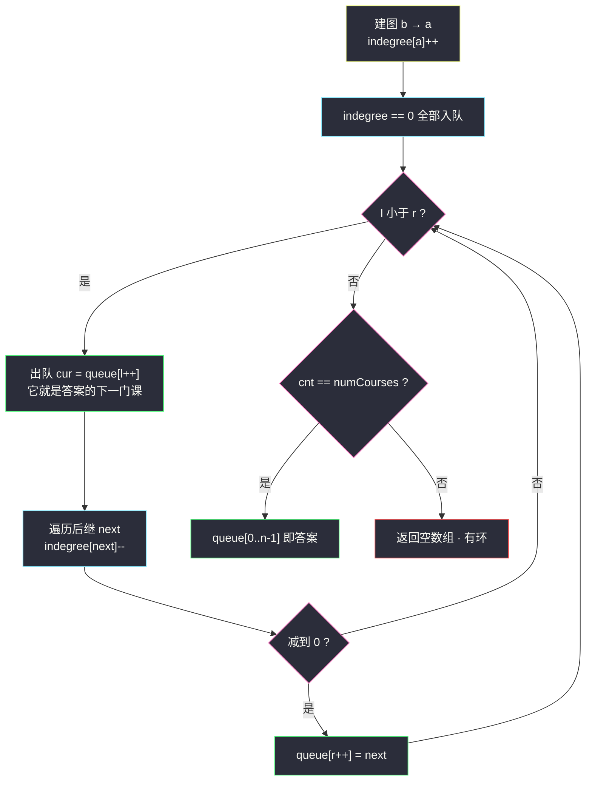
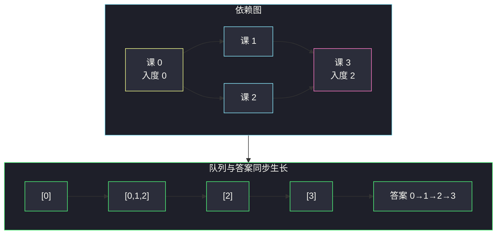

# 课程表 II（拓扑排序模板题：出队顺序即答案）

## 一、问题描述

现在你总共有 `numCourses` 门课需要选，记为 `0` 到 `numCourses - 1`。给你一个数组 `prerequisites`，其中 `prerequisites[i] = [ai, bi]`，表示**选修课程 `ai` 之前必须先选修课程 `bi`**。

返回你为了学完所有课程所安排的学习顺序。可能会有多个正确的顺序，你只要返回**任意一种**即可。如果不可能完成所有课程，返回一个**空数组**。

> 🔗 LeetCode 210：https://leetcode.cn/problems/course-schedule-ii/
>
> 约束：`1 <= numCourses <= 2000`，`0 <= prerequisites.length <= 5000`，`ai != bi`，无重复边。

**示例 1**

```
输入：numCourses = 4, prerequisites = [[1,0],[2,0],[3,1],[3,2]]
输出：[0,2,1,3]（[0,1,2,3] 同样正确）
解释：0 没有先修，先修；1 和 2 都只依赖 0，先后随意；3 要等 1、2 都完成
```

**示例 2**

```
输入：numCourses = 2, prerequisites = [[1,0]]
输出：[0,1]
解释：唯一合法顺序
```

**示例 3**

```
输入：numCourses = 1, prerequisites = []
输出：[0]
```

**直观理解**

[#207 课程表](./course-schedule.md) 只问「能不能修完」，本题要你**交出一张合法课表**。好消息是：#207 里的拓扑排序过程**天然就在按合法顺序吐课**——每次出队的都是「当前所有先修已修完」的课，把出队顺序记录下来就是答案。所以本题是拓扑排序的**正宗模板题**，课源码 class059 `Code02_TopoSortDynamicLeetcode` 收录的正是它：邻接表动态建图 + 入度表 + 数组队列。

---

## 二、暴力解法（枚举全排列验证）

### 直观思路

把 `0..n-1` 的所有排列一个个拿来，检查每个位置的课程其先修是否都排在前面，第一个通过的就是答案。

```java
class Solution {
    public int[] findOrder(int numCourses, int[][] prerequisites) {
        List<int[]> perms = new ArrayList<>();
        permute(new int[numCourses], new boolean[numCourses], 0, perms);
        for (int[] order : perms) {                 // 逐个排列验证
            if (valid(order, prerequisites)) {
                return order;
            }
        }
        return new int[0];
    }

    private void permute(int[] cur, boolean[] used, int depth, List<int[]> out) {
        if (depth == cur.length) { out.add(cur.clone()); return; }
        for (int i = 0; i < cur.length; i++) {
            if (!used[i]) {
                used[i] = true;
                cur[depth] = i;
                permute(cur, used, depth + 1, out);
                used[i] = false;
            }
        }
    }

    private boolean valid(int[] order, int[][] prerequisites) {
        int[] pos = new int[order.length];
        for (int k = 0; k < order.length; k++) pos[order[k]] = k;
        for (int[] p : prerequisites) {
            if (pos[p[1]] > pos[p[0]]) return false; // 先修排在后面 → 无效
        }
        return true;
    }
}
```

### 复杂度

- **时间**：`O(n!·(n+e))`——n = 10 就三百多万排列，n = 2000 直接天文数字
- **空间**：`O(n)`

### 🔴 瓶颈在哪里

答案只有**一种相对结构**（拓扑序），排列枚举却把「无关课程谁先谁后」的所有自由度全部展开。真正需要的只是：**每一步挑一门「先修已全部完成」的课**。按这个规则每次都能挑到 ⇔ 无环；一路挑完 n 门，挑的顺序就是合法课表——这正是拓扑排序。

---

## 三、优化探索（核心章节）

### 3.1 观察特征

| 特征 | 说明 |
|------|------|
| 先修关系 = 有向边 | `[a, b]` 建边 **b → a**，方向仍是第一易错点 |
| 合法顺序由「入度清零」驱动 | 一门课的先修全修完 ⇔ 它的入度被砍到 0 |
| 出队顺序天然合法 | 出队的课此刻依赖数为 0，先修必然**全都排在更早出队的位置** |
| 需要失败信号 | 最后出队不足 n 门 → 有环，返回**空数组** |

### 3.2 优化：Kahn 拓扑排序，队列即课表

与 #207 的算法**一字不差**，只多一行「把出队的课存进答案」。这也是它适合当模板题的原因：把骨架背熟，#207（判环）、#210（求序）以及一大批依赖题全部通吃。

1. 建邻接表 + 入度表；
2. 入度 0 的课入队；
3. 出队 `cur` → **写入答案** `queue[cnt++]`；对每个后继 `next` 执行 `indegree[next]--`，减到 0 就入队；
4. `cnt == numCourses` 时，那个当队列用的数组 `queue[0..cnt-1]` **本身就是拓扑序**；否则返回空数组。

课源码的妙处正在于此：**队列数组直接复用为答案数组**，不多花一分空间。



### 3.3 变体讨论：要「字典序最小」的顺序怎么办

本题「任意一种即可」，普通队列够用。若题目要求答案**字典序最小**（如 #1203 项目管理、#444 类变形），把队列换成**小根堆**：每次在「当前可修的课」里挑编号最小的。骨架完全不变，只是「先到先出」换成「先挑小的」。注意这**不改变**判环与计数的正确性，只改变出队的选法。

### 3.4 关键推导问题

| 问题 | 答案 |
|------|------|
| 出队顺序为什么一定合法？ | `cur` 出队前提是入度 0，即所有先修（全部指向它的点）都已被出队处理，位置必然更靠前 |
| 答案不唯一是怎么回事？ | 队列里同时存在多门可修课时，谁先出队都合法；判题器会按「是否为合法拓扑序」校验，不比对具体数组 |
| 空数组怎么表达？ | `return new int[0]`；长度为 0 即失败信号，不要返回 null |
| 初始 `prerequisites` 为空？ | 所有课入度 0 全部入队，答案就是 0,1,2,...,n-1 |
| 数组队列开多大？ | 每门课至多入队一次，`numCourses` 大小即够 |

### 3.5 一句话核心

> **拓扑排序跑一遍，出队顺序即课表；凑不齐 n 门课就返回空数组——同一套代码同时回答了 #207 的「能不能」和 #210 的「怎么排」。**

---

## 四、代码实现详解

### Java（主解：对齐课源码 class059 Code02）

> 课源码出处：`class059/Code02_TopoSortDynamicLeetcode.java`（动态邻接表 + 数组队列，`cnt == numCourses ? queue : new int[0]` 三元返回）。以下即其骨架：

```java
// 课程表 II
// 测试链接 : https://leetcode.cn/problems/course-schedule-ii/
import java.util.ArrayList;

class Solution {
    public int[] findOrder(int numCourses, int[][] prerequisites) {
        // 动态方式建邻接表
        ArrayList<ArrayList<Integer>> graph = new ArrayList<>();
        for (int i = 0; i < numCourses; i++) {
            graph.add(new ArrayList<>());
        }
        // 入度表
        int[] indegree = new int[numCourses];
        for (int[] edge : prerequisites) {
            graph.get(edge[1]).add(edge[0]);   // b → a
            indegree[edge[0]]++;
        }
        // 数组队列：l 指出队位置，r 指下一个入队位置
        int[] queue = new int[numCourses];
        int l = 0, r = 0;
        for (int i = 0; i < numCourses; i++) {
            if (indegree[i] == 0) {
                queue[r++] = i;                // 无先修，直接可修
            }
        }
        int cnt = 0;
        while (l < r) {
            int cur = queue[l++];              // 出队 = 修掉这门课
            cnt++;                             // cur 就是答案第 cnt-1 门
            for (int next : graph.get(cur)) {
                if (--indegree[next] == 0) {   // 给后继减负
                    queue[r++] = next;         // 依赖清零，可修
                }
            }
        }
        return cnt == numCourses ? queue : new int[0];
    }
}
```

### Java（附：要求字典序最小时，PriorityQueue 换队列）

```java
import java.util.*;

class Solution {
    public int[] findOrder(int numCourses, int[][] prerequisites) {
        List<List<Integer>> graph = new ArrayList<>();
        for (int i = 0; i < numCourses; i++) graph.add(new ArrayList<>());
        int[] indegree = new int[numCourses];
        for (int[] p : prerequisites) {
            graph.get(p[1]).add(p[0]);
            indegree[p[0]]++;
        }
        // 小根堆：每次挑当前可修课程里编号最小的
        PriorityQueue<Integer> heap = new PriorityQueue<>();
        for (int i = 0; i < numCourses; i++) {
            if (indegree[i] == 0) heap.add(i);
        }
        int[] ans = new int[numCourses];
        int cnt = 0;
        while (!heap.isEmpty()) {
            int cur = heap.poll();
            ans[cnt++] = cur;
            for (int next : graph.get(cur)) {
                if (--indegree[next] == 0) heap.add(next);
            }
        }
        return cnt == numCourses ? ans : new int[0];
    }
}
```

### Python

```python
# 课程表 II（Kahn 拓扑排序）
# 测试链接 : https://leetcode.cn/problems/course-schedule-ii/
from collections import deque

class Solution:
    def findOrder(self, numCourses: int, prerequisites: list[list[int]]) -> list[int]:
        graph = [[] for _ in range(numCourses)]
        indegree = [0] * numCourses
        for a, b in prerequisites:            # b → a
            graph[b].append(a)
            indegree[a] += 1

        queue = deque(i for i in range(numCourses) if indegree[i] == 0)
        order = []
        while queue:
            cur = queue.popleft()
            order.append(cur)                 # 出队顺序即课表
            for nxt in graph[cur]:
                indegree[nxt] -= 1
                if indegree[nxt] == 0:
                    queue.append(nxt)

        return order if len(order) == numCourses else []
```

```python
# 附：字典序最小版（heapq 当小根堆）
import heapq

class Solution:
    def findOrder(self, numCourses: int, prerequisites: list[list[int]]) -> list[int]:
        graph = [[] for _ in range(numCourses)]
        indegree = [0] * numCourses
        for a, b in prerequisites:
            graph[b].append(a)
            indegree[a] += 1
        heap = [i for i in range(numCourses) if indegree[i] == 0]
        heapq.heapify(heap)
        order = []
        while heap:
            cur = heapq.heappop(heap)
            order.append(cur)
            for nxt in graph[cur]:
                indegree[nxt] -= 1
                if indegree[nxt] == 0:
                    heapq.heappush(heap, nxt)
        return order if len(order) == numCourses else []
```

---

## 五、具体例子演示

### 例 A：示例 1 完整跟踪（`numCourses = 4`）

```
prerequisites = [[1,0],[2,0],[3,1],[3,2]]
建图：0 → 1, 0 → 2, 1 → 3, 2 → 3
入度：indegree = [0, 1, 1, 2]
```

| 步 | l → r | 出队 cur | 答案 order | indegree 变化 | 队列（处理后） |
|----|-------|----------|------------|----------------|----------------|
| 初始 | 0/0 | — | [] | [0,1,1,2] | 课 0 入队 → [0] |
| 1 | 0→1 | 0 | [0] | 1: 1→0（入队）、2: 1→0（入队） | [0,1,2] |
| 2 | 1→2 | 1 | [0,1] | 3: 2→1，未清零 | [2] |
| 3 | 2→3 | 2 | [0,1,2] | 3: 1→0，入队 | [3] |
| 4 | 3→4 | 3 | [0,1,2,3] | — | [] |

`cnt = 4 = numCourses` → 返回 `[0,1,2,3]`。若第 1 步入队顺序换成 `[0,2,1]`，最终答案 `[0,2,1,3]` 同样合法——**并列可修课的先后是自由的**。



**第 2 步的细节**：课 1 出队后，课 3 的入度从 2 减到 1——**还没资格入队**。要等第 3 步课 2 也出队，课 3 的两个先修才凑齐。这是「多先修」必须等齐的典型画面。

### 例 B：有环返回空数组（`numCourses = 3`）

```
prerequisites = [[1,0],[2,1],[0,2]]   →   0 → 1 → 2 → 0 环
入度：indegree = [1, 1, 1]
```

| 步 | 检查 | 队列 | cnt |
|----|------|------|-----|
| 初始 | 没有任何课入度为 0 | [] | 0 |

队列空，`cnt = 0 ≠ 3` → **返回 `[]`**。环上三门课入度全是 1，谁也清不了零，一步都迈不出去。

### 例 C：字典序版跑同一份例 A 数据

第 1 步后堆里是 {1, 2}，小根堆弹出 **1** 在前；于是答案为 `[0,1,2,3]`。若把依赖改成 `[[1,0],[2,0]]`、n=3（1、2 并列），普通队列给出 `[0,1,2]` 或 `[0,2,1]` 皆可，而堆版**保证** `[0,1,2]`——这就是「任意合法」与「字典序最小」的差别。

---

## 六、复杂度分析

| 版本 | 时间 | 空间 | 说明 |
|------|------|------|------|
| 主解（数组队列） | `O(n + e)` | `O(n + e)` | 每课一次入出队、每边砍一次；queue 数组复用为答案 |
| 字典序（小根堆） | `O((n + e)·log n)` | `O(n + e)` | 出入堆各带 `log n` |
| 暴力枚举排列 | `O(n!·(n+e))` | `O(n)` | 不可行 |

---

## 七、方法对比与总结

### 易错点

1. **边方向建反**（`a → b`）：判环计数侥幸能对，但**输出顺序全反**，本题直接判错。记口诀：**先修 → 后修**。
2. **失败时返回 null 或忘判 `cnt`**：必须返回长度为 0 的数组，且三元判断别写反。
3. **答案数组与队列分开建导致空间翻倍**：课源码的写法是 `queue` 数组**本身**就是答案，学这手复用。
4. **`indegree` 用 `--next` 还是 `next--`**：写 `next--` 就是先判后减，判断的是旧值，逻辑错位；必须先减再判（`--indegree[next] == 0`）。
5. **字典序题用普通队列**：#210 本身不要求，但变体一旦要求「最小」，普通队列的正确性没问题、**最优性**没了，得换堆。

### 本题在课程表家族中的位置

| 题 | 问什么 | 用什么 |
|--|--------|--------|
| 207. 课程表 | 能否修完 | 同骨架，只要 `cnt` |
| 210. 课程表 II | 给出一种顺序 | 同骨架，记录出队序（本文） |
| 630. 课程表 III | 最多修几门 | 贪心 + 大根堆退课，另起炉灶 |
| 1462. 课程表 IV | 传递先修查询 | 拓扑序上做「祖先集合」传播或位运算 |

### 模板口诀

> **动态建图入度表，零度全进队列来；出队写进答案里，砍边减到零再排；不足 n 门是死锁，空数组交卷不耍赖。**

---

## 八、举一反三

| 题目 | 链接 | 迁移点 |
|------|------|--------|
| 207. 课程表 | https://leetcode.cn/problems/course-schedule/ | 同骨架判环版，与本文互引 |
| 269. 火星词典 | https://leetcode.cn/problems/alien-dictionary/ | 课源码 class059 Code04 原题：单词序列抽边 + 拓扑排序出字母序 |
| 444. 序列重建 | https://leetcode.cn/problems/sequence-reconstruction/ | 判断拓扑序是否**唯一**：队列长度始终 ≤ 1 |
| 1203. 项目管理 | https://leetcode.cn/problems/sort-items-by-groups-respecting-dependencies/ | 组内 + 组间两级拓扑，要求字典序时换小根堆 |
| 1136. 平行课程 | https://leetcode.cn/problems/parallel-courses/ | 出队顺序再按层分段，层数即最少学期数 |

**迁移一句**：#210 是拓扑排序的「全家福模板」——判环看计数、求序看出队、求字典序换小根堆、求最少轮数按层切。把这 40 行代码背熟，依赖类题基本一网打尽。
